# パーヴェル・サヴィノフ（ПАВЕЛ САВИНОВ）

# БАЗА（ベース）

## シーシャについての本

---

## 目次

- **第01章** ［9–21］ シーシャの歴史とエチケット
- **第02章** ［23–125］ シーシャ用タバコの原料と成分 ＞ バージニア種 ＞ バーレー種 ＞ ニコチンおよびその類似物質の含有量 ＞ ニコチン ＞ シーシャ用タバコはどのように作られるか
- **第03章** ［127–163］ 現代のシーシャ。その進化。
- **第04章** ［165–180］ シーシャ用ボウル
- **第05章** ［183–197］ シーシャ用の炭
- **第06章** ［199–227］ ミクソロジーとは何か？
- **第07章** ［229–267］ サービス。オーダーテイク。販売。
- **第08章** ［269–292］ シーシャマスターとシーシャラウンジのオーナー
- **第09章** ［295–302］ マーケティング調査「私たちは何者か」

---

## はじめに

### 何かを成し遂げるには——ただ取りかかって、やるしかない。

私は生涯ずっと、本を書くというのはなんと難しく、そしてなんと格好いいことだろうと考えてきました。どれほどの力、忍耐、そして目標への強い意志が必要なことか！　そしてある瞬間、自分自身に本を書くことができるだろうか、もしできるとしたら、それはどんな内容の本になるだろうかと考えたのです。その答えは時を経てやってきました。皆さんの多くがご存知のように、私はシーシャに7年間携わってきました。この間、ロシアのシーシャ業界は間違いなく非常に速いスピードで発展しており、私たちは細部に至るまで研究し、試し、語り合い、シーシャマスターたちと経験を共有し、数多くの会社が誕生する様子や、展示会や会議が開催される様子を目の当たりにしてきました。

ある瞬間、私の頭の中でパズルがはまり、この本をどう「作る」ことができるのかが分かったのです。これ以降、私はまさにこの言い回しを使っていきます。どのように、そしてなぜそうするのかを説明しましょう。この本を可能な限りプロフェッショナルなものにするために、私はテレグラムチャンネル Savinov Says を立ち上げ、そこに業界の関係者たちとのさまざまな記事やインタビューを公開することにしました。

それはシーシャマスター、マネージャー、シーシャラウンジや店舗のオーナー、タバコ・シーシャ・アクセサリーのメーカー、ディストリビューターなど、要するに私の理解において私たちの業界で興味深い事例を持っていたすべての人たちです。

それと並行して、チャンネルと連動する形で、プロフェッショナルなシーシャチャット master's が動き始め、多くの記事、インタビュー、その他の素材についてフィードバックを与えてくれました。

チャンネルのテキストは平均して週に1〜2回公開され、1年半が経つ頃には、本の最初のバージョンを作るのに十分なだけの素材が集まっていました。

さて、なぜ「書いた」ではなく「作った」なのか。実のところ、私はこの本を書いたのではなく、プロフェッショナルな読者層に向けた質問を狙いとしたインタビューをただ始め、その経験に疑いの余地のない業界の人々による記事の公開を積み重ねていったのです。これまでに100本のインタビューと、ほぼ同数の記事が公開されました。その結果からは、この情報が市場にとって有用なものであったことが十分にうかがえます。目標は、このテレグラムチャンネルを業界のオープンな知識ベースにすることでした。そして、私の見るところ、それは成功したのです。

この知識ベースを紙に移す時が来ました。

この本は、シーシャについてもっと知りたいと思うすべての人のためのものです。各部はそれぞれに重要です。構造としては、この本はシーシャマスターにとって最も重要な知識へと分けられていますが、業界で働くそれ以外のすべての人にとっても、決して無駄にはならないはずです。

シーシャの歴史、たばこ葉、シーシャ用タバコはどのように作られるか、ニコチン、シーシャ、ボウル、ミクソロジー、販売、サービス、統計、そしてその他多くの素晴らしい情報。この本のすべての著者は、一文字一文字に多くの時間と力を注ぎ込んでいます。

膨大な選択肢の中から、これが初版であり、その後本は加筆・変更されていくという前提に基づいて、一定の記事のセットを選び出す必要がありました。私たちは皆、大きな仕事をやり遂げたのですから、この本がその時代の精神とエネルギーを伝えてくれることを願っています。

あらかじめ言っておきますが、私は多くを書くのが好きなタイプではなく、普段は短く要点を突いて書きます。これもまた本を作る道のりにおける一つの障害ではありますが、その結果が多くの人に気に入ってもらえることを願っています。

すべての著者およびインタビューに参加してくださった方々に、特別な感謝を述べたいと思います。さらに、このアイデアを発展させるのを手伝ってくださったすべての方々にも。

現時点では、すべての記事は使いやすいナビゲーションを備えた専用サイトに公開されており、希望する人は誰でも、自分にとって最も今日的で興味深いニュースや記事を見つけることができます。waterpipe.pro

さて、それでは長々とは引き延ばさないことにしましょう。

---

# 第1章

## シーシャの歴史 ＞ エチケット ＞

この本は、シーシャ（水たばこ）の歴史とエチケットから始めます。

実際のところ、私はシーシャの人気はその歴史や伝統とも結びついていると考えています。多くの人にとって、シーシャは友人たちと時間を過ごすための一つの代替手段となりました。

## シーシャの歴史とエチケット

シーシャの歴史は錯綜しており、起源についていくつかの説があります。その中でも主要なものは、シルクロード全域でほぼ同じ時期にシーシャが登場したというものです。シーシャは、さまざまな時代・さまざまな国の歴史的な出来事の中にしばしば見られます。これについての詳細は、ドミトリー・ズーデルマン（Дмитрий Зудерман）の記事で。

数年前、Hookah Place（フカ・プレイス）チェーンで研修生をしていた頃、私は研修の過程でエヴゲニー・ママノフ（Евгений Мамунов）と交流する機会に恵まれました。私は知識に対して非常に几帳面なので、どこへ行くにもカメラを持ち歩き、後でその記録を見返してはノートにまとめ、何一つ聞き逃さないようにしていました。ジェーニャ（ママノフ）との出会いも例外ではありませんでした。記録映像は残っていませんが、ノートは残っています。私はこの簡潔なメモを、自分の経験と知識で補い、掘り下げました。

「で、こんなものが俺に何の役に立つんだ、それよりミックスの作り方を教えてくれよ」——これは、シーシャの仕事をプロとして本格的にやりたくて私のもとにやって来た人たち全員から、私が幾度となく耳にした言葉です。そして答えはいつも一つでした。どんな仕事でも、もしマスターになりたいのなら、自分の生業がいつ、どこから、何のために生まれ、どのように発展してきたのかというところから始めて、徹底的に学ばなければならない、と。なぜなら、それこそが土台であり、すべてはそこから始まるからです！ もしシーシャマスターが、自分の仕事の起源の歴史にまつわる初歩的な質問に答えられないとしたら、その人はプロではありません。これが、なぜ私がこのテーマで記事を書くことが重要だと考えるのか、というあなたの問いへの私の答えです。実際、経験が示すとおり、シーシャの起源の歴史を知っている人は決して多くありません。あるいは知っていた、聞いたことはあった、けれども忘れてしまった、という人もいます。そして、シーシャのエチケットにまつわる話に至っては、宇宙人の話に類するような神話と伝説の寄せ集めなのです。これは良くないことです。なぜなら、シーシャのエチケットはシーシャを吸う文化と切っても切れない関係にあるからです。

私は、起源の歴史についてあなたの記憶を呼び覚まし、謎めいたシーシャのエチケットに光を当てましょう。さあ、行きましょう！

## シーシャの起源

### 1．歴史はインドに、おおよそ紀元5世紀に始まる

医療目的で、ココナッツから作る器具が考案されました。それには二つの穴が開けられました。一方の穴には竹の管、もしくは太い藁が差し込まれました。もう一方の穴からは、内部に芳香性の薬草の混合物が入れられました。タバコではありません！ そしてそれらに火がつけられ、吸われたのです。

のちに、二本目の管（シャフト）が加わります。しかし、どのような理由からなのかは分かっておらず、推測するほかありません。そして当然ながら、その結果として「さて、これから吸うもの（火種）はどこに置けばよいのか？」という問題を解決するために、ボウルが登場します。オールドスクールのファンネル（漏斗型）です！ これが最初のボウルなのです！

さらに、歴史を信じるならば、この発明は遊牧民のオスマン人たちによってアラブ諸国へと持ち込まれ、シリア人の気に入りました。シリア人たちはそれをさらに改良し、フラスコ（水容器）を金属製に（より正確には銅製に）しました。当時は平らな底を鍛造するのがかなり難しかったため、フラスコは丸い形をしており、ココナッツ製の先代と同じように、この構造物全体を手に持って宙に浮かせた状態で吸われました。そしてそれは「ゴザ（Гоза）」という名前を得ました。

のちに「ゴザ」にエジプト人が目を留め、改良します。彼らはフラスコを粘土製にし、平らな底を持たせました。構造物は床置き式となり、「ゲド（Гедо）」という名前を得ます。

しばらくして、シリア人たちが再び新機軸を導入します！ 彼らはホースを三つの部分に分け、皮革で巻きました。ホースは曲げられるようになったのです。

これほど大きな変化が次々と起こったあと、インドでは、自分たちの発明品の発展に自分たちもまた貢献しようと、憤りと熱意をもって考えるようになりました。そして考えついたのです。竹の管を多数の小さな部分に折り、皮革で巻く——すると、まあまあ使い物になるホースができあがります。インドの美意識は常にその独特さで知られていましたから、その皮革が蛇の皮であったのも驚くにはあたりません。そして、今日でも見かける蛇の頭の形をした木製のチュブク（後述の用語解説を参照）——これは決して現代の創作ではないのです！

受け皿（ブリュッツェ）については、別途触れておきたいと思います。それがいつ考案されたのかについては正確な情報がありません。その主な機能は、今日と同じく、炭がテーブルや床、人……要するにあらゆるものの上に落ちるのを防ぐことでした。しかしながら、名門の家々にあった古代のシーシャには、主たる受け皿よりも下に、より大きな受け皿がいくつか備わっていました。その上には果物やその他のもてなしの品が供されました。おそらく多くの人はこのことをすでに知っていたでしょうが、思い出しておいて損はないでしょう。

さて、チュブク（チューブク）とは、私たちがシーシャを吸うときに手に持つ、ホースの先端部分の正しい名称です。今では誰もがこのシーシャの部分をマウスピース（ムンドシュトゥーク）と呼ぶことに慣れていますが、本来、マウスピースとは、シフト後にいつもポケットに残っているあの使い捨てのプラスチックのちっぽけな代物のことを指します。また、使われていない正しい名称の仲間には、チリム（чилим）——これは私たちがタバコを詰めるボウル（鉢）のこと——も挙げられます。私の記憶では、これらの正しい名称を使っていたのはただ一人、ジェーニャ・ママノフだけでした。

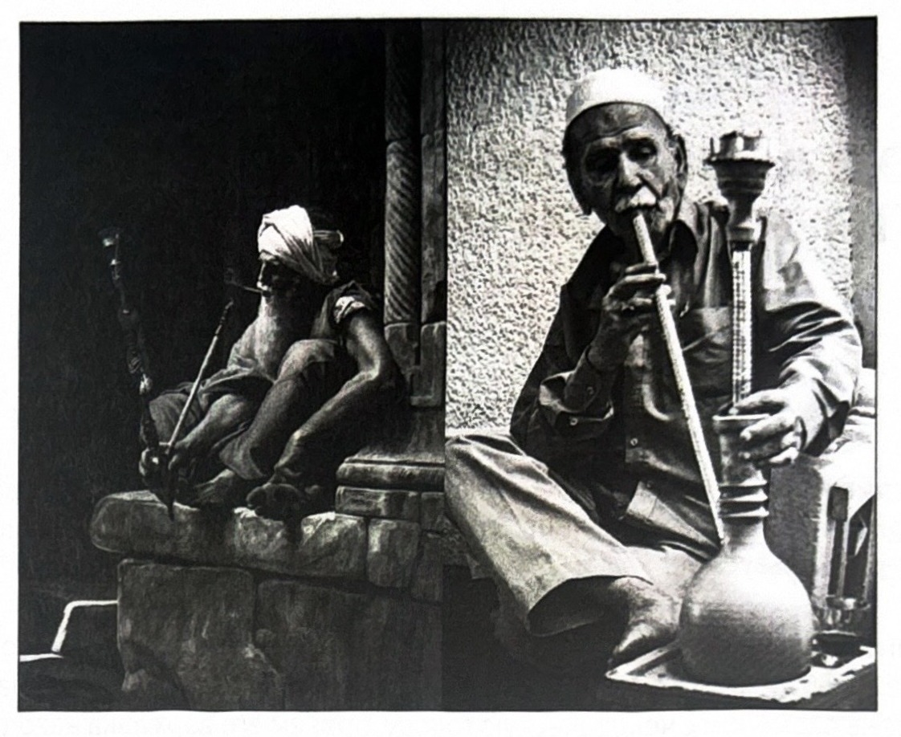

*図：伝統的なシーシャを吸う人々を写したモノクロ写真（左：ターバンを巻いて長い水たばこをくゆらせる男性、右：丸い水容器の背の高い水たばこを吸う帽子の老人）（原書 p.13）*

## シーシャのフラスコの中の水

正確なところは誰にも確かなことは分かりませんが、最も可能性が高いのは、水は土製のシーシャ（地面のシーシャ）から借用されたということです。これは非常に古い装置ですが、今なお使われています。

土製のシーシャとは、深さ30〜50センチメートル、容量30〜50リットルの地面に掘った穴のことです。そのうち3分の2が水で満たされ、穴の中央には人間の頭ほどの大きさの石が置かれ、しかもその頂上は水面の上に出ています。穴の壁と底は粘土で塗り固められています。上からは藁で覆い、それもまた粘土か、あるいは気密性を生み出すような何か別のもので塗り固められます。蓋には三つの穴が開けられます。シャフト用、管用、そして布切れで栓をした弁（吹き出し＝パージのときには、当然その布切れは取り外されます）です。

さて、最も興味深いのは、シャフトが石の頂上にほとんど触れるように差し込まれていたという点です。喫煙の際、煙はシャフトを通って、石にぶつかりました。石にぶつかって砕けた煙は、冷やされ、湿らされたのです。推測するに、あるとき、こうしたシーシャをまた一つ作っている際に、シャフトの位置を少し誤り、それが水の中に沈んでしまったのでしょう。その結果として得られた効果を、従来のシーシャに借用したのかもしれません。

## シーシャのエチケット

東洋諸国の文化において、シーシャはもう何世紀にもわたって重要な役割を果たしてきました。それどころか、かの地ではそれは単なる伝統ではなく、一種の哲学なのです。そして、シーシャラウンジで何世紀にもわたって確立されてきたエチケットに反するような振る舞いをしようものなら——恥をかかされて追い出されてしまいます！

ロシアでは、この点についてはもっと単純です。時には不作法と言えるほどに。そもそも私たちのところでは、シーシャは大局的に見ればごく最近になって登場したものであり、それを吸う正しい文化はまだ形成されておらず、私たちのところではまさにその過程の段階にあるにすぎません。そして、まさにそれゆえにこそ、私はこのことに特別な注意を払う必要があると考えています。なぜなら、私たちシーシャマスターは、煙の神殿に仕える者のようなものであり、この道に通じていない人々は道に迷える魂なのですから。私たちが彼らをどう正しい道へと導くか、そのとおりに彼らは進んでいきます。シーシャ文化が今後どうなっていくのか、その責任はまさに今、私たちの手に握られているのです。

このあと私は、アラブ諸国におけるシーシャのエチケットの主要な側面の例と、比較のためにロシアにおけるそれの例を挙げていきます。そして、それについての私自身の見解も述べます。これは、その違いを目に見える形で感じ取り、あなた自身の結論を出すのに役立つことでしょう。

## もてなしの仕草としてのシーシャ

実際、そのとおりなのです。

アラブ諸国では、客にシーシャを勧めることは礼儀作法の一つです。それどころか、家の中でシーシャに火をつける権利を持つのは一家の主だけであり、カフェやシーシャラウンジではその店の主人自身だけでした。こうして主人は、店の客に対する敬意ある態度を示したのです。しかもそれでいて、シーシャを吸うことは常に個人的な営みとされていました。つまり、一つのテーブルに何人が集まろうと、各人に自分専用のシーシャがなければならなかったのです。

これはスープの皿や酒のグラスのようなものです。何人もの人が一つの皿からボルシチを食べたり、一つのグラスからワインを飲んだりするのは、奇妙な光景ではないでしょうか？ しかしながら、客に別々のシーシャを用意することが不可能な場合には、礼儀作法は、客に喫煙の営みを分かち合うよう申し出る義務を求めていました。

シーシャはまた、国家的重要性を持つ不可欠な要素でもありました。二国間の外交使節が芳しい煙を共に吸うことは、信頼と協力への用意を意味したのです。

以上に述べたすべてに関連して、ある興味深い歴史的事例があります。それは1841年のことでした。フランスの大使が国家的重要事項のためにオスマン帝国を訪れましたが、スルタンは彼に自分のシーシャを分かち合うことも、客のために別のシーシャを用意することも申し出ませんでした。フランス大使は教養ある人物であり、商用で訪れたその国の文化やエチケットについてかなり多くのことを知っていたにもかかわらず、です。そして、その結果として彼は侮辱されたと感じ、大きな国際的スキャンダルが巻き起こりました。

ところが、ここロシアでは、「俺たち十人で一つのシーシャを吸おうぜ」という類いの話が——ごく当たり前のことなのです！ 多くのシーシャラウンジには、一定の人数あたりシーシャを最低何台用意するかを定めた一定の規定があります。これは利益のためというだけのことではありません。これは文化なのです！ そして私はこれを正しいことだと考えています。人々はシーシャラウンジには、何よりもまずシーシャを目当てに（私は今、カラオケや食事のあるバーやレストランのことを言っているのではありません。そういう場所へは、人々はシーシャ目当てに来るのではありません）、あるいはそれに関連する雰囲気（会話、バックギャモン、チェス、芳しいお茶）を目当てに来るべきなのです。ただ大勢で座っているだけなら——それはどこか別の場所でやればよいのです。

そして、もてなしについて言えば、私たちのところでは「どうでもいい」式で受けられたオーダー、それと同じ質の、犬に骨を投げ与えるかのように客に放り出されたシーシャ、そしてそのあとはもう二度と地平線上に姿を現さないシーシャマスター——これらがもはやあたかも当たり前のことになりつつあります。

ジェーニャ・ママノフはいつもこう言っていました。客のことをクライアント（顧客）や来場者（訪問者）と呼ぶのは間違っている、と。シーシャラウンジに来る人々、それはゲスト（客人）なのだ、と。その瞬間、私が彼に同意したことを覚えています。年月が経ち、今では客のことをほかのどんな呼び方で呼ぶこともどうしても言葉に出せません。では、その肝心なところは何かといえば？ 接し方です！ シーシャマスターは、客をまるで自分自身の客、自分の友人、あるいは友人の友人であるかのように迎え、それにふさわしく、敬意をもって、相手の心をつかむ術をもって、語らい、冗談を言い、しかし同時に自分の仕事についての厳格な知識をもって接しなければなりません。そして彼自身は、その店で彼らにシーシャを作る、最も重要な人物なのです。しかし、これらはもうむしろサービス、接し方というテーマ——

そして、良いシーシャマスターとはどうあるべきか、という問題に属する話です。

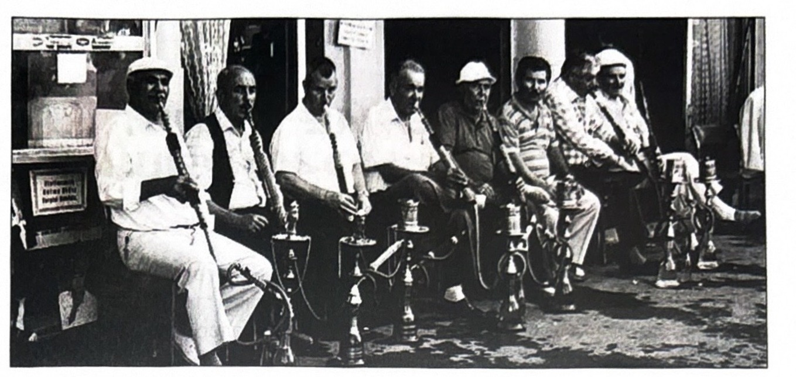

*図：店先に腰かけ、それぞれ自分専用のシーシャを吸う男性たちを写したモノクロ写真（原書 p.17）*

## 喫煙者に対するシーシャの配置

シーシャがときにどれほど神秘的に、謎めいて、不可解に、あるいは魔法のように見えようとも——それはただの装置です。そしてそれは、人々の上にそびえ立つようにテーブルの上に置かれるべきではありません。床の上にのみ置くべきです。東洋諸国では常にそう考えられてきました。ロシアでは、この伝統はあまり広まっていません。多くのシーシャラウンジでは、まさにこの装置がテーブルの上に置かれています。そしてところによっては、それを置くためのテーブル内の専用の窪み（ニッチ）まで設けられているところもあります（どこかは言わないでおきましょう）。しかし、それでもよいではないか、とも言えます。肝心なのは、使い勝手がよく、場所が足り、そしてホースがテーブルの上に置かれた物に引っかからないことです。使い勝手が最優先です。

## チュブクの手渡し

私のお気に入りの一つです！ そう、確かにアラブ人にはチュブクを曲げて、その曲がった部分を自分のほうから（相手に）向けて手渡す伝統があり、先端を前に向けるのは無作法とされています。なぜそうなのか？ 単純なことです。この場合、チュブクは顔に突きつけられる男根の象徴と受け取られかねないからです。それでいてしばしば、管を受け取る側が、手渡す側の手に触れたり、軽く叩いたりする様子を見ることができます。これはさらに単純で、この仕草は多くの東洋諸国では感謝を意味します。何かを手渡してくれる人の手をぽんと叩くことは、かの地では慣わしなのです。

ロシアでもこうするのでしょうか？ ええ。それは必要でしょうか？ 私の見るところ、必須ではありません。ただチュブクの先端を客に突きつけないようにし、取りやすいように差し出せば十分です。しかしながら、シーシャのエチケットのこの側面を知っている客は、こうした差し出し方を常に好意的に受け止めます。

## シーシャは食後に吸うほうがよい

それにはいくつかの理由があります。第一に、この場合、酸素欠乏（による効果）がそれほど強く出ないからです。

第二に、胃の中に食物がないとき、その壁は脆弱になり、この器官の感受性は著しく高まり、ニコチンは何の問題もなく胃壁の表面に吸収され、それによって害を及ぼし、消化器系の疾患を引き起こしかねないからです。

そして最後に、第三に、喫煙は食欲の低下を引き起こします。これは広く知られた事実です。その原因は、ニコチンと相互作用する際の私たちの体内における一連の複雑な化学的過程にあり、それがこのような効果をもたらすのです。スターリングラード包囲戦の時代、人々は空腹を感じにくくするために、より多くの紙巻きたばこを吸いました（子どもにまで吸わせたほどです）。そして、女性人口のある一定の割合は、これを体型維持のために利用しています。また、シーシャマスターは食欲を失いがちで、その結果として体重が減りやすいことも指摘されています。なぜか？ 単純なことです。彼らは朝食を取らないのです。多くの場合、出勤前に単に時間が間に合わず、そして職場では一日が粥（カーシャ）からではなく、ボウル（チャーシャ）から始まるのです。

自分自身の経験で確かめ済みです。

ですから、敬愛する同業の皆さん、いつもしっかりと朝食を取り、ご自身を大切にしてください！

## シーシャとアルコールは悪い組み合わせ

アラブ諸国の住民は、シーシャをお茶と共に味わうのであって、アルコールと共にではありません。かの地では、シーシャとアルコールは相容れません。私たちの同胞についてはそうとは言えませんが。とりわけ嘆かわしいのは、すでにアルコールでかなりぐったりとなった人が、シーシャでさらに追い打ちをかけられて、完全に廃人（野菜）と化してしまう光景を目にすることです。

すべては、ニコチンが向精神性物質の分類において三次グループに属し、抑制剤（ディプレッサント）と興奮剤（覚醒系物質）の境界に位置していることに起因します。アルコールは同じ分類において抑制剤のグループに属します。手短かつ簡単に言えば、医学に深く立ち入らず、脳のどの部位への作用かを書き連ねることもしないとすれば、アルコールとタバコ、すなわちその中に含まれるニコチンは、同一の神経中枢に作用し、それが「酔いの効果」を増強します。これは、さらに大きな度合いでの運動協調性の乱れと、状況を十全に判断する能力の喪失を引き起こします。

私たちが飲んだアルコールは、血液中に入る前に、消化器官による浄化を経ます。ところが、シーシャを通して肺に吸い込まれるアルコールの蒸気は、はるかに速く、しかも何のろ過もなしに私たちの体内に入ってきます。これは血圧の上昇を招きかねません。激しい頭痛、さらには失神さえも起こり得ます。ですから、どちらか一方を選ぶべきであり、それならばいっそ喫煙のほうがよいでしょう。

## シーシャか紙巻きたばこか。一緒には似合わない

シーシャラウンジの中で（紙巻きたばこを）吸うこと、ましてやシーシャの炭から火をつけることは、無作法とされます。シーシャ愛好家が葉巻愛好家のクラブにシーシャを持ち込んで行かないのと同様に、葉巻愛好家もシーシャ愛好家の集まりの中で（葉巻に）火をつけたりはしません。喫煙といっても喫煙によりけりであり、何にでもそれぞれの場所、雰囲気、香りがあるのです。私はこれに大いに同意します。

---

# 第2章

## たばこ原料と成分

### バージニア種

### ニコチンとその類似物質 ／ たばこはどのように作られるか

### バーレー種

## シーシャ用たばこの原料と成分

どんなシーシャ（水たばこ）においても最も重要な構成要素はタバコです。次の記事では原料について述べていきます。皆さんの多くはバージニア種、バーレー種、オリエンタル種について耳にしたことがあるでしょうが、実際にはそれらにはさらに多くの種類が存在します。当チャンネルの常連執筆者であるエヴゲニー・フェドトフが優れた記事を書いてくれました。これを読めば、多くのことがずっと理解しやすくなります。

皆さんこんにちは。エヴゲニー・フェドトフ、「ポイント・アート（Поинт Арт）」です。

シーシャの世界における多くの問題は、いまだ完全には体系化・整理されていません。特に、わかりやすい言葉で情報を提供するという観点ではなおさらです。そこで私は、タバコとたばこ原料についての有益な記事を別シリーズとして始めることにします。まずは「タバコ」「たばこ原料」という概念を定義し、タバコについて何を知っておくべきかを整理していきましょう。

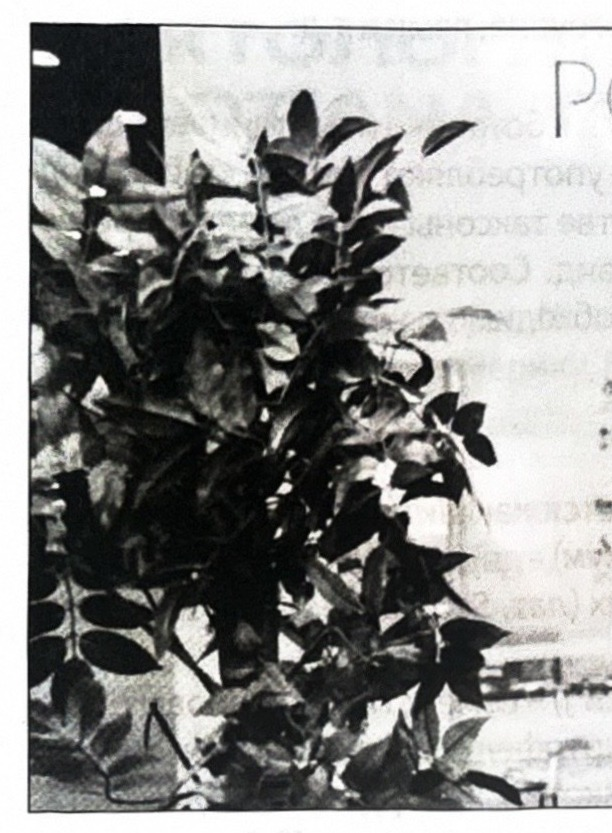

*図：鉢植えのタバコ（ニコチアナ）の植物（原書 p.25）*

### タバコとは何か？

一般的な知識を少しだけ。どの学問にとっても課題の一つは、その過程に関わるすべての者にとって理解可能な用語体系を導入すること、そして知識を体系化・分類することです。いかなる学問においても、科学的知識を分類体系の形で示そうとするとき、分類の単位として似通った対象からなる不可分のグループを定める必要があります。これをタクソン（分類群）と呼びます。たとえば生物学では、タクソンは属、種、界などです。言語学や言語系の学問分野では、タクソンは語派、語群、言語などです。

タバコは植物であり、つまり植物学および栽培植物の科学である作物学（栽培植物学）に属します。「たばこ栽培学」という用語が使われることもあります。さて、植物学および栽培植物学におけるタクソンは、ドメイン、界、門、綱、目、科、属、種です。したがって、タバコを古典的な科学的記述に従って説明するには、それをタクソンごとに分解し、そこから定義を導き出す必要があります。

タクソンごとに分解すると、次のようになります。

タバコ（ラテン語 Nicotiana tabacum Lin、「ニコツィアナ・タバクム・リン」と読み、「ニコティアナ・タバクム」と発音しても差し支えありません）は、ナス科（ラテン語 Solanaceae）、ニコチアナ属（Nicotiana）に属する双子葉の一年生草本植物です。

Solanaceae（［ソラネシ］と読む）という科はナス科であり、タバコのほかにナス、ジャガイモ、トマトなどが含まれます。ナス科の多くの植物はニコチンを含んでいます。タバコを除けば、ニコチン含有量で記録的なのは緑色のトマトで、1グラムあたり42.8ナノグラムのニコチンを含んでいると認められています。ちなみに、タバコを1本吸う代わりに緑色のトマトを約7kg食べても、ニコチンの量はおおよそ同じになります！

ニコチアナ属には、Nicotiana Tabacum Lin そのものに加えて、Nicotiana Rustica（ラテン語 Nicotiána rústica、［ニコチアナ・ルスティカ］、ロシア語の文献ではマホールカ（махорка）と呼ばれます）という植物、およびそれらの雑種が含まれます。

したがって、科学的観点からは次の定義が正しいことになります。タバコとは、植物 Nicotiana Tabacum Lin、ならびにそのすべての種および雑種である。

しかし、タバコ生産の相当な割合を占めているのが植物 Nicotiana Tabacum Lin であることを踏まえ、私たちは今後の記事で用いる次の定義を導き出します。タバコとは、植物 NICOTIANA TABACUM LIN である。

### Nicotiana Tabacum に関する事実

現在、ニコチアナ属には66の種が数えられ、そのうち36種が南アメリカに、9種が北アメリカおよび中央アメリカに、21種がオーストラリアに分布しています。

科学的裏付け：「世界のタバコ・マホールカおよびニコチアナ属野生種コレクションの遺伝資源の在庫調査と開発」、タバコ・マホールカ研究所。

Nicotiana Tabacum の植物の高さはタバコの品種型によって異なり、30cmから2メートルまでの幅があります。

茎につく葉の数もタバコの品種型によって異なり、およそ12枚から60枚ほどになります。

タバコの最も重要な生産国は、ヨーロッパ（イタリア、フランス、ポーランドなど）、アメリカ合衆国、インド、ブラジル、中国です。

### 何のためにタバコを栽培するのか？

ネタバレ：ニコチンのためです。ただそれだけのこと。

タバコが工業的規模で栽培される主な目的となる活性成分はニコチンです。主にたばこ葉に含まれています。通常、たばこ葉中のニコチン濃度は0.3〜7%の範囲にあります。

### たばこ原料とは何を指すのか？

たばこ原料とは、適切に加工処理されたたばこ葉のことです。

葉が収穫後の適切な処理を経ると、それは紙巻きたばこ、葉巻、シーシャ用および紙巻きパイプ用のタバコ、スヌース、その他のたばこ製品を製造するための原料になります。まさに、収穫後処理を経たたばこ葉のことを、たばこ原料と呼ぶのが一般的です。

重要なのは、たばこ葉の加工方法もまた、たばこ原料に影響を与えるという点であり、それはときにタバコの品種型以上に大きく影響することもあります。

### タバコの分類。品種型とは何か？

すでに述べたように、どの学問においても最も重要な課題の一つは、正しい分類を確立することです。

20世紀には、タバコに関する専門の学問であるたばこ栽培学が活発に発展し、学者たちにはタバコの種類の正しい階層的分類を作り出すという課題が課されていました。

最初に、我が国の同胞A・F・ブチンスキーが、タバコを農生態型（アグロエコタイプ）によって、すなわち特定の環境に適応した栽培植物（この場合はタバコ）の生態型によって把握することを提案しました。そして、その農生態型がグループにまとめられました。こうして、A・F・ブチンスキーによれば、たばこ栽培学におけるタクソンはグループと農生態型とされました。

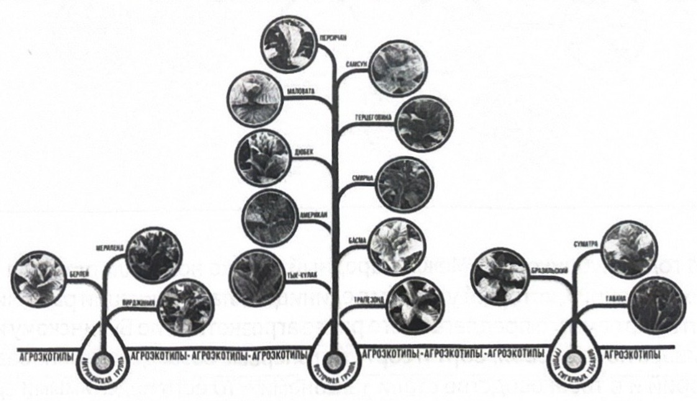

*図：ブチンスキーによるタバコの農生態型分類の系統図（アメリカングループ・東洋系グループ・葉巻系グループ）（原書 p.29）*

別のアプローチを取ったのがE・N・プサレワでした。彼女は自らの研究において、亜種、変種、そして「コンクルティバル（栽培変種群）」をタクソンとして区別しました。この難しい言葉に怖じ気づかないでください。これは実質的に品種型と同じものです。

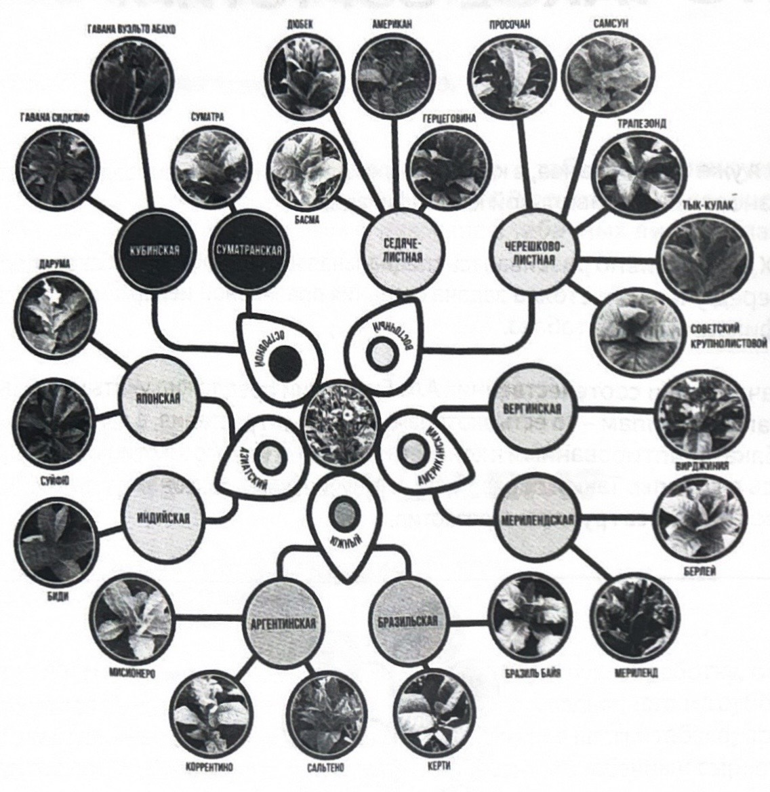

*図：プサレワによるタバコの分類（亜種・変種・コンクルティバル）を示す系統相関図（原書 p.30）*

1964年に「栽培植物命名規約（国際栽培植物命名規約）」が公表され、これによって、それまで提案されていたブチンスキーによる農生態型やプサレワによるコンクルティバルに代わって、植物分類の単位として品種型（ソルトティプ）と品種（ソルト）が承認されました。品種と品種型は初めて基本カテゴリーの地位に引き上げられ、たばこ栽培学においてタクソン、すなわちタバコ分類における不可分の単位となりました。

### タバコの品種型とは、共通する性質と特徴に基づいてまとめられた、同一の地域に生育するタバコのグループである。

1979年、ソ連ではГОСТ 8072-77「発酵済みたばこ原料。技術規格」が導入され、これによれば次の品種型のタバコが存在します。

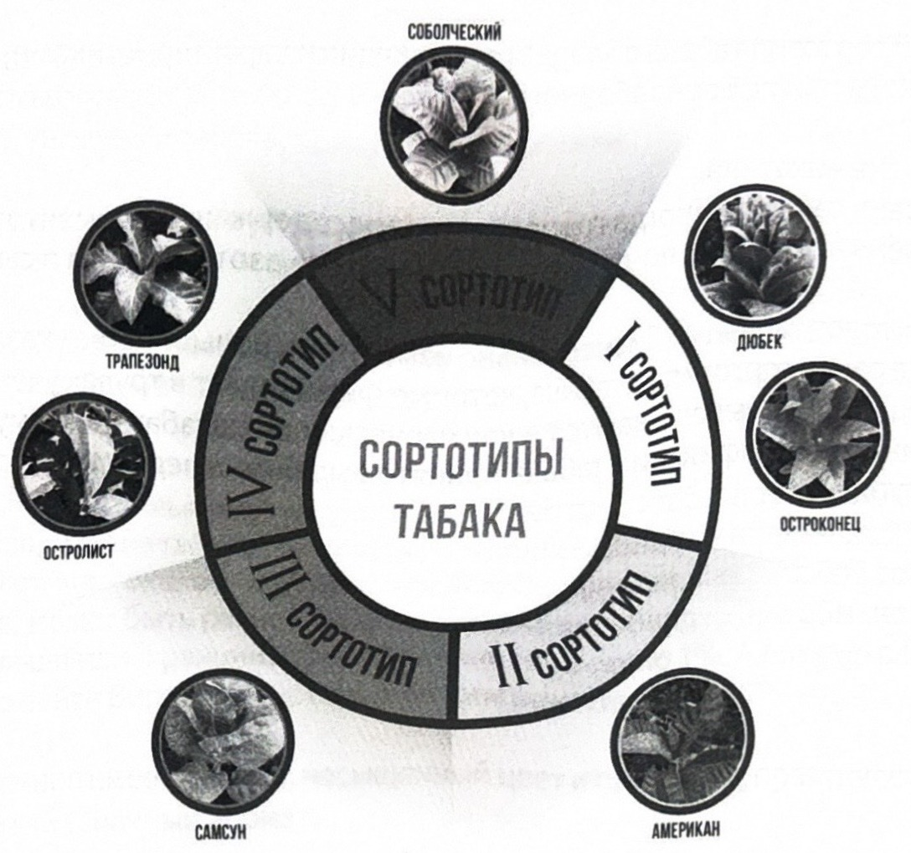

*図：ГОСТによるタバコの品種型（第I〜第IV品種型）を示す環状図（原書 p.31）*

ちなみに、ロシアのシーシャ用タバコの製造業者は、この規格（ГОСТ）を非常に頻繁に利用しています。同意していただけると思いますが、2019年に前世紀の40〜70年代のデータを参照するのはかなり奇妙なことです。

### タバコの品種型の特性

タバコの各品種型は、たばこ原料を選ぶ際に重要となる次の特性を備えています。

1. ニコチン濃度。 2. 糖分濃度（「炭水化物含有要素」と言われることもあります）。 3. 窒素濃度（あるいは別の言い方をすれば、原料における窒素と糖の比率）。

1970年代以降、たばこビジネスは大きく変化しました。本記事でこれまでに挙げた品種型の大半、すなわち20世紀の学者たちの著作に登場するものは、もはや商業的規模では栽培されていません。そのため、現代のタバコ分類では次の品種型およびグループを区別するのが一般的です。

### 現代のタバコ分類

#### アメリカングループ

##### バージニア種

この品種型の英語名称は Virginia で、しばしば FCV という略称が使われます。これは Flue-Cured Virginia、あるいは単に Flue-cured を意味し、すなわちバージニア種に特有の煙管火力乾燥（フルーキュア式）の乾燥法を指します。

タバコの乾燥法のタイプについては後ほど詳しく説明しますが、今のところはバージニア種について定着している名称と略称を覚えておきましょう。

この品種型は世界のタバコ市場の40%を占めています。通常、バージニア種は高い糖分含有量、すなわち炭水化物含有物質の高さを特徴とします。世界中、75か国以上で栽培されています。

ロシアのシーシャ業界では、バージニア種から作られるたばこ原料はニコチン含有量が低く、約1〜2%だと考えられています。しかしそれは正しくありません。バージニア種も、ほかのどの品種型と同じように、さまざまであり得ます。低ニコチンのバージニア種はたいていポーランドやフランス産で、ニコチン濃度は約1%です。一方、イタリアではニコチン含有量2.5〜3.5%のバージニア種も見つけることができます。

バージニア種は黄色く鮮やかな色をしており、心地よく、ほぼニュートラルなタバコの香りを持っています。

##### バーレー種

英語では Burley［バーレー］、ロシア語では Берлей（ベルレイ）と書かれることもあります。

この品種型は世界市場のおよそ15%を占めています。濃厚なタバコの味わいを持つ黒っぽいタバコで、しばしばチョコレートのニュアンスを伴います。香料をよく吸収します。

タバコ市場のプロの間では、「女性的（フェミニン）」バーレーと「男性的（マスキュリン）」バーレーといった概念が見られます。それは、このたばこ葉が栽培上のいくつかの特徴によって違いが出るためです。すなわち、早期の収穫、多量の窒素肥料、生育地域などです。これらのために、バーレーにはほとんど糖が含まれていません。

同じニコチン濃度であっても、異なる地域産の葉は、出来上がったシーシャ用タバコにおいて異なる吸い心地の効果（накуривание）を生みます。これは荒々しさ（жесткость／きつさ）という特性に影響します。これは何に起因するのでしょうか？明らかに、その具体的なたばこ原料における窒素と糖の比率です。アメリカ地域産の葉は伝統的に窒素をより多く含み、「男性的」とされます。一方、ヨーロッパの葉は窒素が少なく、しばしば「女性的」と呼ばれます。

バーレーはニコチン濃度の点で全く異なるものになり得ます。含有量は約1%と低い場合もあれば、4%を超える極めて高い場合もあります。たとえば、ロシアの「ポイント・アート」の顧客の中には、シーシャ用タバコの製造にニコチン含有量4%のイタリア産バーレーを使っている人もいます。

##### メリーランド種

アメリカングループのもう一つのタバコです。原語では Maryland［メリーランド］、ロシア語では Мариленд（マリレンド）と書かれることもあります。

紙巻きたばこにしばしば加えられます。非常に軽くてふんわりとした、ニュートラルな香りのタバコで、よく燃え、通常はニコチン濃度が低く、約1〜1.5%です。

クラスノダールのタバコ・マホールカ研究所の記事からの図で、アメリカングループのタバコの3つの品種型すべて、すなわちバージニア種、バーレー種、メリーランド種を示しています。

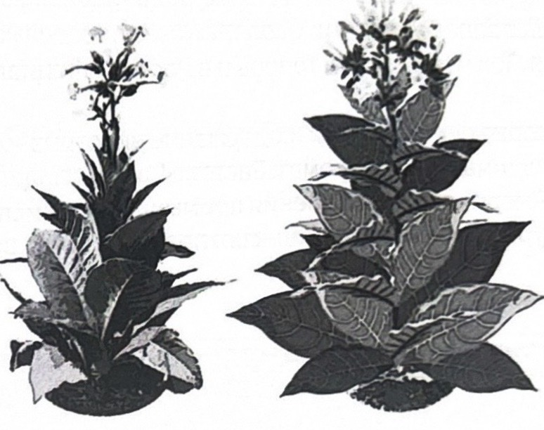

*図：草丈と葉の付き方を比較したタバコの植物体（バージニア種・バーレー種・メリーランド種）（原書 p.35）*

#### 東洋系タバコグループ

##### オリエンタル種

まさにあの「Oriental」［オリエンタル］です。バーレーと同じく、この東洋系タバコは世界市場の15%を占めています。

非常に特徴的なやや酸味のある香りを伴った、マイルドな煙を生み出します。ニコチン含有量は低く、平均で約1%です。その葉は通常小さく、緑がかった黄色をしています。

この品種型の糖分はバージニア種よりも少なく、約5〜7%です。そのため、オリエンタルの後味は酸味を帯び、香りは乾いた酸味のある草のようです。この組み合わせは、ほかのタバコの種類とは決して取り違えようがありません。

##### マホールカ［Rustica］

かつてマホールカはロシアでは概して、タバコではない別の製品とみなされていました。ちなみに、一部の製造業者は今でもマホールカからの物品税の徴収をめぐって議論しています。彼らをがっかりさせて恐縮ですが、新しい規則には次の定義が示されています。「タバコ」とは、原料を得る目的で栽培される、ナス科ニコチアナ属の Nicotiana Tabacum 種および Nicotiana Rustica 種の植物である。というわけで、マホールカは今やロシアでも公式にタバコということになっています。

マホールカは非常に高いニコチン含有量を持ち、10〜15%にも達します。強く濃厚な味と香りを持っています。ロシア、インド、アフリカおよびアメリカの一部地域で栽培されています。工業的利用の観点からは、世界のほぼすべての国で Nicotiana Tabacum との競争に敗れています。

##### その他のタバコ

ここでは列挙するだけにしますが、もし興味があれば今後の記事でより詳しくお話しできます。ラタキア、ペリク、葉巻用タバコなどです。これらは工業的規模ではほとんど使われていません。主な理由は、その分布が小規模で地域的に限られていることです。

### 性質によるタバコのグループ分け

すべてのタバコの品種型は、その品種型の主要な性質を特徴づける2つの大きなグループに分けられます。一方のグループは芳香性（アロマティック）、すなわちブレンド用（クパージュ用）タバコであり、もう一方は骨格性（スケルトン）タバコです。

芳香性タバコ（ブレンド用）。このようなタバコから作られるたばこ原料は、さまざまな強度と風味の鮮やかで濃厚な香りを生み出します。

したがって、芳香性原料とは、芳香性タバコのグループから得られたたばこ原料のことです。

骨格性タバコ。このようなタバコから作られるたばこ原料は、余計な匂いのないクラシックな香りを生み出します。ただし、ニュアンスは異なる点に留意すべきです。バーレーとバージニアはどちらも骨格性原料に属しますが、異なるノートを生み出します。

最も人気のある品種型について、現代の分類に従ったタバコの品種型の表として、まとめておきましょう。

| | アメリカングループ | | | 東洋系グループ |
|---|---|---|---|---|
| 品種型 | バージニア種 | バーレー種 | メリーランド種 | オリエンタル種 |
| ニコチン（MIN） | 1%未満 | 3.5% | 1%未満 | 1%未満 |
| ニコチン（MAX） | 4.5% | 1%未満 | 2.5% | 2.5% |
| 単糖類／糖分 | 15〜30% | 0% | 10〜12% | 1% |
| タバコのグループ | 骨格性 | 骨格性／芳香性（ブレンド用とも言う） | 骨格性 | 骨格・芳香性 |

［原文ママ：表中の数値はOCR由来で配列が乱れており、上表は原文の数値を可能な範囲で対応させたものです。バージニア＝骨格性、バーレー＝芳香性（ブレンド用とも言う）、メリーランド＝骨格性、オリエンタル＝骨格・芳香性。］

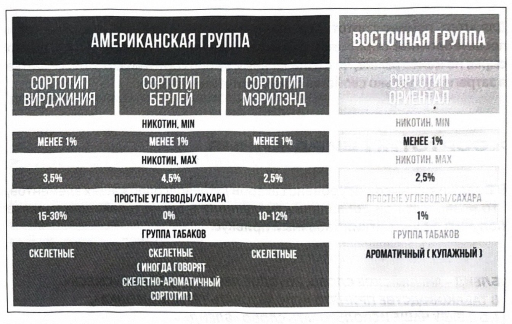

*図（表）：品種型別の特性比較表。アメリカングループ（バージニア・バーレー・メリーランド）と東洋系グループ（オリエンタル）のニコチン最小／最大、単糖類／糖分、タバコのグループ（原書 p.37）*

### シーシャ用タバコにはどの品種型が使われ、それはなぜか？

この問いは正しくは次のように表現されるべきです。「シーシャ用タバコにはどのタイプのたばこ原料が使われ、それはなぜか？」しかし、たばこ原料のタイプについては次の記事でお話しします。

そのためには、品種型に加えて、さらにタバコの収穫後処理の方法についても掘り下げる必要があります。なぜなら、たばこ原料のこの構成要素は、最初の品種型の選択に劣らず重要だからです。本記事では、私はタバコの品種型そのものの性質だけを取り上げます。

##### バージニア種の品種型

バージニア種は糖分／炭水化物含有要素のレベルが高く、そのおかげで、シーシャ用タバコのブレンドにバージニア種を加えることで、よりマイルドなタバコの後味を得ることができます。

ブレンドとは「混合（смесь）」と訳される英語の言葉です。たばこ栽培学では「メシカ（мешка）」という用語を使うのが一般的ですが、私はより定着した選択肢である「ブレンド」という言葉をより頻繁に使っていきます。

##### バーレー種の品種型

バーレーは濃厚なタバコの味わいを持つ黒っぽいタバコで、しばしばチョコレートのニュアンスを伴います。高貴なタバコの後味を与えるのに非常に適しています。

さらにバーレーは、香料を極めてよく吸収します。同意していただけると思いますが、シーシャ用タバコにとってこれは大きな利点です。

先に、バーレーには「男性的」なものと「女性的」なものがあることをすでに整理しました。シーシャ用タバコにおける「男性的」バーレーは、喫煙時により高い荒々しさ（きつさ）を生み出しますが、同時により大きなリラックス効果ももたらします。これは、窒素含有量が高いとニコチンがより速く吸収され、より強く感じられることで説明されます。「女性的」な葉は、それに応じて、喫煙時の荒々しさはかなり小さくなりますが、十分に大きなリラックス効果を保ちます。

##### メリーランド種の品種型

シーシャにはほとんど使われていないので、この話題はここで終わりにします。

##### オリエンタル種の品種型

メリーランドと同じく、シーシャ用タバコの製造においてこの原料はほとんど使われていません。主な理由は、高価格と、かなり風変わりな酸味のある後味です。

### 自分のタバコのブレンドをどう作るか？

多くのシーシャ用タバコには、タバコのブレンドが含まれています。たとえば、紙巻きたばこのブレンドの「黄金比」を守る場合、芳香性たばこ原料の含有量は混合物全体の質量の25%を超えてはなりません。つまり、骨格性たばこ原料は75%以上を占めます。この比率はシーシャ用タバコには完全には当てはまりませんが、まさにあなた自身の最適なブレンドを探す出発点にはなり得ます。

#### たばこブレンドの最適な比率

75% 骨格性原料 ／ 25% 芳香性原料（ブレンド用）

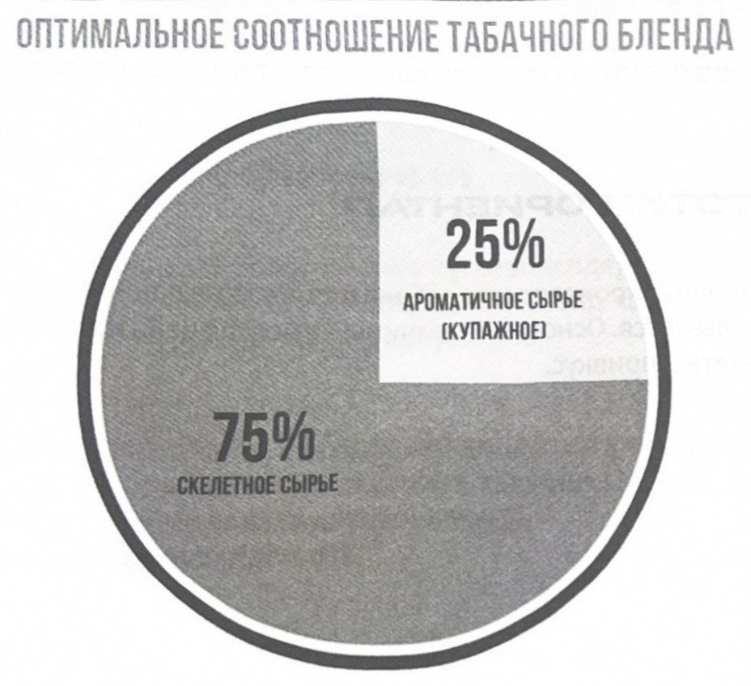

*図（円グラフ）：たばこブレンドの最適な比率（骨格性原料75%・芳香性／ブレンド用原料25%）（原書 p.40）*

## バージニア種［Virginia］

アメリカ大陸における最古のイギリス植民地の名にちなんで名づけられたタバコの諸品種です。ほかの州（フロリダ、ジョージア、両カロライナ州）、南アフリカ、カナダ、インド、ザンビア、ジンバブエ、マラウイ、中国でも栽培されています。ヨーロッパも制覇しました。

これは大葉で甘い品種であり、大半のタバコ混合物の基盤となりますが、ほかの成分を加えずに単体でも喫煙されます。タバコの特性は、品種改良、土壌、微気候、加工方法によって変わります。最も多いのは、一次加工として、煙管（フリュー）の中で熱風によって乾燥させる方法です。近年は技術工程を加速させるため、室内での乾燥を蒸気処理に置き換えることが多くなっています。

Matured Virginia（マチュアード・バージニア）。フルーティーなニュアンスを伴う、清らかでやや甘い味わいの、バージニア種の芳香性を帯びた熟成葉です。

Gold Virginia（ゴールド・バージニア）。煙管の中で乾燥させた、バージニア種の金色のたばこ葉です。

Red Virginia（レッド・バージニア）。天然糖分を多く含む赤い斑点のあるたばこ葉で、アフリカがその名声を誇り、多くのクラシックなタバコ混合物の基盤となっています。

Stoved Virginia（ストーブド・バージニア）。煙管の中で乾燥させ、高圧蒸気処理の結果として色が濃くなった、バージニア種のたばこ葉です。Matured Virginia よりも香りの主張が弱く、味わいにはフレッシュなフルーツ・チョコレートのニュアンスがあります。

まさに Virginia の葉に天然の糖が存在することによって、タバコは保管中に発酵し、すなわち新しい独特の味わいを獲得します。専門用語では「タバコが成熟する（взрослеет）」と言います。糖分の含有量が多いため、バージニアのタバコの味わいはやや甘く、繊細で、芳香性は熟度によって変化します。きつさ（強さ）の点では、バージニアのタバコは非常にマイルドなものから中程度のきつさのものまで幅があります。これは、植物のどの部分から葉を摘んだか、そしてタバコが栽培された地域によって決まります。

## バーレー種［Burley］

最初の株の品種改良は、ジョージ・ウェッブとジョセフ・フォア（George Webb, Joseph Fore）の功績とされ、この出来事は1864年のこととされています。

大局的に見ると、Burley のタバコの株は、淡色（ここにはいわゆるホワイトバーレー White Burley が含まれます）と濃色の品種に分けることができます。濃色バーレーの葉は文字どおりニコチンが染み込んでおり、タールの含有量が高くなっています。これらは「重い」、土っぽく、動物的なニュアンスの味わいを生み出し、私たちはしばしばそれを葉巻のようだと認識します。

淡色品種は、ほどほどの量のニコチンを含んでいます。このようなタバコにはナッツのような後味（新鮮な、あるいは焙煎したクルミの）が特徴的です。ホワイトバーレーの味わいは、ときにカカオを思わせる連想を呼び起こすこともあります。

収穫したたばこ葉の加工技術について言えば、このタバコは、バージニアの葉でほとんどの場合に行われるような何か一つの加工処理ではなく、しばしばさまざまな加工処理の一連のサイクル全体を経ます。最も多いのは、まず第一に葉の空気乾燥（エアキュア）です。タバコを納屋に吊るし、循環する空気の作用で葉を必要な度合いまで乾燥させ、その際に色を変化させます。この処理は、湿度やそのほかの気候条件にもよりますが、8週間以上にわたって続きます。

私たちに Dark-Fired Kentucky、あるいは単に Kentucky（ケンタッキー）として知られる濃色バーレーは、空気乾燥の代わりに直火の上で乾燥させる工程を経ます。これによってたばこ葉は同時に炙られると同時に燻されもします。この方法は、ラタキアという名称で私たちに知られている東洋系タバコの製法と多くの点で似ています。

バーレーは、ある意味でバージニアの競合相手であり、こう言ってよければ、やはり万能ですが、これらのタバコ品種の万能さの性格はかなり異なります。

今日のたばこ製品の製造におけるバーレーの応用範囲には、実質的に限界がありません。紙巻きたばこの製造でも、葉巻の巻き上げでも、喫煙パイプ用のタバコ混合物の作成でも使われています。嗅ぎタバコや噛みタバコの製造も、バーレーを見過ごしてはいません。要するに、現代世界のあらゆるたばこ製品の製造は、バーレーそのものを純粋な形で使うか、あるいはその派生物を使っています。

おそらく、ある時点で「バーレー」という言葉が事実上「香料を加えたタバコ（ароматизированный табак）」という言い回しの同義語になったことが、多くのパイプ喫煙者（通常は「純粋な」タバコ混合物の愛好者の中の人々）がバーレーを見下すようになる原因となったのでしょう。しかし、急いでバーレーを見限るべきではありません。このタバコ品種は、「香料もの（アロマティク）」の愛好者の陣営でも、「純粋な」タバコ混合物の崇拝者からなる正規軍の部隊の配置の中でも、バリケードの両側でその役割を見事に果たしています。

ナッツの味わいを持つ淡色および「中間」のバーレー品種は、香料を加えたタバコ混合物の作成に広く使われています。このようなタバコ自身の味わいはマイルドであまり主張が強くなく、控えめです。香料を加えると、バーレー自身の味わいは後景に退き、外から加えられた味や香りと衝突しません。

ケンタッキーについては別途語っておくべきでしょう。火力乾燥（オープンファイア式）のタバコ、Dark Fired Kentucky です。これはおそらく、いささかも万能とは呼べない唯一のバーレーの種類です。これはそれ自体で完結したタバコです。あまりにも際立った個性を持っているため、キャベンディッシュやペリクと同じように、独立した成分、独立した亜種として区別されています。

タバコ混合物にバーレーが含まれていることの特徴的な点（の一つ）は、喫煙中に舌がピリピリすることです。Burley は、あらゆる種類・品種のタバコの中でおそらく最も刺激の強いものです。これはバーレーのアルカリ性によって引き起こされるもので、それによって、私たちが感じる「押し寄せてくる」きつさも説明できます。舌のピリピリは熱による作用の結果ではなく、煙のアルカリ性環境によって引き起こされる小さな痙攣です。もしこのようなバーレーの作用が不快になってきたら、何か酸っぱいもの、ジュースや辛口ワインを飲むとよいでしょう。バーレーの高まったきつさの作用を和らげるためには、飴やキャラメルを手元に置いておくと役立ちます。ニコチンはまず血糖値を上げ、その後それを急激に下げます。そういうとき、私たちは汗が噴き出し、喉に塊がこみ上げてくるのを感じます。飴の中の糖が「すべてのシステム」の働きを正常化するのに役立つはずです。

バーレーは、タバコに使われる最も多面的な成分の一つです。乾燥の段階だけを経た単純な形でも、いくつもの加工サイクルと発酵を経た複合的な形でも見られます。バーレーは淡色のものも濃色のものもあります。純粋な形のものも、加工されたもの、さらには炙られたものもあります。リボン状の刻み、サイコロ状、リング状、薄板状、そしてほかにも実にさまざまな形で見られます。バーレーは、タバコ混合物の味わいに、コク、深み、濃厚さを与えて大きく変身させ、改善することもあれば、それを取り返しのつかないほど台無しにすることもあります。

（インターネットの広大な世界から、一般教養のために引用）

## ニコチンとその類似物質

多くの人がその危険性について耳にしたことはあるものの、具体的な情報を伴っていません。私たちはこの空白を埋めることにしました。まず、ニコチンにはどのようなものがあり、それがシーシャ用タバコの中でどのように使われているのかから始めましょう。

本記事は、Chabacco の主任技術者キリル・オフチンニコフが、イリヤ・アンドレーエヴィチ・ロマノフとの共著で執筆しました。イリヤは校正を入れ、いくつかの点について生きたコメントを加えることに同意してくれました。

### シーシャ用タバコにおけるニコチンおよびその類似物質の含有量

私はさまざまな理由でシーシャ用ミックスを吸っています。その一つがきつさ（強さ）です。タバコ混合物について言えば、それはたいてい原料に含まれるニコチンのことです。タバコ中のニコチンについて語るのは報われない仕事です。Savinov Says というリソースでは、すでにこのテーマについてさまざまな性格の記事がちらほら登場していますし、私はこの部分に時間を割くつもりはありません。なおさら、きつさの調整剤（レギュレーター）という観点から見ると、このテーマはあまり興味深いものではなくなってきています。そして、私たちの業界が年長の兄である紙巻きたばこ業界から最良のものを取り入れ、しかもそれ自身も立ち止まっていないことを考えれば、私には語るべきことがあります。

イリヤ・ロマノフ：私たちのこの市場では、いまだに誰も彼もが試している状態です。私たちはおそらく世界で最も寛容な客層です。シーシャを吸って、「お前は吸うな、こんなの最悪だ」と言って人に回さない、それが私たちです。私はこれをそろそろ終わりにすることを提案したいと思います。なぜなら、もし「ロシア製」のような製品が、たとえばアメリカ市場に出たら、工場は閉鎖されるでしょうから。一方、ロシアでは製品に対する管理は最小限で、認証の遠隔取得などが行われています。

技術的な部分を広く明かしたり深く掘り下げたりするつもりはありません。第一に、これはかなり大きな価値を持つ情報だからです。第二に、私はあなた方が自分自身で視野と知識を広げるように後押ししたいのです。そうして初めて、あなた方は得たものを大切にするようになるでしょう。

### もしニコチンがなかったら

もしたばこ原料がニコチンを失った、あるいはニコチンが不足している、あるいは原料がそもそもニコチンを成分として一度も含んでいなかったとしたら、どうなるでしょうか？

ブレンド作りの分野では、全員の成績表に「5（最高評価）」がついているわけではありません。全員が、たとえばルキヤノフ氏とそのチームや、ホフマン氏ほど腕が確かなわけではありません。鼻で笑う人もいるかもしれませんが、私の考えでは、この2つの製品はシーシャ用タバコ市場で最も技術的に優れた製品です。

イリヤ・ロマノフ：私のほうからは Sebero と Starbuzz に挨拶を送っておきます。

さて、もしあなたがいくつかの理由で原料を加工処理するなら、多数の成分とともにニコチンも失うことになります。

たばこ葉の乾燥：地下室での乾燥、火力乾燥、日光による乾燥。

乾燥前のたばこ葉は次の成分を持っています。ニコチン、タンパク質、アンモニア、炭水化物、酸類、ポリフェノール、ペクチン物質、タール、精油、ミネラル物質です。乾燥・発酵前の成熟葉は80%の水分と10〜20%の有機物を含んでいます。

乾燥は成分を大きく変化させます。葉は枯死後には物質を分配しません。中央の主脈が黒ずみ、それを切り取り、そしてさらに……。タンパク質、糖（デンプン）、クロロフィルが分解され、水分の75〜80%が失われます。

## 第一発酵（一次発酵）

- 葉を積み重ねると、炭水化物が分解され、新たな過程が始まります。分解によって得られたエネルギーが新たな過程を起動させます。

- 山を互いに重ね合わせます。中央の葉は酸素を受け取れなくなり、葉が急速に腐敗するのを防ぐようにします。過程そのものは進行しますが、ゆっくりと進みます（タンパク質化合物）。

- 有機物が無機物へと移行する――これが発酵です。

- このような場所の温度は300℃に達することがあります。

- 腐敗が起きていないかを管理しながら、山をかき混ぜます。

上のものを下へ、下のものを中央へ、中央のものを上へ。

- 色が変わります。なぜなら（完全にではないものの）クロロフィルが失われ、黄金色から褐色へと変化するからです。

- タールが大きく減少します。

- 発酵は葉をさらなる変化へと準備させます。第一発酵後の主たる変化（トランスフォーメーション）は、色、タールの減少、葉の加湿です（葉をあまりに乾燥させたまま放置してはいけません。水分が均一に行き渡ると、葉は折れにくくなります）。

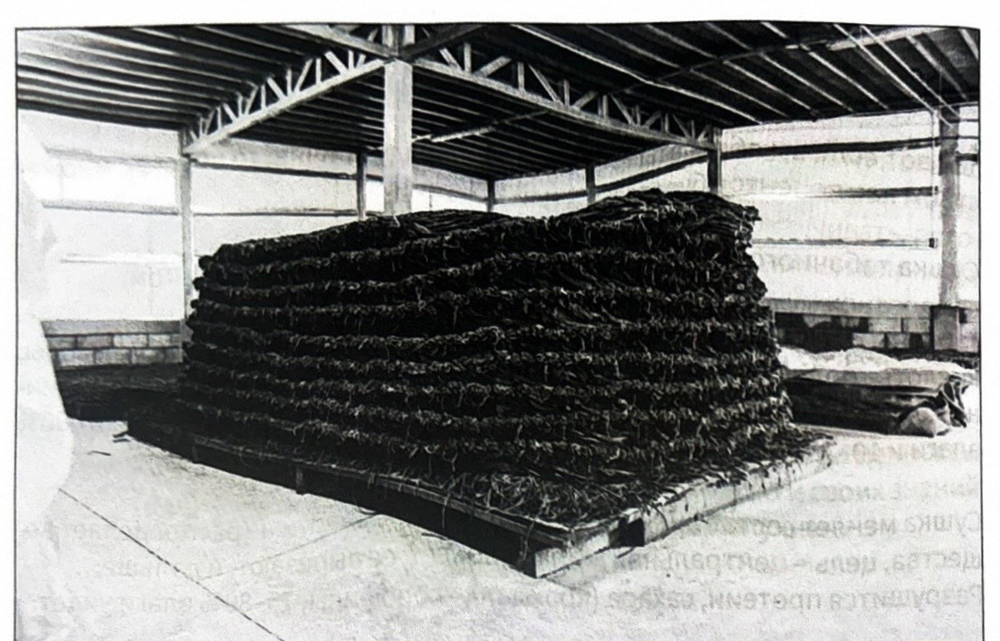

*図：倉庫で積み重ねられ第一発酵中のタバコ葉の山（原書 p.48）*

## 第二発酵（二次発酵）

準備にあたり、葉は品質ごとに分類されます――リヘロ、セコ、ボラドです。上・中・下の原則です。

- 第二発酵における化学的変化。主要なものは、第一発酵の長さに応じた硝酸アンモニウムの発生です。有機物の分解過程が続くか、あるいは無機物が芳香性の揮発性物質（化合物）――アルデヒド、酸、フェノール類など――へと変化し始めます。

- 精油性の香気成分やその他の十分に揮発性の高い物質は失われていきます。
- 重い分子は葉の中に沈着します。

- 香りを付与するだけでなく、この発酵は葉をより燃えやすくします。
- 第二発酵はより温かいものです。

リヘロは440まで、セコは400まで、ボラドは370まで。

- これらの温度データは（葉が育っていた間の）気象条件によって補正されます。

- ニコチンが気体状態に移行することがあります。

復元された、あるいは拡張された（再生された）葉は、例外的な場合に限り、有意な強さ（クレペスチ）を持つことになります。

すべての原料がニコチンを含むわけではありません。

茶やその他のもの――トウモロコシ、ビート、ニンジン、ジェル、石などはニコチンを含みません。なぜ茶だけを別に扱うのか。それは、世界には医学的・宗教的その他の理由から茶を喫煙する習慣を実践する文化が存在するからです。実のところ、アジア医学における茶の喫煙、そして茶の喫煙に関する科学的探究のおかげで、Chabacco（チャバッコ）が誕生したのです。

イリヤ・ロマノフ：タバコのほかにも、人々は何世紀にもわたって、茶葉を含むさまざまなハーブや植物を喫煙に用いてきました。

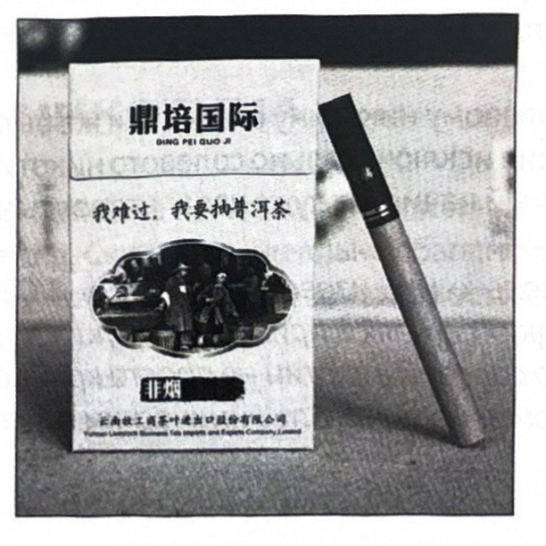

*図：中国産プーアル茶を用いた喫煙製品（茶のパッケージとタバコ状の製品）（原書 p.49）*

## 液体ニコチン

抽出と精製による産物です。その本質において、ニコチン含有植物中のニコチンとほぼ完全な等価物です。純度が高いほど良く、不純物の量は匂い、味の特性、溶解能力に影響を及ぼします。

私はまさにこの成分を扱っています。それがどれほどうまくいっているかは、Chabaccoを吸ってみれば評価できます。ニコチン全般についての良質な記事はすでにSavinov Saysのチャンネルで公開されていますので、ここでは詳細に深入りはしません。それにネット上にも膨大な量の資料があります。コピペで遊ぶようなことはしません。

イリヤ・ロマノフ：Command+c……

## ソルトニコチン（塩ニコチン）

ニコチンの一種で、ソルトニコチン、あるいはモノプロトン化ニコチンと呼ばれるものです。その創出の主たる目的は、我々の身体との酸性度レベルにおける最大限のバランスをとることであり、それがより深いニコチンの充足を与えるのだと考えています。酸を添加することによって得られます。

イリヤ・ロマノフ：あるいはアルカリでしょうか？多くの場合、そしてより興味深い成分の場合は稀にですが。

ソルトニコチンには、タバコ由来のニコチンと同じくらい速く依存してしまうことがあります。長期間にわたってソルトニコチンだけを摂取した後では、タバコのニコチンはニコチンへの渇望を満たしにくくなり始めます。

イリヤ・ロマノフ：私の知る限り、「吸収」の速度はおよそ30秒、稀に2分まで、たとえば抽出産物では5～7分から15分です。私は、ソルトニコチンが極めて有害であるばかりでなく、最も速い置換効果、すなわち化学的依存を持つものだと考えています。

また、ソルトニコチンの過剰摂取は、タバコのニコチンの摂取よりも深刻な、体内でのニコチン合成に関する問題を引き起こすことがあります。つまり、ソルトニコチンにこそ最大限がっちりとはまり込んでしまうのです。

イリヤ・ロマノフ：血圧の問題、めまい、片頭痛なども含めて。その最初の兆候は睡眠後の「つらい目覚め」であり、それ以前には後頭部の圧迫感です。

それでは、市場に出回っているソルトニコチンの種類について手短に見ていきましょう。

イリヤ・ロマノフ：私はじっくり拝聴しますが、思い出していただきたいのは、シーシャを吸う際には胃の中の環境に注意を払う必要があるということです。吸う前には食べておき、吸っている間は液体で攻撃的な環境を薄めるのです。ソルトニコチンは胃により大きな影響を及ぼします。

## ニコチンレブリン酸塩（レブリン酸ニコチン）

気道の感受性を下げます。つまり、より高い濃度で摂取することができるということです。また、ニコチンに十分な形で反応しないニューロンとの結合能力を高めます。私の感覚と寄せられた感想によれば、芳香（アロマ）への影響が最小限の、最も穏やかな形態です。

## 安息香酸ニコチン

市場における最も初期の塩の一つで、これによってソルトニコチン使用のブームが始まりました。知覚の穏やかさ、摂取効果、芳香（アロマ）との調和性において理想的にバランスがとれていると考えられています。

## 酒石酸水素ニコチン（ニコチンビタートレート）

禁煙を助けるはずの製品との組み合わせで最もよく耳にします。現時点で市場で最も人気のある形態です。さまざまな研究におけるフォーカスグループは、まさにこの酒石酸水素ニコチンこそが、最も強力で速いニコチン効果を持つと指摘しています。

## サリチル酸ニコチン

市場で成長しつつあるシェアに属します。なぜなら、これには食品中に最も多く見られるサリチル酸が含まれているからです。

## 乳酸ニコチン

乳製品に最も多く見られる酸が用いられます。私自身から付け加えると、この形態は他のものと違って、摂取のためにより低い温度を必要とします。

このグループについてまとめると、摂取にとってそれが良いことなのか悪いことなのか、私は一概には言えません。自分の製品にソルトニコチンを使うのかとよく訊かれます。いいえ、使いません。とはいえ、個人的にはソルトニコチンは「キマる感（ナクルカ）」という点では好きですが、強固な依存を生み出すという点では好きではありません。製造者の側としては、恥ずかしげに「ニコチン」と書く代わりに、パッケージに「ソルトニコチン」と書く方が正直でしょう。なぜなら、人は、喫煙の効果がより濃厚で、ところによってはより美味しいが、この形態のニコチンをやめることもはるかに難しいのだということを知るべきだからです。それに、ありふれた過剰摂取で最初の高血圧患者や心臓病患者がヴァルハラへ旅立つまでのことでもありますし。

イリヤ・ロマノフ：もう一度言いますが、これはまさにロシアでの話です。もう厳しい姿勢をとりましょう！私は、ソルトニコチンであることが明記されていない場合のソルトニコチンには反対です。ただしJuulは興味を持って試してみました。

## タバコ製造の廃棄物

特殊なケースについて話しましょう。最も単純で安価な形態――たばこ葉を洗浄した後の液体廃棄物です。

大雑把に言えば、たばこ葉を取り、水で洗うと、洗うたびに、葉はニコチンの一部と、受容体を刺激する成分の一部を失います。

製造者はこのことを公然と語るのを恥ずかしがります。なぜかは分かりません。

ただし、別の意味で「才能あふれる」、そして幸いにも今は元になった、そうした製品の一つの代表者は例外でしょうか。なぜほかでもない彼について触れたのか。彼はまさに、洗浄の過程で得られた水溶液は何の処理もろ過も必要としないと、何人かの尊敬すべき人々の同席のもとで私を説得しようとしたからです。

ご想像のとおり、あるいはそうでないかもしれませんが、こうした洗浄液には、率直に言って有害な物質がある程度含まれており、それらはたばこ葉からならこのような濃度であなたの体内に入ることはなかったはずのものです。

イリヤ・ロマノフ：実のところキリルは少し誇張しています。なぜなら、いずれにせよ物質の一部は沈着するからです。ただ、これこそがもう私の「ロシア的寛容さ」なのかもしれませんが。

ですからこの問題については、もはやすべては製造者の良心に委ねられています。良質なろ過に気を配り、しかもそのうえでどうにかしてニコチンを保持してみせる製造者の良心に。

この過程を用いていて、しかもかなりうまくやっている会社があります。彼らのブランドへの取り組み方、そして我が国の業界の行く末への深い関与を考えると、まさに彼らこそがすべてを最大限に正直に、そして良くやっているのだと、私は確信しています。

では、そうでない場合はどうすればよいのでしょうか。何もできません。信じてください、製造者自身がそのことを公然と表明しなければ、ニコチンやソルトニコチンの添加の問題と同様に、あなたはそのことすら知ることはないでしょう。とはいえ時折、官能（オルガノレプティック）によって添加されたニコチンを見分けられるとされる変わり者が現れます。ブラインドテストは逆の結果を示します。実際には、ラボでなら、タバコだけに固有の微量成分によってそうした形態を捕捉することは可能です。それも、たばこ原料を使用していない製品の範囲においてだけですが。それに、そんなことが誰に必要でしょうか。そう――誰にも必要ありません。

## カフェインとその他の興奮剤（アクセラレーター）

私はかつてカフェイン、ハーブや根の抽出物（朝鮮人参、エゾウコギ、ロディオラ）、さらには半ば禁止されているDMMA（ゼラニウムの抽出物）で実験しました。

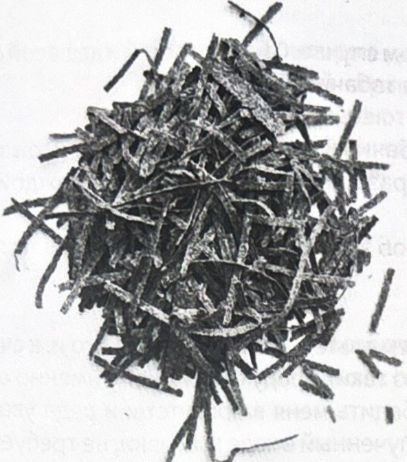

*図：細かく刻まれた喫煙用原料（茶葉・ハーブ）のクローズアップ（原書 p.54）*

最も興味深いのはカフェインです。Tangiers F-Lineに敬意を。

イリヤ・ロマノフ：それだけじゃありませんよぉぉ。

なぜなら、残りの成分は実用的な投与量では個人の不耐性につまずきかねないからです。たとえばドイツでは、こうした添加物を使用することは法律上公式に禁じられています。ロシアでは、誰もそんなものを使っていないことを願います。

イリヤ・ロマノフ：願い続けてください……。それにしても興味深いですね、これはカフェインとブースターの話です。ではアレルゲンについてはどうでしょうか。だってお認めになるでしょう、蜂蜜へのアレルギーは非常に一般的なのに、「天然」をうたう製造者が何社かいるのです……。カフェインやその類似物、代替物の添加は、可能な害を自覚しないまま「ユニークな仕掛け」として「隠される」、非常に込み入ったアイデアです。茶でさえ――それは健康的なライフスタイル（ZOZh）ではありません、喫煙であり、有害なのです。ただ、自分自身と消費者に対して正直であるべきだということです。

これはニコチンに似た効果を与えるのでしょうか。一概に比較はできません、それは別物です。共通点といえば、おそらく顕著な血圧の変動と、多くの人が「きつさ（ジョーストコスチ）」と呼ぶ喉頭への圧迫感くらいでしょう。

シャキッとさせてくれるか。はい、一杯のコーヒーのように。

イリヤ・ロマノフ：私は心臓がそれを感じますが、私はコーヒーや「レッドブル」などに対して非常に敏感なのです。

製造に使うことはできるのか。間違いなく、できません。興味深い刺激効果があるにもかかわらずです。なぜなら、活性物質の濃度がWHO（世界保健機関）の勧告を大幅に上回ることになるからです。

イリヤ・ロマノフ：思うに、TangiersはF-Lineなしでも最も有害なものの一つです。でも吸いはしますけどね）。

強さ（クレペスチ）の調整剤としては、シナジー剤の役割を担うニコチンとの組み合わせにおいてのみ適用可能です。単独で使用した場合は、ニコチン摂取による個々の効果を昇華させるにすぎません。

茶ベースのシーシャミックスが、カフェインのおかげでキマる（ナクリヴァチ）し強くなりうると断言する製造者がいます。そこにはテインもあって、それがキマらせるのだと反論する人もいるでしょう。化学便覧を開けば、あるいはググれば、この用語はマテインと同様にカフェインと同義であることが分かります。

テオフィリンは？はい、ありますが、それは淹れた茶の中にごく微量しか検出されず、何らかの効果を得るにはあまりに少なすぎます。

テオブロミンは？はい、カフェインに似ていますが、これもまた少なすぎますし、十分な投与量での類似性は、心筋の興奮と排尿量の増加を引き起こすことになり、ニコチン効果とは決して言えません。

そこで、次の出典を参照してみると――

- Y. Lin et al, Factors Affecting the Levels of Tea Polyphenols and Caffeine in Tea Leaves, Journal of Agricultural and Food Chemistry 2003, 51, 1864-1873
- P. Mohanpuria et al, Caffeine Biosynthesis and Degradation in Tea [Camellia sinensis (L.) O. Kuntze] is under Developmental and Seasonal Regulation, Molecular Biotechnology (2009) 43:104-111
- J. Xiao et al, Determination of Polyphenols and Alkaloids in Tea and Cluster-Linear Discrimination Analysis, Shipin Keshe () 2010, Vol. 31, No. 22 343
- Y. Zuo et al, Simultaneous determination of catechins, caffeine and gallic acids in green, Oolong, black and pu-erh teas using HPLC with a photodiode array detector, Talanta 57 (2002) 307-316

……そしてもう一つ二つの特許（ググってください）も参照すれば、ヴェイプ用リキッドの同じ製造者たちにおける実用濃度と比較したときに、追加で添加しなければ茶にはカフェインが足りないことが分かります。それに全般的に、カフェインとニコチンはかなり異なる効果を持っているのです。

## CBD（カンナビジオール）

確かめられた事実よりも、神話のほうを多く耳にします。科学に知られている数百のカンナビノイドの一つです。潜在的な有用性が活発に研究されています。この成分については別に一本記事を書くこともできますが、本稿の範囲では扱いません。一つだけ覚えておくべき重要なことは、CBDはTHCではないということです。精神活性効果は持ちません。ヨーロッパやアメリカでは、CBDはその特性のおかげでますます人気を集めています。強さ（クレペスチ）の調整剤としては適していません。

結論は書きたくありませんでしたが、やはり書かざるを得ません。

パーヴェルはこの記事を一年以上待っていました。私はずっと取りかかろうとしては先延ばしにしていましたが、結局3日で書き上げました。私は理論家ではなく実践家であり、長々と語るよりも結果を見せるほうが簡単なのです。私はよく、業界で茶の喫煙の流行を最初に持ち込んだ人物と呼ばれます。まあそういうことにしておきましょう、もっとも、それは完全に正確な表現ではないのですが。

追伸。いわゆるТХ（この用語は好きではありません、かつては専らヴェイピングと結びついていたものですから）の本質は、しばしばニコチンの量ではなく、原料の糖化度、糖の種類、そしてそれらとシーシャミックスの他の成分との相互作用にあります……。

イリヤ・ロマノフ：結びに、読んでくださった方々に感謝を申し上げたいと思います。上で述べたことは一つの意見であり、あるところでは私的なもの、あるところでは裏付けのあるもの、そしてあるところでは、プロを気取る無学者たちのやり方にうんざりした疲れた人間たちの感情です。我々は、我が国の市場における「クソ」な製品を確かに名指しできます。そしてあなたがたにもできます。もう強い「検閲基準（ツェンズ）」になりましょう。

別途、助力と提供いただいた情報に対して感謝を申し上げたいと思います。

レイコ・N.――助言、批判、そして君が私の兄弟であることに対して。サヴィノフ・P.――忍耐と、出版の機会を与えてくれたことに対して。

そして、注意深く読み、自分にとって何か有益なものを得てくれるすべての人々にも。市場を教育し発展させようと努め、記事を書いてくれるすべての製造者に感謝します。

ご清聴ありがとうございました。

## 参考文献の出典

- https://patents.google.com/patent/CA2909967A1
- https://patents.google.com/patent/WO2015006652A1
- https://patents.google.com/patent/WO2015183801A1
- https://patents.google.com/patent/US9340475B2
- https://patents.google.com/patent/CN110367581A
- https://patents.google.com/patent/NL2018504B1
- https://patents.google.com/patent/WO2014150245A1
- Y. Lin et al, Factors Affecting the Levels of Tea Polyphenols and Caffeine in Tea Leaves, Journal of Agricultural and Food Chemistry 2003, 51, 1864-1873
- P. Mohanpuria et al, Caffeine Biosynthesis and Degradation in Tea [Camellia sinensis (L.) O. Kuntze] is under Developmental and Seasonal Regulation, Molecular Biotechnology (2009) 43:104-111
- J. Xiao et al, Determination of Polyphenols and Alkaloids in Tea and Cluster-Linear Discrimination Analysis, Shipin Keshe (4) 2010, Vol. 31, No. 22 343
- Y. Zuo et al, Simultaneous determination of catechins, caffeine and gallic acids in green, Oolong, black and pu-erh teas using HPLC with a photodiode array detector, Talanta 57 (2002) 307-316
- https://patents.google.com/patent/US20050241658A1
- https://patents.google.com/patent/KR200231198Y1
- https://patents.google.com/patent/US3561451A
- https://patents.google.com/patent/JP2014087342A
- https://patents.google.com/patent/CN1694628A

## ニコチンについて詳しく。イリヤ・コブザレフ

| ここは非常に注意深く読む必要があります。なぜなら、情報がより専門的で理解しづらいものでありながら、あなたの仕事の本質を理解するうえで間違いなく超重要だからです。

さて、また会いましたね。早速本題に入ります。サンクトペテルブルクの展示会Hookah Club Show 2019で、私は「ニコチン――応用への深い探訪」と題したセミナーを行いました。おそらくあなたが私の文章を読むのはこれが初めてではなく、私が文章をたくさん書くのが好きで、語るべきことを持っていて、口頭での朗読用に準備した記事を文書の形で公開するという有益な習慣を持っていることをご存知でしょう。とはいえ、この件については別に語っておきたいのです。現時点で、これは我々のチームが用意した最も本格的なものだからです。あらかじめお断りしておくと、これは非常に大部のものになりました。ここには6千語があり、そして発表は実際まる1時間を要しました。

テキストエディタの「出典」フォルダには、短い記事から書籍まで、さまざまな分量の34本の資料が入りました。最大限に情報量が多く、そして願わくば分かりやすいものになりました。私の文章の「印刷」版の利点として、出典の大部分は末尾に一覧として残しておきます。以下には、簡単な要旨と、発表のために書かれた原文を無修正で載せます。資料の拡散にご協力いただければ幸いです。また、過去の作品への心地よい感想すべてに感謝したいと思います。

どうぞお楽しみください。

## 物質としてのニコチン。何が？何のために？どこから？なぜ？

これから、物質としてのニコチンについて、それが我々の身体に及ぼす影響、そして消費者向け製品における使用について、私の知る限りのすべての情報をお話しします。情報はかなり多くなったので、その理解を容易にするために、補足の画像を添えながら説明していきます。とはいえ、まずは自己紹介から始めましょう。

私はイリヤ・コブザレフ、「イントロ・グループ」社のプロダクトディレクターです。おそらくCobra（コブラ）というブランドでご存知でしょう。知らない方のために言うと、我が社はシーシャ、炭を製造していますが、主力製品は3つの喫煙製品ラインであり、そのうち2つは茶葉をベースに、1つはタバコをベースに作られています。

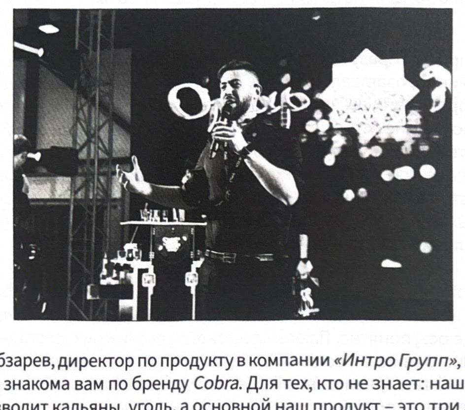

*図：マイクを手にセミナーで講演するイリヤ・コブザレフ（原書 p.60）*

言うまでもなく、製品の開発にあたって最優先の課題は市場の要求への適合でした。そのため、最初の2つの製品ラインは非タバコ製ですが、無ニコチンではありません。これにより、我が美しき国の領土において、我々は非タバコ製品のあらゆる利点を手に入れつつ、タバコの物品税政策や公共の場での喫煙禁止の対象とならずに済むのです。同時に、製品に含まれるニコチンが、古典的なシーシャ用タバコの利点を我々に取り戻させ、喫煙への欲求を満たし、その過程を心地よいものにしてくれます。

私がいまこの情報をお伝えしたかった唯一の理由は、我々の場合、ニコチンは単に我々が扱う一成分ではないということを説明するためです。それは、製品の理念と品質、その主要な消費者特性と本質を支える柱の一つなのです。だからこそ我々は、自社製品中のニコチンが最大限に高品質であるように、少なからぬ時間と金と労力を費やしてきました。そして今日に至るまで、仕入れのたびにそれらを費やし続けています。数字好きとユーリー・ドゥーディ（ВДудь）愛好家のための補足脱線――我々が使用するメルク社（Мерк）のニコチンはロシアで1キログラムあたりおよそ10万ルーブルし、それは同じ電子タバコ市場で使われる平均的なニコチンよりおよそ8～10倍高価です。要するに、我々にとってこれは本当に重要なことであり、だからこそ今日は、多くの人にとって議論の的となるこのテーマをあなたがたがよりよく理解できるよう、喜んで情報を共有します。

さて、それでは始めましょう。そして始めるのは、定番どおりウィキペディアからです。ウィキペディアは我々にこう告げます。「ニコチンはピリジン系のアルカロイドで、ナス科（ラテン語Solanaceae）の植物、主にタバコの葉と茎に含まれる（乾燥重量で0.3～5%の濃度）。マホルカ（ルスチカ種のたばこ、2～14%）にも含まれ、より少量ながらトマト、ジャガイモ、ナス、ピーマンにも含まれる」。これはもちろん素晴らしいのですが、読んだ人のほぼ誰の頭にも、特に有益な印象を残しません。とりわけ「ピリジン系のアルカロイド」というこの部分は。ですので、まずはそもそもアルカロイドについて、そしてなぜそれが我々にとってそんなに重要なのかについて話しましょう。

## アルカロイド

これは、塩基性を持ち、主に植物に見られる窒素化合物の一群をこう呼びます。それらは多くの場合、複雑な構造を特徴とし、通常その分子内に複素環を含みます。多くのアルカロイドは強い生理作用を持ちます。大量では毒となり、少量ではしばしば薬剤として用いられます。

歴史的・大衆的な観点から見ると、アルカロイドは総じて愉快なものです。多くの「魔法の薬」、シャーマンの薬、毒、その他の興味深い煎じ薬は、まさにその作用のおかげなのです。

その発見の歴史すらおもしろいものです。アルカロイド化学の始まりは、主要な出典では1803～1804年とされており、このときアヘン用ケシからアルカロイドの混合物が分離されました。当然ながら、求められた鍵となるものはモルヒネで、これがまさにあの身体への生理作用をもたらすものでした。同じケシから「ナルコチン」という素敵な名前の物質も分離されました。

その後、歴史にはキニーネ、アコニチン（最も強力な植物毒の一つ）、薬用のコルヒチン、コニイン（ちなみにソクラテスはこれで毒殺されました）、そしてついにコカインといった数多くのアルカロイドが現れました。リストは長く続けることができ、幻覚剤のメスカリンから、精神安定剤である現代のレセルピンのようなものまで思い浮かびます。

- 現時点で、この一群には1万2千を超える化合物が含まれています。重要なのはただ、アルカロイドが、しばしば我々の身体に非常に大きな影響を及ぼす物質であり、その影響が良いものになるか悪いものになるかは、物質の種類だけでなく、その濃度にも大きく左右されるということです。さて、先へ進みましょう。言うまでもなく、我々がまず第一に関心を寄せるのは1809年です。この年、人々はついにニコチンに十分な注意を払いました。

1809年、ルイ・ヴォークランは、バージニア産のタバコを綿密に分析した論文を発表しました。その研究の過程で彼は、タバコ中でニコチンが結合しているリンゴ酸と、そして当のニコチンそのものを分離しました。残念ながら、著者は当時ニコチンをアルカロイドとは認めず、その塩基としての性質は葉の中のアンモニアの混入に起因すると誤って推測しました。そのため、ニコチンの発見の年として公式に認められているのはより後年、すなわち1828年です。この年、ポッセルトとライマンという二人のドイツの化学者が自らの研究を発表し、それは当初の批判にもかかわらず、後に高く評価され、最終的にニコチンはアルカロイドと認められました。

ニコチンはその名を、分離された元の植物から得ました。言うまでもなく、その植物はNicotiana tabacum（タバコ）でした。

その植物自体は、ジャン・ニコ――フランスの大使で、タバコの流通に登場した最初の公人の一人――にちなんで名付けられました。ニコ自身が誰にちなんで名付けられたのかはもう分かりません、歴史は語ってくれません。

要するに、ニコチンはNicotiana属の植物から得られるアルカロイドであり、密度1.01 g/cm³の無色の液体として存在します。つまり密度は水に非常に近く、その沸点は247℃です。特有の匂いを持ち、容易に蒸発し、空気と接触すると褐色を帯び、高い生物学的活性を持ちます。それでは、ニコチンが消費者である我々のもとへ届くまでの道筋を辿ってみましょう。始めるのはもちろん植物からです。私が話している間、背景としてニコチンの生合成（バイオジェネシス）の図を眺めていてかまいません――私の見るところ、すべてが一目瞭然ですから。

図1．ニコチンの生合成。注記：2は受容体。点（太い点）は標識の位置。

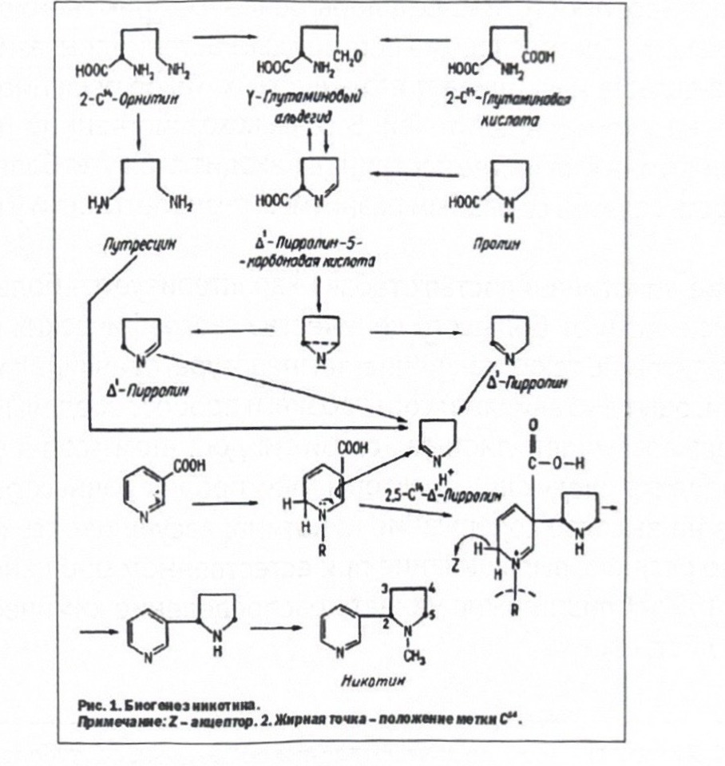

*図：ニコチン生合成経路を示す化学式（化学反応経路図）（原書 p.63）*

これは皮肉です、念のため。

ニコチン含有植物の主要な種は、Nicotiana tabacum（タバコ）とNicotiana rustica（マホルカ）です。タバコには葉の乾燥重量の1.5～3.5%が含まれ、マホルカには最大10%が含まれると言われています。確かに、3.5%はタバコの上限ではありませんが、いまは平均的なデータについて話しているのです。

Nicotiana属の植物は、ニコチンを含む唯一のものではありません。アサ科、セリ科、シソ科などといった他の科にも見出すことができます。要するに、ジャガイモやホップから、カミツレやラベンダーまでです。ただ、この議論ではこれらの科は割愛し、タバコに集中します。なぜなら、他の代表種のニコチン含有量はあまりに微々たるもので、頭の中で進化的実験の結果――いわばちょっとした自然のいたずら、平たく言えば――として片付けてしまえるほどだからです。というのも、頭に浮かぶ最初の論理的な問いは「何のために？」というものだからです。これらの植物に、何のためにニコチンがあるのか。

実のところ、すべては単純です。植物界における主たるニコチンの用途は、我々のものと一致します。一言で言えば――殺虫剤です。植物は根でニコチンを合成し、その後それを葉に蓄積します。こうした解決策が、害虫を撃退するのに役立つのです。農業の実践において、ニコチンを殺虫剤として用いることは、すでに100年以上行われています。その人気は、害虫における耐性の発達が弱いことに関係しています。

タバコの葉のニコチン含有量は、土壌、温度、降水量、湿度など、多数の地理的・農業気候的要因に応じて大きなばらつきを特徴とします。言うまでもなく、タバコの品種、栽培と加工の過程、さらには日光へのアクセスに関連する葉の段（位置）の高さまでもが、目に見えて影響します。より具体的には、他の条件が同じであれば、ニコチンの高含有量に良い影響を与える次の要因を挙げることができます――土壌の乾燥、少ない降水量、自然灌漑下での栽培です。加えて、この表では、葉の段（位置）ごとの化学物質の分布を見ることができます。

表4．葉の段（位置）別のタバコの葉の化学組成、品種モルダフスキー456。絶対乾燥物質あたりの含有量、%。葉の段／ニコチン／タンパク質／炭水化物／シュムク係数。第一段 1.83／6.91／1.97／（後段）0.28／第二段 2.29／7.89／2.48／0.31／第三段 2.15／8.5／3.2／18.2／0.38／第四段 2.41／8.93／3.85／0.43／第五段 2.49／8.97／4.03／0.45

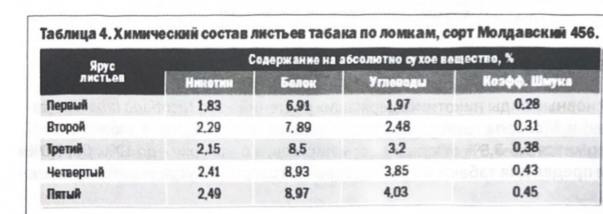

*図：葉の段別タバコ葉の化学組成（ニコチン・タンパク質・炭水化物・シュムク係数）を示す表（表4）（原書 p.64）*

## 身体への作用機序

そもそもこれは一体どう働くのでしょうか。そして「これ」というのは、まず第一に我々の身体のことを指しています。消化、呼吸、血圧などといった、身体内で無意識に進行する過程は、自律神経系によって調節されています。それは二つの下位系統――交感神経系と副交感神経系に分けることができます。

交感神経系は、さまざまな器官を活性化（加速）させる役割を担っています。たとえば、心臓の拍動を速くしたり、筋肉を収縮させたりします。一方、副交感神経系は逆に、心臓の拍動を遅くし、筋肉を弛緩させます。やや大ざっぱで例外もありますが、全体像を理解するにはこれで十分でしょう。これらの各サブシステムは2つのニューロンから成り、その連結部分はガングリオン（神経節）と呼ばれます。したがって、脳から伸びるニューロンは節前ニューロン、器官へ向かうニューロンは節後ニューロンと呼ばれます。もし「急に話が難しくなりすぎた」と思っているなら、安心してください、これはまだほんの始まりにすぎません。

### 交感神経系と副交感神経系

副交感神経系の作用: 瞳孔を縮小させる、唾液分泌を促進する、心拍を遅くする、気管支を収縮させる、消化を促進する、胆嚢を刺激する、膀胱を収縮させる、直腸を弛緩させる。

交感神経系の作用（交感神経節を介する／胸部・腰部の各分節）: 瞳孔を拡大させる、唾液分泌を減少させる、気管支を弛緩させる、心拍数を増加させる、消化を遅くする、肝臓によるグルコース放出を促進する、アドレナリンの分泌を促進する、膀胱を弛緩させる、直腸を収縮させる。

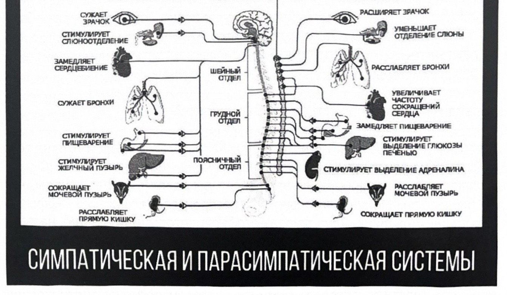

*図：交感神経系と副交感神経系が各器官に及ぼす作用を対比した解剖図（原書 p.65）*

副交感神経系の内部で神経インパルスを伝達する過程で仲介役を果たす主要な神経伝達物質は、アセチルコリンと呼ばれます。これは節前ニューロンが刺激されると放出され、節後ニューロンの受容体と相互作用して、対象となる器官から必要な生物学的応答を引き起こします。

（図版: シナプス間隙／シナプス前ニューロン／シナプス後ニューロン／シナプスにおける信号の伝達、適切な脳機能と記憶形成）

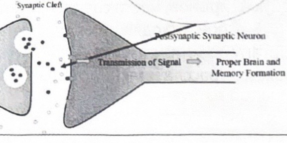

*図：シナプス間隙における神経伝達物質を介した信号伝達の模式図（原書 p.66）*

― また、アセチルコリンは交感神経系においても伝達物質となります。ただし節前ニューロンに限られますが、それでもこの系の働きにも関与しています。こうして、同一の物質が、異なる系に作用することによって正反対の生物学的応答を引き起こしうる、ということになります。

当然の疑問が浮かびます。そもそもニコチンがこれと何の関係があるのか、と。

― そしてここからが、より面白い部分です。すでに述べたように、アセチルコリンは受容体に作用します。その受容体はそのまま、アセチルコリン受容体と呼ばれます。薬理学的観点から見ると、これらの受容体は2つのグループに分けられ、それぞれアセチルコリン自体の効果を各系の中で再現しうるアルカロイドにちなんで名づけられています。一方のグループはM受容体（あるいはmAChR）で、キノコに含まれるアルカロイドであるムスカリンにちなんで名づけられました。そしてもう一方のグループがN受容体（nAChR）で、われらが尊敬すべき主役、ニコチンにちなんで名づけられました。この時点で、いくらか分かりやすくなってきます。すなわち、一部の受容体に対して、ニコチンはアセチルコリンと同様の作用を引き起こし、さまざまな器官から生物学的応答を得るのです。

受容体がニコチンによって興奮させられた際の信号伝達メカニズムの、より詳細な仕組みには立ち入りませんが、ニコチンと受容体の結合の性質は実際にアセチルコリンによるものと非常によく似ており、得られる効果も完全に同様である、とだけ言っておきます。N受容体にもさまざまな亜種があり、それらに含まれる、ギリシャ文字で名づけられたより小さなサブユニットの数と種類に依存します。たとえば、α2β3受容体はニコチンに対してより感受性が高く、ニコチンが継続的に供給されるとこの受容体の発現が増加する一方で、時間とともに感受性は低下する、ということを示す研究があります。

（図版: α-サブユニット、γ-サブユニット、β-サブユニット、δ-サブユニット、α-サブユニット ― 標準的なN型コリン受容体）

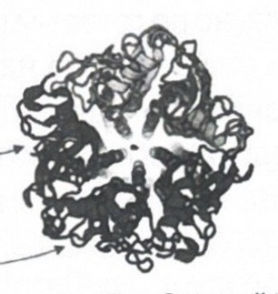

*図：5つのサブユニットから成るN型コリン受容体（nAChR）の立体構造（原書 p.67）*

別個に、α4β2受容体が区別されます。これは主にシナプス前領域に位置し、ドーパミン、グルタミン酸、γ-アミノ酪酸（GABA）など、広範な伝達物質の放出に関与します。こうして、ニコチンの作用範囲は非常に広いということが理解できます。なぜなら、これらの神経伝達物質は、今度はそれぞれ別のニューロンと相互作用するからです。しかもこれらの受容体はニコチンに対して非常に高い感受性を持っているため、この場合、高用量のアセチルコリンですらニコチンに対抗できないほどです。そして脳内では、こうした感受性の高い受容体が全N型コリン受容体の80%以上を占めています。つまり、そう、中枢神経系（ЦНС）もこれに関与しており、しかもかなり顕著に関与しているのです。結果として、ニコチンは実にさまざまな相互作用を刺激し、それらは多くの場合、さまざまな脳のプロセス、たとえば記憶などに良い影響を及ぼすことになります。これに加えて、ニコチンと受容体の相互作用が、新しいnAChRの合成発現の活性化と関連していることを裏づける研究もあります。つまり、ニコチンが多ければ多いほど、発現は高まるのです。そしてここでは、これらの受容体が十分な感受性を持っているかどうかはもはやそれほど重要ではありません。なぜなら、高い発現レベルそれ自体が細胞の活発な代謝をもたらし、その崩壊の過程を遅らせるからです。

この発見は、今度は研究者たちに、ニコチンを用いてアルツハイマー病やその他の疾患を予防するというアイデアを思いつかせました。しかも、その治療的応用が見込まれる疾患のリストには、パーキンソン病、トゥレット症候群、あるいは前述のアルツハイマー病といった神経変性疾患だけでなく、潰瘍や歯周病といった領域まで入ってきます。一部の心理学者は、ニコチンを原則として、潜在的な記憶力を高める認知エンハンサーと呼んでいます。そして専門家たちは、これによって恩恵を受けられるのは、何らかの障害を抱える人々だけではないと言っています。なお、この記事を準備する過程で、私はアセチルコリン調節の原理に基づいて開発された製剤や、その治療的応用に関する言及を見つけようとしましたが、完成した解決策に関しては何も見つからなかった、ということも述べておかなければなりません。この種のあらゆる話と同様に、ヒトを対象とした大量の研究の蓄積を待つ必要がある、ということを常に頭に入れておくべきです。唯一、多少なりとも無理やりこじつけられそうなものは、フェノトロピルという名のヌートロピック製剤に関する、2009年の出所不明な研究です。受容体調節物質としてのその作用もN受容体の刺激によって説明されますが、第一にその製剤の種類自体が率直に言って非常に議論の余地があるものであり、第二に、まさにニコチン自体は関係なさそうなのです。というわけで、これは割愛しましょう。

> ## 健康への害: 「賛成」と「反対」

これだけの情報を浴びると、かなり複雑な気持ちが湧いてきます。「で、あの馬を殺すって話はどうなったんだ。そもそもニコチンは毒なんだろう、薬とはどういうことだ」と。

「喫煙は健康に有害です」「タバコの煙はがんを引き起こします」「喫煙は人を殺します」― これらのフレーズは、今日では誰もが知っています。その人が喫煙するかしないかにかかわらず、です。世界保健機関は、喫煙の危険性について警告するフレーズと恐怖を煽る写真が、タバコのパッケージ面積の50%以上を占めなければならないと定めました。しかし私たちは皆、喫煙者の大多数が、いかなる健康被害に関するメッセージも平然と無視していることを理解しています。せいぜい一部の人が「インポテンツ」と書かれたパッケージを買わないようにしている程度です。まあ、念のため、というわけです。そして世界の喫煙者の割合は徐々に減少しているものの、その絶対数は人口増加によって依然として増え続けています。

（図版: 2016年のタバコ喫煙による死者数。タバコ喫煙に起因する疾患による年間早期死亡者数。0、500、1,000、5,000、10,000、50,000、100,000、250,000、500,000、100万、200万。出典: Institute of Health Metrics and Evaluation、OurWorldInData.org、CC BY）

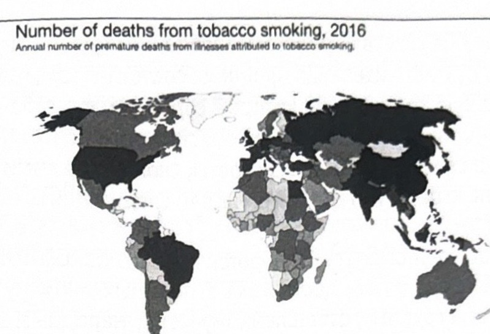

*図：2016年のタバコ喫煙による年間早期死亡者数を国別に示した世界地図（原書 p.69）*

国連のデータによれば、毎年世界中でタバコ喫煙によって700万人が死亡しています。4〜5秒ごとに新たな1人の死者が出る計算です。ですから、そう、喫煙の害についての言葉は十分すぎるほど正当なものです。喫煙者の閉塞性気管支炎、肺気腫、喉頭がん、肺がん ― タバコの喫煙はこれらの疾患のリスクを急激に高めます。心筋梗塞、脳卒中、血管のアテローム性動脈硬化、高血圧、不整脈 ― すべてここに含まれます。しかし、多くの人が今なお見落としている点が一つあります。すなわち、ここではニコチンは関係ないのです。

― ある引用を紹介しましょう。出所は「フィリップ・モリス」社の1972年の社内文書だとされています。本当にそれが彼らのものだったのかは分かりませんが、その意味するところは実に的確に伝わっています。「タバコ(シガレット)は製品としてではなく、パッケージとして捉えるべきである。製品とはニコチンだ。タバコの箱を、毎日のニコチンの用量を保管するための容器だと考えよ……タバコ1本を、ニコチンを一回分ずつ供給するディスペンサーだと考えよ。煙(スモーク)は疑いなくニコチンの最も最適化された供給手段であり、タバコは煙の最も最適化されたディスペンサーとして役立つのである」。

そう、この論理に従えば、ニコチンは危険です。しかしその主な危険性は、ニコチン依存がタバコ消費を支え続けるという点にのみあります。喫煙によって引き起こされる害に関する論文では、通常このような立場が取られ、ニコチンは飛ばしてタバコの煙の化学組成へと話が移ります。

実際、世界のニコチン消費の大部分はタバコ喫煙によるものです。そして、追加の問題として、人々はタバコ製品に含まれる物質を直接摂取しているのではなく、その燃焼の結果として生じる物質を摂取している、という点があります。そのため、注意を向けるべきはタバコの組成そのものよりも、むしろ煙の化学組成なのです。そこには実に興味深いものが大量にあり、数千もの化合物が含まれています。

― まず第一に挙げるべきは発がん性物質です。タバコの主流煙には、国際がん研究機関がまとめた「ヒト発がん性物質グループ1」のリストに分類される44種類のうち9種類の物質が含まれています。これらの物質とは、ベンゼン、カドミウム、ヒ素、ニッケル、クロム、ベリリウムなどです。さらに一酸化炭素 ― いわゆる一酸化炭素(угарный газ)もあり、これは血液中のヘモグロビンとはるかに結合しやすく、そのために血液が酸素を運ぶ能力を低下させます。これもまた重大な危険であり、不完全燃焼の産物として発生します。さらにタバコ特異的ニトロソアミンも存在し、これは喫煙時に体内に入り、DNA分子と相互作用してその構造を変化させます。そしてこれは、念のため言っておくと、悪性腫瘍の増殖の発端となり、その病因因子となるのです。

（図版: タバコの煙に含まれる化学化合物。このグラフィックは、タバコの煙に含まれる一部の有害化合物とその影響をまとめたものである。タバコの煙に含まれる化学化合物の推定数: 7,357。ニコチン、アセトアルデヒド、N-ニトロソアミン、1,3-ブタジエン、ベンゼン、アクロレイン、芳香族アミン、多環芳香族化合物。これらの化合物のうち発がん性が確認されているものの数: 70。WOUNDCHEM.COM、facebook、Creative Commons Attribution-NonCommercial-NoDerivatives ライセンスのもとで共有。COMPOUND INTEREST 2015）

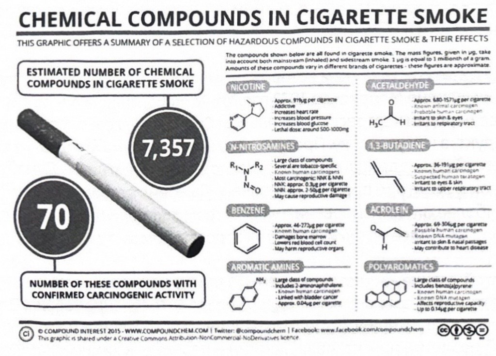

*図：タバコの煙に含まれる主な有害化合物とその構造式・影響をまとめたインフォグラフィック（原書 p.70）*

理論上、いや実際上もすでにと言ってよいのですが、タバコをまだ燃焼しないがニコチンはすでに放出される温度まで加熱することによってニコチンを摂取すれば、このプロセスは桁違いに安全になります。なぜなら、その場合、体は有害物質の山を丸ごと受け取らずに済むからです。

まさにこの論理の上に、IQOSやGloといった現代の製品が成り立っているのですが、今日はそれらについて詳しく立ち止まることはしません。一見すると、ここで私たちシーシャの消費者もほっと一息つけそうに思えます。なぜなら私たちのところでは燃焼は一切起こらず、ボウル内の温度はそれら「アイコス」や「グロ」と近いからです。一見そう思えますが、ただ、いつものことながら、どこにでも「しかし」があります。

シーシャが私たちの健康に及ぼす害というテーマについても、今は論じません。それはあまりに広範で、それ自体独立したテーマだからです。ただ、このテーマの研究は、従来のタバコ産業に比べて桁違いに少ない量しか行われていない、とだけ指摘しておきます。私たちはまだそこまで成熟していないのです。単純な話、紙巻きタバコの煙の化学組成に関する研究は、公開されているものが山ほどありますが、シーシャのテーマでこの種の情報を見つけるのは、本当に一苦労です。また喫煙(プロクーリヴァニエ)に関する規格も存在しません。もっとも、紙巻きタバコ用の喫煙マシンに相当する、シーシャ向けに調整された装置はすでに開発されており、私自身、あのドイツの展示会 InterTabac で何度もそれを目にしました。ここでは、ボウルの上に置かれて一酸化炭素の発生源となる炭(チャコール)も、ひと役買っているのです。要するに、疑問は数多くありますが、なんだか話が脇道にそれてきました。全体の趣旨が伝わっていることを願います。すなわち、タバコ喫煙における主な害は、ニコチンからではなく、タバコの燃焼産物から来るのです。

さて、ちょっと待ってください、あの馬はどうなったのでしょう。ああ、そうでした。ニコチン中毒です。やはり毒なのです。ガングリオン毒(神経節毒)です。しかし順を追って見ていきましょう。

― LD50、すなわち「半致死量」という指標があります。これは、対照群の構成員の半数を死に至らしめる、ある物質の量を示します。通常は、実験動物の体重1キログラムあたりに必要となるグラム、ミリグラム、あるいはその他の重量単位の量を示す形で表されます。ええ、あなたは「これは理論上の情報だ」とでも思っていたのでしょうか。いいえ、すべてマウスやラットで、いわゆる in vivo（生体内）で行われています。また、物質を体内に投与する方法も少なからず示されます。なぜなら、用量の大きさはしばしばそれに依存するからです。

ウィキペディアで最初に目に入ったLD50の指標は50 mg/kg ― これはラットで、経口、つまりげっ歯類が物質を飲み込んだ場合です。馬に関するデータは、幸いにも存在しません。ヒトに関しては時折さまざまな数値が登場しますが、それらは主に20世紀初頭に得られたデータに基づいています。そしてそれらは、今度は計算上のものであり、それ自体が19世紀の実験データの上に成り立っていました。

なかなかどうなんだという話です。半致死量の指標もまた万能薬ではないという点を指摘しておかなければなりません。なぜなら、種の違いのため、ラットにとって比較的安全なものが、ヒトにとっては十分に毒性を持つこともありうるからです。その逆もまた然りです。しかし、より良いものがない以上、まさにこのデータを使って話を進めることにします。

― 乗用の軽輓馬の平均体重は400〜600キログラムです。1.5トンもの体重があるシャイア種の重輓馬は、ここでは計算に入れすらしないでおきましょう。さて、単純な計算によれば、ラットのLD50指標を基準にすると、体重半トンの馬は25,000ミリグラムのニコチン、すなわち25グラムを飲み込まなければなりません。1滴の平均的な容量は0.04 mlですから、つまり40.4 mgのニコチンとなります。

― 合計で、馬は死ぬためにニコチンを619滴飲み込まなければならないことになります。これはもちろん、あなたの馬がラットである場合の話です。もっとも、別のLD50の値もあって、それは0.33 mg/kg ― これはもうマウスで、経口の場合です。ですから、もしあなたの馬がマウスなら、必要な滴数はわずか4滴ということになります。なお、飲み込んだ際の馬の体へのニコチンの生物学的利用能(バイオアベイラビリティ)や、あるいは馬の腸がこの物質をどれくらいの時間で排出しようとするか、といった変数については、こうした計算のためには一切割愛します。さもないと、このばかげた話を引き延ばしてしまいますから。

要するに、ご自身でお分かりのとおり、馬を殺そうとする者にとって必要なニコチンの量を、私たちが正確に算出することは到底できません。しかし、こうした瞬間にこそ、それがいかに相対的なものであり、なぜ特定のケースにとってあまり妥当でないデータに基づいているのかが、はっきりと見えてきます。もし聴衆の中に、この、ニコチン1滴と馬についての主張のようなものをいきなり真に受けてしまう人がいたなら、この瞬間から、まずそのデータを検証したいという欲求が皆さんの中に芽生えることを願います。少なくとも、あなたの馬がラットなのか、それともやはりマウスなのかを検証する、というくらいには。

（表: 安全性
ЛД50（LD50）: 50 mg/kg（ラット、経口）、0.33 mg/kg（マウス、経口）、0.3 mg/kg（マウス、筋肉内投与）
619滴
高毒性、ガングリオン毒（神経節毒）であり、中枢神経系を侵す。きわめて毒性が高い。
冷血動物および昆虫に対する毒性
LD50、動物の体重、致死量
0.33
致死量, g
500
500
1滴の平均的なサイズ, g
0.165
致死量
618.31／4.08
滴
0.0404
0.0404
H-フレーズ／P-フレーズ
H301, H310, H400, H411／P273, P280, P301+P310, P302+P350, P310
GHS（СГО）ピクトグラム
4滴）

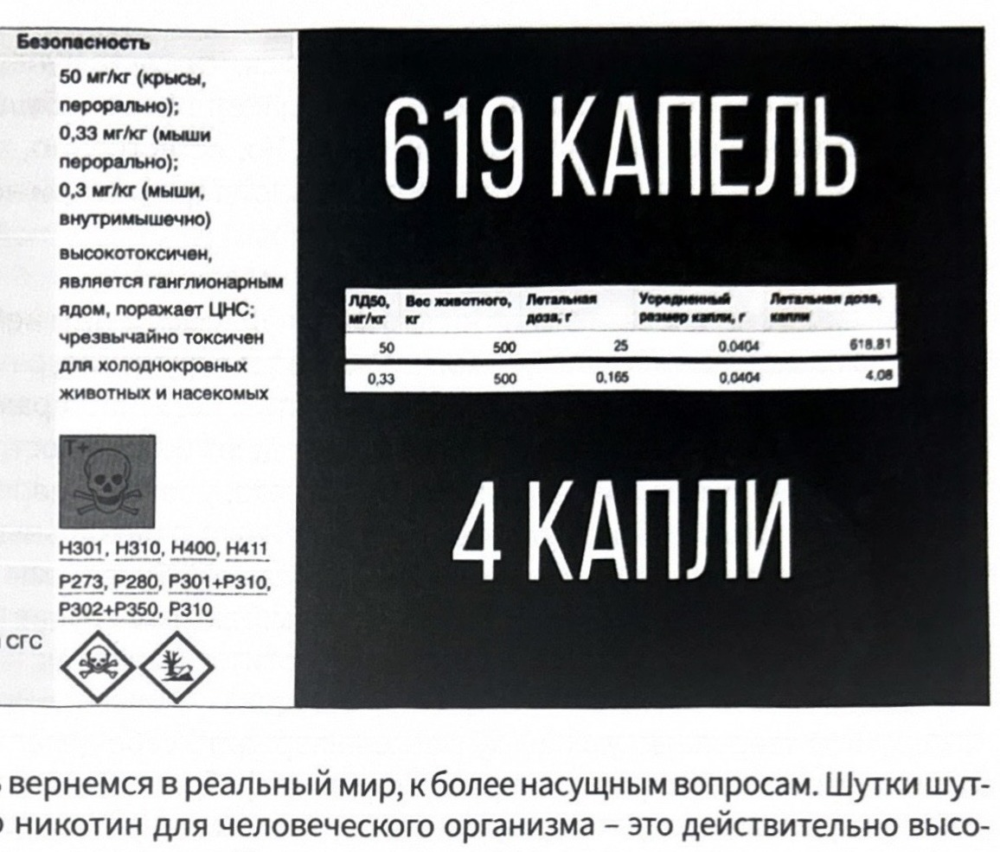

*図：ニコチンの毒性データ表とLD50に基づく馬の致死滴数の試算（619滴／4滴、GHSピクトグラム付き）（原書 p.73）*

― さて、それでは現実の世界に、より差し迫った問題へと戻りましょう。冗談はさておき、ニコチンはヒトの体にとって実際に高毒性の物質です。先ほど述べたように、多くのアルカロイドは用量に応じて正反対の効果を持ちます。もっとも、飲み込むこと、ましてや筋肉内や静脈内への投与というのは、いささか現実離れしたケースですから、消費者向け製品を通じてニコチンで中毒を起こす可能性を評価してみましょう ― そこでの確率はまったく別物ですから。

現実には、目に見えて低い濃度オーダーだけでなく、私たちの体の代謝や吸収の動態(キネティクス)といった他の特性も関わってきます。

上でニコチンの体への作用について述べた際、これらの受容体刺激のメカニズムはすべて、少量においてのみ有効である、ということには触れませんでした。濃度を絶え間なく増やしていくと、作用の効力は低下し、過剰摂取に至っては受容体の完全な遮断を引き起こしかねず、これこそが体への危険性の理由となります。そして、論理的に言えば、まさにこの同じメカニズムが、ニコチンを効果的な殺虫剤にしています。高用量はシナプスにおける興奮の伝達を抑制し、それによって致死的な結末が起こるのです。

ただ皆さんに分かっていただきたいのですが、そこまで「決めて」しまうためにはどれほど努力が必要かというと、医療の実践においては、吸入によるニコチン中毒で死亡が引き起こされたケースは一例もありませんでした。ただし当然、通常の中毒はあり、主にパッチや電子タバコなどを使用する代替療法（ニコチン補充療法）の際に起きていました。

中毒の症状そのものに特別なものは何もありません。軽度の過剰摂取は、短時間のめまいを、より稀には吐き気や頭痛を引き起こします。こうしたことは、カウンターで働いたことのあるマスターなら誰でも知っていると思います。より急性の過剰摂取は、より急性の症状を引き起こします ― 著しい動悸、吐き気、嘔吐、下痢です。嘔吐と下痢は、体が中毒と闘うための自然で根本的な手段であり、つまりこうして体内に入る毒素の量を減らしている、という点は指摘しておくべきでしょう。ですから、不調に陥った際には覚えておいてください、体はできるやり方であなたを気遣おうとしているだけなのです。

皆さんの多くがご存じの、ポガル葉巻・紙巻きタバコ工場（ПССФ）は、電子タバコ市場向けの自社製品の開発に取り組む際、興味深い理論的な確率評価を行いました。この工場の専門家たちは、以前に収集されたこの種の中毒に関するデータを基準とし、その資料の中で、ヒトの体への経口摂取の場合で純ニコチン0.5〜1グラムという評価を示しました。この数字は、推定される致死的な静脈内投与量に相当しますが、ニコチンの生物学的利用能が20%であること、そして経口摂取という方法ゆえに嘔吐と下痢が利用可能なニコチンの量を5分の1に減らすこと、への補正が加えられています。この量は、濃度20 mg/ml、つまり「20番手」のニコチン含有電子タバコ用リキッド25〜50グラムに相当します。言うまでもなく、これほど大きなボトルを誤って飲み込むのは難しく、その可能性は低いでしょう。そもそも2019年にこれほど高濃度のリキッドを見つけること自体も同様に難しいです。ですから、誤った経口中毒という選択肢は除外します。

第二の選択肢は、ニコチンが皮膚に付着することによる中毒です。ここでは、状況はより危険です。なぜなら、ニコチンは、前のケースとは異なり、肝臓を経由せずに血流に入るからです。その、体内に「通り抜ける」量は、同じくПССФの従業員たちの評価によれば、70〜100%に達します。

こうして、致死量としては、前述の静脈内投与量、すなわちまさにその0.1〜0.2グラムをそのまま採用してよいことになります。

しかし! ここで、先ほど私が話した、まさにあの代謝と皮膚吸収の特性が関わってきます。実は、ニコチンの代謝はかなり速く、体内ではこのアルカロイドはコチニンに変換され、それは私たちの体内に最長48時間とどまり、その後尿とともに排出されます。ちなみに、例のアセチルコリン受容体もかなり速く、たとえば一晩のうちに浄化されます。まさにそのために、朝一番のタバコやシーシャはあれほど効くのです ― ニコチンがきれいな受容体に向かうからです。したがって、ニコチンの速い代謝は、その遅い吸収という条件のもとで、また血液から他の組織への分配とあいまって、血中のニコチン含有量が危機的なレベルに達するのを防ぎます。まさにこのおかげで、ヴェイパーや喫煙者は一日を通じて、もし一度に静脈内投与すれば致死量となりうるほどの量のニコチンを摂取しても耐えられるのです。これに加えて、皮膚による吸収速度自体が低いものです。同じくПССФの記事では、面積10平方センチメートルの皮膚部分に純ニコチンを塗布した場合で、毎時0.8ミリグラムという値を示しています。この論理から、誤ってニコチンをこぼしてしまうような事故ですら著しい悪影響は引き起こさない、という結論が導かれています。もっとも、当然ながら、それでもこれは避けるべきですが。

では、それにしても、これまで述べてきた中毒はいったいどこから来るのでしょうか。明らかに、あらゆる日常的な状況と同じく、過剰摂取が起こるのは、すでにニコチンが十分で、そろそろしばらく摂取をやめるべき時なのに、私たちがそうしない場合です。心当たりがありますか。そうしたことが起こりうる理由として論理的に考えられるのは、摂取方法の特性です。紙巻きタバコには触れないでおきましょう、その害については上で十分に述べました。しかし、現代の主な代替ニコチン源については手短に論じ、その細かい点に触れておきます。

> ## ニコチンの摂取源。消費の特性

― 私たちの議論における第一のタイプの製品はスヌース(снюс)です。スヌースは無煙タバコの一種の代表格であり、調製されたタバコを一回分、唇の下に置いてそこに10〜20分ほど保持することによって消費されます。このような消費の仕方では、ニコチンは口腔の粘膜を通じて吸収され、人体に入り、すでに私たちが知っているシナリオに従って作用し始めます。正直に言うと、スヌースは私のお気に入りのニコチン摂取方法の一つです ― もちろんシーシャに次いで、ですが。しかもそれは、消費そのものへの個人的な関心からというよりは ― むしろスヌースは避けるようにしています ― この製品の作用の仕組みがもたらす、ある種の美的な楽しみによるところが大きいのです。

要点はこうです。スヌースの中のニコチンは最大限にブースト(разогнан)されており、アルカロイドはそこで遊離形(свободная форма)で存在しています。

説明しましょう。ニコチンの摂取には、それから得られる感覚に大きく影響する、かなり重要な要素があります。それが水素イオン指数pH（ピー・エイチ）、まあ平たく言えば酸性度の指標です。ニコチンには3つの形態がありえます。すなわち、プロトン化型、半プロトン化型、脱プロトン化型です。ニコチンがどの形態にあるかは、pH値に直接依存します。具体的に言うと、第一の形態に対応するのは低いpH値、おおよそ3〜4まで、第二の形態は4〜8の間、そして第三の形態は8を超える値です。そしてこの第三の形態こそが「遊離ニコチン(свободный никотин)」と呼ばれます。

まさにこれが私たちにとって興味深いものです。遊離ニコチンはより良く吸収され、神経系に対して本当に爆発的な効果をもたらします。ちなみに、これはこのような性質を持つ唯一のアルカロイドというわけではありません。たとえば、まさに同様に、クラックはアルカリ性の成分によってより遊離した形態に変換されているために、通常のコカインと異なるのです。もし誰かが尋ねるなら ― これはウィキペディアにそう書いてあるのであって、私は関係ありません。そしてどうやら私は皆さんを欺いてしまったようで、手短には収まりません。ただ、私の見るところ、遊離ニコチンの商業的な物語は素晴らしく興味深いので、昨年のセミナーでも触れたとはいえ、新しい聴衆のために繰り返しておきます。

（図版: 高いpH（アルカリ性の環境）― 脱プロトン化型（遊離）ニコチン。中程度のpH（中性の環境）― 半プロトン化型ニコチン。低いpH（酸性の環境）― プロトン化型ニコチン）

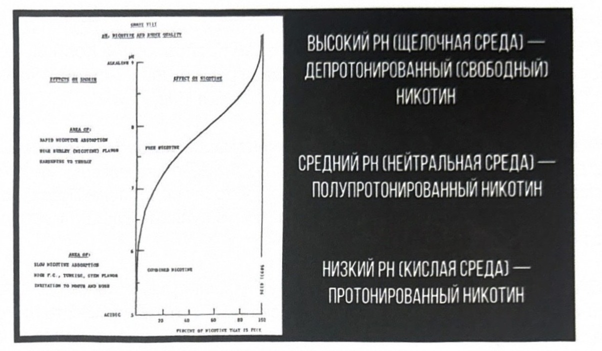

*図：pHと遊離ニコチン割合の関係を示すグラフと、pH環境別のニコチン形態（遊離／半プロトン化／プロトン化）の対応（原書 p.77）*

時間を少しさかのぼってみましょう。1960年代初頭、「フィリップ・モリス」社はアメリカの6大タバコ会社の中で最も小さい会社であり、他社ブランド「ウィンストン」の年間売上高は、「ФМ（フィリップ・モリス）」の「マールボロ」のほぼ3倍にも上っていました。1978年までに、根本的な転換が起こりました。「マールボロ」は世界で売上トップの紙巻きタバコブランドになったのです。アメリカ全体で販売される紙巻きタバコの5本に1本、そして17歳から28歳の喫煙者に販売されるタバコの半数以上が、「マールボロ」によるものでした。

当然、このような大転換は競合他社の鋭い注目を集め、皆が「フィリップ・モリス」の技術を探り始めました。長い引用は持ち出しませんが、要するに「マールボロ」と、ほかに2、3のブランドで、アンモニアを染み込ませたシート(プレート)を使い始めたということに帰着します。これがタバコ中のpHレベルを高め、その結果、遊離ニコチンのレベルを上昇させたのです。やがては、消費時に感じられるレベルが、高いタールとニコチンの量を持つ他社ブランドに匹敵するほどになり、それでいて測定される、これらの物質の量は実際には3分の2も低いままでした。これは、当時「タバコが軽いほど害が少ない」という類いのアナロジー(類推)が立てられ始めていたという理由からも重要です。言うまでもなく、これは会社にとって有利に働きました。なぜなら、少量のニコチンでも、まるでそこに大量のニコチンがあるかのように効果が感じられたからです。

おそらく、この物語に対する私の特別な感動は、まだ大学の広告の講義で、私たちが「マールボロ」のカウボーイを前世紀の象徴、すなわち「フィリップ・モリス」社に商業的成功をもたらした広告キャンペーンの象徴として教わったことに由来しているのでしょう。

私は今なお敬服しているPMI（フィリップ・モリス・インターナショナル）のマーケティング部門を、決して傷つけたいわけではありません。それどころか、マスコミュニケーションの背後に、非常に強力なプロダクト面の裏づけもあると知るのは喜ばしいことです。もっとも、会社自身は今なおニコチンの利用可能性の操作への関与を否定していますが、まあそれはそれとして。

― 本題に戻りましょう ― スヌースです。先ほど述べたように、ロシア市場のスヌースのほとんどのブランドでは、pHレベルは7.8から8.5の範囲に保たれています。これはニコチンが非結合の脱プロトン化型で存在することを促進するだけでなく、ヒトの口腔内の酸性度のレベルにも見事に対応しています ― それはまさに、唾液分泌に応じて7前後で変動するものと表すことができます。したがって、スヌースでは、ニコチンの速やかで効率的な吸収が確保され、それを製造者は特別な添加物で酸性度を安定させることによって制御できます。一例として、炭酸ナトリウム、口語ではより「炭酸ソーダ（焼成ソーダ）」として知られているものが挙げられます。

もちろん、ベイピング（電子タバコ）にも触れないわけにはいきません。ベイピングはほんの数年前までロシアで人気の絶頂にあり、まさにそれがシーシャ市場に「液体ニコチン」というある種の「恐ろしい話のタネ」をもたらしました。ニコチンが身体に及ぼす影響についてのブロックの冒頭で、このアルカロイドが体内に取り込まれる過程を私は意図的に省きましたが、今こそそれについて語る絶好の機会です。

さて、タバコ製品については分かりやすいでしょう、とあなたは言うでしょう。ニコチンはタバコの中に含まれていた、私たちはタバコを加熱した、その結果ニコチンを得た。すべて分かりやすく、論理的で、まったく恐ろしくありません。しかし、もう少し複雑な一連の出来事が始まると、一部の人々は思考が止まってしまい、固まってしまって、こう結論づけるのです。「もし自然の植物から来た何かが、急に何か別の物質と一緒に瓶に入って、しかも液体の状態で自分の手の中に現れたとしたら、もうおしまいだ。これは化学物質だ」と。そう、化学物質です。だって、まわりのすべてが化学なのですから。私たちあなたと私も化学です。先ほどお聞きになったように、私たちの心臓が正常に鼓動するために、ニューロン同士が互いに相互作用すること、これもまた化学なのです。

しかし、こうした人々はこの言葉にまったく別の意味を込めています。彼らにとってこの言葉は、何か恐ろしく、理解不能で、そして必ず有害なものなのです。なぜなら彼らは、それが不自然なものだといつも確信しているからです。そして彼らはむしろ、害が幾度となく確認されているタバコを次から次へと吸い続けるほうを選ぶのです。でもそれは「自然なもの」だから、「植物由来」だからというわけです。

そして、そこにも化学が含まれているということなど、彼らにとってはどうでもいいのです。誰にでもそういう知り合いが一人はいると思います。幸いなことに、そうした人々は少しずつ減ってきていますが。ですから、こうした人々のことを気にかけてあげて、結局のところニコチンがどのようにして電子タバコのリキッドの入った瓶の中に入るのかをお話しすることにしましょう。

すべては Nicotiana tabacum（ニコチアナ・タバクム）という植物から始まります。これは意外な展開でしょう？　当然ながら、市場で商業的に使用されているニコチンは、いずれかの抽出方法によって直接たばこ葉から得られた製品です。さらに言えば、前述の人々とは反対に、多くの人にとっては合成されたニコチンのほうがより純粋で安定しているように思われるため、自社のたばこ由来のニコチンを合成ニコチンと偽ろうとする企業もあります。もっとも、今のところは失敗に終わっていますが。テストに合格できなかったのです。確かに、どこかに合成のソリューションで本気で市場参入を試みているグループがいるらしいのですが、その者たちについて歴史が口をつぐんでいるところを見ると、そちらもすべてがバラ色というわけではないようです。

一方で、たばこ葉から得られた製品は、それこそ掃いて捨てるほどあります。その品揃えと同じくらい価格帯も幅広いのですが、当然ながら品質のばらつきも決して小さくありません。私が「品質」と言うとき、まず第一に念頭に置いているのは、純度、つまり不純物がないことです。しかし、忘れてはならないのは、ニコチンの用途範囲は、私たちによる摂取よりもはるかに広いということです。考えてもみてください、甲虫を駆除するために使おうとしている化学物質の純度に余計なお金を払う必要などあるでしょうか。それでもなお、あの patents.google.com には──そう、彼らはそんなものまで持っているのです──たばこからニコチンを得る方法についての情報が山ほど載っています。品質の異なる製品が産出されるということは、実現方法も多種多様にあるということです。要するに、いずれにしてもすべては何らかの純度の抽出物に行き着きます。「汚い」安価な製品では、硫酸を用いてたばこの細片を硫酸化し、より純粋なものでは様々な担体上で溶液を凍結濃縮し、技術的に最も高価な製品ではアルカロイド同士を分留して、99.5％の純度に達します。

### 液体ニコチンはたばこ葉から得られる

［図表：乾燥たばこ原料（40メッシュ）→ PE：95％エタノール（4:0）で2倍量にて抽出 → 抽出溶液 → エタノール水相（ニコチン）→ 水溶液 → pH10に調整 → 精製ニコチン → pH4.0に調整 → 2相を分離 → PE相（ソラネソール）→ 真空濃縮 → PEを回収 → 粗ソラネソール → シリカゲルカラム分離 → 精製ソラネソール］

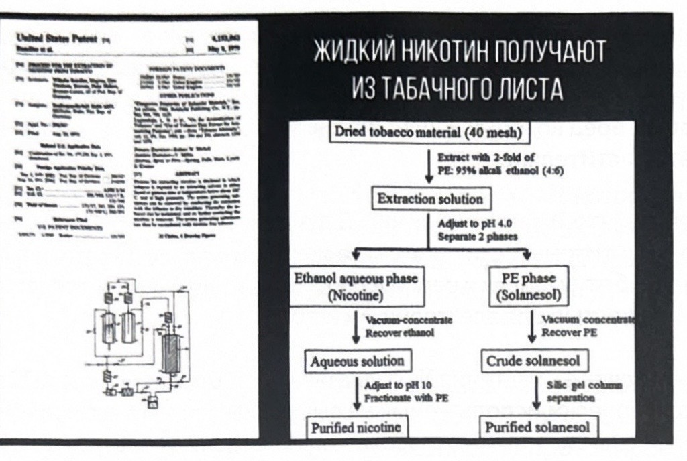

*図：たばこ葉からの液体ニコチン抽出工程フローチャートと関連米国特許（原書 p.80）*

ここで注記しておかなければならないのは、最も純粋なニコチンが万人にとって最良というわけではない、ということです。電子タバコ系フォーラムの奥深くを探せば、今でも比較的精製度の低い中国製ニコチンを好む筋金入りの男たちを見つけられるのではないかと思います。理由は単純で、そうした製品はたばこのアロマとより相性よく馴染み、普通のタバコを吸う感覚──そのスロートヒット（TH）やその他の欠点を含めて──をより近く再現するからです。そしてある意味では、彼らは確かに正しいのですが、シーシャの分野においては「純粋なほうが良い」という法則が依然として有効なままです。

比較的新しいトレンドの中から、別の話を一つ。それがソルトニコチン（塩ニコチン）です。私にとっても、そして市場の一部の消費者にとっても、それはその矛盾性ゆえにあまり理解しがたいものであり、今からそのような状況の具体的な理由について議論していきましょう。ソルトニコチンに関する特許は2015年に PAX Labs 社によって出願され、これがソルトニコチンに関する現代的な大衆的認知の始まりと位置づけられます。念のため言っておくと、PAX Labs とは、Juul（ジュール）というデバイスとそのリキッドを製造している企業です。当然ながら彼らには他の製品もありますが、今はその話ではありません。このデバイスは、当然のことながら、ソルトニコチン入りのリキッドで動作します。それはアメリカ合衆国で非常に広く普及しており、最近ではソルトニコチンのトレンドを世界へとさらに広げています。ロシアでは、ソルトニコチンに関するソリューションが Babylon、Maxwell's など様々な企業によって示されてきました。PAX Labs の主張によれば、ソルトニコチンは、ほとんどタバコ版のそれと同じくらい、身体によく吸収されるとのことです。それはおおよそ次のような感じです。

### ソルトニコチン

［図表：血中ニコチン濃度、ng/ml　20／15／10　最初の一服からの経過時間、分　10／20／30　MAX］

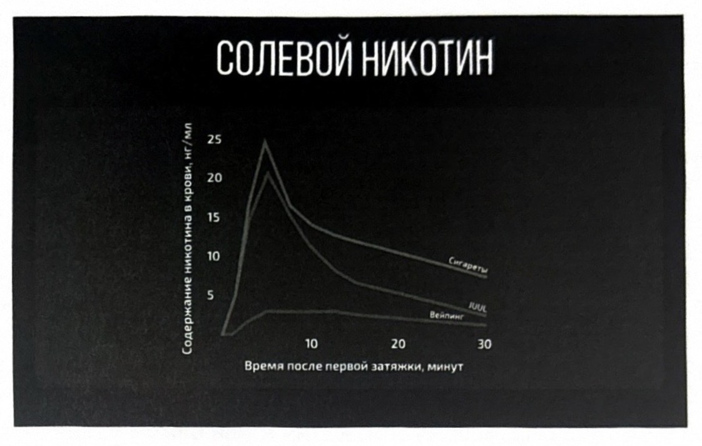

*図：紙巻きタバコ・JUUL・ベイピングの血中ニコチン濃度の時間推移比較（原書 p.81）*

これは、前述の、素早く効果的に体内に取り込まれる遊離ニコチンと非常によく似て聞こえます。ところがここにパラドックスがあります。ソルトニコチンは、脱プロトン化された遊離ニコチンという同類とは、まったく正反対のものなのです。

ソルトニコチンへの言及は、1930年代からすでに見つけることができます。原則として、たばこ葉そのものの中にニコチンが塩として存在していること、これはまさにまったく正常なことです。しかし、それをより広範にこの形態へと押し込もうとする特別な試みは、遊離ニコチンがより毒性が強いと受け止められ、人々が逆にそれを結合させようとしていた時代の傾向なのです。

ソルトニコチンは、通常のニコチンを何らかの酸で処理することによって得られます。そして、先ほど私が言ったように、遊離ニコチンが高いpH値──アルカリ性の環境──に対応するのに対し、低いpH、酸性側へ偏ったものは、まさに結合したニコチンの領分です。ですから、もしかすると私が何か理解できていないだけかもしれませんが、私の頭の中では、ニコチンの生体利用能（バイオアベイラビリティ）がその結合形態とどうしても噛み合わないのです。より小さいスロートヒット（TH）と主観的なまろやかさ──それはそうでしょう。しかし「キマり具合（накуриваемость）」については、本当に理解できません。そして特許で言及されている2.1～6.7という範囲のpH値が、この疑念をさらに裏付けるばかりです。

問題は、これと同じ疑念が消費者のレビューによってさらに深まるということです。ベイパー向けの媒体 Viva La Cloud が集めた、ソルトニコチンの使用に関するコメントのいくつかを以下に挙げます。「文字どおり最初の数吸いから不快に頭が痛くなり始めた、まるで吸いすぎたかのように」、「めまいと急激な血圧の上昇があった」、「ほとんどすぐに頭が痛くなり始めて、20～30分痛んだ」。

そもそも、これらの症状は通常の軽度のニコチン中毒とかなり似ており、これこそまさに、中毒（イントキシケーション）のテーマについて論じたときに私が摂取の特徴として言いたかったことなのです。そう、確かに、そのようなニコチン入りのリキッドはよりまろやかに感じられるはずですが、メダルの裏面は、もうそろそろやめておくべきときに、ニコチン摂取を続けたいという欲求になるのです。

要するに──私にとっては極めて議論の余地のある製品ですが、自分にとってどうかという判断はご自身でなさってください。もちろん、そもそもあなたにとってそれが関係のある話であれば、ですが。

最後に、私たち全員にとって間違いなく関係のある問題、すなわち──シーシャにおけるニコチン摂取について触れておきましょう。

技術的には、ここで起こるプロセスはベイピングのときとまったく同じです。なぜなら、誰もが知っているとおり、私たちが第一に摂取しているのは、シーシャタバコの液体部分の蒸気だからです。そして電子タバコ市場で起こっているのとまったく同じように、私たちのところにも、まさにこの液体ニコチンを使用しているメーカーがいます。

しかし私は、これまでに得たすべての情報を経た今となっては、この事実それ自体がもはやあなたに何らかの否定的な感情を引き起こすことはなくなっていることを願っています。なぜならそれは、全世界がたばこから直接摂取しているのと同じアルカロイドだからです。そして私のこれまでの話はすべて、ただ一つの目的──それをあなたに説明すること──を追求してきたのです。私がいつも言っているように、メーカー側にとってのこのようなソリューションの否定的な側面はわずかしかありません。一つ目は、液体ニコチンの使用という事実が隠される場合です。まあこれは単に見苦しいことであり、道義的な結果を招きかねないというだけのことで、それ以上のものではありません。一方で、この問題の技術的側面への無理解と、このアルカロイドの不適切な使用は──すでにはるかに深刻な問題です。

ニュアンスは十分すぎるほどあり、それらには注意を払う必要があります。しかも私はまだ、まさに私たちの種類の製品における具体的な使用の問題には触れてもいません。というのも、ニコチンは、香料（フレーバー）と同様に、タバコあるいは使用される他の担体全体に均一に分布させる必要もあるからです。

ですから、恐れるべきはニコチンではありません。恐れるべきは、悪質なメーカーと人間の愚かさです。そしてそれは、残念ながら、無限なのです。知識は力であり、私は重ねて皆さんに呼びかけます。できる限り多くの情報を集め、周囲の世界を分析し、自分が直面するすべてのことをより深く掘り下げて理解しようと努めてください、と。このセミナーのための情報源のほぼ100％は公開されたものであり、少し努力すれば、皆さんはそれらすべてを利用することができます。まさにこうして、私たちは皆ともに少しずつ強くなっていくのです。

これらのリンクから、細部や新しい知識に特にこだわる人々のための興味深い情報を見つけることができます。私は、記事を一つ書くたびに、質問の数や、問題の技術的側面に関心を持つ人々の数が増えていくのを見るのが、とても嬉しいのです。私たちの業界における教育的情報という観点からはかなり「暗黒の」時代だった過去の年月を背景に考えると、今日、まさに S'Says のような情報源やコミュニティが私たちのもとにあり、そこではより多くの人々が自ら学ぶだけでなく、ユニークな情報や経験を分かち合って他の人々を教育する用意があるということが、とりわけ喜ばしいことです。

すでに資料の準備を終えた後、まったくの偶然と偉大なる Pikabu（ピカブー）のおかげで、私はテレグラムチャンネル https://t.me/tibiolog に行き当たりました。そこでは、それと似たような調子で、私たちの業界の枠を超えて、日常生活の中で私たちが出会う様々な興味深い事実、現象、プロセス、物質について語られています。

ぜひお勧めします。これは決して宣伝ではなく、その労力に対する、そして私自身が広めようとしているものとメッセージが似ていることに対する、私にできる精一杯の著者への敬意の表れにすぎません。すなわち、声高な無知は恥ずべきことであり、情報は強力なツールであり、自己教育はシンプルで、手軽で、面白いものでありうる、ということです。この資料が、私が用意するすべてのものと同様に、あなたをますますこの考え方へと傾けることを願っています。

### 参考文献

- https://ru.wikipedia.org/wiki/Никотин
- https://ru.wikipedia.org/wiki/ЛД50
- https://pccf.ru/blog/chto-nuzhno-znat-o-nikotine-adeptam-veypinga-i-elektronnykh-sigaret/
- http://ash.org.uk/information-and-resources/tobacco-industry-information-and-resources/tobacco-additives-cigarette-engineering-and-nicotine-addiction/
- https://www.researchgate.net/publication/299019723_Experimental_Study_and_Modeling_of_Supercritical_Extraction_of_Nicotine_from_Tabacco_Leaves
- http://www.tobaccoreview.com/tr.cgi?art=1303a20
- http://www.tobaccoreview.com/tr.cgi?art=1406a52
- https://biomolecula.ru/articles/nikotin-kak-alkaloid
- https://www.krugosvet.ru/enc/nauka_i_tehnika/biologiya/ALKALOIDI.html
- https://cyberleninka.ru/article/v/izvlechenie-nikotina-iz-tabaka-i-ego-kontsentrirovanie
- https://patentimages.storage.googleapis.com/7a/f9/fc/09b5f3ccdd459e/US3046997.pdf
- http://www.ximicat.com/ebook.php?file=sadykov.djvu&page=45
- https://doctor-neurologist.ru/simpaticheskij-i-parasimpaticheskij-otdely-vegetativnoj-nervnoj-sistemy-chto-eto-osnovy-anatomii-i-fiziologii-funkcii
- https://www.gazeta.ru/science/2012/08/20_a_4731333.shtml
- http://www.tobaccoreview.com/tr.cgi?art=1710a38
- http://www.tobaccoreview.com/tr.cgi?art=0903a20
- https://ru.wikipedia.org/wiki/Холинергические_рецепторы
- https://vivalacloud.ru/2018/07/salt-nic-2/
- https://pccf.ru/blog/sravnitelnye-issledovaniya-komponentnogo-sostava-sigaret-i-stikov-parliament-dlya-sistemy-nagrevaniya-tabaka-iqos/
- http://www.vniitti.ru/conf/conf2017/article/Zhabentsova_O.A_statya2.pdf
- https://patentimages.storage.googleapis.com/b8/d1/54/9525d2599da302/US3139435.pdf
- http://www.refstore.ru/box/1/pro/849/index1.1.html
- https://patentimages.storage.googleapis.com/22/cb/67/2d26662a419529/US4153063.pdf
- https://medi.ru/info/5855/
- https://ajph.aphapublications.org/doi/full/10.2105/AJPH.2007.121657

## タバコについて詳しく。イリヤ・コブザレフ

### シーシャ用タバコの組成

最も普及しているシーシャタバコ（モアセル）について語るうえでまず指摘すべきことは、実はそれはあまり「タバコ」ではない、ということです。説明しましょう。平均的なシーシャタバコの組成において、たばこ葉そのものが含まれているのは全体の質量のおよそ10～15％です。つまり、標準的な50グラムのパックの中には、葉そのものは約5～8グラムしか入っていないのです。これはその粘り気のある質感──蜂蜜やジャムのようなものを思わせる質感──からも見て取れると思いますが、シーシャに真剣に関心を持っている多くの人々でさえ、葉が液体を吸収する高い能力ゆえに、タバコそのものはそれほど少ないということを、必ずしも知っているわけではありません。

これは、消費者をだまして節約するために何かで薄めているとか、そこに有害な化学物質や得体の知れない成分が大量に入っているとか、そういうことを意味するわけではありません、違います。シーシャ用タバコの組成はとても単純で、論理的で、透明です。しかし最も大切なのは、もしあなたが本当にすべてがどのように構成され、機能するのかを理解したいのであれば、シーシャタバコを乾いた物質としてではなく、液体物質を多く含んだ塊として捉えることです。そしてシーシャの「煙」については、定着した言葉ではあるものの、その液体の含浸液、「シロップ」を加熱する際に生成される蒸気あるいはエアロゾルとして捉えるべきです。通常の喫煙条件下では、そこに煙はありません。

シーシャ用タバコの組成の説明に移る前に、シーシャタバコの特性の一覧を示しておきましょう。

### シーシャ用タバコの特性

#### 強さ（クレポスチ）

強さは、そのタバコを使ったシーシャが私たちをどれだけ強く「キメる」か、すなわち私たちが体験する弛緩の度合い、ある種の「ニコチン酩酊」の度合いを左右します。注記しておくべきは、最終製品中のニコチン量を測定する一般に認められた標準が存在しないことに関連して、パックに記載されたニコチン量を強さの指標として当てにすべきではない、ということです。通常このためには便宜上の10段階の強さスケールが使われますが、残念ながらそのような情報はパックには見当たりません──それは経験と他のシーシャ愛好家との交流からのみ得られるものなのです。

#### 硬さ（ジョーストコスチ）

［強さと混同しないこと］

というのも、多くのシーシャ愛好家にとって、強いシーシャタバコの摂取は、キマり具合に伴う一連の感覚と結びついているからです。例えば、肺に感じる煙のある種の「濃密さ」とか、吸い込みに伴う、一部の人々にとっては心地よい喉への刺激といったものです。その際に理解しておくべきなのは、すべての強いタバコが必ずしも非常に硬いわけではなく、また硬い詰め方が、必ずしもその強さでキメてくれるわけでもない、ということです。そもそもタバコのあれこれの特性は、ボウルをどう仕込むかによって、より強くも弱くも感じられるものですが、それについてはここで、今日語ることではありません。

#### 煙の量（ドィムノスチ）

実のところ、この評価項目はかなり時代遅れです。というのも、どのタバコも、そこからどれだけの煙を絞り出せるかという点ではおおむね大差なく、それはむしろ詰め方によるところが大きいからです。しかし、純粋に形式上、やはり言及はしておくべきでしょう。

#### 火力への好み（ジャロリュビーヴォスチ）と耐熱性（ジャロストイコスチ）

このペアの名称は、業界の専門家の間で多くの論争の種となっていますが、今回の場合、まさにこのような用語を用いることで、私はそれらの意味を分かりやすい言葉で説明しやすくなります。

さて、タバコが正しく燻るためには、一定量の熱（あるいはもっと簡単に言えば、ボウル上の炭の数）が必要です。この温度はほぼすべてのシーシャタバコでだいたい同じですが、それでも火力はコントロールしなければなりません。そこで、私たちにとって可能なすべての温度範囲を、ゼロから増加方向へ伸びる一本の直線（光線）だと想像してみましょう。すると、私たちはこの直線上に二つの点、すなわち二つの温度の値を置くことができます。一つ目は、タバコが温まり始めて燻り始めるために最低限必要な温度を意味します。二つ目は、タバコにとって限界となる最大の温度を意味し、もし私たちがこの値を超えてしまうと、ボウルの中のタバコは過熱し始め、それを吸うのが不快になります。喉を刺激し始めたり、味が変わったり、焦げ臭くなったりするなどです。したがって、これら二つの点の間には、タバコにとって快適な温度範囲となるある区間があり、火力をこの区間内に保つことで、私たちは心地よく燻るタバコを得られるのです。すべてとても単純です。

［図：Oc 火力への好み　Tic 耐熱性　T тут заеб（ここで限界）T2°C］

#### 切り方（ナレースカ）

ここはすべて簡単です。あれこれのシーシャタバコの内部のたばこ葉は、ほとんど均一な塊を形成するほど非常に細かく細かく刻まれている場合もあれば、全体の塊から個々の大きな葉片を簡単に見分けられるほど、かなり大きく、まるで引き裂かれたような状態の場合もあります。これが切り方のサイズと呼ばれるものです。なぜこれが重要なのでしょうか？　使用上の便利さに加えて、切り方は、他の条件が同じであれば、塊全体の火力への好みと耐熱性に影響を与える変数だからです。すべて論理的です──個別に取った小さな葉片を温めるには、同じ葉片でも大きいものを温めるよりも少ない熱で済むのですから。

多くの人にとって別の論争の的となる問題が、タバコの中のいわゆる「丸太（ブレヴノ）」の存在です。丸太とは、刻まれたたばこ葉の葉脈（まれに茎も）のことで、かなり大きくなることがあり、一部のメーカーの製品で見られることがあります。一部の人々はこれらを非常に否定的に捉え、詰める前に全体の塊から取り除こうとしますが、実際には丸太もまた、葉そのものほど常にうまくとはいかないものの、シロップを吸収します。

私の意見はこうです。もし丸太があなたの邪魔になり、それらを扱うのが不便なら、取り除いてください。もしそれらがあなたにとって問題ではなく、全体のタバコの塊から突き出さないようにボウルの中に丁寧に収められるのなら、安心してそのまま残しておいてください、それは喫煙に影響しません。

#### 漬かり具合（ヴィモチカ）

この指標は、液体の含浸液とあの乾いたたばこ葉そのものとの比率を表します。この比率は常に液体成分のほうが優勢ですが、それでも、ほどよく湿っていると感じられるタバコもあれば、たばこ葉がまさにシロップの中で「泳いでいる」ようなタバコもあります。ここは人それぞれの好みです。より乾いたタバコを好む人もいれば、より湿ったタイプを好み、詰める前に自分でタバコを絞って、自分が必要と考える状態になるまで余分なシロップを取り除く人もいます。

#### 洗い具合（プロムィトスチ）［洗浄度、水洗い］

ほとんどのシーシャタバコのブランドの製造において、その後の工程の前にたばこ葉を部分的または完全に水洗いすることは、まったく正常な段階です。先ほど私が言ったように、私たちはタバコそのものよりむしろ液体の含浸液を吸っているので、この処理はタバコがどう燻るかにグローバルに（決定的に）影響するわけではありませんが、それでもなお独自のニュアンスをもたらします。他の条件が同じであれば、洗浄されたシーシャ用タバコはよりまろやかに、より軽く燻り、たばこの風味がより少なくなります。つまり、洗浄は混合物中のたばこ葉の存在の側面を打ち消すのです。それが利点かどうかは、あなたの好み次第です。

#### 製造技術（テフノロギヤ・イズゴトヴレーニヤ）

あれこれのシーシャタバコにどのような成分が含まれているかに加えて、それらがどのような方法で準備され、混合されたかも十分に重要です。実のところ、前述の洗浄もまた技術的な構成要素なのですが、この項目を別個に取り上げておきたいのです。というのも、業界の発展と、開発への科学的プロセスのより強力な導入に伴って、製造の過程で煮込み（ヴァルカ）や、私たちの場合で言えば冷凍（ザモロースカ）といった追加の工程を行うメーカーがますます増えてきているからです。ここは個々の具体的なタバコごとに見る必要がありますので、この側面を念頭に置いておいてください。

#### 味（ヴクス）

実のところ、最も複雑で主観的な要素です。この特性に主に関与しているのは製品に含まれる香料（フレーバー）ですが、上述のことから明らかなように、乾いた担体、およびその加工処理も、味に独自の貢献をしています。この特性の下位区分はかなり多く、その中には特に論争の的とならないもの（例えば、一定の温度における味の持続時間、香料の味と原料の味の組み合わせ、全体的な味のプロファイルなど）もありますが、より詳細な味の知覚、その強度や濃厚さといったニュアンスは、詰める人の腕の確かさだけでなく、吸う人の身体による味・香気化合物の個人的な知覚にもかなり強く依存します。しかしこれはもう、別の資料のためのテーマです。

特性についての話への小さな補足として、私が「ポイント・アート（Поинт Арт）」社で働いていたときに自分用に作ったブランク（記入用紙）をここに載せておきます。大量のシーシャ製品のサンプル（新しい味、ラインナップ、原料の試作など）を評価する必要が生じたことに関連して、すべての試喫を記録し、統一された情報ベースを作成する必要が出てきました。この作業にまさに役立ったのが、こんな表でした。

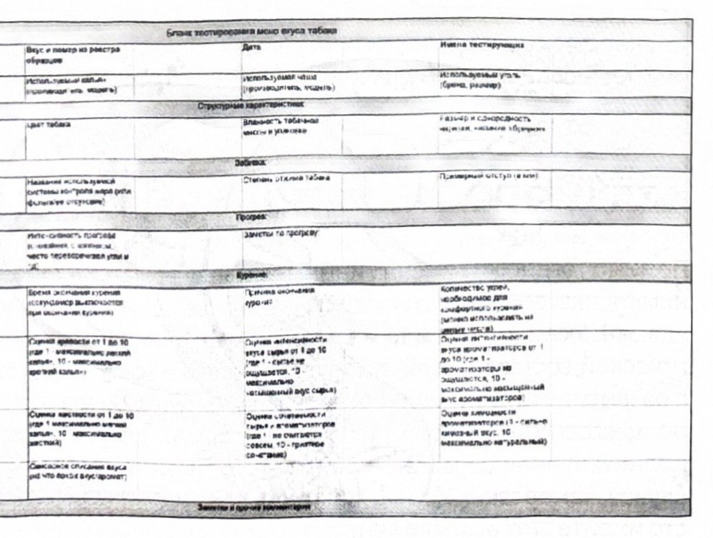

*図：単一の味（モノ味）を評価するためのタバコ試喫記録用ブランク（記入用紙）（原書 p.90）*

一見すべて単純なようですが、実践が示すところによれば、このような情報を構造化することは、その理解と評価に非常によく役立ちます。ですから、これは重要です。当然ながら、ここはすべて状況次第です。このブランクは、特定の単一の味（モノ味）の評価にのみ適していたもので、様々なサンプルの集合の評価には別のツールが使われました。このようなブランクから、単純なマクロを使って情報を統一されたベースに引き出し、それをさらに扱っていくことができますが、これについてもここでは語りません。もっとも、こうした瞬間に私は、カウンターに立った最初の数か月の研修時代を思い出し、このようなツールがあれば、私の習得と、膨大な量のモノ味の試喫がどれだけ楽になっていたことかと実感するのです。

テーマに戻りましょう。全体として、特性についてはこれで以上です。シーシャ用タバコの組成をざっと見ていきましょう、その際、シーシャ混合物の各成分が何に影響するのかを併せて検討していきます。

### シーシャ用タバコの組成

#### タバコ

あるいは、上述のことを踏まえれば、担体（ノシテリ）と言うほうが正しいでしょう。というのも、シーシャタバコにおいて、タバコそのものは、それを液体成分で含浸させるためにのみ必要だからです。担体の選択肢は多くありえます──何か特定の品種のタバコであることもあれば、様々な品種の混合であることもあります。この混合は通常ブレンドと呼ばれます。たいていの場合、最もよく使われるのは、軽いバージニア種（Virginia）と、よりニコチン含有量の高いバーレー種（Burley）ですが、例外もあります。例えば、強くて力強いバージニア種といった形で。

また、原則としてタバコの代わりにまったく別の担体を使う選択肢もあり、それも多くの場合、サトウキビや、私たちの自社製品の大部分の場合で言えば茶葉といった、植物由来のものです。適切に選ばれた技術という文脈においては、こうした製品は少なくともタバコ製品に引けを取らず、しかも安価です。なぜなら、わが国でタバコに課されるような物品税（アクシーズ税）が課されないからです。

そしてそもそも、私は心から、茶葉は適切な加工処理を施せば、シーシャ製品の担体として進化的に次のステップですらあると考えていますが、宣伝とみなされないために、この辺で口をつぐむことにします。いずれにせよ、乾いた部分はこの項目に限られ、以降の構成成分はすべて液体になります。すでに上で述べたように、このような原料は完成製品の質量の約15％を占めます。

#### グリセリン

私たちの液体含浸液の主成分です。グリセリンは蒸気を生成する物質です。より正確に、技術的に言えば、私たちは香料（フレーバー）とニコチンを含んだエアロゾルの流れを吸い込んでおり、グリセリンはこれら人生のあらゆる素晴らしいものを私たちに届けてくれます。この成分の沸点は290℃ですが、概してこの数字は忘れてしまってかまいません。なぜなら、溶液中ではこの値が急激に下がるからです。水とグリセリンの溶液の沸点が成分比率にどう依存するかを示した、インターネット上の歪んだ画像をここに載せておきます。急激な落差に注目してください。完成製品の組成のうち、グリセリンは通常40～70％を占めます。

［図：沸点（摂氏）　300／280／260／240／220／200／180／160／140／120／100　0／10／20／30／40／50／60／70／80／90／100　水中のグリセロール％］

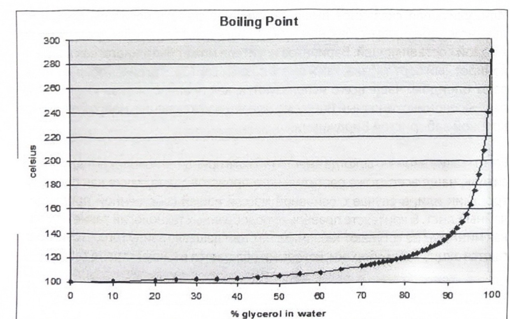

*図：水中のグリセロール濃度（％）と沸点（℃）の関係を示すグラフ。高濃度域での急激な上昇に注目（原書 p.92）*

#### 炭水化物含有物質

あるいは、もっと簡単に言えば、糖類です。その選択は様々でありえます。フルクトースやグルコースをベースとした糖シロップが使われることもあれば、カラメルや、砂糖の製造過程で副産物（廃棄物）として得られる糖蜜（モラセス）、そして例えば蜂蜜なども使われます。これらはすべて、異なる組成、酸度、そして内部に含まれる様々な糖を異なる比率で含むという点で特徴づけられます。第一に、こうした物質は、製品が傷むことなく賞味期限を延ばすのに役立つ天然の保存料として機能します。第二に、適切に選ばれた炭水化物含有物質は、製品の味の品質を良い方向に変えることができます。第三に、こうした物質は、喫煙中（例えば、主観的な煙の「濃密さ」）にも、タバコを扱う際（詰めるときの粘着性による単純な扱いやすさ）にも、完成製品の他の官能特性にも影響を与えます。個人的に私が最も使うのが好きなのは蜂蜜で、これは心地よい煙の濃密さと、軽やかで心地よい風味を与えてくれますが、「同類」のものより高価です。注記しておくと、輸入タバコのパックに書かれている「honey」という言葉は、必ずしもその文字どおりの訳「蜂蜜」を意味するわけではなく、単に糖含有シロップが入っていることを示しているだけのこともあります。こうした成分の含有量は通常、製品の全体質量の40％の範囲内にあります。

- 情報として一応書いておきます。この項目には、たとえば蜂蜜愛好家がパニックになる一点が関係しています。その一点とは、ヒドロキシメチルフルフラール（HMF。毎回この厄介な名前を書かないように、ここではOMFと表記します）です。OMFは糖類の分解生成物であり、とくに加熱時に生じます。いくつかの研究によれば、潜在的に危険な発がん性物質であり、マウスや人工培養された細胞培養に細胞変異を引き起こすとされていますが、人間についてはまだ何も証明されていません。この場合、糖類の供給源が蜂蜜であろうと、砂糖シロップであろうと、糖蜜であろうと、その他何であろうと重要ではありません。蜂蜜市場でこの問題を支持する人々は、騒ぎ立てて不安をあおるのが好きで、偽物の蜂蜜（結晶化しないように加熱されている）に対する余計な論拠を持ち出します。一方その他の人々は、そんなものは全部くだらないと言い、たとえばコーヒー（焙煎のため）にはこの物質がもっと多く含まれているという研究を見つけてきます。私自身、どちらが正しいのか今のところ確信をもって言うことはできません。分かっているのは、私たちはこれを吸い込んでいるということ、そしてOMFの問題が業界で一度も取り上げられたことがないということだけです。ですので、これは皆さんに考える材料として残しておくことにします。

> 香料および芳香添加剤

天然のもの、または天然と同等のもの、ただし常に食品工業での使用が認証されたものです。私たちが吸うことになるタバコの最終的な味、それがイチゴであれレモンであれ、あるいは生姜であってさえも、それを決定するのがまさにこれらです。もしあるメーカーのこれが食品用ではないという疑いがあるなら、ゴミ箱行きです。残念ながら、この問題は消費者の視点から管理するのは難しいのですが、私は、低価格帯の商品では食品用の物質を香水用の香料に置き換える香料メーカーが存在することを知っています。ここでは、悪い意味での「クラフト」製品に対して、より警戒した態度で接することをただ助言します。

覚えておいてください。本格的な香料を入手できるのは、本格的な企業だけなのです。完成品において、味と香りの成分は通常、質量の10〜15%を超えません。

香料が最終的な味を決定するため、シーシャ製品が異なるロットでときにプロファイルのニュアンスが異なるのは、通常まさにこれと関係しています。多くの芳香物質は植物原料からの抽出によって得られるため、たばこ原料と同じく、年ごとに少し違ってきます。もっとも、香料メーカーは大部分、得られた香料を手作業で「調整しなおす」ことでこの点を埋め合わせることを習得していますが、100%の安定性の保証は誰にもできません。香料を一度に大ロットで仕入れることが役立ちますが、それでも結局いつかは尽きてしまいます。

溶剤としては通常、1,2-プロピレングリコール、エチルアルコール、グリセリン、トリアセチン、ジアセチン、ベンジルアルコール、水、またはこれらの混合物が使用されます。しかしこれらの選択は、最終製品への大きな影響というよりは、むしろ技術的な側面によって決まります。それも全員にとってではありませんが。プロピレングリコールについては、独立して添加される成分として別項では書きません。これは意図的なもので、自分の製品でこれを使う意味がまったく見出せないからです。

> ニコチン

この場合、このニコチンがたばこ葉の一部であるか、あるいは製品に別途添加されるかはあまり重要ではありません。製品の強さ（クレプキー＝強さ）を担うのは、まさにニコチンの量と質です。また、それは硬さ（ジェストキー）にも影響することがあります。

これはかなり論争を呼ぶ点で、皆がよく持ち出したがるものでした。最近、業界は以前より深く考え、未確認の情報をただ繰り返すことが減ってきたので、この成分の使用に関する疑問も多くの人にとってなくなりつつあります。

### おわりに（КОНЦОВКА）

私が言ってきたとおり、シーシャ用タバコの組成は非常にシンプルで分かりやすいものです。まあ、少なくとも私がこの記事に加筆を入れる前は、確かにそうでした。

復習と、ある重要な基礎（БАЗА）の体系化に加えて、皆さんが自分にとって新しい情報を得てくださったことを願っています。そして私自身は、その代わりに、自分が持っている情報について、これからより深く、より専門特化した素材を書いていくよう努めます。

# ニコチンの強さ（クレプキー）か、硬さ（ジェストキー）か。ヴラド・パニューチン

| 長い間、シーシャ業界では「強さ（クレプキー）」と「硬さ（ジェストキー）」という概念の取り違えが存在してきた。この問題に最終的な決着をつけよう。

> INTRO

陽光あふれるクリミアから、皆さんこんにちは！私の名前はヴラド・パニューチンです。以前、私は友人であり同郷でもあるアンドレイ・トゥルケヴィチと一緒に、チャンネル「Savinov Says」のために「ミクソロジー」についての記事を書きました。活発な反響を受けて、新しい記事を書きたいという興味が湧いてきました。

ここにはかなりの量のテキストがありますが、それは間違いなく皆さんの余暇を彩り、多くの興味深い情報を提供してくれるはずです。ある人にとっては、特定の物事に対する見方を変えることさえあるでしょう。

> ENTER

まず初めに、シーシャ・コミュニティに存在するある問題を指摘しておく必要があります。そしてこの問題は、用語に関係しています。

多くの人が「強さ（クレプキー）」と「硬さ（ジェストキー）」という用語を混同するか、あるいはまったく区別していません。総じて、このテーマは多くの人にとって非常に議論を呼び、込み入ったものであるため、最後まで解明されていません。この記事を読んだ後、皆さんも私と同じように、人々の固定観念的な思考を「ぶち壊して」くれることを願っています。これを「意見の押しつけ」と混同しないようお願いします。

> MARKS

最初に取り上げたいテーマは「10段階評価スケール」です。

まず本質から始めましょう。そのような一般的に認められたスケールはコミュニティには存在しません。それはある一人の人間が自分自身が使うために考え出したものであり、最大限に主観的なものです。そして、それを一般に普及させてはならないということを、誰もが理解しているわけではありません。現時点でこのスケールを導き出すことは不可能です。なぜなら、2つの基準点、すなわち最小（1）と最大（10）を取る必要があるからです。しかも、最小の基準点ならまだ容易に思いつくとしても、最大については非常に難しいのです。なにしろ「トンバク」「ジュラク」「サルム」、そしてセルゲイ・プトコフの「Frigate」が出てきたような代物が存在するので、「50グラム」なしにはここを把握できません。さらに、新商品が出てくるにつれて、これらの基準点を定めることはできなくなります。それに加えて、段階分けの問題もあります。また、Fumariを「満点」にできるとか、あるいはTangiersは4でも10でも吸えるなどと人々が考えているのを聞くと、非常に奇妙です。

多くの人は問題の本質を掘り下げず、タバコの強さ（クレプキー）はすでに定められた値であることを知りません。もし皆さんが最大限に有能で熟達した自分の道のマスターになりたいなら、このスケールを使うべきではありません。これは万能薬ではないのです。本来であれば、他の人々をこれから引き離していく必要があります。もし「シーシュカ（Шишка）」でこれが使われていて、それが機能しているのなら、それはどうぞご自由に。なにしろ、それは彼らが考え出したものであり、イリヤ・ロマノフによる、自分の客のための独自のローカルな仕掛けなのですから。パーシャ・サヴィノフが皆に説いているとおり、「自分の頭で考えろ」です。

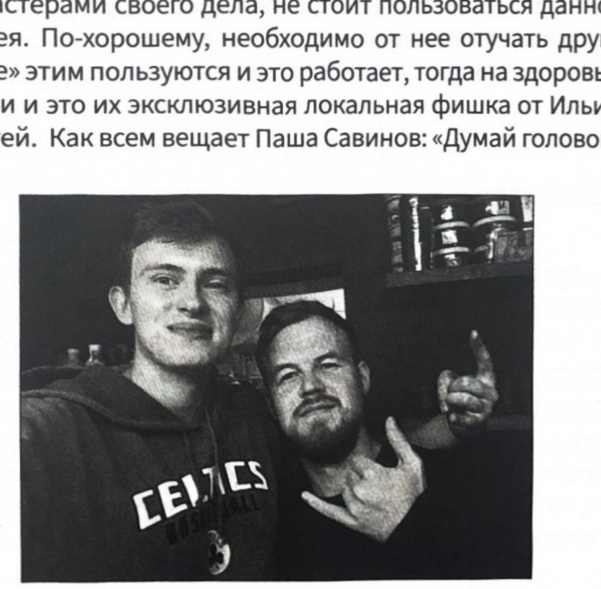

*図：シーシャ仲間との一枚（原書 p.97）*

> STRENGTH（強さ）

強さ（クレプキー）とは、含有されるニコチン量の、ある一定量（質量／体積）のタバコ混合物に対する比率です。この定義によって、「強さ」がすでに条件づけられた要素であるという事実がはっきりと理解できます。

例：Afzalというタバコの強さは、（実用主義と比較に基づいて形成された）主観的な描写では、平均より下、軽めに近い、比較的小さな強さのタバコであると解釈されます。したがって、私が伝えたいのは、この製品を外部からの操作、つまり添加物（別のタバコなど）の形での操作なしに「より強く」することは決してできない、ということです。つまり、もし人が純粋なAfzalを望むなら、その人はすでに強さを定めたことになり、それがAfzalの強さなのです。

- 分かりやすい比較：タバコ混合物の強さは、アルコールの強さのようなものです。ただ最初の場合はニコチンの比率であり、後者の場合はアルコールの比率だというだけです。

含有されたニコチンのタバコ的ポテンシャルに対してできる唯一のことは、ありふれた標準的な手段を用いてニコチン放出の強度をコントロールすることです。そしてこれはすでに硬さ（ジェストキー）に関わることです。そしてこの用語から始めて、私たちはなめらかに次の章へと移っていきます。

> HARDNESS（硬さ）

硬さ（ジェストキー）とは、シーシャを吸うことから人（消費者）が直接感じる感覚のことです。これらの感覚は、気道に生じる痙攣、不快感（たとえば喉のイガイガ）、また流行りの言い方をすれば「throat hit」、あるいは単に喉への一撃などを伴います。

「硬さ」という用語そのものはまったくもってシンプルで分かりやすいものですが、それを形成する諸要素のほうがはるかに興味深いのです。私は硬さの主要な3つの方向性＋追加要素を挙げています。

硬さを形成するもの：

- ニコチン放出の強度

- タバコ混合物の過熱（とくに糖蜜の過熱）— ガス（一酸化炭素および二酸化炭素）

さらに：プロピレングリコール（PG）の質、グリセリン（VG）の質、香料の濃さと質、濃度、味と香りの成分の性質、たばこ原料の質（品種型およびそれに関連する化学組成）、その他多くのものです。

それでは、各項目をより詳細に見ていきましょう。

1. ニコチン放出の強度。

一定の時間内に、熱の作用によってどれだけの量のニコチンが分解され、放出され、私たちの体に入ってくるかを示す用語です（この文脈では「ニコチン」で正確です）。

- 主たるコントロール要素は温度です。そこから派生する追加要素として、ボウルの材質、ボウルの形状、一定の熱源に対するタバコ混合物の量（ボウルにどれだけのタバコが入っているか）があります。また、ここには完成したタバコ混合物の加工（カット、絞りなど）も部分的に関わってきます。なぜなら、この点もまた「糖類」の章、そしてそれだけにとどまらない章に関わるからです。さらに、ニコチン放出の強度は人的要素なしには成り立ちません。例として、シーシャを吸う強度を挙げることができますが、これもやはり温度に関わること（火力のコントロール／温度のコントロール）です。

2. タバコ混合物の過熱。

タバコ混合物が過熱すると、人は吸う過程で不快な感覚を覚えます。私たちのコミュニティでは、それを「苦み（ゴルチェニエ）」「焦げ（ゴレニエ）」などと呼びます。これは大部分が糖蜜の過熱に左右されます。糖蜜（メラス）が多ければ多いほど、そしてそれが過熱されればされるほど、不快感は大きくなります。これは主に、糖が燃焼する際の二酸化炭素の放出（学校の化学のプログラムを思い出してください）と、その他の派生的な要素に関係しています。この場合、まさに二酸化炭素であって、一酸化炭素ではありません。

3. ガス（二酸化炭素および一酸化炭素）。

この項目は最も複雑で議論を呼ぶものですが、これを避けて通ることはどうしてもできません。まずは、これら2つのガスがそもそもどのように生成され、どこから来るのかを明らかにしましょう。

先ほど、二酸化炭素について、そしてそれが糖の燃焼時に放出されることに触れました。また、二酸化炭素はPG＆VGの「発火」時にも放出されることがあります。さて、これら両方のガスは燃焼時に生成されますが、ただ少し異なる条件下で生成されるのです。

一酸化炭素は、二酸化炭素とは違って、燃焼時（木製品などの燃焼）に酸素が不足した状態で生成されます。それは人体にとって極めて有害です。なぜなら、体内での酸素の輸送を妨げ、タンパク質体を破壊するなどするからです。一方、二酸化炭素は人体が自ら生成するものであり、しかもこのガスは私たちの生命活動にとって非常に重要なものです。

一酸化炭素については次のような事情があります。それは、私たちが欠くことが非常に難しい産物、すなわち酸素の燃焼時に生成され、シーシャの熱源は炭です。それはココナッツ炭、レモンの木の炭、クルミの炭、ただの木炭、その他何であってもよいのですが、要点は一つ、その燃焼時には必ずガスの集合体、そして主に一酸化炭素と二酸化炭素が生成されるということです。

そして、この問題の本質を十分に解き明かした今になってようやく、ガスが人体に作用する際の、とりわけ吸うときの感覚に作用する際の、硬さの問題の本質を理解することができます。なぜなら、吸い込む空気の中で酸素が不足すると、人は気道に確実に不快感を覚えることを、誰もが知っているからです。

そして、もしこの空気がさらに一酸化炭素で「豊かに」されているとすれば、それはもう完全に厳しいものになります。また、ガスは今度は人の血圧の状態にも影響を与えるので、喫煙におけるその役割を過小評価することはできません。ガスのテーマは非常に興味深く、多くの人によって解明されていません。とても残念なことです。なにしろ、これはこの章だけでなく、その他多くの章にも関連づけられるのですから。

この先はさらに踏み込みます！今から「概念の取り違え」というテーマを解き明かしていきます。まず頭に浮かぶのは「エアクッション」、あるいは「カザン手榴弾（カザンスカヤ・グラナータ）」です。

> EDGE

文化の発展につれて、市場には絶えずさまざまな新商品が登場します。あらゆるアクセサリー、タバコ、シーシャ機器などに加えて、一部の人々はボウルへの「詰め方」のさまざまな方法を実験しています。きっと皆さんも、いろいろな珍奇なものを見せ、しばしば視聴者に不明瞭な情報を押しつけるYouTubeの動画を見たことがあるでしょう。

たとえば、この「カザン手榴弾」です。多くの人が、空気の層によってシーシャを「より強く（クレプチェ）」できると主張しています。幸い、この問題に精通した人々はすでに、選んだ製品を「より強く」することはできないが、「より硬く（ジェスチェ）」することはできる、と知っています。

方法：ボウルの上にカラウドを置き、カラウドをボウルごとフォイルで覆い、それに応じてフォイルに穴をあけ、たくさんの火力を与え、長時間加熱します。この方法の問題は、カラウド（または他の類似品）の下面と、その上に張られたフォイルとの間の空間で、炭の燃焼により、ガスの集合体、主に二酸化炭素と一酸化炭素が絶え間なく合成されることにあります。そして、このようなシーシャを一吸いするごとに、消費者は間違いなく燃焼生成物の余分な量を部分的に受け取ることになります。これは過剰な頭痛、めまい、意識喪失などを招きかねません。

原因：体内の酸素不足の生成（低酸素症）と一酸化炭素中毒です。もちろん、一酸化炭素のモル質量（28）は空気のモル質量（29）より小さいので、上へ（揮散しようと）向かおうとしますが、それでも吸うときには一定の部分が体内に入ってきます。

「井戸（コロデツ）」や大きな間隔（オーバーハング）については、とりわけウラジーミル・フィリッポフのおかげで、すでにずいぶん前に解明されています（興味のある方には、彼のチャンネルに「井戸」についての別の動画があります）。

上記の情報を踏まえれば、ここにもう何も付け加える必要はありません。理解しておくべきは、ここでの類比が「エアクッション」と似ているということです。害をもたらすだけのガスの過剰な合成です。当然ながら、「カザンカ」と比べればこれはより小さい程度で感じられるものですが、それでもこの事実が消えるわけではありません。誰もが自分の好きなように吸っていますし、これからも吸うでしょう。しかし、人々が「硬さ」と「強さ」を混同しないことが非常に重要なのです。

> HUMAN FACTOR（人的要素）

人体の生理的状態という、これほど重要な要素も指摘しておく価値があります。この点もまた、シーシャを吸うことから得られる効果に大きく影響を与えることがあります。なにしろ、すでに皆さんの体内に含まれているニコチンの量や、外部から入ってきたニコチンに加えて、生体リズム、動脈圧および静脈圧、その他のごくありふれた事柄（たとえば、シーシャを吸う前／吸いながらアルコールを摂取すると酸素不足が増大します）など、他にも重要きわまる側面が存在するからです。上記すべての要素の組み合わせは、たとえまったく同じものからであっても、皆さんの感覚に常に異なる影響を与えうるのです。これを人的要素と呼ぶことにしましょう。

> END

このテーマの土台は据えられました。

これが今後も正しい方向に発展していくことを願いましょう。

大ボリュームの教育的素材に変化をつけるために、私はシーシャ用タバコのメーカーへのいくつかのインタビューを挟みたいと思います。最初のものは、Tangiersというタバコの生みの親、伝説的なエリック・ホフマンのインタビューの翻訳です。2015年、私はエリックのサンディエゴのラウンジを訪れ、そこで作りたてのオーセンティックに詰められたTangiersのタバコを吸う機会に恵まれました。

# エリック・ホフマンとのインタビュー

| ステパン・ヴォルコフが、皆に愛されるタバコTangiersの生みの親であるエリック・ホフマンとのインタビューの翻訳を行った。このインタビューは遠い2010年に発表されたものである。原文はこちら：HTTP://BLOGDOARGUILE.COM.BR/2010/06/ENTREVISTA-COM-ERIC-HOFMANN|CRIADOR-DO-PHUNNEL-E-FUMO-TANGIERS-ORIGINAL-EM-INGLES/

> あなたは何者ですか？

私は、多かれ少なかれ、ごく普通の男です。有機化学、ガスプロセス化学、原子核化学、化学工学といった分野で働いていましたが、ある時、自分自身の何か、新しい何か、現実の人々と出会えて、科学的なことにあまり関わりすぎないようなことを始めるほうがよいと決めました。好きな炭酸飲料はMountain Dew、好きな肉は鴨、チェス、バックギャモン、Skatというドイツのカードゲーム、その他いくつかのボードゲームやカードゲームをします。また、サンバ調の音楽が好きです。好きな地球の半球は南半球です。

> いつ、なぜシーシャ製品を売り始めたのですか？

ビジネスパートナーがシーシャ業界に取り組むことを提案してきました。当時、すべてが非常に高価で、フレーバーの選択肢は非常に少なかったので、私はそのプロセス全体を改善しようと決めました。私の目標はアプリコットになりました。私はこのフレーバーをずっと良くしたいと強く思っていました。

> なぜTangiers（タンジール）なのですか？モロッコの港湾都市ですか？

- そうですね、タバコを生産している地域が2つありました。Sham（中東の地域で、シリア、レバノン、パレスチナ、イスラエル、ヨルダンの領土を部分的に含む。— 訳注）とGulf（ペルシャ（アラビア）湾を指す）です。Gulfのタバコはより強く、より硬く、通常フォイルなしで吸われます。Shamのタバコは、私たちが普段シーシャ用タバコと結びつけるものです。私は、テクスチャーと品質の観点から、この2種類の中間にあたるものを作りたかったのです。また、現在のどの種類とも結びつかない、アラブの名前も欲しかった。そこで、選択肢として残ったのはチュニジア、アルジェリア、モロッコでした。チュニジアは小さすぎ、アルジェリアはアメリカでは何か暗いものと結びつくので、選択はモロッコに落ち着きました。私は大きくて有名な都市の中から選びました。カサブランカは映画と結びつき、ラバトはウサギの病気のように聞こえ、マラケシュには歌があります。タンジール（まさにタバコの名前の由来となったモロッコの都市）は素晴らしい響きだったので、私たちはそれを選びました。

> Tangiersのタバコは誰が製造しているのですか？

私たちです。すべてここ、カリフォルニア州サンディエゴで作っています。タバコはほぼ完全にアメリカで製造された成分から作られています。私たちが使っている植物性グリセリンは太平洋地域から供給されていますが、それ以外はすべてアメリカ製です。

> 製造の初めに困難はありましたか？それとも、何を、なぜ作るのかをすでに知っていたのですか？

私は、他のタバコブランドの製造の基本原則に基づいて、何をすべきかをおおよそ理解していましたが、実際にはプロセス全体に大量の実験と改良が必要でした。新しいフレーバーの創造は、今でも理想に至るまでの骨の折れるプロセスです。試行回数は2回から60回超まで幅があります。Maraschino CherryとColaをきちんと機能させるのが最も難しかったです。

> なぜTangiersは湿ったタバコなのですか？

グリセリンのせいで湿って見えるのです。実際には水分の含有量は非常に低いのです。一部の国では、税制のため、乾いたタバコのほうが購入者にとって魅力的であり、彼らは自分でグリセリンを加えます。アメリカではこれはそれほど大きな問題ではないので、私たちはすぐに使える完成品を出荷しています。

> いつTangiersを製造し始めたのですか？

最初の実験は2001年に始まり、販売は2005年です。

> あなたの製品の特徴は何ですか？

絹のような煙の質感です。他のブランドよりも、より豊かで自然な味、そしてもっとクールです。

> なぜあなたは自分の製品にPREMIUM（プレミアム）のステータスを与えなかったのですか？

それは購入者に決めてほしかったのです。ブランドをプレミアムだとか、最高だとか、ベストセラーだとか呼ぶのは思い上がっていると、私は常々考えていました。

> 今、Tangiersのフレーバーはいくつあるのですか？

現時点で、Lucid、Noir、F-lineのラインナップにおよそ100あります。これまでに私たちが作ったことのあるフレーバーの数は、120をはるかに超えます。（この情報は古くなっています）

> なぜTangiersは空気と接触した後に良くなるのですか？

水分の含有量が非常に低く、また私たちは保存料、人工着色料、添加物も使っていないので、タバコは空気の湿度に応じて簡単に水分を失ったり得たりします。包装後、開封の瞬間まで湿度は変化しません。もしタバコが作られた湿度が、それが開封された場所の湿度と大きく異なる場合は、タバコを4〜24時間空気にさらしておくと有益でしょう。

> PHUNNEL（ファンネル）ボウルを作るというアイデアはどうやって思いついたのですか？

私はタバコを使わない完全に液状の製品を作ることを考えていて、そのためのボウルを作りました。普通のタバコで新しいボウルを試してみたところ、それがどれほどうまく機能するかに驚いたので、それを大衆市場に投入しました。

> PHUNNELは湿ったタバコにだけ向いているのですか？

このボウルから恩恵を受ける種類が湿ったタバコだけではないだろうとは想像できますが、その中で乾いたタバコを試したことは一度もありません。

> なぜPHUNNELの土台（基部）は長いのですか？革新ですか、より良い冷却のためですか、それとも作業を簡単にするためですか？

主に脚の長さは気液流の特性に影響します。同時に、ボウルが熱くないときに取り外したり持ったりするのが簡単になります。

> 今日、PHUNNELボウルは世界中で知られています。このような世界的な普及を予想していましたか？

正直に言うと、いいえ。地球のあらゆる片隅で見つけたすべての友人、購入者、支持者たちに、毎日驚かされています。私は自分を謙虚な人間だと考えるのを好み、自分が作り出したものを多くの人々が楽しめるなどとは、決して思い上がって考えたりしません。

自分が作り出したもの、そして自分の作品が世界中の人々にとって意味を持っているということを自覚するのは、つらいことです。私は自分の製品への人々の愛をとても真剣に受け止めていて、それは私に大きな責任を負わせます。後でそれを買う人々に対する何らかの責任なしに、人が何かを作り出せるとは思いません。あまりにも多くのメーカーが、それがどれほど良い香りがするか、うまく機能するか、購入後に買い手が満足するかを考えずに、ただ何かを作っているだけだと思います。彼らは製品を、空白を埋め、他の売り手と競争する手段とみなしていて、品質を気にかけていません。一部のメーカーは本当にそれを気にかけ、心配していますが、大多数の態度はいい加減です。

> ブラジルのシーシャ市場についてどう思いますか？

シーシャ業界では、私たちは皆、互いに密接につながっています。ブラジルだろうと、アメリカだろうと、イギリスだろうと関係なく、私たちすべてを結びつけているのは何か人間的なものです。私はシーシャを国の側からではなく、人類の側から見ています。これはもちろんノーベル賞に値するものではありませんが、ある人が現代世界で、私を深く突き動かす興味深い状況に気づきました。彼は、私たちは自分自身を奮い立たせようとする意欲を失ってしまった、と言いました。

シーシャは私を一人の人間として奮い立たせてくれます。そして、それがほんの少しであっても、他の人々を奮い立たせてくれることを願っています。私は世界を国によって分けたことは一度もありません。国は政府によって形成されますが、人々は独立しています（あるいは、私の考えでは、自分自身をそう見るべきです）。そして、偉大さと個人的な志に向かう私たちの歩みの中で、自分自身を一つの全体としてみなすべきです。

> Tangiersのファンネルはアメリカでつくられているのですか、それとも中国から輸入しているのですか？

- それらはアメリカで作られています。私のグローバルな考え方にもかかわらず、私はアメリカ市民であり、中国製とほぼ同じ値段でありながら、より良く、より中身のある、手作りの何かを作ることが私の務めです。私は中国の成功を見くびっているわけではありませんが、ここアメリカ、とくに南カリフォルニアで製造することを好みます。これにより、購入される製品の品質が最大限可能なものになると保証することができます。

> なぜPHUNNELボウルを特許化しなかったのですか？

難しい質問です。私はポルトガル語をまったく知りませんが、英語には「ambivalent（アンビバレント／両価的）」という言葉があります。アメリカでは多くの人がこの言葉を乱用していますが、それは、何かに対して支持する強い気持ちと同時に嫌悪感を抱いているという意味であり、中立とは違います。中立というのは、何かに関してどちらの方向にもまったく気持ちがない、という意味になりますから。

さて、私はPhunnelボウルの特許化の問題について、かなりアンビバレントでした。一方では、それは利益になりえましたし、特許がなければ、私なら決して作ろうと思わないような安くて質の悪い偽物を人々が作れるようになってしまいます。そして私はこのアイデアに反対でした。なぜなら、それは私の発明から得られる利益を減らし、それがおそらく品質に影響を与えるだろうからです。しかし、もし人々のお金が少なければ、より多くの人々がPhunnelのアイデアを用いたボウルを買えるように、それ（安いもの）のほうが良いということもありえます。

> どちらが優れているか：Vortex か Phunnel か？ その理由は？

Phunnel の成功の後、私はさらに多くの試作品を作りました。オリジナルのデザインと比べると、ボウルは多少変化しました。初期の4つの試作品では、Phunnel の上部が密閉され、穴はボウルの側面に配置されていました。それらには、ボウル上部に交差する棒があった、より初期のモデルと同じ問題が生じました。たばこのジュース（汁）がそこに入り込み、溜まり始めたのです。ある時点で溜まる量があまりに多くなり、それがボウルの働きに影響を及ぼし始めました。一つの大きな穴と滑らかな側面を作ることで、私は所有者が行わなければならないメンテナンスを最小限に抑えようと、あるいは少なくともそれを簡単にしようと試みました。

ですから私は、あらゆるテストと作業を経た上で、Phunnel こそが作り得た最良のものだと考えています。私の理解では、Vortex のボウルは私の初期のボウルにあったのと同じ問題を抱えているので、その点で Phunnel のほうが優れています。Vortex のほうが安価なので、何を重視するかは購入者が選ぶことになります。

## ロマン・シュトフのインタビューより抜粋

かつてはロシアの超有名DJ。現在は、最も人気のあるタバコブランドの一つ「DUFT」のオーナー。

[原文ママ: КРАФТА / Создан ПРОКАЧАЕМ разрас этапы р выстра Шутов УТЬ К УСПЕХУ ЧЕРЕЗ ПОТ, БОЛЬ И ХЕЙТ лен, который закатит споной рецептуры.. маркет работа кой шиб юдст подвал цех фабрика й и дистрибьюторской политики сть и почему иногда не надо больше 4, черный «батарейный» хайп]

汗、痛み、そしてヘイトを通じた成功への道

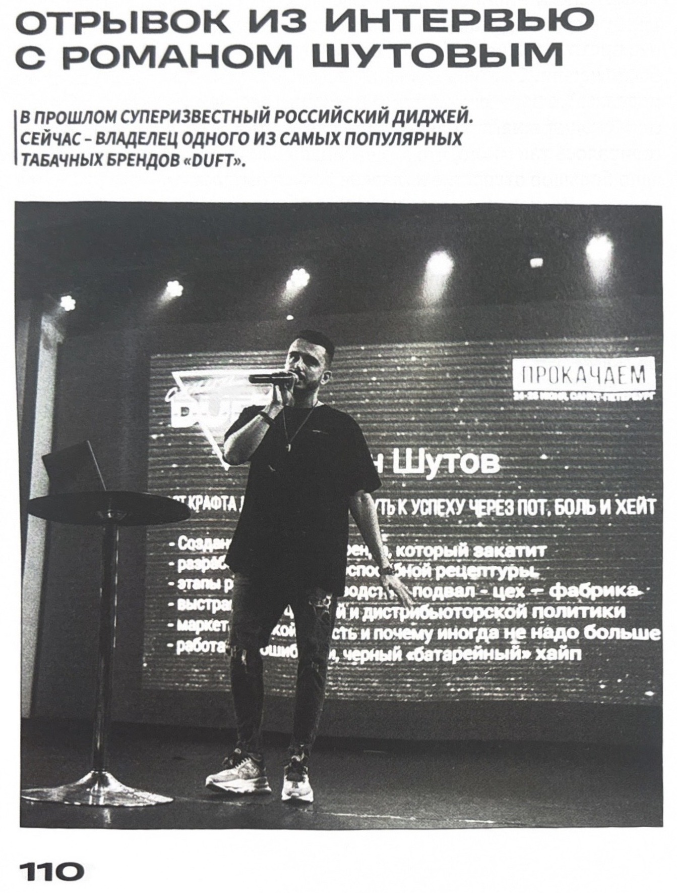

*図：DUFT のオーナー、ロマン・シュトフがイベントのステージで講演する様子（原書 p.110）*

> ロマン、ディストリビューションのシステムは今どのように機能していますか？

我々のビジネスで定着しているディストリビューター網の構築の型に反して、我々は自らの戦略を組み替え、別の道を行くことにしました。現在の構成では、テリトリーや人物に対する独占的な紐付けがありません。我々はディストリビューターたちの間でオープンな競争という方針を発信しており、最も強い者がより多く稼げるようにし、彼らをテリトリー的にも厳格な価格帯によっても制限していません。

率直に言って、このモデルへ移行する一歩はかなりリスキーなものでしたが、ここ半年でそれは見事に機能し、販売量はただただ伸びる一方です。不満や恨み言を耳にするのは、最も売れていなかった小規模なプレイヤーからだけです。まあ、これは自然淘汰というものでしょう。

> DUFT のタバコの製造は、ポガールスカヤ工場へのアウトソースで行われています。この協業のプラス面とマイナス面は何ですか？

我々にとってこれは、まず第一に、合法セグメントでの製造を素早くスタートアップさせる手段でした。自社製造を立ち上げるのは、オペレーションの観点からはるかに時間がかかり、複雑でした。これについては以前にもお話ししたとおりです。

第二に、あらゆるアウトソースの明白なプラス面ですが、製造プロセスや課税に関する日常業務のすべてを自分で背負わなくて済むのです。ただ消耗品やレシピを投入し、金を払って、倉庫で完成品を受け取るだけ――しかしこれはあくまで理論上の話です。実際には、その先で大量の技術的なニュアンスや問題が次々と出てきて、それらはモスクワに座って電話で解決できるものではなく、絶えず500キロ離れたブリャンスク州まで足を運んでは細かなニュアンスをいじり回す羽目になるのです。

> 自社製造を行う計画はありますか？

実のところ、それはすでにあります。当初我々は、ある時点で技術的な問題でも政治的な問題でも不安定な状況にあったため、Duft を工場から引き上げるためにそれを建設しました。しかし結局、我々はすべての方面で合意点を見出し、弱い部分を手直しし、現在も依然としてポガールに残るほうが我々にとって有利な状態です。自社製造のほうでは、近いうちに新製品を立ち上げる計画があり、また全体として Duft のための予備の飛行場（バックアップ）として保持するつもりです。

> MUST HAVE というブランドとはどのように関わっていますか？

Must Have というブランドそのものは具体的にはポガールスカヤ工場の所有物ですが、そこにはアンドレイ・シビリャコフという主要な中心人物がいます。彼はこのブランドの創設者であり、そのCEO兼テクノロジストです。我々は彼と技術開発について最大限に密接に協力し合い、知識と経験を共有しています。どれほど多くの革新が、まさに私のラボで最初にテストされ、その後で初めて工場にある我々両方の製品に産業規模で導入されたか、皆さんには想像もつかないでしょう。彼の側からも、私のもとには絶えず素晴らしい差し入れ（アイデア）が飛んできて、私はそれを積極的に自分の製品に取り入れています。要するに、これは、実際には我々の製品が直接の競合であるにもかかわらず、我々が自らをパートナーと位置づけ、互いに敵対して害し合うよりも一緒に前進してそれによってより強くなるほうが良いとはっきり理解している、そういうケースなのです。

> 多くのロシアのブランドが非常に似通ったパッケージを使っているという事実が、あなたを困惑させることはありませんか？

要は、このパッケージは、おそらくロシアで製造されている中で、素早く便利に扱えるPETボトルの唯一の選択肢なのです。他のどんな選択肢も中国かヨーロッパから運んでこなければならず、それは納期、リスク、そして凍結される投資額を増大させます。我々はこのパッケージをシーシャ市場に最初に導入した者の一人であり、それが皆に非常に刺さったので、多くの者が――これは当然のことですが――我々を模倣し始めました。これは成し遂げた仕事への誇りを抱かせずにはおきませんが、同時にネガティブな感情も呼び起こします。将来に向けて、我々はすでに自社製品のための、より独創的な新しいフォームファクターを検討しています。様子を見てみましょう。

> どのロシアのシーシャブランドを挙げますか？

1. Darkside――最大の企業として、そしてロシアセグメントにおける強い煮込みタバコ（вареный табак）のパイオニアとして。

2. Hookah Place と JohnCalliano――私の理解では、国内産業の成長の触媒として登場し、キッチンもアルコールもない「シーシャラウンジ」というニッチな形態をマスマーケットへと推し進めた存在として。

3. MattPear――現代のロシアのホレカ（HoReCa）において最も大衆的なシーシャとして。

4. Nuahule Smoke/Store。最も総合的でパッケージングの整ったシーシャ・フランチャイズとして。

5. セヴァストポリスキー市場――聖域中の聖域として。

## ミスター・イブラギムのインタビューより抜粋

ある時、私は古い友人ウラジーミル・デネシュキンと一緒に、タバコ Malaki の製造のために Ajman（アジュマーン）へ行きました。そこで私は、シーシャの世界で大きな歴史を持つ人物であり、「マラキ（Malaki）」社のオーナーであるミスター・イブラギムにインタビューを取りました。

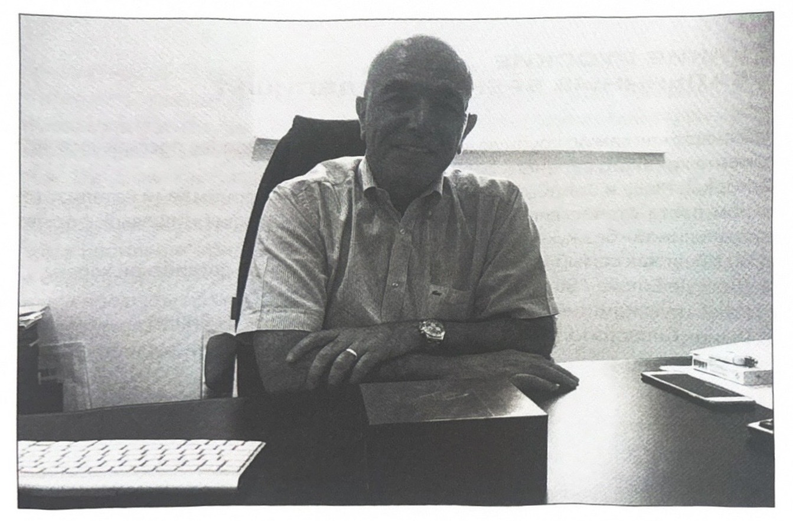

*図：オフィスのデスクに座る「マラキ」社オーナー、ミスター・イブラギムの肖像（原書 p.114）*

> あなたはどこで、いつ生まれましたか？

私は1956年5月20日に、パレスチナのヘブロン（Hebron, Palestine）という街で生まれました。

> あなたはどのようにして、自分がタバコに携わることに興味があると理解したのですか？ タバコビジネスでのあなたの始まりはどのようなものでしたか？

子供の頃、私は建築家になりたいと思っていましたが、イスタンブールにいたときに Tabacco Expert College（イスタンブール大学と Tekel の支援による）のことを耳にし、この教育機関が興味深く思えたのです。私は彼らが何を教えているのかを知るために、このカレッジを訪れました。彼らが私に何を教えられるのか――まさか喫煙の仕方を教えるのか――知るのが興味深かったのです。

教えられている科目は私には興味深く思えました。我々は、タバコが土の中で育つ瞬間から、店の棚に並ぶ最終製品が作られる瞬間まで、タバコにまつわる工程について教わりました。当時はまだ香料を加えたタバコ（加香タバコ）はなく、黒いエジプトタバコとトンバク（томбак）だけがありました。我々は、タバコを見たときにそれがどの葉でどんな特性を持つのか分かるように、葉同士を見分けることを教わりました。

> それは大きなカレッジだったのですか？ 何人の人がそこで学んでいたのですか？

毎年彼らは55人の生徒を認可し、修業期間は4年でした。このカレッジはトルコ国民専用で、授業はトルコ語で行われ、私は唯一の外国人の学生でした。すべての学生は、例えばエンジニアの給料に匹敵するような給与を受け取っていました。タバコ会社 Tekel は、人々が修了後にタバコ産業に残ることに関心を持っていたのです。私の学費は父が支払いました。私は1976年に入学し、1980年にこのカレッジを優秀な成績で卒業しました。

> その後はどうなりましたか？

私は Jordan Tabacco & Cigarettes Co に Primary manager assistant（プライマリーマネージャー補佐）の職で採用され、その後 Head of quality control department（品質管理部門長）となり、1983年には Production manager（製造マネージャー）の職を得ました。私は製造工程と品質管理に携わっていました。

> それは有名なタバコ（シガレット）の銘柄でしたか？

あなたはおそらく聞いたことがないでしょう。会社の事業はヨルダン市場に向けられていましたが、我々はイラク、サウジアラビア、クウェートといったいくつかのアラブ諸国にも供給していました。

> 製品は地元の原料から作っていたのですか？

原料の一部はヨルダンで生産されたものでしたが、我々はさまざまな国からも輸入していました。

> 次の段階は何でしたか？ なぜあなたはこの会社で働くのをやめたのですか？

我々の製品の主要なディストリビューターに、新しい会社を設立するというアイデアが生まれ、1992年に International Tobacco and Cigarettes company（以下 ITC）という会社が組織されました。これは株式会社として設立され、アンマンの株式市場にも上場していました。製造は1994年に始まりました。Factory manager（工場長）の職から始め、1996年にはすでに General manager assistance（ゼネラルマネージャー補佐）になりました。

> ITC はシガレット（紙巻きタバコ）だけを作っていたのですか？

はい。

> 何か有名なブランドはありましたか？

会社はローカル市場向けのシガレット製造から始まりましたが、1995年に Rothmans Cigarette 製品の製造が始まり、それは1998年に終了しました。Phillip Morris との協業が始まり、会社はヨルダン市場向けに L&M と Marlboro 製品を生産していました。

> 何かシーシャ製品はありましたか？

我々はムアッセル（muassel。アラビア語からの翻訳で「糖蜜（パトカ）」の意味）の開発を2005年に考え始めました。タバコ製造のための設備を探す中で、我々は Al Fakher という会社を知り、2006年にそれを買収しました（取引額は非公開です）。

> 買収前の会社のオーナーは誰だったのですか？

シリア人でした。

> あなたは Al Fakher 社でどの職位から活動を始めたのですか？

General manager assistant（ゼネラルマネージャー補佐）の職位でです。2010年に私は General manager（ゼネラルマネージャー）になりました。

> あなたが Al Fakher 社を経営に引き受けたとき、どのような課題がありましたか？

製造はすべて手作業でした。我々の主な課題は、製造を完全に自動化することでした。我々は広い空間を借り、設備を購入し始めました。Al Fakher はすべてを自動で行うようになった最初の会社でした。

> あなたはいつ自分自身の製品について考え始めたのですか？

2015年、60歳のときに Al Fakher 社を去り、私は静かで落ち着いた生活を始めたいと思いました。しかし2016年の1月にはもう、自分には何か新しく革新的なものを作ること、シーシャ市場に新しいアイデアを、これまで一度もなかったような何かを与えることができると理解したのです。

私は機械（生産設備）の製作を手がけている会社に連絡を取り、どうすればシーシャ用タバコの現代的なパッケージを作れるか考え始めました。我々は50グラムのパッケージから始め、タバコができるだけ長く新鮮なまま保たれるように、その内部に25グラム入りの袋を2つ入れることにしました。また我々は250グラムおよび1000グラム製造用の機械についても考えました。私は製造サイクル全体が自動であることを望んでいました。

> MALAKI という名前はどのように生まれたのですか？

名前を考えるとき、私にとって、世界中のどこでも発音しやすいことが重要でした。Malaki は「王の、王室の」という意味です。我々はこの名前を登録し（現在 Malaki は全世界で登録された商標です。――注）、ロゴの開発を考え始めました。そこには2つの「M」の文字があります――Malaki molasses です。

[原文ママ: MALAKI LEMON MINT السور بالماي]

ロゴデザインのアイデアは、私が家でテレビを見ていて、「ニュース」でシェイク・ムハンマドがある美術展のオープニングに来た様子を見たときに頭に浮かびました。私は Malaki のタバコのパッケージに果物やベリーが載っているのを望まなかったので、すぐにその展覧会へ出かけ、絵画と向き合い始めました。展覧会を訪れた後、私はデザイナー（彼とはすでに6つの案を試していました）に電話をかけ、こう言いました。「ロゴがどうあるべきか分かった、でも君にはそれを作れない、我々には画家が必要だ」と。

> あなたはいつ自分自身の製品について考え始めたのですか？

2015年、60歳のときに Al Fakher 社を去り、私は静かで落ち着いた生活を始めたいと思いました。しかし2016年の1月にはもう、自分には何か新しく革新的なものを作ること、シーシャ市場に新しいアイデアを、これまで一度もなかったような何かを与えることができると理解したのです。

私は機械（生産設備）の製作を手がけている会社に連絡を取り、どうすればシーシャ用タバコの現代的なパッケージを作れるか考え始めました。我々は50グラムのパッケージから始め、タバコができるだけ長く新鮮なまま保たれるように、その内部に25グラム入りの袋を2つ入れることにしました。また我々は250グラムおよび1000グラム製造用の機械についても考えました。私は製造サイクル全体が自動であることを望んでいました。

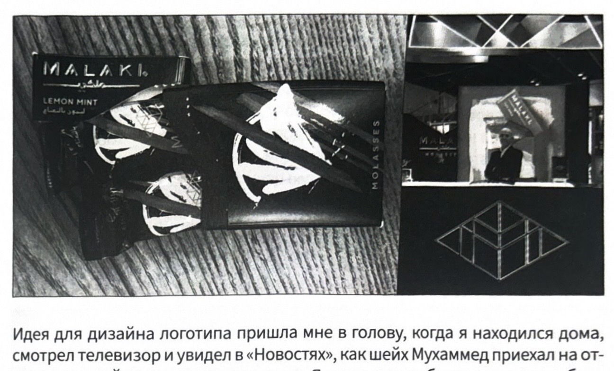

*図：Malaki「Lemon Mint」のパッケージと、展示会のブースに立つミスター・イブラギム（原書 p.119）*

> MALAKI のタバコの製造工程における特徴について教えてください。

我々はすべての工程を最初から最後まで管理しています。我々の工場には、Malaki のタバコ用パッケージを製造する機械が設置されています。250グラムと1000グラムの容量は、高級なギフトボックスの形のパッケージになっています。もしこれを外部の組織で作っていたら、それは非常に高くついたでしょうが、自社製造のおかげで製品の最終価格にはほとんど影響しません。これはまた、パッケージの在庫余剰を抱えないことにも役立ちます。必要な場合には、我々は必要なだけの量を製造するだけです。我々のパッケージは、便利で現代的であるように、絶えず近代化され、改良されています。

特に注目に値するのが、パック（袋）の内側のデザインです。多くのシーシャマスターは、パッケージからタバコを取り出すとき、外側のパッケージを捨ててしまいます。タバコが入っている袋には、通常、味を見分けるための識別的な特徴がありません。我々のすべての内袋には、タバコの味を描いた絵が付いています。最初は気づかないかもしれませんが、作業をしていく中で、これがどれほど便利か感じることでしょう。

我々が作業で使用している機械は、個別の設計図に基づいて作られています。50グラムパッケージの製造の最初の段階で、我々はタバコを専用のコンテナに入れ、出口で包装された製品を得ます。

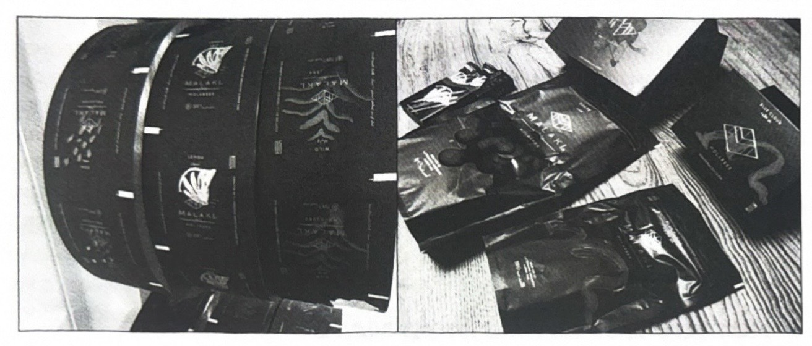

*図：Malaki のパッケージ用フィルムロールと、完成した各種パウチ製品（原書 p.120）*

> 世界に製造能力の点で類似のものはありますか？

いいえ、これはユニークな機械です。Malaki はユニークな製品であり、私は、我々がそこにどれほどの力と努力を注ぎ込んだか、購入者が評価してくれることを願っています。

> MALAKI の味の開発は誰が担当しているのですか？

まず私が新しい味を作ります。それが私を満足させたら、私は5人で構成される自分のチームに尋ねます。全員が満足するという条件のもとで、我々はそれをコーヒーショップ（ラウンジ）に送って試してもらい、フィードバックをもらい、その後で製造に投入します。

ロシアとの関わりについて言えば、公式ディストリビューターが私を何度かあなた方の国に招待してくれました。そこで私は、アラブ諸国の標準的な喫煙とは異なるシーシャ喫煙文化の発展に少々驚かされました。そのため、ウラジーミル・デネシュキン（「チャイホナ№1」のシーシャ部門の責任者であり、レストラングループ 354 Exclusive Height のシーシャ・サービスのブランドシェフ。――注）が率いるテストグループが組織されました。ロシアのために共同で、我々は Malaki タバコの特別なラインナップ（Wild、Sour Asia、Amazon、Velvet など）を作り上げ、それらはサンクトペテルブルクの展示会 Hookah Club Show で来場者に非常に好評でした。

> あなたの新しい味がコーヒーショップの客に気に入られなかったケースはありましたか？ もしあったなら、あなたはどうしましたか？

もし最終消費者に新しい味が気に入られなければ、我々はメモ（指摘）を踏まえてそれを作り直します。

> MALAKI ではバージニア種が使われています。しかし市場には、より強いタバコ葉から作られた製品が膨大な数だけ出回っています。あなたはこれらの種類の葉についてどう考えますか？ あなたはロシアの会社 Dark Side をご存じですか、またそれをどう思いますか？

私は他のタバコ葉に対して肯定的です。ええ、私は Dark Side のタバコを知っていますが、私が彼らに評価を下すべきではありません。重要なのは最終消費者が何と言うかです。タバコを製造するにあたって、あなたは自分が気に入るものを作るべきではありません――シーシャを吸う人々に気に入られるような製品を作る必要があるのです。

> 黒タバコの製造は計画されていますか？ いつですか？

はい、計画されています。私はロシア市場を驚かせたいと思っています。現在、タバコの開発が進行中で、時期は未定です。

> 何カ国で Malaki を買うことができますか？

現在は――キプロス、バーレーン、アラブ首長国連邦、レバノン、ロシアおよびCIS諸国で、まもなくアメリカ、ブラジル、パラグアイ、サウジアラビアでも買えるようになります。また我々はパキスタンとアフガニスタンでの販売許可を待っています。

> あなたの考えでは、どこで最も多くシーシャが吸われていますか？

非常に大きな市場は、イラン、イラク、サウジアラビア、アラブ首長国連邦、ロシアおよびCIS諸国、アメリカです。

> 製品の安定した品質をどのように保っているのですか？

ほとんどの会社は手作業で混ぜています。タバコの製造がコンピューターで行われると、品質は今日も、そして10年後も安定したものになります。

> Malaki の好きな味を3つ挙げてください。

選ぶのは私には難しいです。なぜなら私は Malaki のすべての味が好きで、私はそれに生きているからです。消費者が最良のものを得られるように、毎日大量のテストを行っているのです。

> なぜタバコメーカーには酸っぱい味がこれほど少ないのですか？

アラブ人は甘い味が好きなので、皆その方向で味を作ろうとしますが、私が知るところでは、ロシアでは酸っぱい味が非常に好まれるので、私はその方向で取り組んでいます。例えば Sour Asia です。

> MALAKI のタバコには赤い着色料が加えられています。これは何のために行われているのですか？

色によってタバコ葉の品質を隠すことができますが、私には隠すものは何もありません。私は良い原料を使っています。私自身、タバコに着色するのは好きではありませんが、私が鮮やかな黄色の着色料なしのタバコをアラブ市場に出そうとしたとき、相談したマーケティングエージェンシーに、それは単に買ってもらえないと言われました。私は、ロシアではこれにそれほど批判的ではないと知っているので、我々はいくつかの味を色なしで作ってみて、ロシア市場がそれにどう反応するか見てみるつもりです。そしてもしすべてが順調なら、ロシア向けには着色料を使わないことにします。近いうちに、1000グラムのパッケージには、シーシャマスターが我々の製品を扱いやすいように、専用の手袋を入れる予定です。

> MALAKI のタバコのコーポレートアイデンティティ（フィルメンナイ・スティーリ）にはいくらかかったのですか？

非常に高額です。我々の会社の資本のかなりの部分がブランディングに費やされました。我々のもとでは大きなチームが働いています。ボストン出身の画家が各味のデザインを筆で描き、それをニューヨーク出身の別のデザイナーがデジタル化します。アメリカ出身のコピーライターが各味についてのストーリーを書き、Malaki のタバコに関するすべての動画はイタリアのチームが手がけ、サイトはロンドンの専門家が担当しています。

> あなたはどのようにして自分のチームに人を選んでいるのですか？

全員がタバコに関する専門的な教育を受けており、製造と工場全体がどのように機能すべきかについての知識を持っています。主要な役割は、言うまでもなく家族の一員に与えられています。なぜなら、それによって秘密を守ることができるからです。それがどれほど重要か、あなたにはお分かりでしょう。

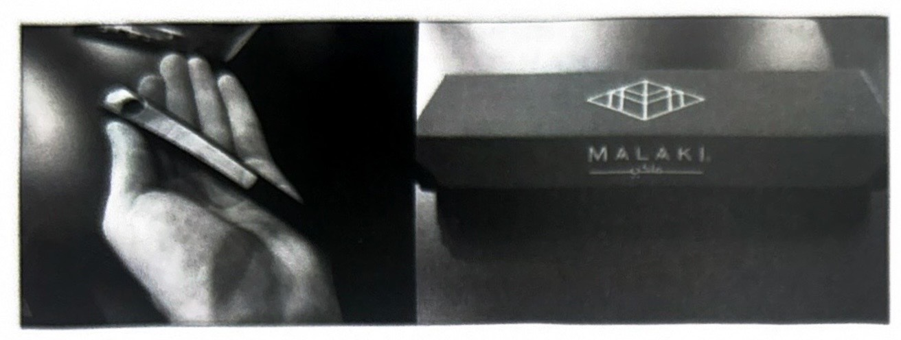

*図：道具を手にする職人の手と、Malaki のロゴ入り高級ギフトボックス（原書 p.124）*

> MALAKI 社は他の製品を出しているのですか？

はい。現在我々は、シーシャ用タバコとメドワーフ（медваха）を製造しています。まもなくドハ（доха）も登場します。計画としては、ベイピング用および電子タバコ用のリキッドの製造、ならびにクラシックなシガレット（紙巻きタバコ）の製造があります。

> イブラギム、ロシアの読者に何か一言いただけますか？

私は消費者に、あらゆるシーシャラウンジで使える最良の製品を提供することを約束します。

---

## 第3章

### 現代のシーシャ ＞ 進化 ＞

### シーシャについて。ドミトリー・フングレーエフ、イリヤ・ロマノフ

これからお伝えする内容は、ドミトリー・フングレーエフとイリヤ・ロマノフの編集のもと、かつての古いフォーラム「フーカプロ（ХукаПро）」に初めて掲載されたものです。彼らはこの非常に貴重な資料を、当チャンネルでの公開のために快く共有してくれました。

ある仮説は、インドのチラム（чилам）をシーシャと結びつけ、チラムが下部（ココナッツや、その他の水を入れる容器）とは別個に使われていた可能性があると考えています。これによって、シーシャの一部、あるいはシーシャ全体を指す言葉が、インドの北および北西の地域へと移っていった経緯が説明できるかもしれません。というのも、よく知られているとおり、ムガル帝国（16〜19世紀）は、現在のインド、パキスタン、南アフガニスタンの領域を占めていたからです。シーシャの祖先がアフガニスタン、さらにはブハラ・ハン国およびヒヴァ・ハン国へと広まっていったと推測できます。ウズベキスタンとタジキスタンでは、シーシャはチリム（чилим）という名で呼ばれ、その主要部分はひょうたんから作られていました。ロシア連邦および旧ソ連の一部の国々では、この言葉でタバコ用のボウルを指していました。

シーシャがインドから広がった主な拡大は、西の方向、すなわちペルシアへ、そしてさらに先へと進みました。サファヴィー朝（1500〜1736年）の時代にシーシャがどのような姿をしていたかを想像するのは難しいですが、同王朝の二代目シャーであるタフマースブ1世（1524〜1576年）の治世には、シーシャはすでにペルシアで知られていたと考えられています。一部の資料によれば、当初ペルシアのシーシャのシャフトは一塊の木材から作られ、容器にはココナッツの殻やひょうたんが用いられていたといいます。

世界では、シーシャを指す別の名称のほうがはるかに広く普及していますが、その多くもやはり同じインドに由来するものです。たとえば、トルコや、その南側に隣接する国々（キプロス、シリア、レバノン、イラク、ヨルダン、イスラエル、パレスチナ）、西側（ギリシャ、アルバニア）、東側（アルメニア）では、シーシャはアラビア語の「ナルギラ（nargila）」に由来する名前で呼ばれています。イスラエルでは、シーシャはヘブライ語で同じ語「ナルギレ（nargyleh）」と呼ばれます。

トルコでは「ナルギレ（nargile）」。ギリシャとキプロスでは「ナルギレス（nargilés）」。アルメニアでは「ナルギレ（nargile）」。アルバニアでは「ナルギレ（nargjile）」。この言葉はペルシア語の「ナルギレ（narghile、ココナッツ）」に由来し、それはサンスクリット語の「ナリケラ（narikela）」（これもまたココナッツを意味します）から借用されたものです。これはおそらく、容器がココナッツで作られていた初期のシーシャを指し示しているのでしょう。今日では、こうしたシーシャはインド、ネパール、イエメン、エジプトで見ることができます。それらの工業的な発展もまた、中東諸国やエジプトに広まっています。

イエメンの携帯型「ルシュバ（rushba）」は、上述したものと同一の装置であり、安定させるために適当な容器に差し込まれて使われ、ココナッツの殻、彫刻が施された木製のシャフト、葦またはそれに類するチューブから成っています。エジプトのシーシャの一種もまた、ココナッツに由来します。それが「ゴザ（goza）」です。

ゴザの歴史はエジプトで知られていますが、レバノン、イスラエル、そしておそらく中東の他の国々でも見ることができます。ペルシア湾岸諸国やアラビア半島では、形を変えて別の名前で呼ばれています。通常この装置は「ゴザ（гоза）」と呼ばれますが、実際には「ジュザ（жуза）」であり、アラビア語で木の実を意味します。これは簡単に説明できます。最初期のシーシャはココナッツの実と竹、あるいは葦から作られていたのです。

時とともに、シーシャはステータスの象徴という性格を帯びるようになり、それは必然的にその外観や価格に反映されました。精巧なインド、ペルシア、アラビアのシーシャは、決して誰もが手に入れられるものではありませんでしたが、もちろん、同じココナッツと竹から作られた手頃なシーシャがなくなることはありませんでした。下層カーストのインド人たちは、ココナッツの実と棒から、量産的に簡素な「ナリケラ（narikela、ココナッツ）」を作っていました。この技術は、シーシャが芸術品となるはるか以前から広く普及しており、ペルシアでも、またアラビアや北アフリカでも、こうした最も単純な装置が知られるようになりました。

エジプトのゴザは、マラバル（南インド）、イエメン、サウジアラビアのフーカ／マダア／ブリの簡略化された複製となりました。ココナッツの実から作られるジュザは、今でもインドや中東のどこかで作られています。

KhalilMamoon や MagdyZidan のような一部のエジプトの製造業者は、流行を踏まえて、このシーシャを全体的にステンレス鋼から製造しています。これは、エジプト人たちの言葉によれば、その国における装置に対する民衆の認識とは根本的に相いれないものです。

中東およびエジプトの最も単純なジュザの子孫たちは、いくらか短くなりつつも、木製のシャフトは保っていました。

ジュザに関する情報を見つけるのは極めて難しいのですが、それはこの名称がエジプトの文化において、エジプト各地の数多くの非合法な喫煙所でのハシシ喫煙と密接に結びついているためです。これらの喫煙所を当局が最終的に一掃できたのは、ようやく70年代の終わりになってからのことでした。

もう一つの理由は、先に述べたジュザに対する「民衆的な」見方にあります。現在のエジプトでは、この言葉のもとで「浮浪者のシーシャ」が連想されます。これは身の回りの材料から作られた自作の装置です。たいていは缶や瓶で、その蓋に二つの穴が開けられます。一つはボウル用、もう一つは吸口（マウスピース）用です。その際、吸口としては中身を抜いた竹や葦の茎、あるいはその他の適当なチューブが使われます。この「伝統的な」ジュザの概念と、現代の工場製のジュザのバリエーションとは、もちろん何の共通点もありませんが、まともなエジプト人はジュザ型シーシャを避けて通ります。

一部のメーカーが製造しているゴザは、伝統的なものとはかけ離れています。たいていはサイズが小さく、全体が金属で作られているか、木製のシャフトを持っています。また、香り付けされていないミックス用の金属製ボウルや、中空の長いチューブの形をした金属製の吸口を備えていることもあります。底が平らになっていないことが多く、そのために喫煙のセッションの間じゅう、手で持っている必要があります。

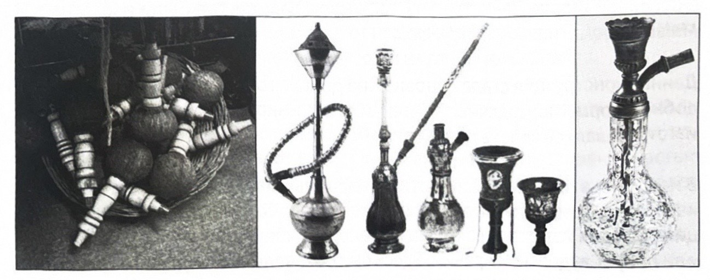

*図：木製シャフトと吸口を備えた、ココナッツ殻や金属製の小型シーシャ（ゴザ／ジュザ）各種（原書 p.131）*

このような構造と外観のシーシャは、さらに西方、ペルシア湾岸や北アフリカの方向へと進む中でも保たれました。ペルシア湾岸（クウェート、バーレーン、カタール、アラブ首長国連邦）のシーシャは、「ゲド／カドゥ（gedo/qadu）」と呼ばれ、やはり同じ構造を受け継いでいますが、その容器は粘土で作られています。

ある時点で、ペルシアのシーシャは家庭用品から転用された容器を備えるようになりました。そのことは、そのインド名「フッカ（hukka）」（ヒンドゥスターニー語：デーヴァナーガリー文字、ナスタアリーク文字（huqqa）、グジャラート語（hukko））が示しています。推測では、この言葉は、さまざまな装身具を保管するためのペルシアの壺に由来するとされています。

イギリス人がシーシャと出会ったのは、インドを植民地化した時代でした。そのため、英語圏全体や西ヨーロッパの一部では、言語的特徴を踏まえて変形した「フーカ（hookah）」という言葉で呼ばれています。

インドでは、シーシャは従来の構造を保ちつつ、さらなる発展を遂げ、真の贅沢品となり、インドの職人たちの技巧の手本となっていきました。とりわけ際立っているのが、コイランディ（Koyilandy）の街のインド製フッカです。16世紀の初め、イエメンの商人たちがインドの南西海岸、ケララ州マラバル地方に位置するコイランディの街に定住しました。彼らの関与のもと、地元の職人たちによって、装飾の文様に心を奪われるようなモチーフをあしらった、入り組んだ装飾のシーシャが作り出されました。容器には依然としてココナッツの殻が用いられ、彫金と象嵌（インクルステーション）で縁取られ、そこに彫刻を施したシャフトと吸口、またはホースが差し込まれました。これらのシーシャは北インド、パキスタン、ペルシア湾岸で非常に人気を博し、「マラバルフーカ（MalabarHookah）」または「コイランディフーカ（KoyilandyHook）」として知られました。

この構造は、長年にわたってこの地域全体の基本形となりました。同様の形をした、豊かに象嵌された容器を持つペルシアのシーシャは、19世紀に至るまで製造されていました。

今日では、コイランディの街では、これらの伝説的なシーシャは、残念ながらもはや製造されていません。しかし、その形と構造を完全に保った同一のシーシャが、現在ではイエメン（そこではより多く「マダア（mada'ah）」または「ブリ（buri）」という名で呼ばれます）やサウジアラビアで作られています。ここでは、それらは受け皿（ブリュードツェ）と、極めて長く太いホースを備えるようになりました。

同様の種類のシーシャは、「ブリ（boury / buri、ホルン）」とも呼ばれ、エジプトでも見られます。一般に、この言葉のもとでは、入り組んだ脚や、自らの軸を中心に回転できるようにする台座に乗ったシーシャが連想されます。ブリは全体が金属製であるか、ガラスの球状フラスコからシャフトの主要部分と下部の台座がねじって取り外せるようになっています。

インド、パキスタン、モルディブ諸島（ここでは「グドゥグダー（gudugudaa）」として知られ、おそらくヒンディー語でシーシャを意味する語の一つである「グラグリ（guraguri）」に由来します）の現代のシーシャは、ディベヒ語での変形を踏まえると、マラバルフーカとはまったく似ておらず、むしろ現代のトルコ、中東、北アフリカのシーシャと共通点が多くなっています（もっとも、外見上はそれらとも大きく異なり、非常に特徴的で、よく見分けのつく姿をしています）。それらの容器は粘土または金属から作られています。

ペルシアを経て北および西の方向へと進む中で、シーシャはタバコと出会いました。ほぼ同じ頃、シーシャは、現代の、私たちにとって見慣れたシーシャに結実する特徴を帯び始めました。そこでは主要な部分は容器ではなくシャフトであり、その基部がボウル、水を入れる容器、そして吸口を一つにまとめて接続します。これらの装置の原型は、すでにガラス製のフラスコを備えたものとして、1622年にヨハン・ネアンデル（Johann Neander）が著書『タバコロギア（Tabacologia）』の中で紹介しています。

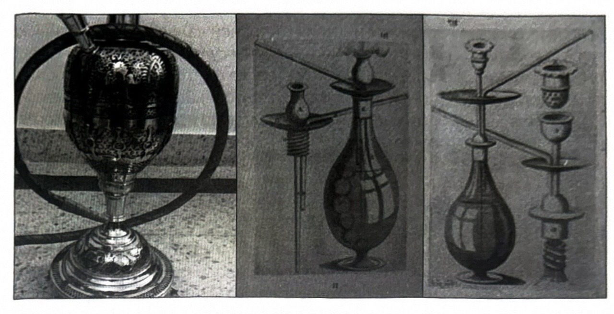

*図：装飾を施した金属製の球形容器と、ガラス製フラスコを備えた初期シーシャの図版（原書 p.133）*

オスマン帝国がペルシアと隣接していたおかげで、シーシャは帝国やスルタン国の上流階級の間で絶大な人気を得ました。当時、オスマン帝国は東のペルシアとの国境から西のモロッコまで、南のエチオピアから北の中央ヨーロッパまでの領域を占めていました。シーシャが帝国全土や近隣諸国へと広まっていったことは容易に想像できます。オスマンの職人たちはシーシャを芸術品へと変え、シャフトを優美な鍛造で豊かに象嵌し、フラスコやホースを宝石やモザイクで飾り立てました。そして18世紀の中頃から終わりにかけて、シーシャはトルコのコーヒーハウスに欠かせない一部となりました。

現代のトルコのシーシャは、古来の伝統を守って製造されています。それらに独自性を与えているのは、独特な構造のホース（マルプチ、марпуч）と、シャフトの製造に青銅や銅を用いる点です。同時に、現代のトルコのシーシャはバルブ（弁）を備えていることを誇りにできます。シャフトへのボウルの取り付け方は、内側式のものも外側式のものもあります。

トルコのシーシャの主な特徴の一つがマルプチです。これは特別なホースで、大きなサイズと、非常に大きく長い吸口を特徴としています。スルタンの時代には、こうしたホースは桜の木の一枚材や、その他の貴重な木材から作られていました。その際、木の成長過程で金属製のリングや締め具をはめ込み、幹がまっすぐになるようにしました。オリジナルのマルプチの製造には、約10年もの歳月が費やされることもありました（もちろん、まず第一に木の成長のためです）。シーシャは、スルタンのハーレムの女性たちも、一般の市民たちも吸っていました。

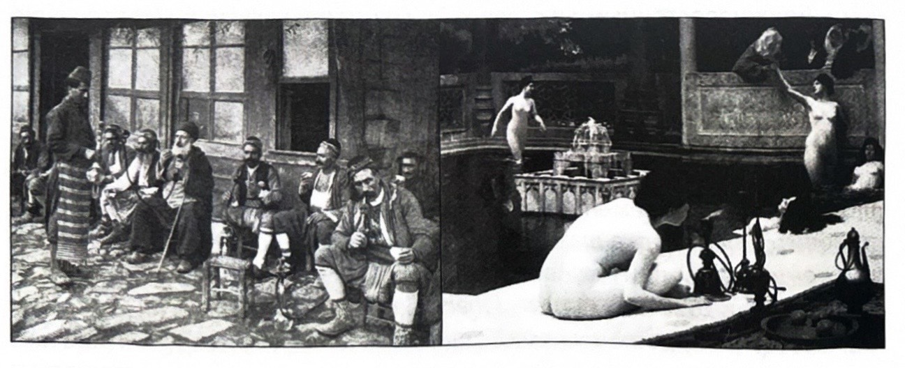

*図：シーシャを吸う人々を描いたオリエンタリズム絵画（コーヒーハウスとハーレムの情景）（原書 p.134）*

アルバニア、ボスニア・ヘルツェゴビナでは、シーシャを「ルラ（лула）」または「ルラヴァ（лулава）」と呼びます。これはロマ語や一部の南スラヴ語でパイプを意味し、「シシェ（шише）」はシーシャの容器を指します。オスマンの支配（あるいは単なる隣接）のおかげで、これらの名称はトルコ語によく似ています。トルコでは「ルレ（lule）」がタバコ用のボウルを指し、「シセ（sise）」が瓶を意味し、これもまたフラスコを指します。これは「シセ（sise）」という言葉がペルシア語の「シセイェ（siséye、ガラス）」に由来することで容易に説明できます。イスタンブールのガラス職人たちはその技で名を馳せていました。極めて精巧なガラス製のフラスコが、シーシャの容器として主流になっていきます。柔軟なホースがパイプ型の吸口を完全に駆逐し、シーシャのシャフトの基部は、今やシャフト自体に加えてホース用のポートをも含むようになりました。

中東、ペルシア湾岸、北アフリカのオスマンのスルタン国では、トルコ語の「シセ（sise）」がアラビア語の「シサ（sisa、sheesha あるいは shisha と読む）」へと変形し、今では最も多くの場合、シーシャそのものを意味するようになっています。エジプトでは、この言葉で、私たちに見慣れた、トルコのスタイルを受け継いだ、ガラス製のフラスコ（支えの役割も果たします）、受け皿、ホースを備えたシーシャが呼ばれます。シリア、レバノン、ヨルダン、チュニジア、アルジェリア、モロッコのシーシャも、このスタイルで作られています。

そしてイギリス、アメリカ、それらに隣接する国々では、「シーシャ（shisha）」という言葉で、シーシャ用の香り付けされたミックスを指します。また、フーカ（hookah）のほかに、ときには英語の語句「ウォーターパイプ（waterpipe、水のパイプ）」も使われますが、この用語はむしろ水道設備の部品に対してのほうがよく当てはまります。やや稀には、もう一つの英語名「ハブルバブル（hubble-bubble、hubble はこぶ、bubble は泡）」も用いられます。「こぶ」という言葉はペルシア語にもほぼ同じ響きで「ハブル（habl）」として見られます。ウルドゥー語では「こぶ」はナスタアリーク文字で記されます。

現在のイランでは、シーシャを「ガリヤン（galyan）」と呼びます。この言葉はアラビア語の「グルヤーン（ghlyan、沸騰する。語根は「沸く」を意味する agla）」に由来すると考えられています。ロシア語では、この言葉が歪んだ形「カリヤーン（кальян）」が使われています。ちなみに、このように呼ぶのは旧ソ連諸国の領域だけです。イランのシーシャでは、しばしば柔軟なホースの代わりに、長い交換式の吸口が付いています。各喫煙者がそれぞれ個人専用のものを持つと考えられています。

シーシャがインドから移っていったもう一つの方向についても、まだ触れていませんでした。それは東への方向です。バングラデシュとネパールを経て、シーシャはほとんど原始的な原初の姿のまま、東アジアおよび東南アジアへと入り込みました。

東南アジアの国々（タイ、ラオス、ベトナム）では、シーシャは二つの要素にまで簡略化され、二本の竹の茎から成る、単調で原始的な装置の一群を生み出しました。それらは現代世界では一般に「ボン（bong、タイ語の bng に由来）」という総称で知られていますが、結局タバコには適応しませんでした。

チベットや中国では、シーシャという装置に対して、より責任を持って実用的に取り組みました。真鍮や銅で作られた、優美な携帯用のタバコ用パイプです。中国ではそれらを七宝焼き（クロワゾネ、cloisonné）で飾り、本物の芸術品へと変えました。こうしたパイプはそれぞれ、中国の職人の最良の伝統にのっとって、容器、それに溶接されたシャフトの基部（この部分が取り外せることもありました）、交換式のタバコ用ボウル（セットに二つ付いていることもありました）、容器に取り付けられるタバコ袋、そしてパイプを使用に向けて準備し、手入れするための道具一式から成る、完全なセットとなっていました。外見上の大きな違いにもかかわらず、シーシャの動作原理は保たれていました。今日では、こうしたミニシーシャは、骨董店やコレクターのもとでしか見つけることができません。そして中国は、自動化された工場で製造される、トルコスタイルの現代のシーシャの、世界最大の生産国かつ輸出国となっています。

今日では、多くの国で、エジプト、シリア、中国の製造業者による積極的な輸出政策によって、自国のシーシャが押しのけられています。たとえば、レバノンやトルコでは、中国製のシーシャで喫煙している人々を簡単に見かけることができますし、中東、アラビア半島、ペルシア湾岸、北アフリカ（リビア、チャド、スーダンを含む）の大半の国々では、シリア製やエジプト製のシーシャで喫煙している人々を見かけます。

### マックス・ポポフが語る、シーシャ「ドゥシャ（Душа）」の創造について

（インタビューからの抜粋）

マックス・ポポフは、ロシアで最も美しいシーシャの一つ「ドゥシャ（Душа、魂）」を作り上げました。それも不思議なことではありません。マックスは15年間デザインに携わってきました。ちなみに、この本の表紙も、まさに彼が手がけたものです。

＞ シーシャ「ドゥシャ」を作るというアイデアはどうやって生まれたのか、教えてください。なぜこれに取り組もうと決めたのですか？

さて、ここはどうやら「魂（ドゥシャ）」抜きには済まなそうですね。魂を曲げずに、正直にお話ししましょう。私はただ稼ぐ手段を探していただけなのですが、これに引き込まれ、ひっくり返されてしまいました。そして年を追うごとに、この仕事に対する私の中の考え方が変わっていきます。最初は市場に参入すること、次に質の高い製品を作ること、その次は使いやすく実戦的な製品を作ること、そして今は、そこに物語を込めようと決めました。そして、おそらく、自分が持っているものを土台にして、自分のための新しい仕事を考え出したのです。おそらく今、私はブランドの教育（醸成）に取り組んでいるのでしょう。

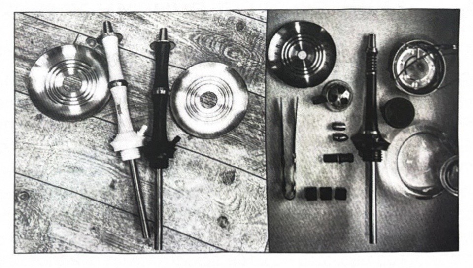

*図：シーシャ「ドゥシャ」のシャフトとパーツ一式（皿・ボウル・吸口など）を分解して並べた写真（原書 p.137）*

＞ 名前はどうやって思いついたのですか？

そして、なぜまさにその名前に決めたのですか？

最初は別の名前、別のイメージとデザインのシーシャでした。それは別の発展の方向性を持ち、まったく別の物語を持つはずでした。あるいは、まったく物語を持たなかったかもしれません。クラスノダールの友人が私を説き伏せてくれたのです。彼の名前の提案が、皆さんが目にしているものを生み出したのですが、提案されたのは少し別の形でした。「The doosha」が、私のもとにメッセージで届きました。そしてこの「ゼ・デューシャ（зе дюша）」が、私の中で共鳴を呼んだのです！ というのも、魂とは、単純でありながら同時に複雑なもの、誰もが持っているもの、そして市場には存在しなかったものだからです。シーシャの名前という概念を打ち破るものです。ただ、私は自分なりにロシア語表記を加えました。そのことで私たちは少し言い争いましたが、彼が折れてくれました。結果的に、見込み違いではありませんでした。それは今でも珍しい名前ですが、ただ今では、これを土台にして、私はイメージや感情を伴った物語を作り出しています。それによって、私の考えでは、製品の名前をさらに深く引き出しているのです。

＞ シーシャの発売前に、どんな困難に直面しましたか？

ありとあらゆる困難に。そして今でも直面しています。なぜなら、私は下請け業者の力を借りて製品を生産しているのですが、ちなみに彼らはロシア的なメンタリティの持ち主なのです。でも、おそらくそこにこそ本質があるのでしょう、ロシアの魂というやつです。投資の困難、生産の可能性に制約されたデザインを作る困難——その生産はその生産で予算に制約され、さらに製品の小売価格にも制約されています。図面を作る困難、何しろ私はすべて自分でやっているのですから。

今この瞬間の困難は、プロセスを委任することです。なぜなら、売上は伸び、需要は高まっているのに、電話や問い合わせには、以前と変わらず自分で応対しているからです。というのも、かつてあらゆる情報源に自分の個人の電話番号を載せてしまったからです。正直で、心のこもったゲームをするためにと。今やそれが、心理状態の困難へと発展してしまいました。夜中の3時に心を割った会話の電話がかかってくるのは、もちろん最高ですが、時にはつらいものです。

＞ 売上には満足していますか？

ええ、もちろんです。でも、もっと伸ばすこともできたでしょう。私は人為的な品薄状態を作り出しています。少なくとも、私はそう呼ぶことに慣れています。在庫がないことが非常に多く、私は製品を購入できる店の連絡先を流しています。たとえば、今この瞬間、私はすべてのモデルを生産から外して、新しいモデルラインを始めようとしているのですが、注文は一時間ごとに舞い込んできています。だって、私は何年も同じことを作り続けることなんてできないのです。それはつまらないですから。

＞ あなたの考えでは、ブランドの「フィーチャー（ウリ）」は何ですか？

いや、名前と製品への個人的な思い入れを除けば、つい最近まで、これといった特徴的なウリなどなかったのです。それはただの実戦的な働き者で、多くの人のニーズを満たしてくれるものでした。でも今は、物語を作り出し、その物語に合わせて製品を適応させることに興味があります。今では少なくとも、語り合える話題があります。とはいえ、私はシーシャの外観という点で何か傑作を作り出そうとしているわけではありません。それは相変わらず、見慣れた普通の、クラシックな構造のシーシャですが、物語の中で使われるイメージに合わせて調整された、細かな特徴を持っているのです。大ざっぱに言えば、シーシャとは、情報を運ぶためのスポンジなのです。

＞ 「ドゥシャ・フレンキ（Душа Френки）」を作るというアイデアはどうやって生まれたのですか、そしてなぜまさに「ドゥシャ・フレンキ」だったのですか？

かつて、私の製品にはハイプ（話題性）がない、ウリがない、特徴がないと言われたことがありました。まさにこれは、先ほど話したことです。そしてそれは、私にとってある種の意地でした。みんなが口々に言っていたのです。マグネット、ブロー（吹き抜け）、ママイ（mamay）……と。まさにそのとき、私にこの自己中心的で図々しいアイデアが浮かんだのです。ちなみに、それは言ってみれば、ここ直近3年間を振り返った総括のようなものでもあり、当時トップだった製品を取り上げ、おそらくそれらに敬意を表すものでもありました。そして「フレンキ（Френки）」という名前は、瞬時にプロジェクトの上に浮かびました。なぜなら、それは本質的に、さまざまな部分から縫い合わされた生命体だからです。しかも、このキャラクターの外見は、大胆かつ冷静沈着な所業——他人のものを盗っただけでなく、それをみんなに語ってしまうという——の物語に完璧に合っていました。

これら三つの特徴に加えて、小さなシーシャというトレンドも利用しました。そのため、フランケンシュタインはすぐに「フレンキ」になりました。とはいえ、上記のすべてをそのままの形で使い、堂々とパクって顔色一つ変えないというのは、あまり正しいことではありません。だからこそ、私はそれを自分独自のデザインにくるみ込みました。どうやら面白いものができ、望んでいたものになったようです。それに、反響は私の予想を超えるものでした。

＞ 新しいプロジェクト「ドゥシャ・ヴァリキリー（Душа Валькирии、魂のワルキューレ）」——私たちは何を期待すればいいのでしょう？ そして、その物語はどんなものですか？

おお、これは長くなりますよ。私が何を気に入っているか分かりますか？ それは、私が一つのゲームを作り出したということです。ティザーの段階で、すでに自分の消費者に製品への興味を植え付けようという期待を込めて。そのティザーでは、一見すると何も語られていないのですが、彼らはすべてを理解し、13秒の中に仕込まれたすべてのイースターエッグを解き明かしてしまったのです。だって、よく見てください、そこにはシーシャについては一切何も語られていないし、シーシャの名前も書かれていないし、それがブランド「ドゥシャ」の新しい限定シーシャだということすら書かれていないのですから。

ところが人々は、名前を当てただけでなく、この動画にまつわる一つひとつの要素を解き明かし始めたのです。秒数、鳥の鳴き声、画面中央のルーン文字、物語の性格を示唆する曲をShazamで特定したり、などなど。もちろん、間違った説もあります。特に戦争に関連したものですが、それで今や私の目標は、6月に予約注文を出さないこと……。でも、話したいのはそのことではありません。私はただ、このゲームが支持され、人々がそれを読み解き始めたことが気に入っているのです。そしてそれが私のモチベーションになっています。そう、まさにそれが今後の仕事へのモチベーションになるのであって、すべての夏季テラスがシーシャ「ドゥシャ」で埋め尽くされることではないのです。

さて、話が逸れましたね。次のシーシャのイメージとして、私はワルキューレを選びました。私の考えでは、このキャラクターは魂と直接結びついています。彼女たちは運命を司り、戦死した戦士たちの魂をヴァルハラへと連れていきました。そして、ゲーム『ゴッド・オブ・ウォー4（God of War 4）』におけるワルキューレの最後の登場でも、彼女たちを苦しみから解放するためには（そこでは彼女たちは呪いを償いながら、人間の姿に封じ込められていました）、殺して魂を解放する必要があるのですが、彼女たちは熟練の戦士なので、殺すことは不可能なのです。面白いでしょう？

とりわけ、会社のスローガン「すべては過ぎ去る、しかし私は残る（Все пройдет, а я останусь）」を思い出すとなおさらです。さて、こうした物語をみんなに語り、神話に踏み込んでいくこと、などなどは、私はあまり面白くないと考えました。しかも、その場合は、私は知識人たちの批判にさらされることになるでしょうし。そこで私は、これを土台にして自分の物語、言ってみれば許容しうる続編を作り出そうと決めたのです。

想像してみてください。彼女はもうずっと長い間この地上にいて、いまだに誰も彼女を殺すことができず、その苦しみの中で彼女は自分の快楽を見いだしたのです。彼女は相変わらず神々しいほど美しく、私たちの時代に、私たちの間にいて、快楽と苦痛を同時に与えることから快感を得ています。いわば、ファム・ファタール（運命の女）です。

私が思うに、これは、かっこいい物語、面白いシーシャの外観、そして喫煙という行為の本質すべての描写という点で、完璧に当てはまります（私たちはそれが好きで、それを欲し、それが身体に何ら良いものをもたらさないと分かってさえいるのに、それでも続けて快感を得ている、という）。

彼女は、残酷さ、現代性、洗練さの一片を効かせて、軽いサイバーパンクのスタイルで作られています。私が思うに、これはどんなインテリアにも完璧に溶け込み、提供された後には、すさまじい興味と感情を引き起こすでしょう。なお、イメージの中に書き込まれているとおりに。とりわけ、プレゼンテーション動画の中の声に気づく人たちは快感を得るでしょうし、もう一つのイメージ——それもまた、このモデルにも、ブランド全体にも完璧に合っている——を無理やりにでも結びつけるでしょう。

＞ あなた自身は、この製品から何を期待しているのですか？

何よりもまず、私が期待していたもの、それを私はすでに得ています。イメージの創造と、それにまつわるすべてのことからの喜びです。私にとっては、コインのこちら側のほうがより興味深いのです。また、これは精神的なレベルでのブランドの発展という点でも、私にとって興味深いのです。人々は私のことを、シーシャの何らかのスペックによって覚えているのではなく、自分が物語の一部であると感じ、それが自分の身に起こったことに快感を得るようになるのです。

おそらく、私は業界に、製品におけるウリの新しい枝を切り開いたのかもしれません。それもまた、かっこいいことです。まあ、それに何より、これはコミュニケーションであり、私と同じくらいこれに病みつきになっている、自分のオーディエンスを獲得することなのです。

＞ 発売開始はいつで、価格はどれくらいですか？

すべて自分でやっています。計画しています、いや、そうじゃないな……5月の終わりまでにこれをやり遂げようとしています。なぜ「やり遂げようとしている」のかというと、ほぼすべてを自分でやっているからです。もちろん、親しい仲間たちが手伝ってくれる項目もいくつかあって、それには深く頭が下がる思いですが、プロジェクトの最終成果物——デザイン、図面、動画、などなど——は自分でやっています。たとえばフレンキの動画は、地元のシーシャ店で椅子から立たずに48時間かけて組み上げました。しかもそれは、動画用の素材がすでに用意できている状態でのことです。私はロボットと呼ばれました。とにかく、物語は面白いものになりますよ、チャンネルはそのままで。価格については詳しくはお話ししませんが、限定シーシャはそれなりの妥当な値段になりうる、とだけは言えます。

> ビジネスで最も大事なものは何ですか？

ビジネスで一番大事なのは「魂（ソウル）」です。それ以外は、好きなように解釈してください。けれども、その魂に耳を傾け、それを大切にし、似たものを引き寄せること、それこそが私個人にとって理想的で誠実なビジネスとパートナーシップの鍵なのです。もっとも、独自のセールスポイント（ユニークな販売提案）について語ることもできますが、それは二の次です。

> 「カルヤン・ドゥシャ（Kalyan Dusha）」への問い合わせは海外から多いのですか？

十分にあります。

おおよそロシア国内と同じくらいです。ただ、私の英語が下手なので、世界中への販売はヨーロッパのディストリビューターに委ねることになり、そのため実質的にすべての問い合わせは彼のところへ行きます。取引量には十分すぎるほど満足しています。

> シーシャ業界に足りないものは何ですか？ そしてそれは誰のせいですか？

業界に足りないのは経験です。そして、ダヴィドゥィチ（Давидыч）なら言うであろうように、悪いのは私たち全員です！ もっと多くの情報、発展、そして面白いプロジェクトが必要です。それに、市場調査を忘れてはいけません。これに取り組んでいる人は多くありません。今のところ、私たちのやっていることはすべて、当てずっぽうのように見えます。すべてはやって来ます。とくに「Прокачаем（プロカチャエム＝レベルアップさせよう）」に参加する人々がそれを実感するでしょう。きっとうまくいきます、約束します！

> 世界一のシーシャを3つ挙げてください。なぜですか？

好みは人それぞれ、サインペンの色だってみんな違います。ニーズも、ましてや評価の基準となるポイントなど、まさに各人の純粋に個人的な意見です。私にできるのは、今日この日に自分が感じていることに基づいた結論を出すことだけです。その姿勢と志に基づいて。

第3位は Desvall。なぜなら、そうしたかったから、できるから、枠は私のためのものではないから。第2位は Mattpear。デン（Ден）は幕の向こうをのぞき込み、面白いものを適応させました。第1位は Khalil Mamoon。今日に至るまで私たちを動かし続けているから。

## シーシャ「REGAL（リーガル）」。メーカーへのインタビュー

この本にロシアのシーシャ業界の代表者だけでなく、海外の人も載っていることを、私はとても嬉しく思います。次のインタビューは、「REGAL HOOKAH（リーガル・フッカー）」社（カリフォルニア）のジョージ（George）とのものです。

> GEORGE、自己紹介をしてください。シーシャの前は何をしていましたか？

10代の頃、夏には多くの分野で働きました。配達の助手をしたり、ファーマーズマーケットで花を売ったり、物を買って売ったり、さらにはボブ・カフナ（Боб Кахуна）とともにサーフィンのレッスンを教えたりもしました。でも一番記憶に残っているのは、高校の卒業学年と、修業期間が2年に短縮された短大の1年目のときに Starbucks で働いたことだと言えます。なぜなら、そこで人生で最高の友人たちと出会ったからです。

> あなたの学歴は？

私は大学の卒業証書を持っていませんが、それを後悔してはいません。

> 初めてシーシャを試したのはいつですか？ どんな経緯でしたか？

1998年にフィリピンでシーシャを吸っている人を見ました。また、ちょうど同じ頃にエジプトへ行った姉からもその話を聞いていました。

ある日、同僚が私を「シーシャを吸おう」と誘ってくれました。私は彼のことをずっと超敬虔なクリスチャンだと思っていたのですが、その誘いはまるで母の70年代の話のように聞こえました。彼は、それはただの香り付きのタバコだと請け合ってくれましたし、私は彼を信頼できると分かっていました。

そうして私たちは彼の家に行き、彼は弟に頼んで私のためにボウルを詰めてもらいました。以前はそれが Nakhla Two Apples だと思っていたのですが、後で共通の友人たちと話したところ、実際には Nakhla Sweet Melon and Mint だったと判明しました。そのほうが筋が通ります。私はとても感動したからです。翌日にはもう、友人が通うことになっていた大学へ行き、彼が教えてくれたエジプト系の市場を探し当て、そこで自分の最初のシーシャを買いました。この昔の友人に会うたびに、彼はこう言います。「ワオ、お前は本当に、あの俺の両親の家での深夜から、何か本格的なものを作り上げたんだな」と。彼とその家族は、本当に私の人生の方向を変えてくれたのです。

> なぜシーシャビジネスをやろうと決めたのですか？

最初のシーシャを買った後、私の友人たちは、さらにその友人たちまでもが、母の車庫に一緒に吸いに来るようになりました。私はサンディエゴの中東系市場でシリア製のシーシャを4台、100ドルで買い、その後1台100ドルで売りました。需要があったのです。私はそれを見て、仕事を始めました。

> あなたのパートナーについて話してください。

シーシャ業界での私のキャリアの中で、主要なビジネスパートナーは2人いました。最初は中学・高校時代からの友人です。彼が私の車庫でだらだらと過ごし、シーシャを楽しみながら「大学のそばにシーシャラウンジをやったらいいアイデアだぞ」と言った後、私たちはパートナーになりました。私は同意しました。けれども、私のせいでラウンジのアイデアが失敗に終わった後、彼はサイトを作ることを提案しました。私たちは草創期を一緒に過ごしました。それは私にとって9年ほどかかったことで、その間に、私が商品を卸していたシーシャラウンジで働いていたジョナサン（Джонатан）と出会いました。あるとき、彼が私の倉庫に立ち寄り、木製シャフトのシリア製シーシャを買ってくれたのです。

それは彼のお気に入りになりましたが、文字どおり1年も経たないうちに問題が生じ始め、そのシーシャは数カ所で穴があいてしまいました。ジョナサンはそのシーシャに対する現代的な見方を提案してくれて、私は彼を全面的に支援すること、そして独占的なオンライン・ディストリビューターになりたいと伝えました。私たちは、私が業界から離れようとして失敗に終わった試みの中でサイトを売却するまで、一緒に働きました。私はほぼ2年間離れていて、再び業界に戻ったときにジョナサンに連絡を取ると、彼はすぐに私を Regal のビジネスに迎え入れてくれました。後に私はビジネスを完全に買い取りましたが、私とジョナサンは今でもとても良い友人です。

> あなたのシーシャがアメリカだけでなく、ほかの国々でも人気になったのはなぜだと思いますか？

Regal Hookah は、伝統的な市場におけるいくつかの重要な問題を解決しました。私が思うに、これはアメリカで量産された、CNC（ЧПУ）を用いて製造された業界初、もしくは初期の一つのシーシャでした。2009年以来、ジョナサンのデザインはほとんど変わっておらず、それがその完成度の高さを証明しています。私たちが作ったどのロットも、製造したのと同じ月のうちに完全に売り切れました。今でも需要を満たすという問題を抱えています。一番最初のロットのシーシャはジョナサンが働いていたラウンジに売られ、そこでは今でも使われています。

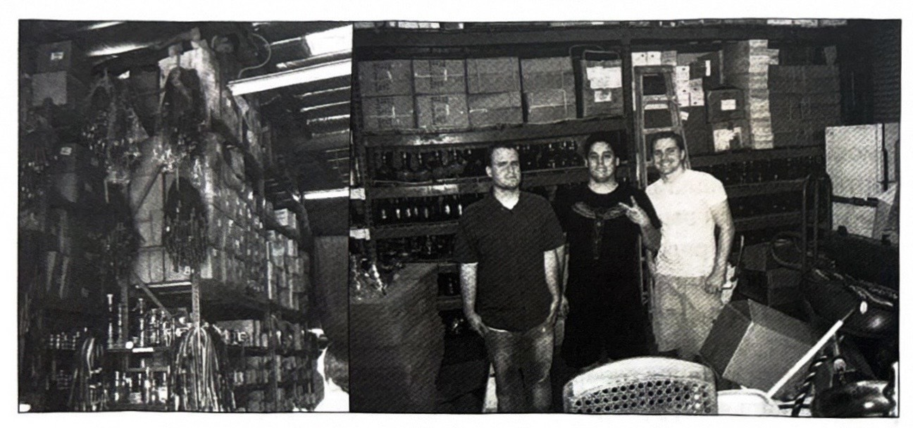

*図：シーシャが所狭しと並ぶ倉庫と、そこに立つRegalのメンバーたち（原書 p.146）*

> 現在の REGAL HOOKAH の生産はどのようなものですか？

私たちは年々ますます多くを作っており、ブラジルには尽きることのない需要があります。私はまた、オーダーメイドのシーシャを作るオプションも追加し、唯一無二の品を製作しています。私はオーダーメイドの注文を週に1件しか受けられず、それは大変なことです。なぜなら、待機リストが丸ごとあり、その全員のために時間を見つけなければならないからです。

> アメリカでシーシャを製造するうえで、どんな問題に直面しますか？

難しいのは需要を満たすことです。そしてアメリカで質の高い製品を作るには時間とお金がかかります。Regal のシーシャの大きなロットを作るために、生産に時間とお金を割くことは、常に問題でした。私たちの木材は、多くの職人たちの手を経てアメリカ中を旅します。そのため、時間の問題は解決が難しく、私は自分たちの木工職人たちに忠実です。ビジネスには常に問題がありますし、どんな製品の販売も決してスムーズには進みません。すべての要素が、欠点を最小限に抑えながら調和して結びつかなければなりません。

> あなたはロシアのシーシャビジネスの多くの関係者と交流しています。ロシアの製品についてどう思いますか？

以前は、Hookah Boss が私たちのディストリビューターだったため、もっと多くのシーシャをロシアに売っていました。今は為替レートのせいで私たちの魅力が下がり、ロシアのシーシャはより革新的で高品質になっています。私はロシアのシーシャが好きですし、敬意を払っています。私のコレクションにもいくつかあります。たとえば VZ、MattPear、Shapes、Hoob などです。今でもロシアから小さな注文を受けることはありますが、以前とは比べものになりません。

> カリフォルニアで観光客に勧めるラウンジはどこですか？

ロシア系のラウンジがカリフォルニアで最高だと言っても、嘘にはなりません。シーシャマスターたちは見事なボウルを詰めますし、内装のディテールへのこだわりや紅茶の選択も本当に素晴らしいです。サンディエゴの Art Hookah は必ず訪れるべき場所です。もしあなたがカリフォルニアを旅しているなら、そこで私と出会えるかもしれません。私はこの店でよく吸っているからです。ロサンゼルスのメルローズ地区にある Glass Hookah Lounge も最高です。それに、すぐ近くのハリウッドにあるラウンジ GQ と Mojo もそうです。本当に良い仕事をしている私たちのアルメニア系の仲間もいるので、グレンデールの Atmosphere に行く価値があります。そこではアルビ（Арби）が見事なタンジールズのボウルを詰めますし、料理も本当に美味しいです。

> シーシャ以外には何をしていますか？

私はナイフを収集し、美味しいものを食べるのが好きで、旅行やサーフィンも好きです。もっとも、あまり頻繁にはやっていませんが。良い友人たちと一緒にいて、面白い会話を交わすのが好きです。それからもちろん、チル（くつろぎ）と Netflix が私の一日のお気に入りの部分です。とくにその日がとても長かった日には。

> 最近、木製デザインのシーシャがたくさん登場したことについてどう思いますか？

すでに上で述べたとおり、木のアイデアは私たちがシリア製のシーシャから取り入れたものです。誰かが自分自身のデザインでシーシャを作っても、私は決して気分を害しません。誰かが Regal のシーシャに着想を得て、私たちのいくつかの欠点を直し、それをより良くするなら、それは素晴らしいことです。一方で、ただ外見や形を真似しようとして、私たちの名前を貶める人々は、業界最悪の存在です。彼らは私たちのコミュニティを良くするどころか、イノベーションを抑圧し、私たちの業界をより魅力のないものにします。立派な業界であることは、法規制やその他の問題に直面しているなかで、私たちの長期的な存続にとって重要です。

> アメリカでシーシャを製造するうえで、どんな問題に直面しますか？

難しいのは需要を満たすことです。そしてアメリカで質の高い製品を作るには時間とお金がかかります。Regal のシーシャの大きなロットを作るために、生産に時間とお金を割くことは、常に問題でした。私たちの木材は、多くの職人たちの手を経てアメリカ中を旅します。そのため、時間の問題は解決が難しく、私は自分たちの木工職人たちに忠実です。ビジネスには常に問題がありますし、どんな製品の販売も決してスムーズには進みません。すべての要素が、欠点を最小限に抑えながら調和して結びつかなければなりません。

> アメリカで最も強いと考えるシーシャ製品は何ですか？

現在、最も成功している製品は、より高品質で、より狭いシーシャコミュニティの中で売られているものです。大学に通う18歳の若者向けの大きな市場の時代はとっくに過ぎ去り、今やそこではベイピング（電子タバコ）向けの製品が主流になっています。Tangiers、Regal、Lotus、Aviator のホース、それに High end Ceramic Heads（ハイエンドのセラミックヘッド）が、アメリカにおける主要な現代的シーシャ製品です。

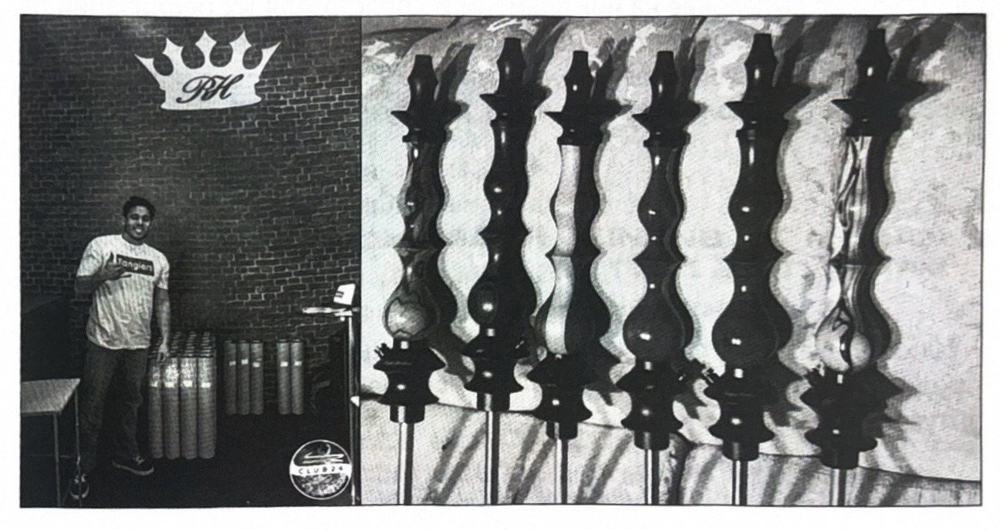

*図：RHのロゴの前に立つスタッフと、ずらりと並ぶ黒い木製シーシャ（原書 p.149）*

> 現在、生産には何人が働いていますか？

生産は数多くの手を経ており、自宅で作られた部品を受け取っています。私たちには、できる限りのことをしてくれる友人や家族がいます。

> シーシャ以外に何かを出す予定はありますか？ ボウルやタバコなどです。

私はテストして開発した多くの製品を出す予定ですが、それらに時間と資金を割いて実現することは、優先事項のリストには入っていません。私たちは創業して最初の6年間、ソーサー（受け皿）すら持っていませんでした。ですから、私たちが構想したフラスコ、ホース、ボウル、ディフューザー、トングなどを無駄に待たないほうがいいでしょう。

> 5年後の REGAL HOOKAH をどう見ていますか？

私たちはシーシャの世界の頂点に立っているだろう、と言いたいところですが、おそらく今後も小さなクラフト・ロットを作り続け、シーシャ愛好家たちを幸せにしているでしょう。

> あなたの最も重要な3つの功績は？

良き友人であり、たくさんの素晴らしい人々を自分のもとに迎え入れてきたこと。自分の家族と祖父母の面倒をみていること。18年間にわたって私たちの業界で主要な地位を占めていること。

> あなたには、自分のモットーやインスピレーションを与えてくれる言葉がありますか？

「あるものは、あるがまま」。そいつは自分自身に忠実であり続ける。

> 好きなタバコのフレーバーを3つ挙げてください。

今のところ Tangiers Peach Cobbler、Horchata、そして Mime です。ある意味で、それらは私の仕事の一部を成しています。けれども、私の理解では、好みは頻繁に変わるものです。

> 本を3冊勧めてください。

『第1感「最初の2秒」の直感力（Озарение: Сила мгновенных решений）』。あるいはマルコム・グラッドウェル（Малкольм Гладуэлл）の他のどんな本でも。ノーム・チョムスキー（Ноам Хомский）の『Understanding power』。ジャレド・ダイアモンド（Джаред Даймонд）の『銃・病原菌・鉄（Ружья, микробы и сталь）』。挙げたものはすべて、私がいかに遅れをとっていなかったかを示しています。

> ロシアでシーシャに携わっているすべての人へ、挨拶と一言をお願いします。

ロシアの数少ない友人たちについて大々的に語りたいとは思いませんので、ただシーシャコミュニティ全体に、世界最大級のシーシャ市場の一つであることに対して感謝を伝えます。また、ロシアが多くの面でシーシャ業界の水準を引き上げたことに対しても感謝したいと思います。

## KALYANBALI

（インタビューからの抜粋）

アンドレイ（АНДРЕЙ）は、2014年からバリ島でデザイナーズ・シーシャを作っています。今やこのプロジェクトは世界中で知られています。

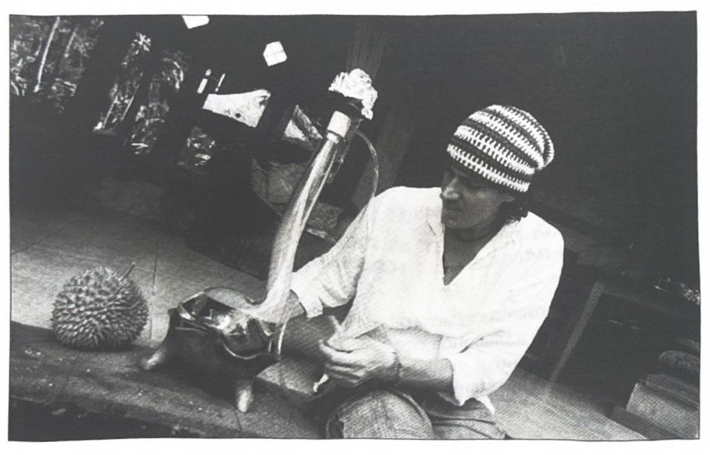

*図：ドリアンを傍らに、シーシャを吸うアンドレイ（原書 p.152）*

> どうしてシーシャを作り始めようと決めたのですか？

偶然、そして必要に迫られてです。

バリ島へ引っ越すとき、荷物にはもうシーシャを入れる場所が残っていませんでした。エジプトやトルコのようなリゾート地なのだから、島で簡単にシーシャを買えるだろうと思ったのです。ところが、そこには「クジラが泳いでいた」（＝肩透かしだった）のです！ 島で唯一の店にあったのは中国製のガラクタばかりで、その店は今日に至るまで変わっていません。即興でやるしかありませんでした。店で珍しい形の手作りの花瓶を見つけ、日用品店でシリコンのチューブとホース用の真鍮の接続具を買い、ペンナイフと枝の一片を使ってシャフトの土台を作りました。そしてバリ島に着いてからちょうど1週間後、私の誕生日に、最初の Kalyanbali のシーシャが生まれました。それは今でも私たちのところに保管されています。

ほどなくして友人たちが似たようなものを作ってほしいと頼んできて、それから他の人たちも、というふうに、私はこれにのめり込み始めました。1カ月後にはシーシャを3台、1台500ドルで売りました。私たちはもう止まらなくなりました。バリ島に着いた人の中には、ビーチや滝を巡って遊ぶ人もいますが、私たちは最初の2年間、彫刻職人やガラス吹きの工房、それに自分たちのシーシャ作りに役立ちそうなあらゆるものを探して、村々や観光ルートから遠く離れた地域を巡っていました。こうして、島中から、そして今では近隣の島々からも、さまざまなパーツを少しずつ集めて、私たちはシーシャを作っているのです。

> あなたのシーシャは、お手頃なものとは言えません。

価格はどのように設定されているのですか？

半年に一度、私たちは Kalyanbali コーポレーションの取締役会を招集します。専門アナリストたちの報告に耳を傾け、取引所の相場を確認し、戦略的に興味のある国々の経済の成長や後退を分析し、占星術師と相談し、コーヒーの澱で占い、コインが表に落ちれば値上げし、裏なら据え置きにします。

> あなたのシーシャに見いだせる主な特徴は何ですか？

外見です。

一番大事なのは、それらが「瓶に刺さった鉄の棒」には見えないことです。

> あなたたちの主な購入国はどこですか？

2014年の危機までは、主な購入者はロシアでした。売れたシーシャの10台中9台はそこへ飛んでいきました。けれども、またしてもルーブルが暴落した後、購買力はほぼゼロにまで落ち込みました。私たちはヨーロッパに切り替えました。その頃にはすでに世界中で私たちのことが知られていて、苦労せずに自分たちの買い手を見つけられました。Kalyanbali が存在してきた7年間で、私たちの作品は世界中の30カ国以上に飛び散っていきました。今のところドイツとフランスが首位で、両国で販売の70%を占めています。

> あなたには好きなシーシャのモデルがありますか。もしあるなら、どれですか？

それは親に「子どものうち、誰が一番のお気に入りですか？」と尋ねるようなものです。私は自分が気に入らないものは何ひとつ作りません。でも、子どもの頃から私はドラゴンが大好きで、しかも辰年（ドラゴンの年）生まれなので、それらには少しだけ多くの注意を払っています。

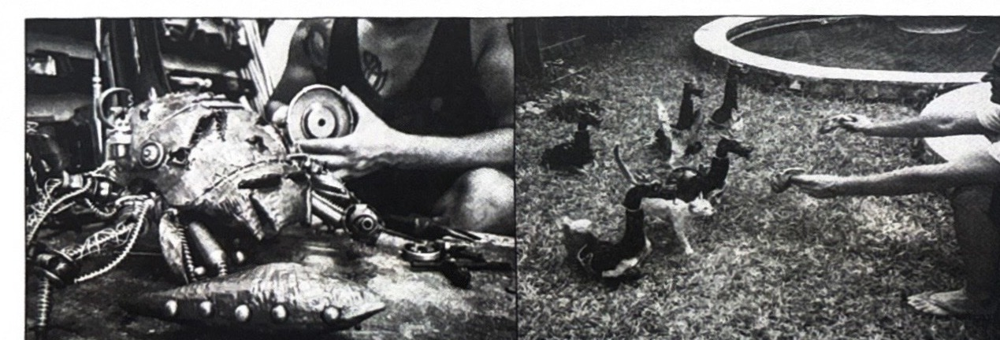

*図：金属製シーシャを組み立てる作業の様子と、庭で犬と戯れる光景（原書 p.154）*

> シーシャ以外にどんな製品を作っていますか？

すでに機能していて収益をもたらしているものとしては、私たちのオリジナルの宝飾品があります。私たちのコレクションには、シルバーとワニやニシキヘビの革のブレスレット、半貴石のブレスレット、指輪、それに人気となった個人用のシルバー製マウスピースがあります。私たちはとても腕の良い宝飾職人を見つけました。それは簡単ではなく、探すのに時間とお金を費やし、製品の品質に確信が持てるようになるまでに、何人かと組んで試してみる必要がありました。

私がデザインを考え、画像を選び、正確な寸法でスケッチを描き、職人と一緒にワックス原型を作り込みます。これは蝋から手作業で彫り出した製品の正確な複製で、これをもとに鋳造用の型が作られます。これは魂のない3Dプリンターではなく、本物の手仕事の宝飾作業です。私たちは革の供給業者と会い、ブレスレット用の一枚一枚の革を自分たちで直接選びます。自分の工房でユリャ（Юля）が、私たちが販売しているブレスレットやシーシャ用のホースを一つひとつ裁断し、自ら縫っています。私たちには、順番を待っている面白いプロジェクトがまだいくつかあります。

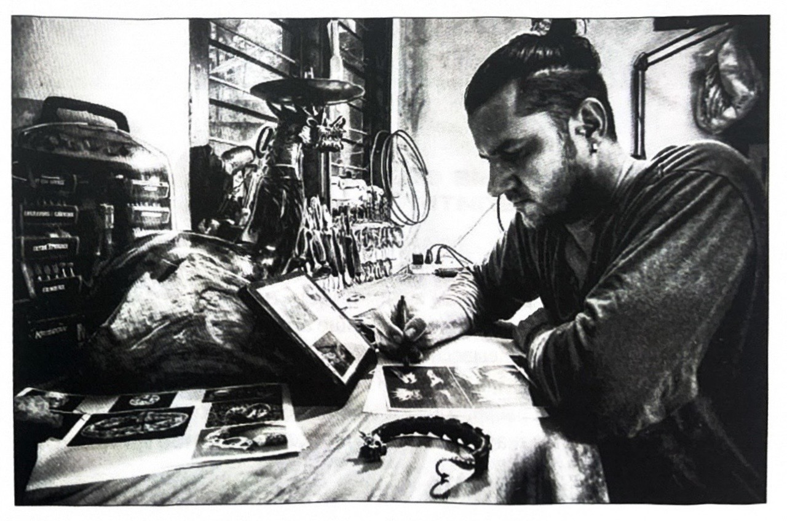

*図：工房で宝飾品のデザインをスケッチするアンドレイ（原書 p.155）*

> SHISHA TEMPLE について話してください。お店を開こうというアイデアはどうやって思いついたのですか？

そのアイデアは、私たちが本格的にシーシャ作りに取り組み始めてからほどなくして浮かびました。私たちにはショールームが必要でしたし、それにバリ島には良いシーシャ店もシーシャもタバコもなく、まさに手つかずの分野でした。私たちの個性的なシーシャは、間違いなく注目を集めるはずでした。そして、実際にそうなったのです。

> どんな主な特徴を挙げられますか？

私たちはたくさんのタバコのフレーバーを取り寄せていて、これほどの品揃えはインドネシア中どこにもありません。私たちは、自分たちのシーシャを置きたいと思う、そしてそのエスニックなスタイルを引き立てる内装を作りました。これは私たちの手作りのアート空間で、通りの看板からトイレに至るまで、すべて自分たちで作りました。ユリャが描いた絵、私が作った家具とシーシャ、島中から集めた、あるいは個人的に知っている職人たちが作った食器や内装の一つひとつ。これが私たちの家なのです。

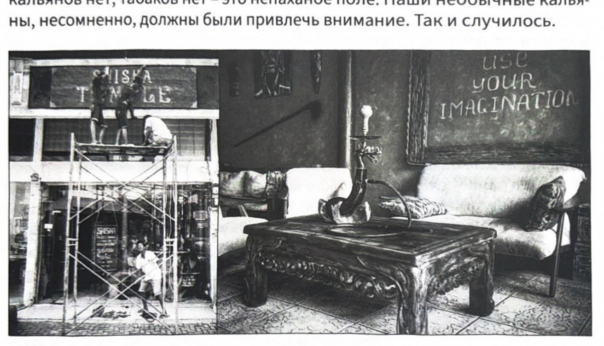

*図：SHISHA TEMPLE の店構えと、「use your imagination」と書かれた店内ラウンジ（原書 p.156）*

> バリ島でビジネスを始めるのは難しいですか。そしてそれをやろうとする人にはどんな困難が待ち受けていますか？

始めるのは簡単で、すべてを台無しにするのはもっと簡単です。最大の難しさは、地元の人々との相互理解です。「お客様は常に正しい」とか「俺はお前に金を払っているんだから、さあやってくれ」といった言葉が彼らにとって無意味な響きでしかないと理解できるくらい、島で十分に長く暮らさないうちは、何かを始めようとしないほうがいいでしょう。

> どんな機材とタバコを使っていますか？

私たちは自分たちのシーシャだけで営業しています。それこそが自分のシーシャ店を開いた意味でした。多くのお客様が、Kalyanbali で吸い、私たちと交流するために、わざわざ私たちのところへやって来ます。

私はロシアからボウルを取り寄せています。今稼働中なのは ST、Облако（オブラコ）、Japona hookah、Harvik、Smokelab、Cosmo… などです。

メニューには Tangiers、Fumary、Nakhla、Adalya、Alfakher、Darkside、Wto、Mattpear、Spectrum、それに他にも数種類のフレーバーのある別のブランドがいくつかあります。

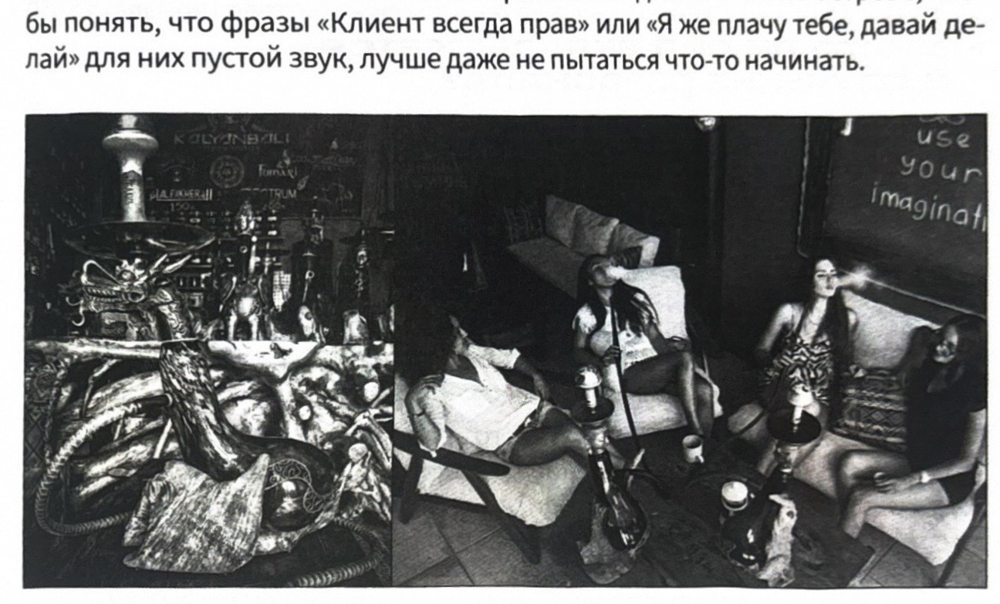

*図：ドラゴンをモチーフにしたシーシャと、店内でくつろぎながらシーシャを楽しむ客たち（原書 p.157）*

> シーシャ店のスタッフはどうやって探していますか？

Facebook のグループや人材紹介会社があります。

> スタッフの教育にはたくさんの力を注いでいますか？

いや、それほどでもありません。1週間のうちに、その人を教育するかしないかは分かります。教育に、自分が費やす覚悟のある以上の力が必要になるなら、別の人を探したほうが手っ取り早いです。代わりのきかない人などいません。

> SHISHA TEMPLE のお客様はどんな人たちですか？

お客様の80%はロシア語話者で、ヨーロッパ人、アラブ人、インド人もたくさんいます。私たちはバリ島の基準からするとまったく安くはない店なので、隣のテーブルでプレイステーションに興じて騒ぐガキの群れではなく、静かな休息を好む、裕福な大人の人々が来てくれます。

> あなたの見るところ、バリ島のシーシャ業界はどのように発展していますか？

ゆっくりとです。難しさのすべては、インドネシアへの輸入シーシャ、タバコ、アクセサリーの輸送にあります。物流費と関税が非常に高いのです。税関職員の無法ぶりにはただ驚かされます。ジャカルタであった話を聞きました。1台100ドルのシーシャ10台の通関のために、税関職員が彼らから1500ドルをむしり取ったというのです。これでどうやって「業界」を発展させろというのでしょう？

バリ島には、アウトソーシングを手がけるロシアの若者がますます増えていて、いろいろな店にシーシャを置き、タバコを取り寄せ、シーシャ職人を教え、フェスまで開いています。それはすべて素晴らしいことですが、私は別の道を行きます。彼らは「ムーブメント（盛り上がり）」を作りたいのですが、私はヨットを買いたいのです。

> SHISHA TEMPLE 以外に、何か挙げられる場所はありますか？

Shisha cafe です。これはおそらくバリ島で最古のシーシャ店で、独自の雰囲気と、クラシックなアラブ風の美しい内装、それになかなかの料理があります。シーシャに関してはあまり良いとは言えず、中国製の機材に Alfakher です。それ以外は勧められません。行ったことも、試したこともないので。

> あなたはロシアのシーシャ市場を追っていますか。もし追っているなら、誰を挙げられますか？

私はロシア市場だけでなく、ヨーロッパやアメリカの市場も追っています。私の朝はコーヒー1杯と1時間のインターネットから始まります。Facebook と Instagram を見て、そこでは膨大な数の海外のシーシャコミュニティをフォローしています。ロシアのシーシャ市場がいまだに抜け出せずにいる VKontakte と Telegram にも目を通します。新作の発売を追っています。今年は何が流行りなのか、軽いドローなのか速い吹き出しなのか、自社のタバコや炭を作ることなのか、ブロガーやインフルエンサーの浮き沈み、それにスキャンダルや陰謀、暴露などを追いかけ、見ては、自分がそれに関わっていないことを喜んでいます。公に誰かを挙げたいとは思いません。それは個人的な交流の中ですることで、ある人とは会って話してみたいと思うし、ある人は避けて通ります。

> ロシアのシーシャ系ブロガーは見ていますか？

見ていますが、ブロガーは片手の指で数えられるほどです。シーシャ文化、業界の発展、誠実なレビューなどと声高に叫ぶレビュアーの数え切れない群れがいます。彼らの大多数が、汚い言葉なしには2つの言葉すらまともに繋げられないというのに、どんな文化を語れるというのでしょう？ 彼らは自分たちの「DQN（ガラの悪い若者）」な視聴者を未成年者の中から選び、その層を良くしようとはせず、彼らのレベルにまで自分を落として、その大衆と彼らの言葉で語り合っています。

「誠実なレビュー」のおかげで、そういうものを2、3本見て、私は自分のシーシャ店向けにあるブランドのタバコを仕入れました。バリ島へのタバコの取り寄せはそれはもう一苦労なのですが、メーカーの言い分によれば、その製品は未熟な状態で出てしまい、改良のために回収されました。今ではそれを自分たちで吸い切るしかなく、「誠実な」ブロガーたちに善意の波動を送っています。

どいつもこいつも、やっていることはまったく同じです。開封、巻き付け、同じようなシーシャの喫煙、ボウルの詰め込みと提供、そして最初の一吸いの後に下す自分の「専門家としての見解」、つまり新しいタバコの味が「クソまずい」のか「トップ（最高）」なのか、というわけです。

大まかに言って、こういったレビューが必要なのは、そのシーシャやタバコのメーカーだけです。彼らはレビュアーのつらい労苦に気前よく金を払って、自分たちのページに広告として動画を載せます。私は確信しています。そんな5分間のレビューに有名な俳優や芸能人を起用したほうが、もうすでに安上がりでしょう。そしてそういう広告の利益は、水増しされたフォロワーのかたまりを抱えたチャンネルから得られるものよりも、はるかに濃厚なものになるでしょう。このアイデアはみんなにあげます。

P.S. 私たちは一度たりとも誰にも無料でシーシャを送ったことはありませんし、レビューや広告に1コペイカも払ったことはありません！ そしてこれからもそうするつもりはありません。

> ロシアには、あなたのシーシャに否定的な態度をとる人々が一定数います。この件についてどう思いますか？

この件についてはとうの昔に考えるのをやめました。もし私がこれについて考え始めたら、その場で足踏みするか、後ろへ這いずるかになるでしょう。否定的な意見は主に価格だけから生まれるものです。それは「自分にとって高いなら、それは悪い、だいたいこんなもの誰が必要とするんだ」というプロレタリアートのメンタリティです。

公の場で、フォーラムやチャットで「クソ高すぎだろ！」「そもそも誰がこんなものを買うんだ？」「ガレージで瓶から吸ったほうがマシだし、それで十分だ！」「世界も俺たちの業界もどこへ向かっているんだ？」などとわめき出す人々には驚かされます。あるいは「ブロガー」が動画を撮って、大真面目に我々のシーシャとハリル・マムーン（Khalil Mamoon）を比較したりします。それなりに大人で、働ける人間が、自分の無能ぶり、生活水準の低さ、成長したくない、より良いものを目指したくないという気持ちを、どうしてこうも声高に世間に向かって宣言できるのでしょうか。

彼らはその陰気な人生をずっと、「イケア（IKEA）」の家具やペットボトルの安ビールを好む同類の連中に向けて、自分たちのクソみたいなシーシャラウンジでタンジュ（Tangiers）を300ルーブルで売り続ける運命にあるのです。

ある社会階層が存在するということを、覚えている人も理解している人もほとんどいません。そこでは非常に裕福な人々が、普通の人の大半が一か月かけて稼ぐ以上のお金を、ただの昼食に費やすことができるのです。彼らはVKontakteに入り浸っておらず、Instagramも持っておらず、シーシャブロガーのレビューを見ることもなく、Telegramでチャットすることもありません。彼らには別の社会生活と関心事があるのです。だから私は、誰が我々の作品を買うのか、それについて何を考え、何を語っているのかを知っています。文化的な深淵の向こう側からの放屁や、下層社会階層からのゴボゴボという音は、こうした人々のもとには届きませんし、私のこともとうに悩ませなくなりました。

自分でSNSの全ページを運営しているので、ほぼ最初の頃から我々の創作を追いかけてくれているものの、まだそれを手に入れる余裕のない大勢の人々を、私は見て知っています。彼らがコメントを書き、ダイレクトメッセージを送ってくるのを私は見ています。それは私にとって嬉しいことであり、いつも返信するよう努めています。私が考えているのは、まさにこのことです。これこそが、我々を前進させ、成長させる原動力なのです。

我々と仕事をするのは大変だという否定的な意見も、やはりかなり主観的なものです。我々の店でおよそ三年間、かなり過酷な体制で働いてきた経験が私に示したのは、それが我々のシーシャを使ったことがない人々、あるいは使い古されて転売された古いモデルを使った人々の出した結論だということです。

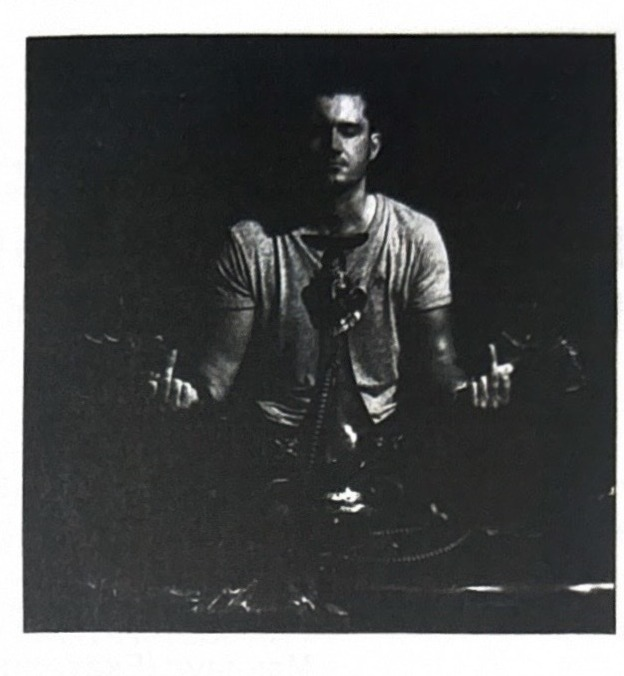

*図：暗がりの中、シーシャを前に瞑想するように座る男性（原書 p.161）*

## ロシアで生産されているシーシャの最新リスト ［ 2020年夏 ］

Хулиган（クラスノダール）
Мамай Customs（サマーラ）
Mir Hookah（ムイティシ）
Target（クラスノダール）
Tongs（カルーガ）

Ash Wood（ペルミ）
Capsule（クラスノダール）
Agach（カザン）

Voodoo smoke（モスクワ）
Ess Hookah（トヴェリ）
VZ（クラスノダール）
DSH（クラスノダール）
LikeSmoke（キーロフ）
Craft（ノヴォシビルスク）
Космо（エカテリンブルク）
Hellfire（カザン）
Hookah Mason（モスクワ）
Ferro（ヴェリーキー・ノヴゴロド）
Dalian（サンクトペテルブルク）
На грани（イジェフスク）
Nube（クラスノダール）
Механика（オレンブルク）
Nejn（ポドリスク）
Эйфория（ミアス）

Shadows Hookah

DymMachine（トヴェリ州）

Fox（ロストフ）

Альфа Hookah（サンクトペテルブルク）

JaponaHookah（サンクトペテルブルク）
Conceptic Design（サンクトペテルブルク）
Choby（ウファ）

Горький（ニジニ・ノヴゴロド）
Маклауд（エカテリンブルク）

Shapes（モスクワ）

Hookah Irk（イルクーツク）

Werkbund（ニジニ・ノヴゴロド）

Хардвуд（モスクワ）

SmokeAngels（モスクワ）

Neolux（チェリャビンスク）
Пиздюк（カザン）

Tortuga（オムスク）
Смоклаб（オムスク）
Fekolin（リャザン）
HookahTree（ペンザ）
Volcano（モスクワ）

Romatti（セルギエフ・ポサド）
Retrofit（ロストフ・ナ・ドヌー）
Отивана（サンクトペテルブルク）
First Hookah（ソチ）
RF（クラスノダール）
Пушка（エカテリンブルク）
Vesper（ニジニ・ノヴゴロド）
Hoob（モスクワ）

DarkMatter（タガンログ）

Darkside（モスクワ）

Orden（モスクワ）

Don（ロストフ・ナ・ドヌー）
DDI Hookah（ウファ）
Chosen（モスクワ）

Venture Hookah（クラスノダール）
ML Clan（ヤルタ）

BigMaks（サンクトペテルブルク）
Marmor（ニジニ・ノヴゴロド）
Pandora（カザン）

Nanosmoke（サンクトペテルブルク）
El Bomber（クラスノダール）
Softsmoke（サンクトペテルブルク）
Душа（エカテリンブルク）

Solomon Hookah（サンクトペテルブルク）

ShiCarver（セルギエフ・ポサド）

Веремчук（ペンザ）

AG（チェリャビンスク）

Геометрия（クラスノダール）

Водо（モスクワ）

У.К.А.Р（オムスク）
Frigate（モスクワ）

Vortex（カザン）

ЧКСЗ（チェリャビンスク）

VS Hookah（ヤロスラヴリ）
Cobra（モスクワ）

Ю4（クラスノダール）

Black fire（ロストフ・ナ・ドヌー）

Мэт пир（クラスノダール）

Rocket（タガンログ）

Стерхов

Blade hookah（オムスク）

F.Corp（サンクトペテルブルク）

Qub Hookah（サンクトペテルブルク）

Юнион（ニジニ・ノヴゴロド）
Avion（コロムナ）

Cwp（モスクワ）

S.Steel（トリヤッチ）

Koress（サンクトペテルブルク）
Bamboo Hookah（カザン）

---

## 第4章

### シーシャのボウル

# シーシャのボウル。歴史と種類

シーシャにおける最も重要なアクセサリーの一つがボウルです。イリヤ・ロマノフとドミトリー・フングレーエフによる連載記事の素材が、どのようなボウルが存在し、それらがどのように変化してきたのかを語ります。

シーシャの他の部分と同様に、ボウルもまたシーシャが存在してきた歴史全体を通じて、変化していくシーシャタバコに適応しながら進化してきました。ボウルは今なお、登場した技術に応じて発展を続けており、新しい種類が生み出されています。しかし、この多様性すべての中から基本的なタイプとボウルの特徴を抜き出してみれば、「新しいものとはすべて、よく忘れられた古いものである」ということが明らかになります。ただし、現存するトレンドを考慮して改良されたものではありますが。

インド亜大陸（ヒンドゥスタン）由来の正統派のボウルは、カバー（コルパーク）と一体化したもので、大きなサイズの粘土製または金属製の漏斗（ろうと）の形をしており、その壁面に喫煙用の混合物を広げて/塗りつけていきます。チリム、チッリム、あるいはチッルムという名称で、タバコとは限らないものを喫煙するためのインドの儀式用パイプが知られています。しかし、チリムはシーシャの一部でありながら、シーシャとは別個に使用されていた可能性があるという推測も存在します。今日では、インドやパキスタンのシーシャのボウルに関して、hukkahchilam（フッカチラム）または hookahbowl（chilam）という用語が見られます。

旧ソ連圏では、ボウルはしばしばチリムと呼ばれます。Wikipedia によれば、この同じ言葉が、ウズベキスタンではシーシャそのものを指すとされています。

これと似た、やや小さめのペルシャ式の金属製ボウルがあり、漏斗の底が閉じられていて、そこに空気の流れのための穴が開いています。イランではボウルは sar と呼ばれ、これはペルシャ語（ファルシ語）で「頭」を意味します。

ペルシャ式のボウルもまた、しばしばカバー（コルパーク）と一体化しています。

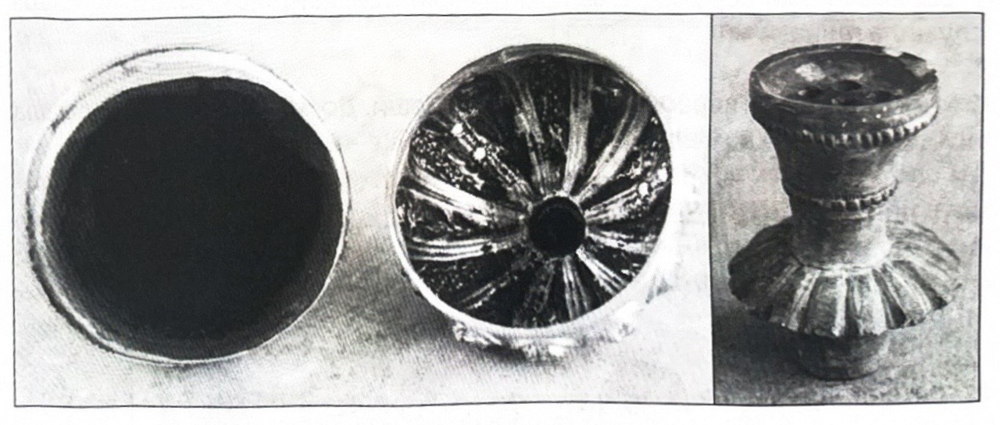

*図：壁面に窪みのある円錐形のインド亜大陸／ペルシャ式ボウル（sar）とコルパーク（原書 p.167）*

トンバク（томбак）を喫煙するために用いられた、進化したトルコ式のボウル lüle（「王冠」と訳すことができ、çukur は「窪みのある」、düz は「平らな」を意味します）は、漏斗の壁を失い、ほぼ平らになりました。素材は今や粘土が用いられました。

この時から、カバー（コルパーク）はボウルの一部ではなくなります。それは今日に至るまでほぼ変わらない姿で残っています。今やそれは düzlüle として、次のような外見をしています。

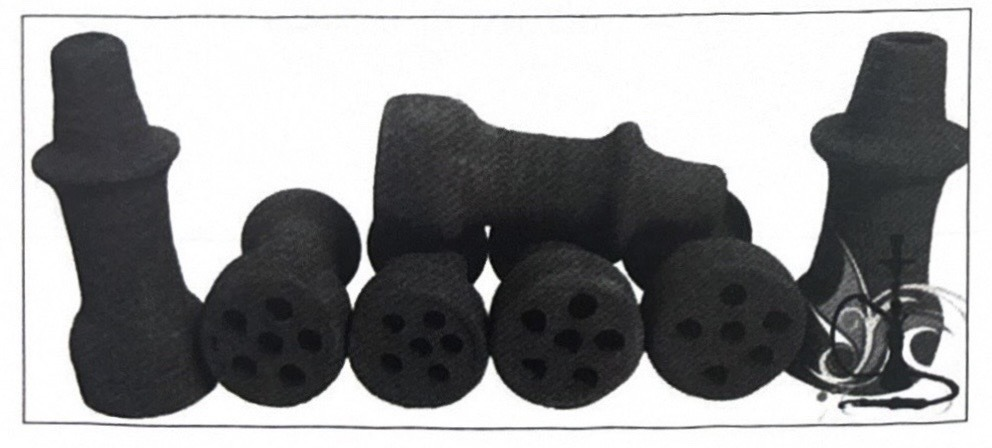

*図：小さな穴が複数開いた平らなトルコ式ボウル düz lüle の各種（原書 p.168）*

アラブ世界では、シーシャを現地の条件に適応させることが続きましたが、それは結果として粘土製の漏斗へと逆戻りすることになりました。しかし今度のそれは、トルコ式の平らなボウルとインド亜大陸の漏斗との中間のようなものでした。つまり、平らなボウルに、いくつかの小さな穴の代わりに一つの大きな穴が現れたのです。あるいはトンネルが。これがそのオールドファンネル、すなわち oldschoolphunnel です。

古い文献ではアラビア語の haggar が言及されています。これはアラビア語の単語 пğr（СС）で、「石」を意味し、正しくは hajra と読みます。主として、このようなボウルは香料の付いていないシーシャ用混合物（黒色の糖蜜入りタバコ。しばしば「黒タバコ」として登場します）を喫煙するために用いられます。とはいえ、望む者がトンバクを吸うことを妨げるものは何もありません。

非常に湿った稠度を持つ、香料の付いたシーシャ用混合物の登場とともに、ボウルは再びまた逆戻りし、トルコ式とペルシャ式のスタイルを同時に取り込みました。トルコ式のボウルと同様に、それは粘土から作られ、いくつかの小さな穴を持っていますが、同時にペルシャ式の漏斗のような壁が現れました。このようなボウルはしばしばエジプト式（egyptian）またはシリア式（syrian）と呼ばれますが、本質的にはこれは単なる粘土製のボウル（claybowl）です。

このボウルが標準的で最も普及したものとなりました。今やシーシャ用混合物は、アルミホイルまたは金属製の穴の開いたスクリーン（エクラン）によって炭から隔てられます。スクリーンによって、混合物に加えられる火力を管理し、より良い結果を達成することが可能になります。

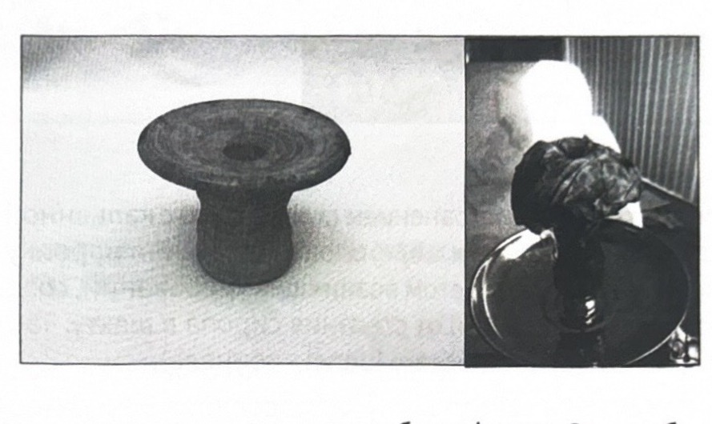

*図：壁のあるエジプト式／シリア式の標準的な粘土製ボウル（claybowl）（原書 p.169）*

ドローの軽さを追求しつつ、シーシャ用混合物から滴り落ちるシロップを保持しようとして、今度はもう西洋世界で、再び漏斗（あるいはトンネル）が思い出され、生じた要求を考慮してそれを改良し、シロップがシャフトへ流れ落ちるのを防ぐ障壁（バリア）を穴の前に作り出しました。こうして現代のファンネル（phunnel、英語の funnel = トンネルに由来）が登場したのです。

ファンネルのほかにも、シロップの流れ落ちを抑えるボウルの改良アイデアが存在します。例えば、vortex（英語で「渦」）ボウルのように、穴の開いた底を上方へ反らせるというものです。

現代のボウルに伝統的に用いられる素材は、粘土、陶磁器（セラミック）、そしてホウケイ酸ガラス（ボロシリケートガラス）です。しかし、インターネットショップではますます金属製のボウルが見受けられるようになっています。

このほか、ボウルはシーシャのシャフトとの接合部の位置によっても区別されます。内側（male）と外側（female）です。後者のほうがより普及しています。

また、ボウルの代わりに何らかのフルーツやバラのつぼみを用い、混合物を詰めるための穴と空洞をくり抜くという方法も行われています。その際、伝統的なボウルの原理は保たれます。

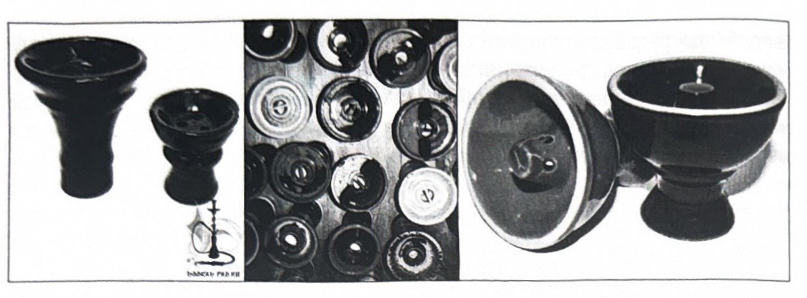

*図：現代のファンネル（phunnel）やボルテックス（vortex）など各種ボウルの形状（原書 p.170）*

---

## 粘土製ボウルの製造。ロマン・クレツ（Роман Крецу）

（インタビュー抜粋）

> これはまさに君自身の製造なの？それともアウトソース？

僕は長いこと腕の立つ陶工を探していて、見つけたんだ。それは家庭内の製造だったけど、投資と注文量のおかげで、今ではプロのレベルにまで到達したよ。もうすぐ、ある有力な企業と提携して、ピーテル（サンクトペテルブルク）に大規模な製造拠点を作ろうと計画しているんだ。でも、これはまだ秘密だよ。

> ボウルについて話そう。ロシアには製造業者が山ほどいる。誰を挙げられるかな？

手作りのボウルを作っている市場で唯一の製造業者、それが「アルトバール（Арт бар）」だ。鋳込み（литье）製では、優れた製品なのが「オブラコ（Облако）」だ。それ以外は皆、シリッカー（様々なレシピの液状粘土）から同じようなタイプの製品を鋳込んでいて、自分たちの製品に手作りだと謳っている。「だって僕たちはその後、手で加工してるんだから」とでもいうようにね。

天然の粘土から作られるボウルは、鋳込み製のものとは違った働きをする。温度の挙動（温度モード）が異なるんだ。

> でも鋳込みのほうが安い。ロシアの多くの人にとって、これは決定的な要因だ。

そう、安くて利益も上がる。利益を追い求める者は、品質を忘れる。僕は、製品数は少なくても、素材と品質に気を配るほうを選ぶ。そして何より、手作業の製造なら、小さな注文でも対応できるし、製品にブランディングを施すこともできる。鋳込み業者にとっては、これは割に合わない。製品ごとに高価な型を作り、それから何百もの製品を鋳込んで元を取らなければならないからだ。だから僕は、どんな店にもボウル、ピアラ（小鉢）、ティーポット、ガイワン（蓋碗）などを十個でも作ってあげられる。

鋳込み業者は誰一人、そんな注文を引き受けようとはしない。

そして何より、僕は赤粘土、白粘土、あるいはシャモット粘土（耐火粘土）を使うことができる。今はそのシャモット粘土ですべてのボウルを作っているんだ。これと同じ素材から、Hookah john や Alpaca のボウルも作られている。この国でシャモット粘土を使っている者は他に誰もいない。

> それはどこから取り寄せているの？

シャモット粘土とは、粘土と、すでに焼成された一定の大きさの粘土の砕片との混合物だ。シャモットは赤粘土からのものもあれば、白粘土からのものもある、などなど。僕のボウルは、ドンバス産の白いシャモット粘土から作られている。

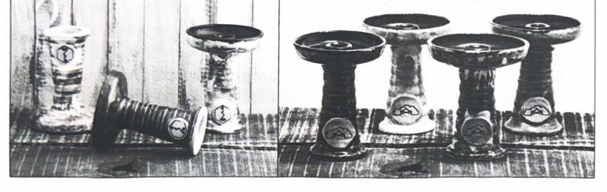

*図：天然・シャモット粘土から手作りされたファンネル型ボウル各種（原書 p.172）*

> 今、良い粘土は1キログラムいくらするの？

粘土の種類はとても多くて、いろんなところで採掘されている。天然粘土の価格と、専用の工場で加工された粘土の価格は別物だ。あるシャモットには一つの価格、別のシャモットには別の価格、というふうに、価格形成は山ほどの要因に左右される。

> 君は、鋳込みの場合は温度の挙動が違うと言っているね。その本質を簡単な言葉で説明できる？

シリッカーは焼成後の密度がとても高い。特に高温焼成の後はね。そのため、製品は熱くなって、喫煙の過程で冷める間に合わない。天然粘土製のボウルは、喫煙中に脚（ノジカ）の部分を指でつかんでも平気だ。なぜなら、粘土は難なく熱を放出するけれど、シリッカーはそうではないからだ。

> それは喫煙の品質にどう影響するの？

過熱だ、それで全部言い尽くせる。でもここでは、具体的なボウルとどう付き合うかを理解しなければならない。マスターが腕利きで、何を、何に詰めて、それがどう吸えるのかを理解しているなら、どんなボウルでも問題は生じない。

僕はそもそも、シーシャバーには様々なタバコや詰め方に対応する、たくさんの異なるボウルがあるべきだと考えている。とはいえ、僕の店ではほとんどすべてのボウルが、やはり手作りの天然粘土製だ。

> 君のボウルの製造における主な工程を教えてくれる？

ろくろ（陶芸用の轆轤）での製品の成形。それから長い自然乾燥。それから様々な種類の手作業の仕上げ。そしてその後、最終的な加工（молочение＝ミルク焼き／燻し焼き、あるいは釉薬がけ）に応じて、数回の焼成を行う。

> 焼成温度は何に影響するの？そしてセラミック（керамика）とは何？

セラミックとは、すべてだ。磁器も、陶器（ファイアンス）も、鋳込み製品も、例えばトルコ式コーヒーポット（турки）のような単純な粘土製品も、すべてセラミックだ。

焼成温度はどの粘土にもそれぞれ固有のものがあって、釉薬にもそうだ。どんな粘土にも融点がある。やりすぎれば、粘土は溶けて製品は台無しになる。釉薬の焼成温度をやりすぎれば、釉薬が沸騰して、これまた製品が台無しになる。だから、一回目の焼成は製造後の製品だけを焼き、二回目はもう被覆（コーティング）をした状態で焼くんだ。

> 釉薬（глазурь）とは何？

おおざっぱに言えば、液状ガラスだ。それに様々な添加物を加えると、色がつく。重要なのは、毒性のある釉薬が存在し、それらは食品製造では禁止されているということを理解しておくことだ。

> 君の考えでは、良いボウルの妥当な値段はいくらで、それはなぜ？

僕たちのものは、手作りなら1000ルーブルより高くなるべきではない。難易度に応じて、ごくまれな例外はあるけれど。鋳込み製は700ルーブルより高くなるべきではない。すべては、僕が原価と労力を知っているからだ。

> マージン（利幅）はどのくらい？

当然、それは誰も君には教えてくれないよ。鋳込みのほうが利益は大きい、おそらく何倍もね。でも、何千個も鋳込まなければならないけれど。

> なぜ大多数のロシア製ボウルは、控えめに言っても、色や美的センスがあまり良くないの？

経験がないんだ。知識がない。良い製造現場には、釉薬職人（глазуровщик）という独立した役職がある。これは釉薬だけに専念する人で、最高のレシピの釉薬を扱うことができ、その結果、最も美しい製品を生み出すんだ。

> ロマン・クレツが選ぶボウル トップ3

・Alien Hookah John Harmony Glina（グリナ）
・Old school Glina（グリナ）

---

## コーリャ SARKO ZY（Коля Sarko Zy）

（インタビュー抜粋）

> どうやってシーシャ業界に入ったの？

まあ、僕はいろんな分野で働いていたんだけど、生活費が足りなくて、3部屋のアパートを借りて、そこには僕のほかに4人が住んでいた。パンと一緒にビーチ（安いインスタント麺）を食べて、運が良ければマヨネーズ付きでね。この時期に、ヴィタリク（Виталик）と知り合ったんだ。彼が、僕が一緒に動画を撮っている、あのヒゲもじゃの友達だよ。

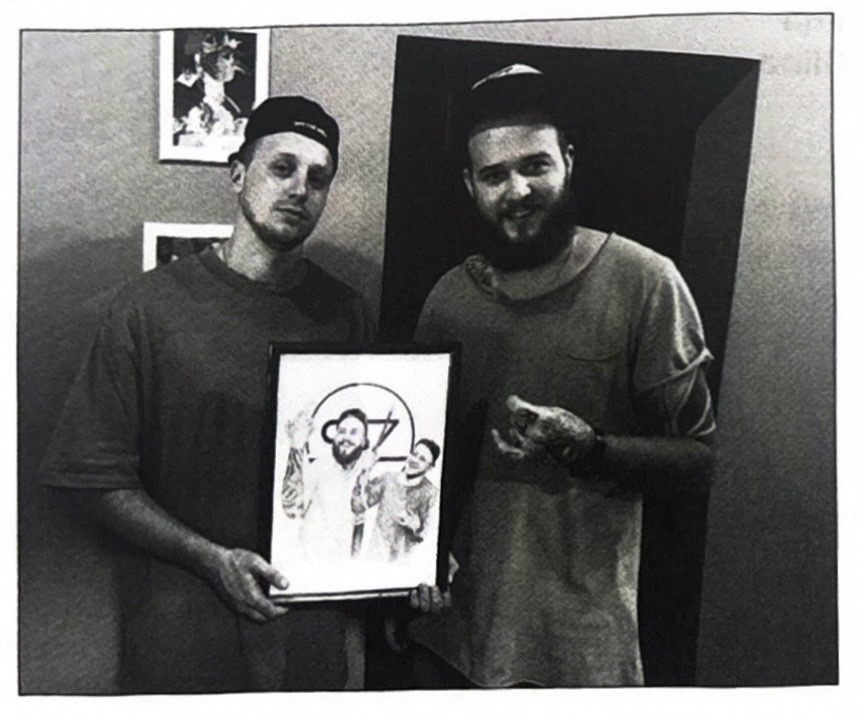

*図：コーリャ Sarko Zy と相棒のヴィタリク（似顔絵を手にする二人）（原書 p.176）*

本当に途方に暮れていて、どうすればいいのか、何をすればいいのか分からなかったんだけど、その時、友達が支えてくれて、外食業界に行ってウェイターとして自分を試してみたらどうかと勧めてくれた。2014年のことだ。たくさんの店を回ったけど、田舎者のメンタリティで経験もない僕なんて、どこにも必要とされなかった。でもそれでも、ある店が僕を受け入れてくれた。もっとも、その店は閉店寸前だったけど、僕の人生をすっかり変えてくれた。そこにはウェイターとしては採用されなかったけど、ナタリヤ・ヴィクトロヴナ（店のオーナー）が僕を哀れんで、シーシャ係（кальянщик）として働かないかと提案してくれて、僕はそれを承諾した。この女性の名前を、僕は一生忘れない。

僕の研修はきっかり1時間で終わって、その後すぐに客席（ホール）に放り出された。すべてが始まったその店では、シーシャのメニューにクラシックなボウルはなくて、フルーツボウルだけだった。僕にとってこれはとても難しかった。なぜなら、それまでシーシャを吸ったことも作ったこともなかったからだ。でも、僕は働いて、努力して、休みもなく身を粉にして、少しずつフルーツでのシーシャ作りに手慣れていった。時間が経って、たぶん3か月くらいして、店が閉店する。僕はどこへ行けばいいのか分からなかったし、3か月の勤務経験なんてすごく短いものだった。

知人を通じて、「ミニマルバール（Минимал бар）」という店でのシーシャ係の求人を知る。僕を採用してくれたのはマクシム（Максим）、彼がまさに、タバコ「マトリョーシカ（Матрешка）」を作ったあの最高に元気な人だ。彼は僕に何でも教えてくれて、見せてくれて、語ってくれて、仕事のあらゆる機微を伝えようとしてくれた。彼は僕の最初の師匠だ。でも彼が僕を採用したのは、別の理由からだった。マクシムは、シーシャのカウンターに入って、僕にできる最高のシーシャを詰めてみろと言った。でも僕はボウルでもシーシャでもなく、布巾を手に取って、テーブルを拭き始め、シーシャを拭き始めた。すると彼はすぐに僕にこう言った。「採用だ、詰めなくていい」と。

僕はシーシャと作業スペースをとても大切に扱うんだけど、時が経ってもこの性質は僕の中から消えなかった。僕には、若くて当時はより経験豊富なシフト交代要員のヴォーヴァ（Вова）がいた。彼は僕がお客のためにどれだけ努力しているかを見て、僕に嫌がらせをし始め、上司に告げ口をし、お客に僕がいかにダメな奴かを吹き込み、僕からタバコを隠したりした。僕がシフトに来ると、アルファケル（Альфакер）が5フレーバー、アフザル（Афзал）が4フレーバーしかない、そんなふうに働いていたんだ。彼の仕業を見破るまではね。

ヴォーヴァはいつも僕の仕事を侮辱して、もちろん僕はそれが不愉快だった。彼はイケてるレストランに移って、とても良く稼ぎ始めた。僕のシフトにやって来ては、金を見せびらかして、みんなの前で見せつけるように僕にチップを差し出した。僕は受け取らずに、いつか彼にこう言った。「ヴォーヴァ、時が来れば、お前は僕の名前を聞くことになる」と。

これらの言葉の後、フルーツシーシャへの僕の情熱は、新たな力とアイデアとともに高まった。僕はフルーツを買って、常連客に無料で振る舞った。彼らの意見が必要だったんだ、それをとても重要だと考えていた。僕は自分の作品を一つひとつ VK（フコンタクテ）のグループに投稿し、自分のインスタにアップした。素晴らしいと言ってくれる人もいれば、いまいちだと言う人もいた。でも僕は立ち止まらず、四方八方から浴びせられる大量の泥の中を進んでいった。

でもその時、僕の頭の中で転機が起きた。

暑い日だった。僕はバスに乗って仕事に向かっていて、次のバス停で幼なじみのジーマ（Дима）が乗ってきた。彼は当時、街の良いシーシャラウンジで働いていた。僕たちの間で、こんな会話が交わされた。

「ジーム、どこへ行くんだ？」

「車を買いにだよ！」そして札束を見せる。

「君のところで働かせてもらえないかな？！ 僕は金がなくて座り込んでいる、お金のことですごく苦労しているんだ？！」

「お前はあんまり良いシーシャ係じゃないし、面接すら通らないよ！」と彼はあざ笑った。

これの後、僕は自分にこう言い聞かせた。「僕はできる、僕はやり遂げる、彼らは僕の名前を聞くことになる」と。目標は定められて、僕は当時としては最も狂気じみたボウルを作って、それを Davy Jones と名付けた。人々が僕を見て、ピーテル（サンクトペテルブルク）のシーシャラウンジ「ポドネベスナヤ（Поднебесная）」で開催されたシーシャフェスに、自分の腕を披露しに来ないかと声をかけてくれた。2015年5月3日のことだった。今でもありありと覚えている。僕は自分にできることを見せようとステージに出たんだけど、客席にいた人たちは皆、踵を返して別の部屋へ行ってしまった。あの瞬間、本当に自分がとてもちっぽけに感じた。でも、それでも客席には、見ていてくれる4、5人の人が残っていた。

でも、僕が Davy Jones を組み立てると、人々はそれを見て、戻ってきて、こう言った。「すげえ、一体どうやってんだ？！」と。彼らはそんなものをこれまで見たことがなかったんだ。

僕は家に帰って、また作り続け、新しいアイデアを考え出した。こうして僕はコーリャ Sarko Zy として業界に足を踏み入れたんだ。そして、僕が業界で這い上がる段階で僕にひどい仕打ちをした奴らは皆、自分たちの侮辱の言葉がどんな役割を果たしたかを、今でも思い出すんだ。

> なぜほかでもないフルーツに重点を置くことにしたの？そして、あんなに美しくフルーツを彫る技術はどこで習ったの？

それで始めたからだよ。腕が最初からそこで鍛えられていったし、興味もそこにあった。独学で習得した。もっと言うと、僕はパンやソーセージ、チーズ、ただのフルーツの盛り合わせを切るのはひどく下手なんだ。でも、シーシャのフルーツボウルのこととなると、僕は別人になる。

> 君は「サー・チャーチル（Сэр Черчель）」という店で働いていたね。そこでは君の作品はよく注文されたの？そしてその価格はいくらだった？

僕には、僕の作家性のある作品を吸う常連客がいたし、もちろんクラシックなフルーツボウルも吸ってくれた。まあ、大部分はクラシックだったけど。作家性のある作品は2500ルーブル以上で売れた。一番高いものは10,500ルーブルで売れた。

> チップは最高でいくらもらった？

一つのテーブルから31,000ルーブルだ。

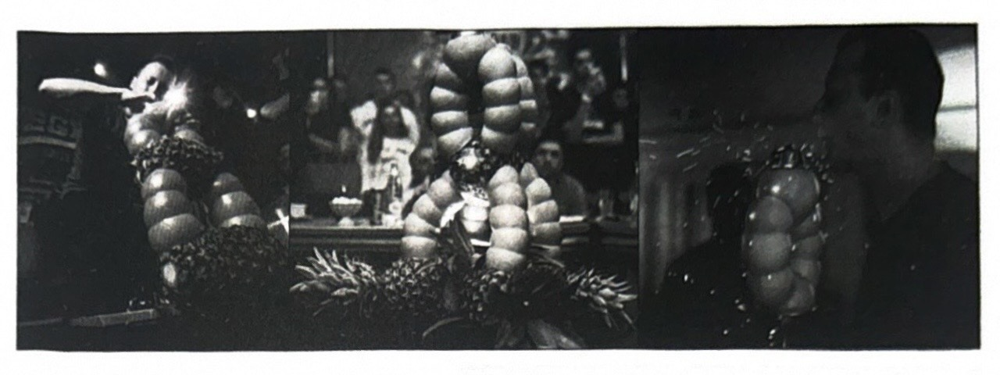

*図：シーシャフェスで披露された巨大なフルーツボウルの作品（原書 p.179）*

> YouTube の自分の動画ブログ SARKO ZY について

視聴者から、フルーツボウルを組み立てるところを動画に撮ってほしいと頼まれて、それで始めたんだ。僕のチャンネルを最初から見てみると、そこにはフルーツボウルの動画がある。

> アンチ（ヘイター）は多かった？彼らとはどう付き合っていたの？

最初は何もかもが癪に障った。出身地のこと、貧乏人だということ、フルーツなんか作っていることなど、いろいろとね。でもその後、僕はそれら全部に構うのをやめて、自分が生まれるべくして生まれたその場所を誇りに思っている。今の自分になりながらも、自分の中の人間らしさを保つことができて嬉しいんだ。僕はもう、人々から発せられるそういうクソみたいなもの全部に屈したりしない。

> 動画の中のコーリャ・サルコ・ジ（Коля Сарко Зи）は、作り上げたキャラクターなの？それとも本当のあなた？

動画の中では、僕は自分でシナリオに書いた人物そのものだよ。

> 一番人気の動画はどれだけの再生回数を集めたの？

ああ、それすら追跡していなかったよ。まあ、たぶん2万再生以上だと思う。

---

# 第5章

## シーシャ用の炭（チャコール）

### シーシャ用の炭。原料の品質から物流まで。

長らくロシアでは、炭の品質をめぐる論争が絶えませんでした。まさにこのために、私たちは炭の製造に関するあらゆる問題についての記事を用意しました。アルチョム・フロポフ（会社「OASIS」）が、シーシャ用の炭の品質について、よく寄せられる質問に答えてくれました。

#### 炭の製造サイクルにはどれくらいの時間がかかりますか？

私たちがシーシャ用にどんな炭を使っているかは、もう多くの方がご存じだと思います。そう、私たちの炭はインドネシアで製造されていて、それには理由があります。製造元を選ぶ際、私たちはまったく異なるさまざまな国から、見つけられる限りのサンプルをすべてテストしました。その中には、私たちに必要な材料、つまりココナッツの殻が存在しない国も含まれていました。しかし、技術力のある中国でさえ、インドネシアの働き手たちが何十年も前からやってきたことを実現できませんでした（もっとも、この「働き手」という言い回しには、私は大いに笑ってしまうところですが）。

製造工程そのものは、それほど長くはなく、せいぜい1か月程度です。しかし、この国がどこにあり、私たちがどこにいるかをご存じなら、配送の選択肢は2つに絞られます。海路か空路かです。さて、製造、物流にかかるすべての時間を合計し、別途、おそらく言及しておくべき私たちの「素晴らしい」税関や、私たちのビジネスが直面するそのほか数多くの細かな問題を加えると、最初の販売開始までの期間が時に4か月に達することもある、と言えるでしょう。

#### シーシャ用の炭の製造における主要な工程は何ですか？

1. ココナッツの殻からの炭の精製。

2. 精製した材料を必要な粒度まで粉砕する。

3. 細粒の炭、タピオカ（天然の接着基剤、すなわちデンプン）、水、そして秘密の材料を混練する。

4. 必要なフォームファクター（成形寸法）まで成形・圧縮・裁断する。

5. 乾燥。

6. 包装。

#### 良質なシーシャ用の炭の組成はどのようなものですか？

ここでは、良質な炭とは何かを理解しておくべきです。そこから、その組成や目に見えるすべての違いが理解できるようになります。まず最もシンプルな真実から始めましょう。高品質の材料を使えば、良い製品を作れる可能性が高まります。

1. ココナッツの殻から作られた炭（そして、それらのヤシがどこで、どのような条件で育ったか）。

2. タピオカ、その品質と等級。

3. 水。「聖なる泉」が決め手です。

#### 炭の製造コストを下げるために、どのような添加物が使われますか？

木材です。普通の木、レモンの木、あるいはそのほかどんな木でも。これらは効率（КПД）が低いのです。炭が完全に燃え尽きた後に残る灰の重さを見れば、それがわかります。見た目には、あるものは灰が多く、あるものは少なく見えるかもしれませんが、それはまた別の特性であり、両者を混同すべきではありません。木材ははるかに安いので、より大きな利幅で売るために、それを混ぜて水増しするのです。

また、灰の量、その色、強さ（火力）、炭の温度、そして燃焼（燻り）の速度に影響を与える化学触媒も使われます。

#### タピオカとは何ですか？

私たちの場合、それは袋に入って運ばれてくる白い粉末です。でも、これはすべて合法です。

#### 炭の製造者はどのような問題に直面しますか？

インドネシア人。怠惰、スピード、というよりむしろその欠如、そして品質。自然災害。始めた当初、私は自分のカルマを清めるべき時が来ているなどとは、まったく考えてもいませんでした。物流会社。海路は非常に時間がかかり、特にロシア向けはそうです。誰も納期を保証できません。ハッカー攻撃、「ペーチャ（Petya）」のお出ましです。もっとも、被害を受けたのは私たちではなく、取引先である海運会社でしたが。税関、彼らは本当に遅く、怠惰です。要するに、アニメ映画『ズートピア』のキツネザルを覚えていますか？とてもよく似ています。炭の品質の不安定さ。誰がどう対処するかは人それぞれですが、たった一度のミスでも、時には会社が信頼を失うには十分です。私たちは一度だけこの難題に直面しましたが、そのロットを販売から引き上げ、不良品の多い炭が当たってしまった方々には無償交換を行うことで、状況を乗り切りました。これによって私たちは200万ルーブル以上を失いました。問題は解決しました。もし誰か質問があれば、こちらが私の個人連絡先です。書いてください。vk.com/akh133820395。

#### なぜ炭は消えてしまうのですか？（同じ製造者の異なるロットの間でも起こります）

低品質の原料、あるいは製造工程の乱れです。たとえば、あるロットでは、別のプランテーションで採取され、別の条件で保管されていたココナッツの炭が混ざっていました。そして、それが残念ながら、私たちのところで初めて表面化したのです。また、これは古いカラウド（Kaloud）の問題でもあります。その金属がすでに疲弊して、熱伝導性が悪化しているのです。さらに、炭が燻る（燃焼する）ためには酸素が必要だというのは周知の事実ですが、カラウドの中では炭が極めて近接して配置され、フォイルの上のような良好な空気の循環ができません。そのうえカラウドが「疲弊して」いて、炭が最高品質でないとなれば、心地よく「シーシャを楽しむ」ことはできないでしょう。

#### 灰の色は何によって決まりますか？（たとえば、黄色、青、ピンク）

温度です。これはまさに物理です。加えて、化学物質が使われているかどうか。オアシス（Oasis）は明るい灰色をしていて、これも炭の品質と天然さを示す要素の一つです。覚えていますが、中国製の炭をテストしたとき、青い火種が出て、非常に不快な後味がしました。ひどかったです！

#### ココナッツの炭の根本的な違いは何ですか？

КПД（効率係数）です。これは火力（ココナッツの炭ではこの値が著しく高い）と灰の重さ（木炭の方が多い）に反映されます。そして言うまでもなく、木炭はココナッツの炭よりも何倍も悪い臭いを発します。

#### 周囲の環境は炭の品質にどのように影響しますか？

ハリケーンは、包装された炭を水浸しにすることがあります。炭そのものには、もちろん何も起こりません（炭は湿気を帯びることがないからです）。しかし、包装の方は完全にぐちゃぐちゃです。当然、すべてが炭に付着するので、これはもう本来の用途には使えなくなります。湿度は炭の品質や燃焼にそれほど影響しません。

しかし、ここに興味深い事実があります。空気の希薄さは、喫煙の質にかなり影響を及ぼすことがあります。物理です。燃焼と燻りのプロセスには、より多くの酸素が必要なのです。その顕著な例として、パーシャ、覚えているかい、私たちが共通の友人ウラジーミル・デネシキン（シーシャ業界で最も責任感の強い人物の一人であり、チェーン「チャイホナ№1（Чайхона № 1）」におけるシーシャ喫煙の質に関する本格的な改革に取り組んだ人物）のもとを訪ねたときのことを。あれはレストラン「354」でのことで、高所では、シーシャそのものの吸い心地さえいくらか違ってくるのです。

#### 灰の量は何によって決まりますか？

主観的な見方をすれば、それにどれだけ注意を向けるかによって決まります。そしてこれは、健全な視力の問題であり、言われたことをそのまま信じる能力の問題でもあります。客観的には、原料、混ぜ物（これについてはすでに上で述べました）、製造技術、そして炭に何を求めるか、つまり良いシーシャを求めるのか、それとも灰が少なく見えることを求めるのか、ということです。よく言うように、「飾り（タクシーのチェッカー模様）が欲しいのか、それとも（目的地に）行きたいのか？」というわけです。

炭は、シーシャの中で最も有害な要素の一つです。

#### シーシャの炭はなぜ有害なのですか？

まさに炭の品質こそがシーシャ全体を台無しにしかねない、という点には同意します。なぜなら、シーシャの喫煙セッションの全プロセスは、まさに炭から始まるからです。良質な炭であっても、燃焼や燻りのあらゆるプロセスに不可避的に存在する二酸化炭素が有害であることは、どうしても否定できません。また、シーシャマスターの技量も大きな意味を持ちます。

ありふれた例として、タバコが「焦げる」場合があります。たいていの場合、もちろん燃えているのはタバコそのものではなく、シーシャミックスやその具体的な構成成分（グリセリン、香料、糖蜜、これもまたその品質や特性によります）が強く過熱したときに生じる不快な結果なのです。また、「カザン式グランタ（казанская гранта）」という変わったシーシャの作り方も知っていますが、これでは意図的に一酸化炭素の量を増やします。これはもう地獄のようで、いったい何のためにと思います。だが、この「ぶっ飛びたい」という願望が、健康につながるわけではありません。

さらに、低品質の原料から作られ、化学物質が添加され、あるいは製造工程が乱れた製品は、強い害をもたらしかねません。主な影響は、頭痛、めまい、酸素欠乏、そして意識喪失です。

これを避けるには、信頼できる良質な製品を使い、シーシャの正しい作り方を守り、頻繁に（1日に1〜3回を超えないように）、そして長時間（1回のセッションで30〜50分を超えないように）シーシャを吸わないこと。すべては程々にすべきです。

#### タイ産とインドネシア産の炭の違いは何ですか？

私はタイでの炭の製造については深く立ち入っていません。ただ、インドネシアにはすでに確立された技術があり、これは部分的には原料の品質に関係していると確信しています。サーニャ（ヌアフレ）が最近タイにいたことは知っていますので、この件については「ワイン（vine、ショート動画）」の王様が明確な答えを出せると思います。タイで何が良くて何があまり良くないのか、と。それはともかく、現時点ではタイ、というよりその島での暮らしが、私の一番のお気に入りの趣味です。

#### なぜシーシャの炭は崩れる（ぼろぼろになる）のですか？

これは製造工程に直接依存します。先ほど言ったように、ここには無数の細部があり、その秘密を明かすことはできません。

#### 炭の規格や認証は存在しますか？

私たちは、何よりもまず自分たち自身が規格です。なぜなら、まさにオアシスは、何より私たち自身でテストし、自分たちがこうあるべきだと考えるように作っているからです。そして、国家の形式的な手続きの枠内では、そのようなものは聞いたこともありません。

ロシアにおける認証は存在しますが、それは任意のものです。

#### なぜ炭は完璧に均一にはなり得ないのですか？

それは、そうである必要がないからです。着火や喫煙の過程では、ほかの特性の方がはるかに重要です。臭うかどうか、後味があるかどうか、火力が多く出るかどうか、崩れるかどうか、そしてもし落ちたときに、かけらを一つひとつ拾い集めなければならないのか、それともキューブ一つでさっと持ち上げられるのか、ということです。

完璧に均一な炭を作ることはできます。成形機で作るか、あるいは出来上がったキューブをやすりで丁寧に加工するかです。どちらの方法も、機械への、あるいは労働力への支出を増やし、それが炭の価格に反映されます。今より2倍も高いけれど完璧に均一な炭なんて、あなたも要らないでしょう？そうですよね？私たちは、バランスの取れた製品を作ろうと努めています。どんなタバコでも、フォイルでもカラウドでも、素晴らしいシーシャを作れて、しかも妥当な価格の炭を、です。

#### 会社「オアシス」の名前と哲学について教えてください

「オアシス」と聞いて、皆さんの中にはどんなイメージが浮かびますか？鮮やかさ、軽やかさ、美しさ、喜び、自由！数えることなどしない、幸せの時間。私たちは、シーシャを心ゆくまで楽しめる製品を作っています。自分たちが思うように作っていて、私たちはそれを最高だと思っています。

#### 何か自分から付け加えたいことはありますか？

自分の好きなことに打ち込んでください。たっぷりと喜びを味わってください。

---

### 炭の製造。キリル・グレベンニコフ

客観性を保つために、私は同じ質問を炭の製造者、СОВЕ（SOVE）にもしてみることにしました。

#### 炭の製造開始からロシアでの販売開始までのサイクルには、どれくらいの時間がかかりますか？

全体で、通常は約2か月かかります。製造段階は2〜4週間（工場の規模と稼働状況によります）、物流は約5週間です。ただし、インドネシアの暦は「赤い日（祝日）」が豊富なので、現地の連中は何の問題もなく仕事を1週間ほど先延ばしにできます。これは前もって取り決めておく必要があります。

#### 炭の製造における主要な工程は何ですか？

殻の選別とその焙焼（обжиг）。洗浄。次に粉砕、そして再び洗浄。すべての材料が揃ったら（タピオカも必要になります）、巨大なミキサーの中で水を加えながら混合が始まります。出来上がった均一な塊を、一種の「ミンサー（肉挽き器）」に通すと、それが私たちのブリケット（成形物）を形作ります。その後、これらの「ソーセージ」がコンベヤー上でナイフを通過します。こうして、ほら、個々の炭のかけらが出来上がります。もっとも、まだ生で弾力があります（СОВЕのキューブの場合、この段階で「点（точка）」も付けます）。あとは、これらを均一に乾燥させて、それから包装するだけです。

#### 良質なシーシャ用の炭の組成はどのようなものですか？

100%ココナッツの殻と、タピオカです。私はこれを確信しています。間違いありません！

#### 低品質の炭では、製造コストを下げるためにどのような添加物が使われますか？

ココナッツの代わりに、しばしば木質の粒（древесная фракция）が使われます（その方が安いので）。そして、必要な灰の色を得るために、たとえば尿素（карбамид）を使って手を加えることもあります。

#### タピオカとは何ですか？

キャッサバ（кассава）という植物があります。熱帯で育ち、根茎に多くのデンプンを含んでいて、それをタピオカと呼びます。見た目は小麦粉のようです。アジアの食生活では非常に一般的な食品です。ちなみに、もし一度でもバブルティー（BubbleTea）を飲んだことがあるなら、知っておいてください。あの粒の中身はタピオカです。

#### 炭の製造者が直面する主な問題は何ですか？

異文化間コミュニケーションの古典的な問題です。手短に言えば、それはインドネシアそのものとインドネシア人、彼らの狡猾さと不誠実さです。指摘しておきますが、こうしたこと（納期・品質に関する義務の不履行……そして、それに注意を向けさせないよう意図的に仕向けること）は、彼ら同士の間でも広く行き渡っています。ましてや、インドネシアで法的な力をほとんど持たない非居住者のパートナーに対しては、なおさらです。退屈しません。（私はかつて、東南アジアのビジネス・メンタリティに関するある教育プログラムのために、詳細なエッセイを書いたことがあります。興味のある方には、お送りします。）

#### なぜ炭は消えてしまうのですか？（同じ製造者の異なるロットの間でも起こります）

開封してみないと正確には言えません。それは、完全には焼き切れていない殻かもしれませんし、混練時の水分が多すぎたのかもしれませんし、乾燥が不十分だったのかもしれません。あるいは、燃焼時の環境における（さまざまな理由による）酸素不足かもしれません、諸君。

#### 灰の色は何によって決まりますか？（たとえば、黄色、青、ピンク）

燃えるものの化学的組成によります。これは広範なテーマですので、ご自身で見てみてください。仮に、殻を隔離した状態ではなく、たとえば土と接触させた状態で焼くとしましょう。炭素は強力な還元剤であり、高温では多くの元素と結合します。こうして、組成に鉄やナトリウム（黄色）、カルシウム（褐色）、銅（青緑色）、カリウム（紫色）が混入することがあります。それは殻自体の油分の残り（やや黄色っぽい灰）かもしれませんし、あるいは「秘密の材料」で、化学分析なしにはわからないかもしれません。いずれにせよ、灰の色は明るい灰色で、均一であるべきです。

#### ココナッツの原料と、たとえば普通の木材との根本的な違いは何ですか？

根本的な違いは密度にあります。また、灰分（зольность）も少ないです。そして、森に感謝、というわけです……

#### タイ産とインドネシア産の炭の違いは何ですか？

正確にはわかりませんが、どうやら分布しているヤシが異なるようです。

#### 周囲の環境は、製造時、保管時、輸送時の炭の品質にどのように影響しますか？

炭は吸着剤（абсорбент）であり、湿気を非常に喜んで吸い込みます。それが乾燥や組成そのものに影響します。湿気（O₂とH₂の分子が、単独でも結合した状態でも）は、着火時に組成中のほかの元素とよく相互作用し、新しい化合物を形成します。

#### 灰の量は何によって決まりますか？

第一に、殻そのものの特性と品質によります。殻によって燃え方が異なり、それぞれ異なる温度域を持ち、固有の灰の割合を含んでいます。第二に、殻の焼成（прожиг）は極めて重要な、非常に責任のあるプロセスです。

#### 炭はシーシャの中で最も有害な要素の一つですか？それがどのように有害で、身体にどう影響するのか、どんな結果をもたらすのか教えてください。

それなら、最も安全な要素の一つは何でしょう？フラスコの中の水でしょうか？同意します、炭には健康的な要素（ЗОЖ＝健康的な生活様式）はほとんどありません。一酸化炭素、硫化水素・二硫化炭素・窒素化合物による中毒。これは有害だと思いますが、致命的ではありません。鉱山や製鉄所の方が、もっと過酷です。

#### なぜ炭は崩れる（ぼろぼろになる）のですか？

もし本当に「崩れる」のであれば、原因はさまざま考えられます。低い圧力で圧縮した、あるいはタピオカの使用量が少なかった、あるいはどこかの工程で水が多く入りすぎた、などです。本当に高い温度（600℃超）を出す炭は、高い確率で割れることがあります。

#### 炭の温度は何によって決まりますか？

第一に、殻そのものの温度域によります。それから、それを鎮める含有水分によります。つまり、組成と密度です。

#### 着火時の炭の臭いは何によって決まりますか？

含まれている揮発性の元素、主に窒素化合物（あの例のタピオカに多く含まれています）によります。そして水分によります。水分は、焚き火で着火するときに臭いを発します。

#### 炭の規格や認証は存在しますか？

現時点ではありません。あるのは騎士道の掟と、商人の約束だけです。

#### なぜ炭は完璧に均一にはなり得ないのですか？

なぜできないと？できますよ。市場にはそういうものもあります。ただ、それはもうほとんど炭とは言えません。接着剤が多くて、炭素（カーボン）が少ないのです。

#### 圧縮は何に影響しますか？

最終製品の密度、燻り（燃焼）の持続時間、そして温度の振幅に影響します。

#### 炭の上の「点」とは？それは何ですか？

もしСОВЕの商標である「点」のことなら、それは乾燥と炭からの水分排出を助ける補助的な要素であり、特徴的な刻印です。これは、健康・幸福・成功を祈るまじないを唱えながら、小柄なインドネシアの女性たちの手によって付けられます！

もし色のついた斑点・混入物のことなら、それは油（エステル）の残りか、あるいは何か別の化学的なものです。

#### インドネシア人とのもっとも馬鹿げた状況は？

言うのが難しいですね……身の毛もよだつ思いで気づくのですが、私はその現地の無法状態に慣れ始めています（許すけれど、好きにはなれない）。おそらく、これは心の防衛機制でしょう。たいていは、現地の人間があなたを騙そうとするところから始まります。彼らはありとあらゆることについて嘘をつくことができ、その限界はありません。あそこでは、それは国民的スポーツなのです。

ある工場があるのですが、私はそこに3回行き、3人の異なる人物が、そのオーナーだと名乗りました。とはいえ、これは言葉を鵜呑みにせず、すべてを実際に確かめることを教えてくれます。結局、ロシア人や旧ソ連圏の住民は、なかなかに正直な民族だと理解しました。すべては比較によって知られるものです。

---

## 第6章

### ミクソロジーとは何か

香りの組み合わせに関する大きなセクションです。本セクションには業界トップクラスのマスターたちが参加しています。この章では、フードペアリングから連想に至るまで、味を組み合わせるためのさまざまな手法とアプローチを学ぶことができます。

---

### 味の組み合わせ。イリヤ・コブザレフ［COBRA CREW］

ちょっとした前置きです。

ロディオン・エルショフのテレグラムチャンネル（https://t.me/r00m1420）に、Foodpairing（フードペアリング）というテーマを扱った投稿があります。フードペアリングとは、分子的な類似性に基づいて互いに調和する食材を探す方向性のことです。私の考えでは、これは非常に興味深いアプローチで、料理の世界でも時折用いられています。今日は、その支持者と反対者の立場には触れず、また批判のために行われた研究についても、それらが同程度に議論の余地があるという理由から無視することにします。フードペアリングをどう評価するかにかかわらず、この方向性は、カウンターで新しい組み合わせを生み出すマスターたちにとって、とても興味深い思考の土台を与えてくれます。香りを扱う人間として、私個人としては、市場でこうした動きが見られるのは非常に嬉しいことです。ですから、ロディオンにはリスペクトを、そして皆さんには、これが一体どういうものなのかをよりよく理解するために、このアプローチとそのバリエーションに関する一般的な情報を少しお伝えします。

#### 「ファット・ダック（太ったアヒル）」から始めましょう

これは、ミシュランの三つ星を獲得した英国の5つのレストランのうちの一つの名前です。より正確には、そのオーナー兼シェフであるヘストン・ブルメンタールの話です。この人物は数多くのさまざまな賞を受賞しており、料理開発における革新的な手法への情熱で知られています。彼は「マルチセンソリー・クッキング（multi-sensory cooking）」「フレーバー・エンカプセレーション（flavour encapsulation）」「フードペアリング（food pairing）」という方向性のパイオニアとして際立った存在です。

最後の一つについて、もう少し詳しく見ていきましょう。17年ほど前、ヘストンは塩味の食材とデザートを組み合わせる実験を始め、ホワイトチョコレートとキャビアが見事に合うことを発見しました。私はもちろんこれを検証するつもりはありませんが、ブルメンタールの仲間で、フィルメニッヒ（Firmenich、世界最大級の香料製造会社の一つ）で働いていた人物は、この実験に踏み切りました。その結果、彼はどちらの食材もアミンが豊富であると結論づけました。ロシア語の資料では、具体的にトリメチルアミンが挙げられています。（詳細に興味のある方のために、ヘストンの当初の発表とレシピへのリンクを載せておきます。https://www.theguardian.com/lifeandstyle/2002/may/04/foodanddrink.shopping）

この実験で得られた情報は、ブルメンタールを、食材の成分中の芳香物質の類似性に基づく「分子の韻（モレキュラー・ライム）」の目的を持った探求へと駆り立てました。これが今度は、イオノンに基づく「ニンジンとスミレ」、どちらの成分も硫黄化合物が豊富な「レバーとジャスミン」、さらには「パイナップルとブルーチーズ」のような数多くの型破りな解決策へとつながりました。こうした組み合わせを最初に読んだときには非常に複雑な感情が湧きますが、ヘストンのさまざまなプロジェクトが受賞した賞の数や、彼の世界的な知名度は、ここには何かしらあることを示唆しています。

そしてさらに広がっていきました。この方向性は人気を得るようになり、foodpairing.comはわずかな料金で彼らの研究データベースへのアクセスを提供するようになり、さらにフランソワ・シャルティエが『味覚受容体と分子』を書きました。この本は間もなく国際的なグルマン世界料理本賞（Gourmand World Cookbook Awards）で「世界で最も革新的な料理本」賞を獲得しました。その中で著者は、分子組成に基づいたワインの選び方に注目を向けています。例として、彼はローズマリーを使った子羊のラグーとともに辛口リースリングを飲むことを勧めています。シャルティエはこの推奨を、ローズマリーと、リースリングに柑橘系および花のニュアンスを与える化合物との間の、まさにあの「韻」によって説明しています。

全体として、ここではすべてがかなり単純に思えるかもしれません。私自身、まだカウンターの見習いだった頃、「スターバズのPirate's Caveにはライムが入っているから、ミックスに何か柑橘系のものを足せば気持ちいいだろう」というような論理を掴んでいましたが、いいえ、これはそういうことではないのです。本質は、別の角度から見るまで同じものが見つかるとは思わないところに、同じものを探すことにあります。たとえば、ガスクロマトグラフと質量分析計という角度から。

当然、これを自分一人で行うことはできません。だからこそ、私たちは先述のfoodpairing.comのようなサービスにたどり着くのです。このサイト自体について、もう少し詳しく見てみましょう。まず、このリンク（http://www.foodpairing.com/en/science-behind）を載せておきます。ここでは、科学的観点から彼らの基本的なアイデアを簡潔でわかりやすく読むことができます。実際、この会社は「リプトン」「ハイネケン」「ペプシコ」のようなB2B顧客を相手に、幅広いサービスを手がけているので、説明するには時間がかなり必要かもしれません。

肝心なのは、彼らにはフードペアリングという方向性に特化したお試し期間があるということです。ですから、それを試してサイトを掘り下げてみるか、あるいは情報を更新すると約束しているロディオンのあのチャンネルをフォローし続けることをお勧めします。このサービスには、お試し版のほかに3つのサブスクリプションプランがあり、それぞれ利用できる機能と食材の数が異なります。料金は1年分を一括購入する場合で月額1.5、7.5、36.5ユーロです。月単位での購入も可能ですが、少し高くなります。インターフェースでは自分のレシピを作成することができます。多数の食材を使用でき、それらの分子的な類似性だけでなく、カテゴリー（果物、野菜、ハーブ、乳製品など）や芳香の方向性（柑橘系、クリーム系、スパイシー系、ウッディ系など）で並べ替えることもできます。さらには、そこでパーセンテージでミックスを組み立て、自分の創作のアーカイブに記録することまでできます。要するに、全体像をつかんでもらうために、以下にスクリーンショットをいくつか載せておきます。

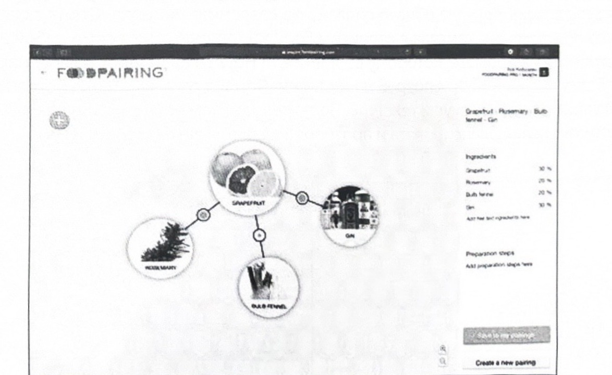

*図：foodpairing.comでグレープフルーツ・ローズマリー・球根フェンネル・ジンを組み合わせたレシピ作成画面（スクリーンショット、原書 p.203）*

私の例にあるミックスはあまり大胆なものではありませんが、こうした「オリジナル」の組み合わせもここでは問題なく組み立てることができます。ロディオンは例として「ベーコン-イチゴ-キャラメル」という組み合わせを挙げています。もっとも、サービス自体は、イチゴの代わりにラズベリーを使うとさらに面白くなるかもしれないとヒントを出しています。

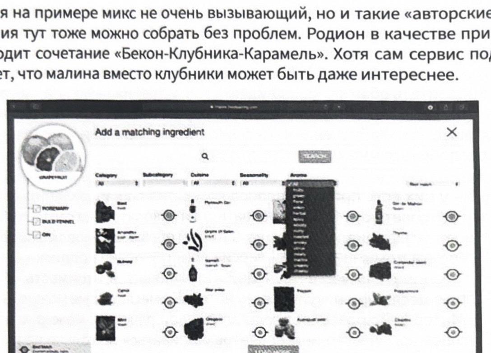

*図：foodpairing.comの「Add a matching ingredient（合う食材を追加）」検索画面（スクリーンショット、原書 p.204）*

このサイトのもう一つの利点は、うまく作られたHow Toのセクションにもあります。これはサービスの使い方を説明するだけでなく、レシピ作成に関する簡単な全般的な手引きも与えてくれます。Foodpairingというサービスに触れていると、おのずと香りに注意が向くことを述べておくべきでしょう。How Toの作成者たちは、食事をする際の私たちの総合的な感覚のうち80%を香りに割り当てています。とはいえ、彼らは味や食感といったものも見過ごしてはいません。これらのセクションには、味をどう組み合わせ、バランスを取り、互いに対比させるとよいかについてのアドバイスがあります。

これらすべてが大げさに思え、このようなツールが過剰だと感じる人のために、もう一つの解決策についてお話しします。私の考えでは、それはより有用性や柔軟性に欠けますが、その代わりはるかに興味深いものです。もったいぶらずに言いますと、IBMのスーパーコンピューターWatsonの話です。ちなみにこれは、かのガルリ・カスパロフをチェスで打ち負かした伝説的なIBM Deep Blueの後継機です。実験として、ウォトソン（あるいはワトソン、お好みの呼び方で）というコンピューターは、ibmchefwatson.comというサイトで希望者全員にコンサルティングを行っていました。しかし、当然ながら、この機械にはもっと有用な仕事が見つかりました。

おそらくまさにそのために、このサイトはしばらく前に閉鎖されました。とはいえ、私はまさに2018年の夏に使っていたような気がするのですが。IBM自身はこれについて何もコメントしていないので、もしかしたら、ひょっとすればまた動き出すかもしれません。面白いものでしたから。稼働中、この機械は月に約5万通りの食材の組み合わせを生成しており、それは否応なく敬意を抱かせるものです。

一方で、このシステムは分子物質の組み合わせだけで動いていたわけではないので、純粋な意味でのFoodpairingムーブメントの一部ではありませんでした。他方で、それは何千ものレシピとその評価から成る膨大なデータの集まりを分析していました。その際、ウォトソンはレシピの新規性を考慮し、単に既知の既存の組み合わせを選ぶだけでなく、何か新しいものを提案しようとし、相乗効果の評価が異なる選択肢の中から選べるようにしていました。同じように、自分のリクエストを、手持ちの食材だけでなく、味のグループやテーマによっても具体化することができました。インターフェースのスクリーンショットは今回用意できなかったので、他人のものを添付しておきます。

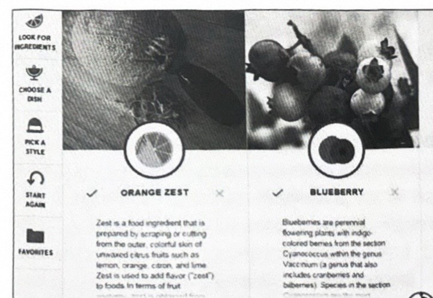

*図：IBM Chef Watsonの食材提案画面（オレンジゼスト、ブルーベリーなど）（スクリーンショット、原書 p.205）*

これらすべてで何が言いたいかというと、今や味についての科学がさまざまな形でますます広く利用しやすくなっているだけでなく、技術の進歩によって、必要な研究をますます深く進めることができるようになっているということです。確かに、この分野はまだ未開拓で、このテーマに関しては今なお答えよりも問いの方が多いのです。しかし、すでに今、私たちが扱わなければならないものの味を改善する可能性についての理解が近づいてきているのが見えてきています。

当然、製品の製造に携わる人は、平均的なマスターがカウンターで作業する際に必要とされるよりも深く芳香物質のテーマを掘り下げなければなりません。しかし、だからといってそれを学ぶことが皆さんにとって役に立たないというわけではありません。こうしたことは、皆さんが成長し、発展し、まさにこの平均的な統計値より上へと抜け出すのに役立ちます。そして食文化（ガストロノミー）は、新しい情報を覗き見し始めるのに最も都合のよい場所なのです。シフト中にまさにシーシャのカウンターから少し目を逸らし、ゲストが注文する飲み物と詰め方を組み合わせ始めることを、誰も妨げはしないのですから。その飲み物の温度、食感、香り、味もまた、シーシャから得られる感覚を大きく補完しうるということに同意していただけるでしょう。

私個人としては、この分野で面白い組み合わせを見つけるのが好きですが、これはもう恒例ですが、別の機会に話すテーマです。

---

### ミクソロジー。イリヤ・ロマノフ

（インタビューからの抜粋）

#### シーシャのミクソロジーとバーテンダーのミクソロジーの違いは何ですか？

香りを巧みに、かつ完全に組み合わせることとしてのミクソロジーですか？　論理はどちらにもあって、残りは別物です。私はかつて、味を組み合わせる論理をバーのテーマ、つまりカクテルのものからもノンアルコールのものからも取り入れていました。私たちの分野では可能性が少なく、たとえば味がそれほど濃厚ではありません。しかし、論理はどちらにも見て取ることができます。たとえば、絶対に組み合わせられない3つの味というものはなく、あるのは無知な配合比率です。強さ、ハーシュさ（きつさ）もあります。私たちのところでは塩味を組み立てるのは非現実的か、あるいは非常に難しいです。多くの人が何かしらの中にそれを感じてはいますが、それは一時的な副次的効果です。添加物なしで非常に辛いものや、他にもいくつかの味も同様に難しいです。カクテルにおける粘性、油っぽさ、ジューシーさは法則性に従って開花します。私たちは味の発展という点ではまだとても若いですが、それでも論理を組み立てています。それは今のところさまざまです。

#### 今日のミクソロジーと5年前のミクソロジーの根本的な違いは何ですか？

私にとっては、私自身の経験の中にあります。市場にとっては、淘汰の中にあります。最も強いものが生き残り、製造の新参者は強者から学びました。品質はより良くなり、味はより多くなりました。組み合わせはより豊かになりました。ゲストたちが面白いものをより繊細に嗅ぎ分けられるようになることを期待していますが、今のところ、経験とともにより強く、より酸っぱくという傾向が続いています。全員ではありませんが、デザートの時期もあり、アールグレイの時期もありました。私個人はこのすべてを追っていますが、自分なりのやり方でやっています。思うに、皆の課題は、注文に応じてあらゆる強さとハーシュさで、害なく、しかしどうかタバコで、最大限に味と蒸気が開いた状態で、1時間にわたって最大限の安定性を提供することだと思います。

とはいえ、これは質問への答えにはなっていません。私にとっては、私は根本的に成長し、アプローチや機材、炭、ボウル、タバコの製造者が生まれ、見つかったということです。市場はより複雑に喫煙するようになり、間違いなく成長しました。全体としてシーシャの素養（リテラシー）は高まっています。ダブルアップル（二倍のリンゴ）は減り、ミックスは増えました。モノのTangiersタバコは減り、Dark Sideタバコ、そしてTangiersタバコは増えました。スターバズは少なく、フマリは少し減り、Nakhlaは変わりました。なんてことだ、今でもライチが恋しいです。

#### 良いミクソロジストは悪いミクソロジストとどう違いますか？

私がマスターについて言ったことは、そのままミクソロジストにも当てはまります。彼は、自分の知識と経験を極めて細心の注意を払って使い、研鑽を積まなければなりません。しかし、それ以上に細心に、ゲストの好みを聴き取り、狙いを定めて傑作を生み出さなければなりません。

虚飾は少なく、独自性はより多く。画家を映し出すのは一筆です。ミクソロジストはコピーすることはできても、再現するのは難しいのです。スタイルが認識できるとは限りませんが、その代わり品質はアプローチからすでに輝いて見えます。私の場合、それほど上手く詰められなかったのに、オーダーテイクの段階からゲストの期待があらかじめとても高かったために、ゲストが歓喜したということがありました。注文とハーシュさには非常に頻繁に的中させますが、強さには無理に合わせようとはしません。しかし、認識できず再現できないオリジナルの作品は、すべてのマスターが持っているべきです。そのほうが単純に楽しいですし。再現された？　じゃあもっと考え出せ！

#### つまり、これは主観的な概念ということですか？

もちろん！　主観的です！　客観的なのは喫煙している本人にとってだけです。

気に入らない、たとえ出来が良くてもね。それなら、お前は望みやオーダーテイクに対して不注意なのです。キリル・ゲンナージエヴィチ自身がかつてこう言いました。味を外したと分かったら、すぐに詰め直す、それ以外については議論の余地がある、と。たしかそんな感じでした。これを尊敬せずにいられますか？

蓼食う虫も好き好き、と言いますが……本当に、どうなんでしょうね？

#### 香りを組み合わせる方法を学ぶためのアドバイスをいくつかください

モノで新しいものを試すこと。市場の傾向と好み、まさに他人の好みを注意深く聴くこと。主観性について上で述べたことを踏まえて。原料とも温度とも、どちらの実験も恐れないこと。ただし、それらすべてはボウル、シャフト、フラスコに添加物を入れず、まさに水だけで喫煙すること。なぜなら、これらはすべてほぼ完成した作品を補正するために必要なものだからです。フルーツカクテルやサラダを研究すること。ミックスが皿の上に、実際にどう見えるかを想像すること。これがメロン、ハチミツ、ベリーなら、どうすればより美味しいか？　ハチミツ50%は明らかにやり過ぎですが、メロンのひと切れと、ハチミツを塗したベリーを散らせば、もう何かになります。2つか3つの味から始めて、その後に初めて発展させること。2つか3つの味の組み合わせから、最も安定したバリエーション（喫煙の全時間を通じて安定したもの）を見つけること。

#### ビジュアライゼーションについての質問です。あなたは提供（演出）に多くの時間を割き始めた最初の一人ですが、どうやってそこにたどり着いたのですか？

私は、そして私一人ではありませんが、フルーツにベリーを刺した串をぶすぶす挿すのは、ヒョウ柄の服と同じくらい俗っぽいと考えました。シーシャは、本質的にはシャフト、フラスコ、ボウルです。そして味の奥行きは果てしないものです。つまり、私たちが何を喫煙するのかという語りこそが、「料理」のサーブ（盛り付け）なのです。私からすれば、成功の80%はオーダーテイクと提供（演出）です。料理そのものが高水準であればの話ですが。

私たちはビジュアライゼーションのトレーニングを考案しました。語りと連想シーシャです。イリヤ・アシミャンツェフも参加してくれましたし、他にも大勢が参加しました。イゴリ・コノヴァロフは今でもシーシャにまつわる物語においてリーダー的存在で、多くのことを頭に植え付けてくれました。

説明しましょう。私は、たとえば何かの絵の味を詰めるわけではありません。でも、もし赤色が、たとえばミゾ（味噌？）チェリーを連想させるなら、絵を眺めることをより濃密に味わえるようにするミックスを、なぜ作らないのでしょう？　没入してもらうために？　シーシャはリラックスさせ、思考を「ひとまとめに」集めてくれます。結果として感覚はより深くなります。私たちは「マイアミ・ブリーズ」を毎回違うものにして作り、連想を集め始めました。

会話に割く時間は少なく、てんてこ舞いです。ボウルが山ほどあります。すべてを一気にやり、提供のときに少しだけ多めに語ります。なぜまさにこうなのか、どんな思いがあるのか。ゲストもまた学び、結果として私たちの雰囲気に染まっていきます。私の強さのスケールについても同じです。これはサービスでもあり、スピードでもあり、理解でもあります。時間があれば解説（読み解き）も行いますし、これは私の考えでは、より面白く、話し方や喫煙の文化を育むものです。

#### 連想というテーマは広まりました。これは面白いのですが、あなたにはかなり議論を呼ぶ解決策、たとえばジェルなどがありますね

私はそれらの上にミクソロジーを築かないようにしています。でも、喫煙中に直接味を際立たせたり変化させたりするのは、まさに製品の品質です！　これはサービスでもあり、ゲストへの配慮でもあります。私のところでは、それは別料金ではなく、サービスの一部です。私はパーシャ・ダヴィドフをとても尊敬していて、「シーシュカ」で彼と一緒に働いていました。これはもう一つの可能性です。おそらく、あらかじめそれらを加えるのは必ずしも適切ではありません。1時間味が保たないからです。しかし、てんてこ舞いのとき、ゲストが正しくない喫煙をしていてシーシャが過熱したとき、これは、ゲストからお金を引き出すことなく、その楽しみを延長する素晴らしい方法です。私はそれらを議論を呼ぶものだとは思いません。

それに、私は上でも言いましたが、私は間違えます、私は人間です。いいえ、私はジェルを間違いだとは思いません。私が言っているのは、ただ、もしゲストが気に入らなければ、彼らは来ない、ということだけです。私のゲストは私のアプローチを気に入っていて、だから通ってくれます。そして私は、みんなが満足しているときが嬉しいのです。「シーシュカ」でのジェルにまつわる話は、ゲストにとっては無料です。味の変化を楽しみたければ楽しもうし、嫌ならやらない。多くの人にとって、これは嬉しい発見です。

#### もう一つ、1から10までの強さのスケールという点があります。これについても多くの人が議論しています。これは当初どのように考えられたのですか？

そもそもスケールは2つあります。強さとハーシュさです。強さとは、喫煙終了後のリラックスの度合いの結果です。ハーシュさとは、過程における感覚です。

Nakhlaタバコをみんなが中くらいと受け止めつつ、ミゾ（味噌？）はアール（グレイ）より軽いと議論しているなら……それを私は基準、中心に据えました。そしてハーシュさを考慮してタバコを分けました。Nakhlaタバコは5〜6、6はシェヘラザード、これはよりきつい……そうして始まったわけです。

簡潔さと教育のために、単純化してまとめることを思いつきました。市場にこんなに受け入れられて、自分でも驚いています。基準点から先はさらに分けることができます。1はノンタバコ、10はシーシャではなく炎、と捉えます。7〜8はTangiersタバコ。9はドハとトンバク（10でもよい）、2はフマリ、などなど。

#### あなたは強いシーシャが好きですか？

好きです。強くて、しかしまろやかなものが。私が知名度を得たのは、タンジ（Tangiers）でたくさん遊んだからです。私のスケールでは、私はタンジを7か、あるいは上に軽いものを足したもの、つまり少し軽めのものが好きです。9を常用することはありません、それは噂です。でも作ることはできます。

---

### ミクソロジーへのアプローチ。ヴラド・パニューチン、アンドレイ・トゥルケヴィチ

この記事は、私の考えでは、シーシャのミクソロジーにおいて飛躍を成し遂げた2人のマスターによって書かれました。彼らは労を惜しまず、自分たちの理解におけるミクソロジーとは何かについてのテキストを書き、初心者に向けたアドバイスをいくつか与え、未来についての自分たちの考えを語ってくれました。

統計が示すように、大多数の人々がシーシャを喫煙するのは、ニコチンを得て「とろん」と座っているためではなく、美的にも味覚的にも、楽しみを得るためです。

ミクソロジーのおかげで、そして人の味の好み、さらにはシーシャのテーマに関する知識の度合いに基づいて、私たちは誰でも驚かせることができます。驚きの効果は、回を重ねるごとにますます大きく発展させることができ、そうすることでゲストを強さの度合いではなく、シーシャの味の質に沿って導くことができます。それによってゲストのロイヤルティ（忠誠度）を高めるのです。

もしカウンターの厨房に100種類の異なる味のタバコがあれば、それは最低でも1000通りの組み合わせになります。これらすべての香りをソロで喫煙してみれば、どの味が、ある特定の時点で、どの温度で、どのようなニュアンスを与えるのかが分かるようになります。これは皆さんのスキルの発展に大いに寄与するでしょう。

この方向性で発展することに自分が興味を持っていると理解したら、これらの味の一つ一つを香料や味の強化剤に分解することができます。それは皆さんの知識レベルを高め、自分がやっていることに対してより意識的に取り組む助けとなるでしょう。

#### ミクソロジーは2つのタイプに分けることができます。ベーシックとPRO（プロ）です

簡単なアナロジーで言うと、青と黄という2つの色を混ぜると、結果として緑という新しい色ができます（これがプロのミクソロジーの例です）。ベーシックなミクソロジーは、基本となる色を活かして遊ぶことになぞらえることができます。たとえば、同じ青を、さまざまな色合いで補い（より暗くしたり、より明るくしたり、あるいは別の形でパレットを多彩にしたりするものの、新しい色を合成することはしない）、という具合です。

実際の例で言うと、「モロッコ茶」（セルゲイ・プトコフのミックス）Nakhla Earl Grey + Cinnamon + Mint + Orange + Lemon + 正しい配合比率 = 複雑なミクソロジーの古典的な例の一つです。Nakhla Blueberry + Lemon + Mint = シンプルなミクソロジーの古典的な例の一つです。

全体として、ベーシックなミクソロジーを取り上げるなら、そこには特に傑出したものは何もありません。だからこそ、それは実質的に誰の関心も引かず、皆が口を揃えて叫ぶのです。「何もかもが何とでも合うし、何でも喫煙できるんだから、それなら一体何を悩むんだ、意味は何なんだ？」と。しかし、もしプロのミクソロジーというテーマに触れるとなると、ここからはもう、ずっと面白くなってきます！

プロのミクソロジーは、まだ発展の初期段階にあるとはいえ、非常に複雑で、多面的で、多様です。言うなれば、「複雑なミクソロジー」は複雑であってこそなのです。

このスキルを発展させるためには、物理学、化学を、タバコの混合物全般に関連する形で理解する必要があります。少なくとも「発酵（フェルメンテーション）」などのような概念を理解すること。それぞれの味をさまざまな条件（温度などの）でソロで喫煙すること。最大限に実験し、すべての物事に頭を使って取り組むこと。この営みは、自分にとって何か新しく面白いものを、実質的に無限に発展させていけるものを習得するために、膨大な努力を注ぐ覚悟のある、目的意識を持った人々にのみ可能なものです。

#### ミクソロジーのような重要なツールの主な使命は何なのでしょうか？

ある状況を想像してみてください。あなたはシフト中で、新しいテーブルの客が来ました。あなたは近づいて、そこに座っている2人の魅力的な女性、金髪と黒髪の女性を観察します。導入のあいさつの後、ありきたりのスクリプト（台本）の代わりに、より気に入った方の女性に（もちろんオーダーテイクの文脈で）こう尋ねることができます。最近どこのカフェ／レストランに行きましたか、と。彼女はおそらくこの突拍子もない質問に答えてくれるでしょう。次にこう尋ねます。そこでどんなデザートを食べましたか、と。仮に、それは「ナポレオン」というケーキで、とても気に入ったと彼女が答えたとしましょう。会話の最後に、締めくくりのフレーズをこんな感じで言います。「他の誰にもできないほど、あなたを驚かせてあげましょうか？」（あるいはそれに類した何か）。それに対して女性は、あなたの説得力次第で、おそらく肯定的な答えをくれるでしょう。

あなたはボウルに「ナポレオン」ケーキのミックスを組み立て、それをこの2人の素敵なお嬢さんに差し出し、何か面白い話を聞かせます。「あなたが洗練されたナポレオンを味わったあのお店のシェフに、その肝はどこにあるのかと尋ねてみたんです。彼は全部教えてくれました。信じられないでしょうが、今、特別に、あなたはそれを喫煙できるんですよ！」と。これで完成です！　こんな提供（演出）をすれば、彼女たちはとろけてしまい、あなたは間違いなく彼女たちを感情へと導いたことになります。あとは、この絵を最後の、しかし非常に重要な仕上げ、すなわち付き添い（サポート）で完成させるだけです。

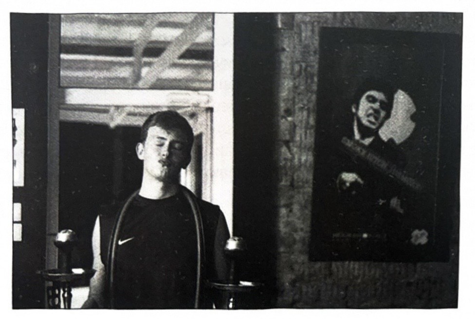

*図：薄暗い店内でシーシャを構え、目を閉じて煙をくゆらせるシーシャマスター（原書 p.214）*

質の高い、巧みなミックスを作るためには、それに向けてゲストの心を傾けさせる必要があります。まさにそうです、ミックスにゲストの心を傾けさせるのです！　何かを押しつけたり、何かを語ったり、何かへと導いたりすることはできますが、本質は、あなたが作ったそのミックスを喫煙する人が、あなたが望むとおりに、あなたがそれをイメージするとおりに、それを感じ取れるようにすることにあります。

ミクソロジーのようなツールは、まさにこんなふうに、シーシャマスターの言語的・非言語的な働きかけとともに、直接的に機能するのです。これを用いることで、すでにこの文化への情熱をすっかり失ってしまった人々に、新たな愛を植えつけることができます。

要するに、私たちの理解では、ミクソロジーは近い将来、シーシャ文化にとってのすべてです。ミクソロジー以外の何において、特にすでに高いレベルで働いている時に、これほど大きく先へと発展していけるでしょうか？　そして今この時点で、最も幻想的で、漠然としていて、理解しがたいテーマは何でしょうか？

それを一緒に発展させ、私たち自身も成長していきましょう！

---

### ミクソロジーへのもう一つの視点、ドミトリー・トレハより

シーシャ系YouTubeでは、かつてフィルとトレハによる「ミックス」というコーナーが人気を集めました。次の素材はディマ・トレハが書きました。

#### 味の組み合わせとミクソロジーの手法

シーシャの世界におけるミクソロジーについて、広く知られた2つの見解があります。

ミクソロジーは必要ない、なぜなら一つ一つの注文／詰めたシーシャは唯一無二で、ある人には合っても別の人には合わないから、というもの。ミクソロジーは、より高い確率で、より深い理解をもって、一つ一つの注文に的中させる可能性を与えてくれる、というもの。

この独白をさらに続けるために、私がこれをどう見ているかを皆さんに説明してみます。ミクソロジーとは、その状況に最も適した結果を得るための味の組み合わせです。

コーラにはどんなレモンがより合うのか？ お茶にはどんな蜂蜜がより合うのか？ 味から渋みをどう取り除くか？ これらもすべてミクソロジーです。

味を組み合わせた結果はさまざまでありえ、それはひとえに皆さん次第です。この短い記事では、味を組み合わせるいくつかの基本的な方法についてお話ししようと思います。

私たちの方法を理解するためには、基礎から始めるべきです。

すべてのミックスは次のように分類されます。1. フルーツ・ベリー系。2. グルメ（食事）系。3. ドリンク系：お茶系、アルコール系、ノンアルコール系（ジュース、炭酸飲料、スムージーなど）。4. デザート系。5. 連想系。

なお、味の方向性が欠けているために特定のカテゴリーに分類できない味の組み合わせもあることを指摘しておきます。例えば、ジンジャー＋セージなどです。

では、ミックスとは何でしょうか？ ミックスとは、いくつかの味の組み合わせです。

ミックス = ベース + 追加の味（+ ノート）。ベースとは味の本体であり、ミックスの方向性を決定します。追加の味とは、ベースを補完するか、あるいはそれと対比させて引き立てるものです。ノートとは、喫味や後味のニュアンスです。

シングルベースのミックスの例：「シナモン入りアップルシュトゥルーデル」。ベースは焼き菓子そのもの、追加の味は焼きリンゴ、ノートはシナモンです。

第二のパターンもあります。ミックス = ベース + ベース（+ 追加の味（ノート））。

しばしば二重ベースのミックスでは、それぞれのベースがすでにミックスになっています。二重ベースのミックスの難しさは、ごちゃごちゃ（カオス）にならないようにすることです。

複雑な二重ベースのミックスを作る際には、構成に含まれるベースが喫煙時に判別できるように注意すべきです。それらが互いに調和するのか、それとも対比として引き立て合うのかは、まったく別の問題です。

二重ベースのミックスでは、追加の味は橋渡し役であるか、あるいはまったく存在しないことがよくあります。ノートはたいてい打ち消されてしまいますが、それに取り組んで、ノートも感じられるようにすることもできます。

二重ベースのミックスの例：「アイスクリーム入りアップルシュトゥルーデル」。ここではベース1がアップルシュトゥルーデル、ベース2がアイスクリームです。

### ミックスの組み立て方

最も基本的なところから始めましょう。ソロ（単体）の味の試し喫煙です。あなたにとって馴染みのないタバコは、各パックを必ず単体で吸ってみる必要があります。これにより、その味に存在するすべてのノートを見つけ出し、その味の弱点と強みを見つけ、そして最も重要なこととして、これと一緒に吸ったときに相性の良い他の味を頭の中で見つけ出すことができます。単体で吸えば吸うほど、より大きな組み合わせのベース（蓄積）が頭の中に積み上がっていきます。

たくさんのことを頭に留めておくのが難しい場合は、便宜上、表を作ってもよいでしょう。やがて、直感的にボウルに味を放り込んで、思い描いたとおりのものができるようになれば、組み合わせを書き留めておく必要はなくなります。

あなたにとって新しい味の中に、あなたの受容器（味覚）にとって馴染みのないものがあれば、それを記録し、その使い道を見つけるよう努めてください。

味｜理想的な組み合わせ｜良い組み合わせ｜普通の組み合わせ
ラズベリー｜野いちご、いちご｜さくらんぼ、レモン｜ブルーベリー、桃

第二の方法、「何と何を一緒に食べる（飲む）か？」に移りましょう。この方法はもちろん抽象的で、必ずしも有効ではありませんが、それなりに成立します。

私たちの目の前に皿（コップ）があり、そこに食べたい（飲みたい）ものを乗せる必要があると想像してみてください。シーシャのタバコの味の多くは、現実の生活で実際に味わえるものなので、想像するのは難しくありません。課題は、皿に乗せたものすべてを食べる（飲む）のがおいしいかどうかを理解することです。

簡単な例として、シナモンをふりかけたレモンパイと一杯のミルク。おいしいでしょうか？ 明らかにおいしいです。シーシャとしてもおいしいでしょうか？ はい、おいしいです。

もちろん、今これを読んで「うえっ、いや、おいしくない」と言う人もいるでしょう。人それぞれ好みがあり、その好みに当てる（合わせる）ことを学ばなければなりません。

さらに理解を深めるために、飲み物で同じ操作を考えてみましょう。一杯のブラックティーを想像してください。そこに添加物を放り込む必要があります。レモンとジンジャー？ はい、誰もが知っていて、多くの人が好みます。ラムとクローブ？ もちろん、それはもうグロッグに近いものですから。

この方法の欠点は、常にうまくいくとは限らないことです。例として、ココナッツ＋ライム。それらを一緒に食べるのは疑わしいですが、シーシャとしてはとてもよく吸えます。

この方法は、一見明らかでない組み合わせを作るのに非常に適しています。セージをジンジャーとサフランと一緒に食べ、それを緑茶で流し込むことを想像しにくいなら、そういうシーシャを詰めて試してみるべきです。この方法を使うと、頭に浮かびもしなかった新しく興味深い組み合わせをたくさん見つけることがよくあります。

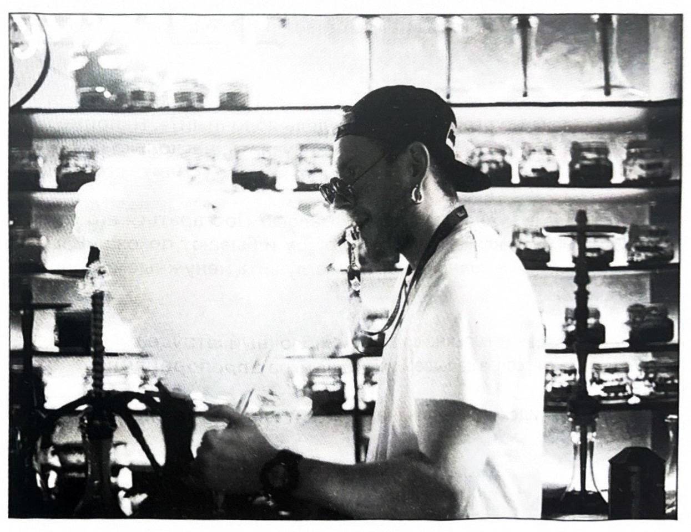

*図：ジャー棚を背に、煙の中でシーシャを仕込むマスター（原書 p.219）*

### 構成要素への分解

この方法の本質をすぐに理解するために、例から始めましょう。

「アップルシュトゥルーデル」を吸いたいと仮定しましょう。シュトゥルーデルとは生地から作る菓子です。現実の生活で生地を作るには、それに味を与える多くの材料が使われます。

シーシャの世界には、そうした味が十分にあり、私たちには最も重要なものが必要です。バニラ、シナモン、クリーム。比率は状況に応じて（タバコのメーカーによって）選ぶべきです。なお、バニラ＋シナモンは、3対1の比率で焼いた生地に近い味になることを指摘しておきます。

次に中身（フィリング）です。焼いた甘いリンゴ。タバコの中でこの味に合うものは何でしょうか？ 明らかに、良いリンゴが必要です。私たちのリンゴにより甘さを与えるためにキャラメル（別名・焦がし砂糖）。そして洋ナシも放り込みましょう。洋ナシはリンゴにとても合い、リンゴの味をより際立たせることができるからです（ここでソロの味の試し喫煙が役に立ちました）。

この場合、ミクソロジーという概念そのものが、「シュトゥルーデルがリンゴ味なのに、なぜここに洋ナシがあるのか？」という問いにおいて私たちを助けてくれることを指摘しておきます。例えば、このようなシーシャのオーダーテイクの際に、ゲストがどれだけ鮮明なリンゴの味を求めているかを聞き出し、もし鮮明な味が必要なら、洋ナシでそれを強めることができます。

必要な味が手元になかったらどうするか？ それを作り出すよう努めることです。多くの味は互いに通じ合っていて、似ていることがあります。あなたの課題は、さらに成分を加えるか、別の味の不要な成分を打ち消すことです。

まとめると、「アップルシュトゥルーデル」の味のシーシャを作るには6つの味が必要で、その先はもうあなたの比率との遊びです。

この方法の本質は、シーシャの味のアイデアを構成要素に分解することです。

アップルシュトゥルーデル｜生地｜中身（フィリング）
クリーム、バニラ、シナモン｜リンゴ、洋ナシ、キャラメル

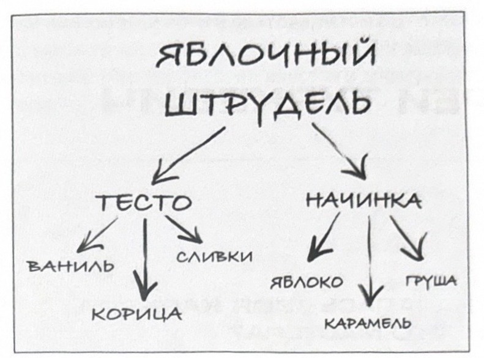

*図：「アップルシュトゥルーデル」を生地（バニラ・シナモン・クリーム）と中身（リンゴ・キャラメル・洋ナシ）に分解するフロー図（原書 p.221）*

メーカーが発売した味が、すでにできあがったミックスである場合もあります。

では、できあがったミックスと自分で組み立てたものとは何が違うのでしょうか？ メーカーはこの味をまさにそのとおりに捉えていますが、あなたはあなたで、それを別のように思い描いていたかもしれず、メーカーの組み合わせがあなたには響かなかったということがあります。同じ味を別のタバコから組み立てれば、構成要素を自分の好みに合わせて調整でき、より高い確率でミックスに満足できるでしょう。

それに、論理的に考えてみましょう。「アップルシュトゥルーデル」という味の缶一つは、喫煙の選択肢がたった一つです。一方、このシュトゥルーデルを構成する6つの味から、いくつのミックスを作れるでしょうか？

覚えておいてください。どのシーシャにも、何か良いところがあります。

実験し、うまくいった結果を書き留め、すべての選択肢を試し、シーシャを吸い、自分の女性を愛しなさい。みんな、ロック（rock）だ！

## アンドレイ・トゥルケヴィチ

（インタビューより抜粋）

### あなたのシーシャマスターとしてのキャリアはどう始まったのですか？

私が初めてシーシャを試したのは、18歳まであと5分というとき、2010年のことでした。初めてアルコールの瓶を空けたのと同じ頃です。なにせ私はスポーツ選手だったので。

私は2014年に、私たちの街のあるアウトソーシング先のカフェで、アルベルトと一緒に働き始めました。彼は今ではクリミアで著名なインフルエンサー（意見のリーダー）の一人です。私はそのような形態でほぼ1年間働きました。街で最初のシーシャラウンジ「グラナート」がオープンし、私はそこへ専属のシーシャマスターとして働きに行きます。7、8か月後、シーシャラウンジ「チェシャ猫（チェシャーキャット）」へ移ります。このプロジェクトについてはもっと詳しく述べたいと思います。

それは私たちの街にとって何かユニークなものでした。フォイル（アルミホイル）のみのシーシャ、時間制の形態、モスクワから来た先輩シーシャマスターたち、彼らはセルゲイ・プトコフの身近な仲間であるグリーシャ・ロドチェンコフ、パーシャ・ゴルバチョフ、そして後にはパーシャ・サヴィノフでした。このシーシャラウンジはモスクワから来た二人の若者が開いたもので、「グラナート」で働いていた間、私はまさにこのシーシャラウンジによく通っていました。

率直に言って、私はそこで働く機会に恵まれました。マスターの一人がカフカス（コーカサス）へ学びに行くことになり、その空いた席に経験のない人を探していたのですが、私が採用されたのです。こうして私とアルベルトの再会が果たされました。そこでまず、グリーシャがゲストとのコミュニケーションを私に教えてくれ、次に物理と化学の基礎をパーシャ・ゴルバチョフが授けてくれ、そして最終的にはそこで、フーカーマッチのチャンピオンであり凄腕のセールスマンであるパーシャ・サヴィノフと知り合いました。これが私の3人の主要なメンターであり、私がマスターとして成長する過程で最も強い影響を与えてくれた人たちです。

この店でほぼ2年間働いた後、2017年の夏、私はNooka Place Yaltaへ移ります。そこで5月初めから8月末まで、私たちは休みなしでヴラド・パニュチンと一緒に働きました。おそらく、このクエストをもって私のマスターとしての成長は完了したと言えるでしょう。

### シーシャマスターの最も重要な3つのスキルを挙げてください。

1. シーシャ市場の知識レベルを維持すること。

2. ゲストと適切にコミュニケーションする能力。

3. 物理的・化学的な用語を理解し、適切に操る能力。

### では、ミクソロジーは？

膨大な数の人々がシーシャにおけるミクソロジーという概念を認めていない私たちの現実においては、これを主要なスキルとは見なせません。もし私の主要なスキルを分析するなら、3つだけに限定したくはないし（これは自尊心の誇示ではありません、本当に）、ミクソロジーはそこに間違いなく入るでしょう。そして、シーシャマスター全般について話すなら、やはりあの3つのスキル＋独自の売り（USP）／こだわり（フィッシュカ）、と呼び方はどうあれ、そういうものになります。

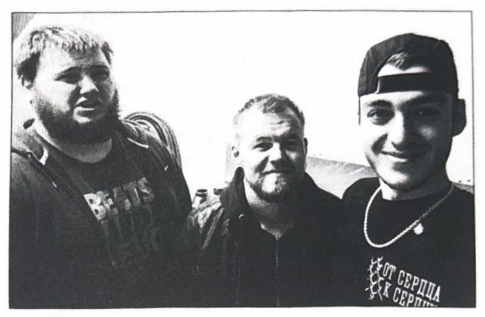

*図：アンドレイ・トゥルケヴィチ（右）と仲間たちのポートレート（原書 p.223）*

### あなたはシーシャのミクソロジーで本当に興味深いことをやってのける能力で名を馳せています。どうやってそこにたどり着いたのですか？

私は自分のこだわり（フィッシュカ）を探していました。今も積み重ね続けている経験のゆえに。繰り返しになりますが、私の理解では、シーシャマスターとは、さまざまな種類の職業から組み立てられた完成したパズルです。料理人、バーテンダー、セールスマン、物理学者、化学者、さらには役者まで。私にとってミクソロジーとは、味の組み合わせと、さまざまな結果を得ることの、果てしない発展です。限界のない発展がどうして魅力的でないことがあるでしょうか？！ なにしろシーシャの構造はおおむね同じままですが、味の組み合わせの理解と見方は成長し、広がっていくのです。これが私のイデオロギー（信条）です。

### 駆け出しのミクソロジストに、いくつかアドバイスをください。

私がアドバイスするとすれば、第一に、単体の味をさまざまな温度条件で試し喫煙すること。第二に、味のパレットを広げること。第三に、自分の受容器（味覚）を忘れず、それぞれの味を完全に理解し感じ取るために、定期的に受容器を清めること。そして第四に、味の組み合わせについての自分の理解に取り組むことです（混ざらない味、合わない味というものは存在しません）。

### 受容器（味覚）はどうやって清めるのですか？

方法その1：3、4日間、揚げ物を完全にやめ、野菜と茹でた食品だけを食べ、そして大量の水を飲むことも重要です。

方法その2：水を約70度の温度まで温め、丸一日かけて積極的にうがいをすること。こうすることで、熱い水によって受容器が洗われ、もしそのいくつかが損傷していても、その回復がより速く進みます。

### あなたはどんな原則でミックスを作りますか？ 何を指針にしていますか？ 何が許されないことですか？

どのミックスも、私は特定のベースに分解し、そのそれぞれを再現し、特定の比率でさらに進めていきます。例えば、韓国風の辛い人参（コリアンキャロット）を、酢、人参、唐辛子という3つのベースに分けます。比率としては人参を多めに、唐辛子を少し、酢をさらに少なくとります。ミックスの組み立てで最も重要だと考えるのは、特定の味の組み合わせがさまざまな温度でどう振る舞うかについての経験と知識です。ミクソロジーにおいて許されないことは、私の考えでは存在しえません。誰もがそれぞれの見方、それぞれの組み合わせを持っていて、それこそがこの分野の一人ひとりをユニークなものにしているのです。

### もっと簡単な例はありますか？

はい、もちろん。季節限定のミックス、グリューワイン／サングリア。本質的には、これらはほとんど同じような話で、提供のされ方が異なり、異なる季節に飲まれ、特定のスパイスが入っています。これらはワイン、香辛料、果物をベースにした飲み物ですが、サングリアは温かいグリューワインと違って冷やして提供される点も異なります。

私たちには3つのベースがあり、それを比率で振り分けます。主役はワインで、それを香辛料で際立たせ、フルーティーなニュアンスを与えます。

- 赤ブドウ（Nakhla El basha）

- Red grape（Al Fakher）

- Sevilla Orange（Tangiers）

- Rose（Al Fakher）

- Cardamom（Nakhla Sheherazade）

- Clove（Tangiers）

サングリアを作るなら、何かしらの冷感（クール感）を加えます。私は真実を主張しているわけではなく、これは私の見方なので、このテーマについてはいつでも議論する用意があります。

### あなたの考えでは、悪いミックスとは何ですか？

そもそも、悪いシーシャというものが存在しないのと同じように、悪いミックスというものも存在しません。ただし、誰にでも合うわけではないかなり特殊な味があって、それがあるミックスに登場することがある、ということは指摘しておきます。特定の人にとって、特定の瞬間には、そのミックスが合わないということです。また、ゲストが自分の受け付けない味を指定する状況もあります。一部のマスターにとっては、それが一種の「クエスト」として作用し、ゲストの嫌いな味を使ってそのゲストの世界をひっくり返してやろうという考えが浮かびます。統計に基づけば、たとえ組み合わせが非常にうまく選ばれていたとしても、100%のゲストが満足するわけではありません。 [原文ママ: гость де вольным не останется]

### どのタバコ同士は混ぜないよう勧めますか？

私はNakhla、Al Fakher、Afzal、Tangiersを使って作業するのが好きです。しかし実際のところ、すべてはすべてと混ざり合うもので、何らかの制約はありません。発想の自由と、味やタバコ銘柄を使う自由、これこそが私のイデオロギー（信条）の主要な側面の一つです。

### なぜまさにこれらのタバコなのですか？

繰り返しになりますが、これは私の仕事の経験から来る、純粋に私の好みです。だからといって、私がこの点で実利主義者で、市場の新製品を扱わないというわけではありません。そんなことはなく、どのブランドにもそれぞれのトップ（一押し）があります。

### ロシアのタバコでどれを特に挙げますか？

今日この日において、私はO-Tobac [原文ママ: 0-Tobat] を挙げないわけにはいきません。今のところ私の中では一番です。特にDaily Hookah [原文ママ: Daily Heckah] が気に入っています。私の考えでは、これはタバコミックスの構成成分の理想的な配合です。また、Cuf [原文ママ] のタバコの味のパレットも興味深いです。Spectrumも大いに頑張っていて、つい最近、Jack-o-Lanternという味を自分のために発見しました。これは愛です。さらに [原文ママ: Спatarco Кога Фете] を挙げたいと思います。それをエゴール・チグリドフが見せてくれて、その仲間たちの哲学について聞くのはとても興味深かったです。その時以来、製品はより良い方向へとだけ発展しています。 [原文ママ: многое еще не попробовал и предстоит попробовать] まだ試していないものも多く、これから試していくことになりますが、現時点ではこんなところです。

---

## 第07章

### サービス ＞ オーダーテイク ＞ 販売 ＞

この章では、さまざまなシーシャマスターがシーシャ店でのサービスについて語ります。業界の発展とともに、ゲストはより要求が厳しくなっています。そのため、店舗におけるサービスは、競争上の決定的な優位性となっています。

## シーシャラウンジにおけるサービス。ゲストとどう接するか。

「ШИШКА LOUNGE」の元シーシャマスター、アレクサンドル・ツヴィルコ｜が、シーシャラウンジにおけるサービスと販売についての見事な記事を書いてくれました。

### ＞ シーシャラウンジにおけるサービス

サービスとは、英語からの訳で「奉仕、仕事、接客」を意味します。私たちの具体的なケースでは、これは当店へ一服しに来てくださるゲストへの接客を指します。すなわち、ゲストの望みを満たすために私たちが行う一連の行動の総体であり、その結果、ゲストが当店への来訪に満足してくださることを目指すものです。

「サービスはレストランのコンセプトに不可欠な一部です。それは料理をさらに美味しくし、ゲストを何度も何度も足を運ばせるのです」――ジム・サリヴァン、アメリカのマーケター、レストランビジネス分野のコンサルタント。当店の厨房で作られる「料理」とは、言うまでもなくシーシャです。

実際のところ、近年では我々の市場における激しい競争を背景に、レストラン業に携わる人々は、まさにこのサービスとその質に、ますます多くの注意を払い始めています。

おそらく私たちは皆、さまざまな店のゲストとして、スタッフの接客がその店への来訪の印象にどう影響するかを、身をもって感じ取ったことがあるでしょう。たとえば、どこか辺鄙な田舎を通りがかり、昼食をとろうと地元の小さなカフェに入ったとき、私はその心からの笑顔、注文の正確さとスピードに感銘を受けたことがあります。しかしそれと同時に、モスクワの中心部のどこかの店を訪れてスタッフとやりとりした際に、無礼さ、いいかげんさ、無愛想さ、そして自分の仕事への完全な無関心といったものに出くわすこともあるのです。

私にとって、店のサービスの質はビジネスの成功を左右する最も重要な要因の一つであることは明白です。ことわざにもあるように、「ゲストが満足すれば、主人も喜ぶ」のです。主人が喜べば、すなわち皆にとって良いことなのです。

また、質の高いサービスをきちんと整えることによってのみ、ロイヤルなゲストや安定した収益という競争上の優位性を得ることができます。私たちのサービスの利用者としてのゲストのロイヤルティとは、まさにあなたのブランドのサービスを利用するという習慣に基づき、他の選択肢を除外した、ゲストの好意的な態度と感情的な結びつきのことです。つまり、大雑把に言えば、ロイヤルなゲストとは私たちの常連であり、一服するなら私たちの店にしか来ず、いつも何もかもに満足していて、自分の知人皆に、あなたの店がどれほど素晴らしいかを語ってくれる人のことなのです。

しかし、ゲストのロイヤルティを獲得することは、継続的で、しばしば長期にわたるプロセスです。継続的であるということは、それが一瞬たりとも途切れないということであり、私たちは常に常連のゲストに対して責任を負っているのです！

私の見解では、店内に「フレンドリーな雰囲気」を作り出すことは非常に重要です。近年これは、シーシャラウンジに限らず、非常に人気のあるテーマとなっています。一人ひとりのゲストを覚えるように努め、会ったときには名前で呼びかけましょう。これはどんなゲストにも、自分が大切にされているという感覚を与えます。ただしその際には、友好的なコミュニケーションと馴れ馴れしすぎる関係との間にある微妙な境界線を感じ取り、それを越えないようにしなければなりません。

さらに、店全体の雰囲気にはスタッフの気分が非常に強く影響すると、私は心から思っています！　あなたが自分の仕事を愛し、責任を持って取り組んでいれば、ゲストはそれを見て、感じ取ります。あなたが悪い気分でも良い気分でも、ゲストはそれを感じ取りますし、あなたがゲストに対して悪く、あるいは敬意を欠いた態度をとれば、それは微妙なレベルで感じ取られてしまいます。ですから、仕事中は常に良い気分でいて、すべてのゲストを心から愛し、敬いましょう。そうすればゲストも、あなたに同じように接してくれるのです。

加えて、覚えておくべきは、あるゲストはコミュニケーションを好み、まさにスタッフと日常的・専門的な話題で会話するためにシーシャラウンジに来るのに対し、別のゲストはシーシャを吸って読書に没頭したり、ノートパソコンで仕事に没入したりするために来る、ということです。

後者は概して、あまりおしゃべりをせず、ただ自分のお金と引き換えに質の高い製品を受け取ることを期待し、質問や会話であまり煩わされたくないと思っています。こうしたゲストはいつも非常に集中していて、しばしばシーシャの状態についての問いかけにすら反応しないこともあります。そのような場合は、炭を交換して、そっと退散するのが最善です。

一方、コミュニケーションを好む第一のタイプのゲストには、もちろんそれを拒むべきではありませんが、肝心なのは、業務に支障をきたさない範囲で行うことです。単純に言えば、会話をする時間があるなら、それを割いてあげればよいのですが、繁忙時にどなたかのゲストがあなたと関係のない話題で会話を始めようとした場合は、会話の時間がないというごく当たり前の理由を説明して、柔らかな形でお断りしなければなりません。

さて、ここからは、私がシーシャマスターやシーシャラウンジのスタッフの仕事をどのように段階的に捉えているかについて、もう少し詳しく話すことができます。ルーシでこう言われていたように――「ゲストを歓迎するなら、門の外で出迎えよ」。

たとえば、どこかの小さなカフェやレストランに入ったとき、とりわけ初めての場合、たとえばクロークがどこにあるかも分からず、ましてやどのテーブルに座ってよいのか、そもそも空席があるのかも分からず、入口では誰も出迎えてくれない、ということがあります。そして戸惑いながら立ち尽くし、どうすればよいか分からない……。あまり気持ちのいいものではないですよね？

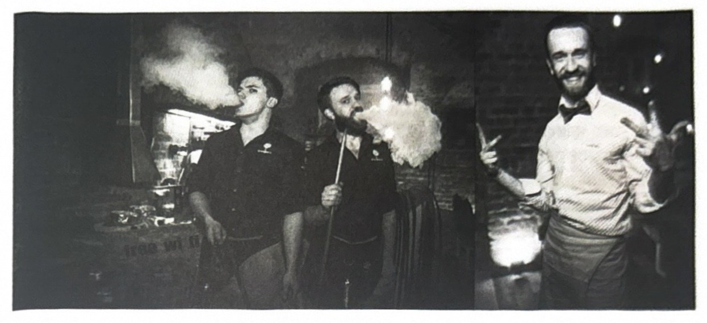

*図：店内で煙をくゆらせるシーシャマスターたち（原書 p.233）*

だからこそ、ゲストは常に敷居のところから出迎えなければなりません。これはあなたのもてなしの心を物語ります。とりわけ、魅力的な笑顔の美しい女性が出迎えてくれるなら、なおさらです。

ゲストがテーブルに着き、（もしあれば）開いた状態のメニューが手渡された後、ゲストのもとへ赴き、注文の準備ができたかどうかを確認する必要があります。私が思うに、ゲストが上着を脱いでテーブルに着く前にオーダーテイクのために近づくのは、少し不適切です。なぜなら、まずはゲストが快適に落ち着くべきだからです（例外は、ゲスト自身が注文するためにあなたを呼ぶ場合です）！

オーダーテイクの際には、次の点を確認する必要があります。

強さ（マイルド、やや強め）

- 味の特徴（酸っぱい、甘い、爽やか、甘酸っぱい、スパイシー、フローラルなど）

- 好きな味、嫌いな味（何を基準にできるか、そしてボウルに絶対入れるべきでないものは何か）

- どの吸い心地（ドロー）を好むかを基準にして、ゲストが吸いたいと思う器材を確認し、ドローに合ったシーシャあるいは詰め方を選んであげること

- ゲストによるボウル選びについては、答えが一筋縄ではいきません。なぜなら、ゲストには自分が吸いたいと思うボウルを選ぶ権利がある一方で、私たちプロとしては、特定のタバコや特定の喫煙者にどのボウルを合わせるべきかをより熟知しているべきだからです

- 常に注意深くある必要があります。なぜなら、もしゲストに何かを確認し忘れた場合――たとえば、ゲストがフレッシュ（みずみずしいもの）を頼んだからといって、パンラース入りの何かを詰めようとしたものの、ゲストはそれを吸わず、その人にとってフレッシュとは要するにオレンジのことだった、というような場合――それがあなたのボウルへの不満の原因となり、結果として詰め直しにつながりかねないからです。つまり私たちの課題は、ゲストが何を吸いたくて、何を吸いたくないのかをできる限り正確に理解し、それをできる限り正確に実行することです。当店での実践が示すように、詰め直しが起こるとすれば、それはひとえに、注文が正確に受けられていなかったからにほかなりません（ボウルに嫌いな味が入っていた、強さが合っていなかった、など）。万一ゲストがボウルの詰め直しを断固として要求する場合は、それを最優先で、できる限り迅速に行わなければなりません！

たとえば、あなたがカウンターの後ろで詰め作業に追われているときに、新しいゲストが着席し、今すぐには物理的にオーダーテイクのために近づけない、という場合、その際にはゲストに、あなたが彼らの来店に気づいていることを示す義務があります（目で彼とコンタクトを取り、うなずき、挨拶をして、手が空き次第すぐに注文を取りに伺うと伝えるのです）。

私が働いている店では、シーシャのオーダーテイクの最大所要時間は5分です！　しかし繰り返しますが、たとえすぐに近づけなくても、あなたがゲストの来店に気づいていることを知らせることが非常に重要です！　シーシャの提供にかかる最大時間については、その時間枠は15分に制限されています。15分というのは、ホールが満席の状態での最大の提供時間です。つまり、満席でなければ、シーシャはもっと早く提供されるべきなのです！　同意していただけると思いますが、ゲストの顔に「おお、なんて速いんだ！」という言葉を伴う喜びの驚きが浮かぶのを見るのは、嬉しいものです。ですから、常にできる限り速くシーシャを準備して提供するよう努めるべきです。ゲストはあなたの仕事ぶりを評価してくれるでしょう。

シーシャを提供する前に、皿（ソーサー）とホースが清潔で乾いていることを確認してください。そうでなければ、それらを拭く必要があります。提供中に偶発的に落下するのを防ぐため、ボウルがシャフトにしっかりと固定されているかを確認してください！

シーシャを提供する際は、可能な限りオープンな仕草で渡しましょう。つまり、ゲストに近づいたときに、彼があなたの左側にいる場合はシーシャを右手で渡し、ゲストがあなたの右側にいる場合は左手で渡します。ただし、これが他のゲストにとっても、そしてあなた自身にとっても快適であることが前提です。

また、シーシャ職人はゲストに、使い捨てマウスピースを装着した状態でホースを渡す義務があると私は考えています。ただし、マウスピースをホースに装着する際は、指で触れないようにするため、マウスピースの包装を最後まで剥がさずに行うべきです。これはあまり衛生的ではないからです。そしてもちろん、これは繁忙時に少し時間を節約してくれます。あなたの熟練した手なら、たとえば長い爪に塗りたてのマニキュアをした女性などよりも、ずっと速くこれを行えるからです。

また、当店ではシーシャの喫煙時間を調整するために、時間制料金の方針を採用しています。これは混雑度が高いことに起因しています。

私の見解では、1時間にわたって安定した喫煙を実現するための主要な条件の一つは、正しく設定された温度管理です。つまり、シーシャを提供する際に、あなたは喫煙開始から5分後、10分後、15分後にそれがどのように振る舞うかを理解していなければなりません。そして、まさに喫煙開始の最初の5分間にゲストのもとへ赴き、シーシャの吸い具合を尋ねることが非常に重要だと思います。なぜなら、まさにこの最初の5～10分間に、ボウルが過熱したり加熱不足になったりする可能性が高いからです。加えて、ゲストはそれぞれ吸い方が異なる（男性、女性など）ため、温度は喫煙者一人ひとりに合わせて個別に調整する必要があります。

さらに、具体的に当店では、内部基準によって炭の交換は15分ごとに行われるべきとされています。これは、ロボットのように近づいて、どのボウルの炭も機械的に交換しなければならない、という意味ではありません！　15分ごとにシーシャ職人はテーブルに赴き、シーシャの状態を尋ね、必ずホースを借りて、シーシャが本当によく吸えるかを自分で確かめ、必要に応じて炭を交換しなければなりません。

また、シフトに入っている間、シーシャ職人は常にゲストを、彼らがどう吸っているか、吹き戻し（プロドゥフカ）後の煙の量を注意深く観察しなければなりません。なぜなら、吹き戻し後にボウルから煙が立ち上るように噴き出すのであれば、それはおそらく過熱だからです。また、フラスコが透明であれば、その中の煙の濃さを観察できます（煙が濃くなければ、温度を上げる必要がある可能性が高い）。そしてゲストの反応――その顔には、シーシャを気に入っているのか、それとも何か問題があるのかが、すべて書いてあります。

もしゲストの誰かが正しく吸えていない（吹き戻しをしない、吸わない、深く吸い込まない、など）のを見かけたら、近づいて話しかけることは、私の神聖な義務だと考えています。シーシャの吹き戻しバルブが何のためにあるのか、なぜタバコのようにではなく深く吸い込まなければならないのか、吸い終わったらホースを自分のところに留めずに次の人に渡さなければならないことを説明するのです。こうして、あなたはゲストにシーシャ喫煙の文化を植え付けるのです。

おそらく誰しも、ある種の「体内タイマー」が作動する、面白い状況を経験したことがあるでしょう。たとえば、5番テーブルはもうかなり時間が経ったから炭を交換しなければ、とふと思い当たります。そのテーブルに近づくと、ゲストからこう言われるのです。「おお、ちょうどいいタイミングだ、ちょうど炭を交換しなきゃと思っていたら、もう来てくれた」。これは、ゲストの望みを予測する、あるいは先取りする、と呼ばれるものです。

信じてください、ゲストはこれに大いに喜びます。なぜなら、あなたが常にゲストの望みを予測するなら、それはあなたの高いプロ意識と仕事への真剣な姿勢を、そしてゲストへの気配りと配慮の表れを示すものだからです！

たとえば、女性が縮こまって座っていて、おそらく寒いのだろうとあなたが気づいたとします。その場合、あなたは待つことなく彼女に近づき、ブランケットをお持ちしましょうと提案すべきです。これによってもあなたは、彼女の望みを言い当て、その期待を先取りしているのです。

各時間の終わりに、私たちはゲストのもとへ赴き、十分に吸えたかどうかを尋ねます。十分でなければ、もう一台シーシャを注文するよう勧めます。十分であれば、お会計をお持ちしましょうかと提案します。ただしこれは、ゲストがちょうど1時間、1分たりとも長くなく吸う、という意味ではありません。もし1日の始まりであったり、あるいは閉店が近づいていて店の混雑度が低く、すでにゲストが座っているテーブルに予約も入っていなかったりする場合、私たちはロイヤルティ（柔軟な姿勢）を示し、ゲストが新しいシーシャを注文すること、あるいは1時間の喫煙の後すぐに会計を済ませて店を出ることを、強要はしません。

つまり、結局のところ、1時間の喫煙の間にマスターは、シーシャの状態を尋ね、必要に応じて炭を交換するために、最低でも4回はテーブルに赴くべきだということになります。1時間にわたる安定した喫煙のためには、これで十分です！

喫煙の終わりに、ゲストにどのように時間を過ごしたか、どう吸えたか、何が気に入って何が気に入らなかったかを尋ねることは、重要なことだと考えています。「良かった」「素晴らしかった」「最高だった」「すてきだった」と答えるなら、おそらく実際にその通りなのでしょう……。しかし、もし返事として「うーん、まあ」とか「普通」と聞こえたなら、おそらく何かが気に入らなかったのです。この瞬間には、少し粘り強くなって、なぜ「良かった」ではなく「普通」なのか、ゲストが具体的に何を気に入らなかったのかを確認するのが良いでしょう。次回はそうした間違いを繰り返さないためにです！

そして当然のことながら、ゲストが店を出るときには、お見送りの挨拶をしなければなりません……。たとえそれが、つんと鼻を高く上げ、あなたに何の反応も示さないご婦人方であっても、あなたは完璧であってください。

## シーシャの提供。ミハイル・プロホロフ

これは、もう「使い古された」テーマに思えるかもしれません。しかし、かなり長い間、私はこんな光景を目にしてきました――ほとんどすべてのシーシャマスターがこのことを知っているように見えるのに、実際には何も知らないことが分かるのです。あるいは、もっとひどいことに――知ってはいるのに、ただそれをやらないのです。以下に書かれていることはすべて、私自身の実践からのエッセンスであり、絶対的な真理を主張するものではありません。また、これをどう行えばよいか、そして私のもとではどう機能しているかという、具体的な手法やコツも共有します。

ちょっとした注意点です。以下に挙げる行動はすべて、すべてのゲストに対して行う必要はありません。一貫性（コングルエンス）を保ってください。すべては場にふさわしく、状況に合っていなければなりません。

まず始めに言うと、私が訪れたことのあるほとんどすべてのシーシャラウンジでは、シーシャの提供はせいぜい、マスターがボウルに詰めたさまざまなタバコの味を私に列挙するだけ、というものにとどまっていました。時には、シーシャを持ってきて黙って去っていく、ということすらありました。最も残念だったのは、シーシャ自体は素晴らしいものだったこともあるのに、私の感情は、最高の場合でも、まあまあの店に行ってまあまあのシーシャを吸ったな、というところで終わってしまった、ということです。しかもそれは、自分自身がこの業界で働いている私の場合の話です。では、シーシャを扱っていないゲストについては、何をか言わんやでしょう？　こうした考えが、私を、ゲストへの自分自身のシーシャの提供に取り組み始めるよう駆り立てたのです。

第一に理解すべき重要なことは、人々は感情を求めて店に来る、ということです！　これは、まさにあのマズローのピラミッドにもあるとおり、ごく普通の社会的な人間の欲求です。店で提供される多くのサービスを、人々は自宅で、自分の力でも得ることができます。美味しい食事や飲み物を作る、シーシャを詰める、などです。

しかし彼らは、私たちのところへ来てくれるのです。もちろん、ただ単に、誰にも余計に邪魔されたり構われたりしないように、ノートパソコンを持って仕事をしにシーシャラウンジに来るゲストもいます。彼らはただ質の高い製品を受け取りたいだけで、それだけなのです。

第二に理解すべきことは、男性と女性とでは感情的な受け取り方が異なる、ということです。そして、男性のグループにシーシャを提供する場合と、女性のグループに提供する場合とでは、それを少し違ったやり方で行うべきです。

一つのシンプルなテクニックを共有しましょう。仮に「ストーリーズ（物語）」と呼ぶことにします。

メリット:

1. ゲストは、シーシャがいい加減に作られたのではなく、それに魂が込められていることを目にします。
2. 自分をプロとして位置づけられること。

3. それを自分の「名刺代わり」にできること。

4. たとえ、うっかり「でたらめ」を言ってしまったと気づいたとしても、あなたはそこにあえて焦点を当て、ゲストと一緒にそれを笑い飛ばすことが非常に簡単にでき、それによって皆の気分を盛り上げられること（これは特に、このコツを習得する段階でうまく機能します）。

5. ゲストのロイヤルティの強化と、新規ゲストの流入の増加。

6. その結果としての、追加シーシャの販売増。

7. そしてその結果としての（給料が歩合制で構成されている人にとっての）給与の増加。

デメリット: すべてを正しく行えば、それはありません。

これはどう機能するのでしょうか？　とても簡単です。たとえば、あなたのもとに男性のグループのゲストが来て、繁忙ではなく、あなたが多かれ少なかれ手が空いているとしましょう。彼らから注文を受けます――やや強めの方向の中程度のもので、酸味のある爽やかなもの、と。

あなたはレイヤード（層状）の柑橘系の詰め方をしました（下層は、たとえばTangiersのPlum、中層はNakhla MixのIce Lemon Mint、そして上層はNakhla MizoのLemon、というように）。

続いて、あなたはシーシャを運び、こう言います。「ご存じですか、あなた方のボウルを詰めている間に、ある場所を思い出して、それを描いてみることにしたんです。さあ、ごく普通の、日が照り、風の吹く、緑の草が生い茂る野原を思い浮かべてみてください。

あなたのボウルの中の太陽――それは、最初に感じるレモンです。なぜなら、レモンは太陽と同じように丸くて黄色いですから。太陽はそこに生えている草を照らします。草というのは、ご存じのとおり緑色です。あなたが次に感じるライムと同じように緑色なのです。爽やかさ――それは風です。では、草はどこから生えているのでしょう？　大地からです。大地は黒く、Tangiers（タンジェ）もまた黒い、しかもそこには黒スモモの味があるのです」。

同じこのボウルを、もし女性たちが注文したのであれば、どう提示できるでしょうか。「ご存じですか、あなた方のボウルを作っている間に、とても美しいある場所についての、あまりにも鮮やかな記憶が私に押し寄せてきたので、ほんの一瞬でもあなた方をそこへお連れすることにしたのです。広々と広がるロシアの野原を思い浮かべてみてください。涼しい風がそこを吹き渡り、四方からあなたを撫で、鮮やかな緑の草が茂り、夏の灼けつくような太陽が照りつけ、その光線の触れる感触をあなたは肌に感じています。まさにこの太陽が、あなたのボウルの中では、最初に感じる酸っぱいレモンのノートとして表現されています。なぜなら、レモンのひと切れは、あの野原の上の太陽と同じように丸く、黄金色だからです。太陽の光線は、柔らかく鮮やかな緑の草を照らします。あなたが少し後に感じるライムと同じように緑色の草を。酸っぱく、深みのある味わいです。そして、そこには心地よい涼しい風が吹いていて、灼けつく太陽の光線からあなたの肌を冷ましてくれるので、あなたはさらに軽い冷たさも感じることでしょう。では、草はどこから生えているのでしょう？　大地からです。そして大地は黒く、下に敷かれているTangiersのタバコと同じです。それが軽く甘いスモモのトーンを与え、酸味をわずかに和らげてくれるのです」。

違いは、女性にはより多くの感情を与える必要があるのに対し、男性には単にいくつかの論理的な連想の系列を示せば十分だ、という点にあります。男性は、これほど風変わりな形でシーシャを提示されたという事実そのものと、味の構成要素と描写された野原の中の対象とが一致しているということから、肯定的な感情を得ます。

女性はより感情的な存在です。ですから、彼女たちは感情に沿って解きほぐしていき、自分の話の中に質の高い形容詞をより多く盛り込み、すべての細部をより多く、より鮮やかに、より深く描写するのが良いでしょう。状況に直接没入させるような言い回し（「思い浮かべてみてください」「光線が触れていくのをあなたは感じています……」「あなたの肌を撫でる涼しい風」など）を、より多く使うことができます。また、話を現在時制で語ることも、状況への没入を助けます。

さて、この手法の本質が明らかになったところで、ボウルにタバコを投げ入れている、まだその最中にさまざまな物語を素早く作り出せるような、いくつかの「ケース」をご紹介しましょう。

1. 自然（上の例のように）。

あるいは、森について何か考え出すこともできます、などなど。

2. 旅（「あなたは山々を旅していて、老人があなたに本物のヒマラヤの蜂蜜をふるまってくれました。それはあなたを内側から温め、あなたの受容体を最も鮮やかな甘さで満たしました……」云々）。

3. 買い物（「あなたは青いBMW（blue mist）を買って、その買い物を祝いました（Argeliniのシャンパンで）……」）。

4. 食べ物と飲み物（「そして、この素晴らしいインドのマサラチャイをひと口飲んだとき、あなたはあまりにも多面的で包み込むような味わいを感じ、それは何物にも比べようがありませんでした。同時に、あなたは胡椒の辛さも、柔らかなミルクの味も、そして……を感じたのです」）。

手始めに、これらのケースを練習し、それらに沿った自分自身のパターンを編み出すことができます。物語のための、いわば柔軟なテンプレートのようなものです。これは将来、それらから離れて、互いに似ていない色彩豊かな描写をその場で考え出すことの助けになります。

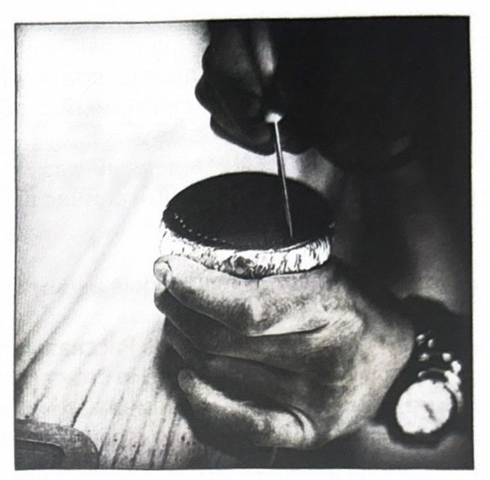

*図：針でホイルに穴を開けてボウルを準備する手元（原書 p.241）*

また、物語の役割を果たすのは、必ずしも連想の系列でなくてもよい、という点も指摘しておくべきでしょう。それは単なる短い話でもよく、できれば1分を超えない、詰め方の全体的なコンセプトと何らかの形で結びついていて、感情的な要素を持っているものであればよいのです。それは、あなた自身が初めてシーシャラウンジに来てシーシャを吸い、それに感銘を受けた、そして今、ゲストにまさに同じものを作った、というような話ですらかまいません。

以上述べたことを総括して、いくつかの結論を導きます。

1. 物語を、誰にでも、いつでも語る必要はありません。語るのは、手の空いている、コミュニケーションに乗り気なゲストに対してだけです。押しつけがましくならないようにしましょう。

2. 物語はできる限り簡潔であるべきですが、その際にその感情的な要素が損なわれてはなりません。シーシャのプレゼンテーションが1分を超えないことが極めて望ましいです。

3. 男性には論理を、女性には感情を。

4. 連想の系列だけにこだわるべきではありません。それは、30秒や1分の短い伝説（レジェンド）でも、自分自身の経験からの話でもかまいません。

最後に指摘しておきますと、シーシャのプレゼンテーションを始めることに対する最もよくある反論は、こういう言い分です。「いやいや、私がこういう物語を語り始めたら、周りの皆も語り始める。そうしたら、それはもう私だけのコツではなくなる」。実のところ、それはそういうふうには機能しません。「伝説」を使ってシーシャを提供するシーシャマスターが3人いるかもしれません。そして、その3人のマスターのそれぞれで、これらの「伝説」は異なるものになるでしょう。

ある人はより簡潔で引き締まった表現を、別の人はユーモアを交えて、また別の人は文学的な語彙を使った美しい一分間の描写を行います。

これらはすべて、あなた自身の気質と、あなたが体現している全体的なイメージによって決まります。ですから、誰かのシーシャのプレゼンテーションの仕方をコピーしようとしないでください。あなた自身のスタイルを、あなた個人に合うように築き上げてください。あなたが「何を」語り、「どのように」語るかが、あなたの全体的なイメージと矛盾しないように。そうすれば、シーシャを提供する際のどんなストーリーも、しっくりと響くようになります。

## オーダーテイク。デニス・シヴァチェンコ

デニス・シヴァチェンコ、地域マネージャーХП、モスクワ

レストランには一般に広く受け入れられている販売の技術が存在します。それはすでに何十年も機能してきました。当然ながら、レストランとシーシャクラブを比べる必要はありませんが、シーシャクラブも新たなレベルへと進む時が来ています! 質の高いオーダーテイクと、質の高いサービスのレベルへと! そして当然ながら、私たちは皆お金が好きです。つまり、私たち全員が販売を伸ばし、自分の仕事に(部分的に)標準化を取り入れ始める時なのです。

> 販売の技術

第1段階。ゲストとの接触の開始。

この段階では、いくつかの項目を行う必要があります。挨拶をすること。名前を名乗ること。ゲストがどのくらいの頻度で吸うのかを把握すること。ゲストのもとへ向かいながら最初の項目を実行している間に、ゲストの気分や、接触に応じる準備ができているかどうかを理解する必要があります。

第2段階。ゲストの希望とニーズの把握。ゲストが使える時間を確認すること。シーシャの強さを確認すること。希望するシーシャの味と、好まない味を確認すること。

追加で:

(会話の流れの中で)テーブルの上の飲み物に注目すること。選ばれた味に対して、追加の味のアクセントを提案すること(あなたはおそらく、ゲストよりもミックスに詳しいはずです)。

第3段階。把握したニーズに基づく提案。必要なことをすべて把握したら、いよいよ販売そのものを行う必要があります。ここからゲストとのゲームが始まります。ここで私たちは客単価を上げようと努めます!

選ばれた味と強さに合わせて、適したフルーツやオリジナルメニューの品を提案します。しかしこれも正しく行う必要があります。フルーツやカクテルの提案は、笑みやにやけを浮かべず、自信に満ちた話し方で行います。次に、少しイントネーションを落とし、信頼を抱かせるような話し方で価格を伝えます。そのシーシャの利点について、もちろん自信に満ちた話し方で語ります。

第4段階。ゲストの質問に対応する。

一部のゲストは、どんな状況であろうと価格を聞くと身構えます。なぜなら彼らは月給が2万ルーブルだったり、オリョール郡から来た学生だったりするからです。一方、別の一部のゲストは価格を聞いても支払うことができますが、彼らは自分が何に対してお金を払うのかを理解する必要があります。もちろん、他の段階と同様に、ここでも各自が自分なりに対応します。そして、してはいけないこと(ゲストと議論する、話を遮る、など)や、すべきこと(誘導的な質問をする、好意的であること……)を述べることは、不要だと私は考えます。ここは各自が自分で書き出せばよいでしょう。

第5段階。提供の順序。

私たちのシーシャラウンジの大半はキッチンに問題を抱えていますが、中にはキッチンがある店もあり、あるいはゲストが自分の食べ物を持ち込んでくることもあります。いつシーシャを出せばよいか確認してください。準備ができ次第か、食事を終えたタイミングか。

第6段階。注文を実行し、フォローする。

- 注文を実行するうえで、奇妙に聞こえるかもしれませんが、まず始めるべきことは、注文を時間通りに出すことです。シーシャについてゲストからフィードバックを得ること。ただし、これはゲストがシーシャの味をしっかり味わえるよう、数分経ってから行ってください。

そして15〜20分ごとに炭を交換すること。シーシャを(可能な限り)安定した温度に保つことで、私たちは最大限に安定した喫煙を提供し、過熱や加熱不足を避けるためにシーシャの管理を行います。そして、これほど頻繁に立ち寄ることで、私たちはゲストのことを気にかけていると示すのです。

第7段階。新しいシーシャの提案。

私たちはレジ売上と自分の給料を上げる必要があります。一定の時間が経過したら、新しい商品を提案します。ただし、もしチェックの際にシーシャが申し分なく振る舞っていると分かるなら、新しいシーシャを無理に押し売りする必要はありません。私たちはゲストにまた戻ってきてほしいのですから!

第8段階。お別れ。

彼に「バイバイ」と言います。そして、彼がもう一度来店したいと思うよう、私たちの近々のイベントを伝えます。これは純粋に私個人の見解として書いたものです。それは他の見解と同様に、主観的なものです。

> 

## アンドレイ・レーシ

(インタビュー抜粋)

> シーシャの仕事をどこで始めた? そもそもХПの前はどんな店で働いていた?

УКのチェーンで下積みを始めました。「ミスト」「シン」「シュタブ・П」「К8」といった店や、エディク・イスマギロフがいた頃の「イッリ」というバーで。これに加えて、仲間の応援でペテルブルクの他の店にも出向いていました。残念ながら、これらの場所の多くはもう存在しません。

> 学歴は?

人生という学歴ですね。私たちの体系には「高等教育中退」という表現はないようなので、中等教育ということになります。実際のところ、組織マネジメント学科の5年生のときに大学と別れました。一部は大学の統合のせい、一部は怠けのせいです。永遠の学生ですね。大学で大事なのは卒業証書ではなく、人生の様々な状況と、そこから何を学び取ったかだと、私は思います。

> シーシャ以外には何に夢中になっている?

- 音楽です。聴くことも、演奏することも。一時期は仲間と演奏して、ライブをやったり、レコーディングをしたりしていましたが、今は各地に散らばってしまいました。かなり最高の息抜きであり、疲れやネガティブな感情のはけ口です。

スケートボードで滑るのも楽しいですし、街を散歩するのも好きです。主に夜、人がいない時間帯に。大きな人混みは好きではありません。私たちの業界の仕事とは噛み合わないことですが。そしてもちろん、バー巡りも欠かせません。なおさら、すでにペテルブルクの飲んだくれというイメージが出来上がっているので。

> 好きなアルコール飲料を3つ挙げると?

トリ・トポラ、ヴィノグラードヌイ・ジェニ、それにブレイザー。まあ、基本的に私はお酒が好きで、あえて挙げるなら、たぶんジン、カンパリ、ラムですね。バーボンとウォッカはあまり好きではありません。

> あなたにとって「シーシャ文化」という概念はある? あるなら、あなたにとって文化とは何か教えて?

私としては、こう分けられると思います。アラブの、正統的な喫煙文化。モノフレーバーや、どちらかと言えばブラック・タバコ、外見やその他の付属物。そしてもう一方は、現代的な、私たちのスタイル。ただこれは、シーシャ業界の存在の全体的な、外面的な側面で言えば、ということです。そう表現できるならば。

私にとってそれはむしろ、あのコミュニケーションです。従業員とゲストの間だけでなく、この業界全体における交流。なにしろ、そもそも今ではシーシャはコミュニケーションの手段として推し進められています。しかし、それはまだまだ築き上げていかなければなりません。なぜなら今はかなり曖昧な概念であり、まとまりや、いわば結束のようなものがないからです。

皆お互いのことを知ってはいるようですが、共同体意識はまだ希薄です。ロシアで人々が東洋風やトルコ風に装飾されたラウンジから離れ、何か一体的なものを作り出そうとしていた頃は、もっと簡単でした。なぜなら、単純にすべてが少なくて、皆が互いに支え合っていたからです。要するに、議論の余地がある点ですね。

> なぜシーシャを仕事にしようと決めた?

- ここはありきたりです。最初は、今のほとんどのマスターと同じく、ただ仲間を手伝っていただけです。それが、気づけばもうシフトに入っていました。面白かったですし、創作の余地があり、せいぜいタバコ会社が全部で5社くらいしかなく、業界全体の動きがオフィスワークよりずっとダイナミックでした。

それに当時は、ミルクや焼き菓子の既製フレーバーなどなく、すべて自分たちで作っていました。業界に深く入り込むにつれて、態度も変わりました。より真剣に、とでも言いますか。業界そのものも成熟していきました。

- 要するに、いろいろな分野で働く機会があり、そのほうが性に合っていました。ちなみに、面白い事実があります。私たちの仲間がペテルブルクでフーカ(Hookah)を開こうと思いついた頃、私はシーシャから足を洗って、専門を活かした仕事を探そうとしていたところでした。でも誘いが来て、どうなるか見てみようと決めたのです。そして気づけば、もうポルチカ(「ポルタフスカヤ」)で3度目の新年を迎えています。たぶん、この瞬間から、これは真剣な仕事になったのでしょう。それに、ある意味では専門を活かした仕事でもあります(ちなみにこれは、多くの同級生について言えることではありません)。

どう考えても、この業界では人がつなぎ止めてくれます。ゲストもそうですし、もうずっと前から第二の家族のようになっているチームも。だって、私たちはほとんど毎日のように顔を合わせているのですから。

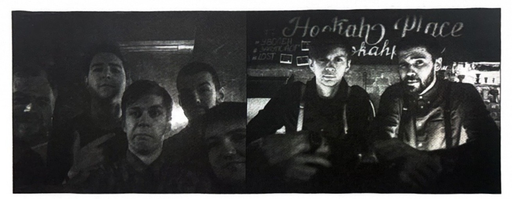

*図：「Hookah Place」店内でくつろぐスタッフたちのモノクロ写真（原書 p.248）*

> 「ХПポルタフスカヤ」は最も雰囲気のあるシーシャラウンジの一つだ。何のおかげでそれを実現できたと思う?

これはチーム全員の功績です。私たちはその時点ですでにお互いを知っていて、一緒に働いていました。つまり同じ波長だったのです。そして大きなプラスだったのは、店の内部の仕事のすべてを、自分たちが必要だと思うように、自分たち自身で築き上げる機会を与えられたという事実です。

そして私たちのアプローチはシンプルで、全員に同じように接します。それがシーシャ界隈の人であれ、普通のゲストであれ関係ありません。もちろん、コミュニケーションの仕方は変わってきます。学生たちと笑い合うこともあれば、ビジネスマンのおじさんたちと最新ニュースを語り合うこともあります。

私たちのところは、実質3年間で人材の入れ替わりがまったくなく、あるのは他のプロジェクトへの昇進だけです。たぶん、これがすべての本質です。マジックは、かなり多才で、一つの仕事に身を捧げた人々が集まり、誰も自分のほうへ毛布を引っ張らない(独り占めしない)ところにあります。そしてもちろん、誤りに対する改善作業も。誰も完璧ではありません。偶然、場所と時間と人が一致した。そして走り出したのです。

ああ、それと、私たちのところは音楽が最高です。

すべての美しさは常に物事のシンプルさの中にあり、そしてこれを実現するのが、いつも難しいのです。

## オーダーテイク。アンドレイ・カレリスキー

シェフ TANGIERS LOUNGE、サンクトペテルブルク

- 私にとってオーダーテイクとは、何よりもまず、ゲストとの対話です。私は外食店でスクリプト通りに働くことの支持者だったことは一度もありません。私の主観的な見解では、このアプローチはむしろ販売の領域のものであり、私たちはどんなに懸命に稼ごうとしても、結局のところ接客サービスの領域、好意とおもてなしの領域で働いているのです。私と同僚たちがフロアでどのように働いているか、手短に説明しようと思います。

現在、私たちの素晴らしい業界はかつてない速度で発展しています。新しい店の数は年々、幾何級数的に増加しています。そしてもちろん、これは喜ばしいことではありますが、質の高い接客サービスを提供できるシーシャラウンジはほんの一握りです。私たちは皆、外食業における年長の兄であるレストラン業界を手本にしています。しかしそのサービスは、ロシアのレベルにおいては、ヨーロッパやアメリカの店と比べて極めて低いのです。

シーシャ業界はより良く、よりプロフェッショナルになろうと努めていますが、残念ながら、世界で最高のところから学ぶのではなく、ただ自国にあるものを見ているだけです。では、レストラン、この国のトップレストランで私たちは何を目にするでしょうか? 同じような若者たちです。調教された振る舞い、まっすぐな姿勢、堅苦しい歩き方、暗記したセリフ、そして最も腹立たしいことに、頭のてっぺんからつま先まで品定めするような視線で、あなたがどれだけのチップを残すかを計算しようとし、不誠実で、取り繕った、偽善的な笑顔と、より高い品をあなたに売りつけるために計算されたスクリプト(なにしろ全員が販売の歩合で動機づけられているのですから)、そしてシェフに叱られないよう、キッチンで傷み始めた食材から作られた料理。どこもかしこもこうなのです!

そして、私たちの小さく、まだ若い業界は、これらすべてを見て吸収し、吸収し、このアプローチを唯一正しいものとして受け入れているのです。

ではゲストはどうでしょう? 彼の目の前には千もの様々な店があり、そのどれもが、結局のところ彼に提供するのはシーシャと紅茶です。どこでも同じ商品です。確かに、マスターによって詰め方は違い、味の品揃えは異なり、機材や炭も違いますが、大ざっぱに言えば、商品はまったく同じで、どこでも同じです。ゲストにとって重要な基準として残るのは、その商品の価格だけになります。こうした状況では、ゲストはどこへ行くか選ぶのが難しくなります。どこも同じなのですから。こうした背景の中で、ゲストはもっぱら自分の感情的な感覚に従って判断するようになります。彼はより多くのポジティブな印象を得られた場所を選ぶのです。

- 感情と印象は、全人類がどっぷりとはまっている麻薬です! ですから、私たちの業界で働くうえで、自分の職務の優先順位を、平均客単価やシェフが言うことに基づいてではなく、決めることが極めて重要です。最も大切なのは、その店で得たゲストの印象と感情なのです。

私たちのチームでは、常に根本的な要素となるのは、各マスターの個性です。スタッフは皆とても多様で、それぞれに自分のカリスマと魅力があり、全員がイケてます。各自に独自のアプローチがあり、ただ方向性だけが共通しているのです。

- ゲストとの出会いやコミュニケーションの際にまずすべきことは、最短時間でゲストを読み取ることです。彼が会話をする気でいるのか、それとも連れの女性に完全に夢中なのかを見て取ること。どんな気分でいるのか、もしかすると個人的な悩みや問題を抱えているかもしれません。その場合は、喫煙の化学についての講釈をしに行くべきではありません。落ち着いた、押しつけがましくない接客のための時間があるのか、それともとても急いでいて、さっと一服しに駆け込んできただけなのか。そもそも彼はボウルの中身に興味があるのか、それともただニコチンの飢えを満たしたいだけで、たとえば口の中にぶどうの香りを漂わせたいだけなのか。

これらはすべて、その人の服装、表情、身振り、全体的な振る舞い、視線、話し方、所作、礼儀正しさのレベルから知ることができます。

苛立っている人、ストレスを抱えている人は、常にコミュニケーションにおいてあまり感じが良くありません。その場合は、ニーズ把握のための質問を山ほど投げかけに行くべきではありません。すべてを素早く的確に行い、自分のプロ意識と、彼の感情状態がいかに自分にとって大切かを示してください。そうすることで、あなたは彼を自分のほうへ引き寄せ、彼の気分をよりポジティブなものへと変えることができます。

もしゲストがポジティブな気分で、気軽に、打ち解けて話してくれるなら、ぜひ彼と対話を交わし、もっと近づき、話を聞き、もし適切であれば、自分の人生の面白い話をいくつか語るべきです。決して馴れ馴れしさの一線を越えてはいけません。あなたの対話がどんなに親密で友好的な関係で進もうとも、まず第一に彼はゲストであり、あなたは接客スタッフです。常に気配りと礼儀正しさを保ってください。

もしあなたの目の前にいるのが、最初の誘導的な質問の段階からシーシャに詳しいゲストだという印象を与える人なら、彼が望む商品の細部にまで踏み込む必要があります。どんなボウルで吸うのを好むのか? ホイルか、それともカラウドか? どの機材で? 詰め方に何か特別なこだわりはあるか? ミックスについて何か具体的な希望があるのか、それともシーシャ職人の発想に委ねる用意があるのか? タッチ(接触)か、ノンタッチか? どんな温度のボウルが彼にとって快適か?

> ゲストをよりよく知るのに役立つ基本的な質問

- 彼はどのくらいの頻度で吸うのか?(「頻繁」の概念は人それぞれなので、1日1回なのか週1回なのかを確認してください。) どんな店で過ごすのに慣れているのか?(もしあなたがプロなら、競合店が何をどのようにやっているか正確に知っているはずです。)

有名なタバコメーカーの名前をいくつか口にしてみてください。もしその人が何のことか分からなければ、彼がシーシャの分野にあまり深く通じていないことがすぐに分かります。

彼にとって爽やかな味とは何か(ミントか、それとも単なる夏のフルーツか)?

基本的なこと——最初の数分で、その人が詳しいかどうかを把握すること。

もし詳しくなければ、煙たく、美味しく、美しく作ること。もし詳しければ、彼から最大限の情報、あらゆる可能なニーズとニュアンスを引き出すこと:

- シーシャの強さ(点数システムは主観的で、ある人にとってはフマリ(Fumari)が8点ということもあり得ます。ですから、その人が吸っているメーカーや頻度を聞き出し、強めがいいのかキツめがいいのかを確認します)

- 味(味と組み合わせを非常に注意深く提案し、好まない味を尋ねます)

- シーシャのドロー(機材の中から特定のものを提案できます)

- ボウル(ファンネル/直通式/フルーツ、特定のボウルを提案できます。たとえばエイリアン/トルカなど)

- ホイルか、それともカラウドか

- タッチか、それとも間隔をあけるか(オツストゥプ)

- シーシャを提供する際に、温度が快適かどうかを確認します。

- すべてを軽やかに、気配りをもって、丁寧に行うこと。そして最も重要なのは、誠実に、好意をもって行うことです。あなたのゲストがどんなにクズであろうと、彼を愛してください。プロであってください。

重要な点の一つは、主導権を従業員側に保つことです。ゲストは免罪のために来たのではなく、しばしば彼自身、自分が何を望んでいるのか分かっていません。あなたのほうから自主的に、ゲストにあれこれの組み合わせや、何か新作、シーシャと紅茶という形式での面白いガストロペア(味のペアリング)を試すよう提案する必要があります。相手から出来上がった答えを待ってはいけません。あなたが彼の代わりに、彼が何を望んでいるかを、彼の希望と好みだけに基づいて決めなければなりません。

味や強さを外してしまうこと、ミックスの選択を間違えること、あるいはただ目の前に意地の悪いゲストがいることもあるでしょう。しかし、もしあなたがすべてを誠実な笑顔で行い、最高の印象を贈ろうと正直に努めるなら、あなたは自分のアプローチと態度でゲストの心をつかむことができます。それは良いシーシャや美味しい紅茶よりもずっと重要なことです。そのゲストは必ず、ほかでもないあなたのところへ戻ってきます。

オーダーテイクは、全体としてのサービスと同様に、好意とおもてなしから始まります。これらの言葉の最も深い意味において!

## アルチョム・バエフ

この記事は、常連で忠実なゲストを生み出すための、地道で骨の折れる作業に捧げられています。また、シーシャ業界の様々な分野に現代的なマーケティングのアイデアを導入する方法も紹介されています。

> 第一部

ДЫМЫ

第一部では、不可欠な段階であるデータ収集に焦点を当てます。得られた情報の体系化と分析のためのツールを検討します。なぜそれを行う必要があるのか、その例を解説します。

こんにちは。今回は、あなたのビジネスの重要な構成要素である「常連客」について語りたいと思います。マーケティングの講師という肩書きを名乗るつもりはないので、私たちは真剣なテーマについて、できる限り平易な言葉で話していきます。理解のために、いくつか難しい用語は導入しますが、主に仕事のメカニズムに注意を向けるよう努めます。

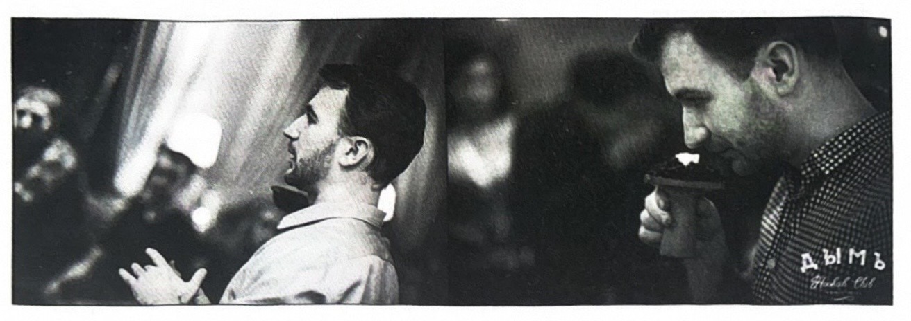

*図：「ДЫМЪ Hookah Club」でのシーシャを楽しむ男性たちのモノクロ写真（原書 p.254）*

そして、次のことに役立つ実践的な解決策にも:
- ゲストのロイヤルティ(忠誠度)を高める

- 来店回数を増やす

- 来店時間をコントロールする

- ネガティブな状況の後でさえゲストを呼び戻す

この資料を読んでいる人は、なぜ不満を持ったゲストを呼び戻すのか、と尋ねるかもしれません。すべてはシンプルです! これは普通の算数です。毎回新しいゲストを集めるほうが、常に高くつくのです! そのとおり、もし私たちが自分たちのトラフィック、すでに自店を訪れたゲストたちと適切に向き合えば、彼らのその後の来店は一回ごとに安上がりになります。こうして、忠実な常連客の来店コストは、実質的にゼロに近づくのです。

この先の話を進めるために、私は理論に踏み込まなければなりません。ゲストのLTV(またはcustomer lifetime value)——手短に言えば、これは顧客生涯価値です。マーケティングにおける最も重要な指標の一つで、これを使えば、あなたの商品・サービスに対する顧客の関心の度合いを理解することができます。私たちの課題は、まさにこの指標を高めることにあります。

シーシャラウンジにおけるマーケティング

トラフィックの生成

トラフィックの計測

トラフィックの管理

私たちはマーケティング構築の古典的な段階に依拠します。続く記事ではこれらの段階を詳しく解説しますが、今は最後の二つについて話します。なぜなら、常連客はまさにここで形成されるからです。

トラフィックの計測 - トラフィックの管理 / データの体系化 / 予約リスト / 個人データの収集 / 分析

何かしらの人々が来店し始めたら、トラフィックの計測の段階で、私たちはゲストを記録し始めます。圧倒的多数のシーシャラウンジでは、これは予約リストであり、それは後で捨てられてしまいます。極めて重大な誤りです! 中にはすでにPOSシステムやデータ保存機能付きのレジシステムを導入しているところもあります。しかし、もしゲストがそのプログラムの中で、カード、電話番号、ゲストの履歴やデータを管理・保存するモバイルアプリによって何ら識別されないのであれば、それは単にレジの役割を果たすだけのプログラムにすぎません。それは棚卸しをまとめ、レジを締め、支出を見ることはできますが、個々の顧客についての何の把握も与えてはくれません。

すぐに断っておくべきこととして、この記事が届くシーシャラウンジのレベルは様々であることを理解したうえで、私は複雑な技術的解決策から、シンプルで手の届くものへとスケールを調整していきます。もし疑問が生じたり、個別の作り込みが必要になったりすれば、いつでも記事の筆者に連絡を取り、個別のスキームを開発することができます。

各ゲストについて、可能な限り最大限の情報を集めましょう!

トラフィックの計測 / データの体系化 / 予約リスト / 個人データの収集 / 分析 / トラフィックの管理 / ソフトウェアコンプレックス、自動化システム(R-keeper、iiko) / 取引先データベースに入力されたデータ(Moy Sklad) / POSシステム / CRMシステム / 予約リストに基づくExcelファイル

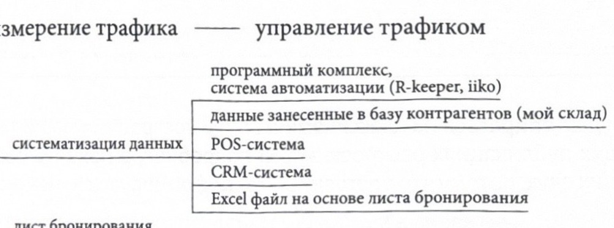

*図：トラフィックの計測・データ体系化・管理の関係を示す図（R-keeper、iiko、POS、CRM等の自動化ツール）（原書 p.256）*

- 最もシンプルなのは、会員カードを配り、割引やボーナスでゲストを動機づけるか、あるいはクラブの閉鎖性を説明して顧客に義務づけることで、データベースにデータを集めることです。要するに、私たちの課題はCRMシステムを構築することです。もちろん、既製のソフトウェアソリューションを導入してレジと統合することもできます。これは作業を簡素化・自動化し、すぐに分析に移ることを可能にしますが、お金がかかります。

私たちには何の自動化もないが、その代わり予約リストとその標準的な項目はある、と想像してみましょう。

トラフィックの計測 / データの体系化 / トラフィックの管理 / 名前 / 電話番号 / 基本項目 / ゲストの人数 / 予約リスト / 予定テーブル番号 / 有用な項目 / 個人データの収集 / 分析

もし、ゲストとのやり取りの中で、あるいはシフトの終わりに追記する必要のある項目を加えれば、すでに私たちには優れたデータ収集ツールが出来上がり、それをほぼ即座に効果的に使うことができます!

トラフィックの計測 / データの体系化 / トラフィックの管理 / 予約リスト / 基本項目 / 有用な項目 / 名前 / 電話番号 / ゲストの人数 / 予定テーブル番号 / 初回来店かどうか / 性別 / 満足度のレベル / コメント / SNS / 生年月日・年齢

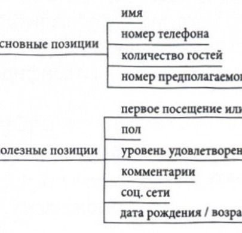

*図表：予約リストの記入フォーム——基本項目（名前・電話番号・人数・予定テーブル番号）と有用項目（初回来店可否・性別・満足度・コメント・SNS・生年月日）（原書 p.257）*

リストについて、どのように情報を引き出すか、また何のためにそれが必要かを説明します:

- 初回来店かどうか。この質問は、ゲストとの最初の接触時に尋ねます(ゲストが電話してきた、または予約なしで来店した場合)。

- 性別。ここはすべてシンプルです。私たちは多民族国家であり、名前から男の子か女の子かが必ずしも分かるわけではありません。ジェンダーの属性は、フィルタリングのために必要になります。

- 満足度のレベル。ゲストとお別れした後、アドミニストレーターは、その人が大満足で帰ったのか、ニュートラルだったのか、ネガティブだったのかという印をつけなければなりません。満席の場合、スタッフが非常に忙しくなることはよく理解していますが、ネガティブな事柄や衝突は記憶に残るものです——これは確実です!

- コメント。レポートでネガティブを見たら、コメントを読んでゲストに電話します。非常に重要なのは、苦情・提案ノートに記録されたものだけでなく、あらゆるネガティブに対応する必要があるということです。そして、これを48時間以内に行うことが非常に重要です。

ソーシャルネットワーク(SNS)

- .

a) 予約がSNS経由で来ることもあり、これは単に記録します。

b) ゲストが電話してきた。電話番号を保存し、後で彼を名前で呼べるようにします。それからGetcontactを通じてその人のフルネームを見つけ、SNSで彼を探すか、あるいはWhatsAppから写真を保存し、「こんにちは、Siri!」と、すべてのSNSアカウントと興味関心を引き出します。

ここで私は、このツールの倫理性とその使用について述べなければなりません。もしあなたが様々な性質の余計な機密情報を知り、それを広めてしまえば、誰の評判が傷つくかは言うまでもありません。これはそもそも外食業の倫理だと思いますが、ゲストを噂話の種にするのは正しくありません。乱用はあなたの名誉にはなりません。ゲストの倫理とプライバシーの問題においては、分別と慎重さを保ってください。

なぜ私たちにSNSが必要なのでしょうか? これはあなたのSMM担当者にとって絶好のデータベースであり、彼はあなたに感謝するだけでしょう。また、ゲストとは追加の接点とつながりを保つこともできます。

生年月日。

オーディエンスを年齢別にグループ分けして分析することを可能にし、また個人的な祝い事を来店のきっかけとして気の利いた提案をすることができます。SNSから取得します。

測定すべきトラフィックの指標／データの体系化／予約リスト／個人データの収集／アナリティクス／トラフィック管理／氏名（姓・名・父称）／日付・生年／性別／電話番号／メール／SNS／来店履歴・最終来店／取得したステータス（割引、ポイント制度のレベル）など／例：来訪者か地元客か

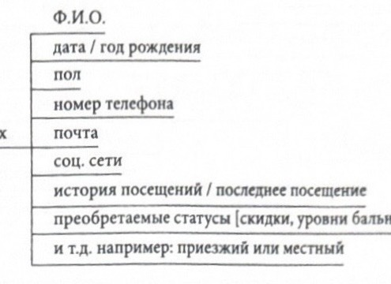

*図：個人データ収集フォーム（氏名・生年月日・連絡先・来店履歴などの項目一覧）（原書 p.259）*

ゲストについて多くを知れば知るほど、個々の機会に応じた提案をきめ細かく設定できます。

来店履歴と最終来店日を加えれば、離れてしまったゲストを呼び戻すことができます。半年間毎日通っていた人が、ひと月ぱったり来なくなった。たとえば、他のシーシャラウンジに行ってしまった。なぜか。トラブルがあったのに、それが経営者まで伝わっていなかった。価格に満足できなくなった、どこかにもっと魅力的な提案がある、シーシャの出来が総じて他店の方が良い。いったい何が問題だったのか。フィードバックを収集します。

取得ステータス。

これはモチベーションに関わる取り組みであり、ここまではまだ分かりやすい話です。これから先は、難しいけれども優れた手法について述べていきます。

来訪者か地元客か。

たいていは会話の中で明らかになります。ここは単純です。彼に広告予算を割く価値があるか。もし彼が他の街から来ているのなら、私なら低い確率でしかボーナス制度を提案したり、店で誕生日を祝うことを勧めたりしないでしょう。とはいえ、いろいろなケースがあるので、分析してください。

測定すべきトラフィックの指標／データの体系化／予約リスト／個人データの収集／トラフィック管理／主要な性別・年齢の特徴：フィルタリングする／来店頻度／最終来店／アナリティクス／初回来店：グループ分けする／常連客

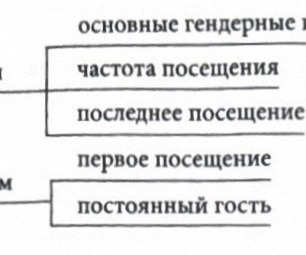

*図：データ分類フォーム（性別・年齢、来店頻度、初回／常連客などによるグループ分け）（原書 p.260）*

> 第二部

収集したデータを体系化します。

これは、私たちの手元に実際のアナリティクスのツールが生まれ、ターゲットオーディエンスの中から抽出した特定のグループに集中できるようにするためです。そして、各グループ・サブグループごとに「魅力的な」提案を練り上げるためです。

ですから第一に、自分の仕事では二つの顧客グループに集中する必要があります。それは、初めて来店した人たち。彼らをただ手放してはいけません。そして、あなたの利益の80パーセントをもたらしてくれる人たち、つまり常連客と忠実なゲストです。

第二に、類型によって分けてください。常連客は必ずしも忠実なゲストとは限りません。もしかしたら、その人は仕方なく通っているのかもしれません。なぜなら、オフィスの昼休みはたった一時間で、あなたの店がビジネスセンターの一階にあるからです。ただ近いだけなのです。これは常連客ですが、そこには感動も、友人や知人にあなたの店を語りたいという気持ちもありません。忠実なゲストは週に一度しか来ないかもしれませんが、機会があるたびに熱意をもってあなたの店を勧めてくれるでしょう。

## オーダーテイクのアルゴリズム。ドミトリー・オブラコフ

私は個人的に、シーシャの販売を手がける店舗のタイプに違いはないということを指摘しておきたいと思います。最終製品の品質は優れたレベルになければならず、スタッフは特定の店舗の特性に応じてきちんと教育されていなければなりません。

これは何よりもまずビジネスです。そして昨今、一部の街ではシーシャを吸える場所が飽和状態にあり、そのうち良質なサービスを提供しているのは三分の一にすぎません。

私が手がけている店舗（レストランもシーシャラウンジも）において、どのシーシャマスターにも共通する基本的なルールは次のとおりです。

シーシャマスターは店舗の開店一時間前に出勤します。身だしなみを整え、清潔でアイロンのかかった制服を着ています。勤務開始前には、店舗がゲストを迎える準備ができているか（換気装置、炭に火をつけるためのヒーターの作動状態）を必ず確認します。シーシャ、ホース、カラウド、作業スペースの清潔さと正常な状態を確認し、不備が見つかれば解消します。必要な品揃えのタバコ、フルーツ、必要な機材があるかどうか、ゲストを呼ぶための時計の作動状態、すべてのボタンの動作を確認します（私たちのすべての店舗にはそれらが備わっており、これによってマスターの仕事が楽になり、またゲストの快適さも増します）。

オーダーテイクのスクリプト：

1. 挨拶。2. 希望するシーシャ用タバコ／機材の選択。3. 強さ／詰め方に関するゲストの好みの確認。4. 香り（フレーバー）の選択。5. 追加販売（シーシャ用の添加物／フラスコの中身を満たすもの／ボウルなど）。6. シーシャの準備と提供。7. タイミングを逃さない炭の交換。8. 最初の／最初の数本が吸い終わったタイミングで、新しいシーシャの提案。9. ゲストへのお見送りの挨拶。

補足しておきたいこと

- ゲストとのコミュニケーションの形式は、年齢などに関わらず、常に丁寧（フォーマル）でなければなりません。例外となりうるのは、友好的な関係が築かれたゲストであり、かつそれが他のゲストの迷惑にならない場面に限ります。注文の際には、フルーツボウルか粘土（クレイ）ボウルかを確認します。それを販売し、適切に提案する機会については、別の項目として扱います。

三人以上のグループでシーシャを注文する際には、快適な喫煙と最大限の満足を得るために、二台目のシーシャを提案します。

常に望む味の特徴を確認し、それを踏まえてゲストが望むものに加えてミックスや味を提案するか、あるいは自分の知識と技術に基づいて提案します。ゲストの好きな味、嫌いな味を確認します。私たち（の大半）のように、誰もが何でも好きというわけではありません。

また、シーシャの強さも確認し、便宜上、軽い・中程度・強いに分けます。ゲストが強いシーシャを選んだ場合は、喫煙のきつさ（ハードさ）を確認します。選ぶのが難しい場合には、ゲストがどのくらいの頻度で吸うかを確認し、最適な選択肢を提案してください。

> ティモフェイ・コレーエフ

（インタビューからの抜粋）

> あなたはシーシャマスターの職から始めましたね。あなたの考えでは、現代のシーシャマスターはどのような資質を備えているべきでしょうか。

そうですね、まず第一に、彼は話すことができ、見栄えよく見える必要があります。ゲストは最初にあなたの見た目を評価し、次にあなたの話し方を、そして最後にあなたが何を話すかを評価します。第二に、自分が扱っているものを理解し、それをどう提示するかを心得ていることです。ゲストのニーズを見抜くことができ、ときには、ゲストがあまり適切でないシーシャの注文をしていると分かったときには、自分の意見を押し通せることです。素早く、丁寧に、きれいに仕事をし、自分の仕事に没頭する「オタク（ザドロット）」であることです。

> ロシアのシーシャマスターの中で、誰を挙げますか。

私が彼らのボウルを吸ったことのある人たちを挙げます。アンドレイ・トゥルケヴィチ、スラヴァ・セラジェトディノフ。私に近いゲストへの接し方のスタイルゆえに。ドミトリー・イワノフ、彼はゲストの前で、まるで教師の前で発表する生徒のようにふるまいます。デニス・シヴァチェンコ＝オートマト、私は彼が「ПРОКАЧАЕМ Белые ночи（白夜をパワーアップ）」をどうこなしたかが気に入りました。

> 良いマスターになるにはどうすればよいですか。

成長し、自分自身に取り組むことです。話し方や身振り手振りに取り組むことです。理論の知識を磨き、自分が扱っている製品や市場にある製品を勉強することです。

ある製品の細部や歴史を知る必要はないと言う人たちのことを、私は決して理解できませんでした。この点で、私はソムリエを手本にしてきました。どんなソムリエでも、ボトルに入っているワインについて、ブドウの品種からシャトーの主人の愛人の数まで、すべてを語ってくれます。同様に、職場での振る舞いのモデルという点でも、私はレストランのウェイターやメートル・ドテル（給仕長）を手本にしました。彼らがどのようにゲストと接し、どのように身振りをし、どのような話法のモジュール（決まり文句）を使うか。もちろん、それをすべて完全にコピーしたわけではありませんが、私の成長において、これは一定の成果をもたらしました。そして最も大切なのは、調子に乗らない（スターになったと勘違いしない）ことです。

> シーシャ業界を追っていますか。全般的に。

全般的には追っています。常に情勢に手を当てて（脈をとって）おく必要があります。

> 2019年の主要なニュース5つ。

1. シーシャ用タバコの物品税の再計算 2. Guide Master's賞 3. シーシャHLGN 4. モスクワでのNUAHULE SMOKEのオープン 5. AzureのアクシズナヤLady liberty）

これはシーシャに関するニュースについて言えば、ということです。

> 説明してください。

1. シーシャ用タバコの物品税の再計算。この点についてはすべて明白で、シーシャ用タバコが安くなりました。そしてこれによって、物品税の証紙を持つ東洋諸国のタバコを、正式に仕事で使えるようになりました。

2. Guide Master'sは、若い人たちがプロフェッショナルな方向へと発展していく後押しになります。あなたはマスターであり、自分の仕事のプロであり、業界がそれを認めたのです。認められることは大切なものです。

3. シーシャHLGN。N Groupからのシーシャは長く待ち望まれていました。そして私には、組み立てた状態のシーシャがバット（野球のバット）のように見えるという事実が、組み立てた状態で完成されたインテリア要素になりうるシーシャへの、一定のトレンドを生み出すように思えます。

4. モスクワでのNUAHULE SMOKEのオープン。このプロジェクトは長く待ち望まれており、フランチャイズ担当のマネージャーである私のもとには、モスクワのプロジェクトはいつオープンするのかという問い合わせがたくさん寄せられていました。そして今、このプロジェクトが実現しました。さらに、そこで働くマスターたちの教育に私が関わったということを知れるのは、嬉しいことです。

5. AzureのアクシズナヤLady liberty。

私はこの味が好きで、それが正式に市場に出ているのは素晴らしいことです。かつてはこの味には一定の品薄状態がありました。

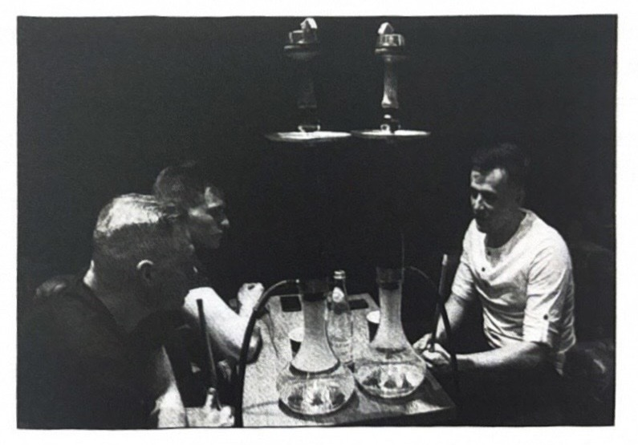

*図：薄暗い店内のテーブルでシーシャを囲み歓談する三人の客（原書 p.265）*

> どのような原則でチームを編成するか、教えてください。

私は人とその個人的な資質を見ます。彼らの経験を、仕事上のものだけでなく、人生経験も評価します。私にとってプラスになるのは、スポーツをやっていることや軍隊での勤務経験です。これらの段階を経てきた人は規律正しく、結果を出すために歯を食いしばって働くことができます。私は野心を見ます。もし人に野心がなく、自分が何を望んでいるか分からないのであれば、その人は私の人間ではなく、私のチームに彼の居場所はありません。ボウルの詰め方や、基準に沿って働くことは誰にでも教えられますが、目標を達成すること、毎日より良い自分になること、そしてこの人生で自分が何を望んでいるかを理解することを、人に教えることはできません。

> 候補者にとって、確実に受け入れられないものは何ですか。

自分の「自我」への固執、仕事に対する不真面目さ、そして不適切さ（常識のなさ）です。

> シーシャマスターの面接における主要な質問を5つ挙げてください。

1. あなたは、私がこれまで面接してきた他の候補者よりも、どこが優れていますか。2. どんな理由で仕事に遅刻していましたか。3. あなたの仕事の中で、ゲストを最もイライラさせるのは何でしょうか。4. 前の職場ではどんな注意を受けましたか。5. あなたはどのように自己学習をしていますか。

> 研修（インターンシップ）はどのように行われますか。何に最も注意を払いますか。

研修は次のように行われます。研修生には、彼が学ぶべきすべての教育資料が与えられ、さらにLife（ライブ）形式で、彼を指導する従業員から規程やサービスの要素を学びます。並行して、特定の製品に関する知識についての質問がなされます。答えられなければ説明されます。しかし、説明を受けた後、翌日に答えられなければ、もうそれは問われる（責められる）ことになります。

研修において私が見ているのは、その人がどう振る舞うか、戸惑っていないか、何もかもを怖がっていないか、その研修を行っている人とどう関わっているか、どんな質問をするか、そもそも質問をするのか、指定された時間の何分前に来るか、ということです。

> 良い人材を育てるにはどれくらいの時間が必要ですか。

これは時間の問題ではなく、人材の問題です。すべては、その人材がどれだけ良くなりたいと思っているか、そしてどれだけ自分をそれに捧げる準備があるかにかかっています。例を挙げましょう。肥沃で、雑草を取り除いた土に蒔かれた種は、荒れ地で育つ種よりも早く実をつけます。

良い条件であれば、ゼロからフロントマンまで6〜8か月で成長できます。

> 私はそうは思わないな。良いところまで、フロントマンまでは、絶対に無理だ。 - そうだ。

モスクワの現実では、店舗のフロントマンまでは無理だ。君はクラスノダールにいるんだ、パーシャ、こっちの人材事情がどうなっているか、君も知っているだろう。

---

# 第8章

## シーシャマスター ＞ シーシャラウンジのオーナー

## スタッフのモチベーション。ウラジーミル・デネシキン

ウラジーミル・デネシキンは、RESTART VASILCHUK BROTHERS のシーシャ部門責任者です。

「モチベートし、支配し、楽しめ」――これは、ウファで開催された「Прокачаем（プロカチャエム）」での私の講義のタイトルです。このテキストには、自分の経験をまとめ、私たちが実際に応用し成功を示してきたケースをできる限り挙げるよう努めました。もちろんこれは完全なリストではありません。そして、もしあなたがこれに付け加えることができるなら、あなたに素晴らしいニュースです。あなたは立ち止まることなく、飛躍的なスピードで成長しているということです。各項目の最後に、それをどう実生活で実現するかの例を挙げていきます。

### 私は誰で、なぜモチベーションについてあなたに語ることができるのか

2013年、私はさらに3人とともに F-Lounge を設立しました。モスクワで最初期のシーシャラウンジの一つで、今でも存在しています。パートナーとの意見の相違により、私はビジネスにおける自分の持ち分を売却し、会社を去りました。短い期間ののち、私は「Шишка Lounge（シーシュカ・ラウンジ）」のチームに3か月間加わり、そこから Secret Sky プロジェクトのマネージャー職へと移りました。2015年、イワンテエフカ市で私の最初のプロジェクトが誕生し、「Кальянная мастерская 1718（シーシャ工房1718）」という名がつけられました。

私は常々アメリカに行ってみたいと強く思っていましたが、Art Hookah 社がそうした機会を与えてくれ、4か月間 Art Hookah Lounge San Diego で働くよう招いてくれました。

モスクワに戻ってから、イリヤ・ロマノフのおかげで私は 354 Exclusive Height グループ企業にシーシャ部門のブランドシェフとして入ることができ、わずか2か月後には、Restart Vasilchuk Brothers ホールディングのオーナーの一人から、「Чайхона № 1（チャイホナ第1号）」のシーシャ部門を率いないかという提案を受けました。次第に、私のシーシャ部門の指揮下で、私たちのホールディングのシーシャを扱うすべてのプロジェクトが動くようになりました。2019年、私はパートナーとともに Tangiers Lounge MSK をオープンしました。

現在、私の指揮下では50を超える店舗のシーシャ部門、200人を超えるシーシャマスターが働いており、私にはモチベーションについてあなたに語るべきことがあります。

### モチベーションとは何か、そしてどのような種類があるのか

ウィキペディアによれば、モチベーションとは行動への動機づけであり、人間の行動を制御し、その方向性・組織性・活動性・持続性を定める心理生理学的プロセスであり、自らの欲求を能動的に満たす人間の能力です。私たちの文脈に絞り込むなら、それは、企業の商品回転率を高めるために人の労働活動を活性化させる目的で人に働きかけることです。

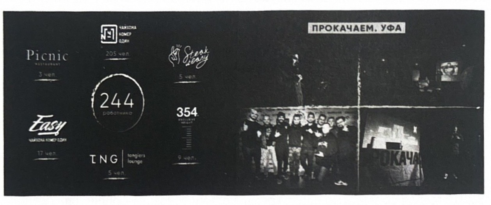

*図：デネシキンが率いる各店舗（Picnic、Easy、Tangiers Lounge ほか）の従業員数と、ウファの「プロカチャエム」イベントでのチーム集合写真（原書 p.272）*

### なぜモチベーションが必要なのか

従業員の内面の状態は、あなたの店の売上に直接影響します。ゲストと接する従業員こそが、ゲストがあなたの店で何をどれだけ買うかを決めるのです。モチベーションの低い従業員が会社の発展に関心を持たず、しかるべき利益をもたらさないのは明らかです。逆に、高くモチベートされた従業員は、あなたが期待するよりもはるかに大きな利益をもたらすことができます。

モチベーションは、物質的なものと非物質的なものの2種類に分類されます。この記事では、私は以下の種類を取り上げます。

「非物質的モチベーション」――称賛と承認 ―― チーム内に前向きな雰囲気をつくること ―― 仕事における一定の特典 ―― 共に過ごす時間 ―― 従業員の職位に対する態度 ―― 自らの手本 ―― アイデアへの支援 ―― その製品を扱う仕事の利点を理解すること ―― ブランドへの帰属感 ―― キャリアアップの展望 ―― トレーニングの実施

「物質的モチベーション」―― 物質的な贈り物 ―― コンテストや競技の実施 ―― 金銭的報酬

### 非物質的モチベーション。称賛と承認

仕事の日常のなかで、経営者はしばしばライン従業員の仕事を当たり前のものとして受け取ってしまいます。スタッフの小さな勝利も大きな勝利も、気づかれないままになります。長い目で見ると、これは非常に嘆かわしい結果を招くことがあります。経営職の高みから見れば些細なことに思えるものが、ライン従業員にとっては時に非常に大切なことだったりします。従業員は熱意を示し、一定の成果を上げることがありますが、経営側からの無関心にぶつかると、その士気は下がり、仕事や良い成果への関心はゼロに近づきます。称賛の欠如は、目を輝かせた有望な従業員を、決められた時間にただ機械的に仕事をこなすロボットへと変えてしまいかねません。仕事における細かなこと（質の高い大掃除の実施、美しくカットされたフルーツ、提供のスピード、オーダーテイクの形式、仕事における財務指標）に目を向けることが極めて重要です。

ケース：誰もがSNS（WhatsApp、Telegram）に仕事用のチャットを持っており、そこでは全員の前で公に称賛することができます。スタッフを集める必要もありません。これには多くの時間も労力もかかりません。

### 非物質的モチベーション。チーム内に前向きな雰囲気をつくること

多くの人が忘れている特徴の一つ――挨拶を交わし、別れの言葉を言い、「ありがとう」と言うチームで働くほうが、はるかに気持ちのよいものです。

チーム全体の空気をモニタリングすることは、あらゆるレベルの経営者にとって最も重要な課題です。すべての対立的な状況は、その芽生えの段階で気づかれ、できる限り速やかに解消されなければなりません。従業員と話すこと、彼らの調子はどうか、何か新しいことが起きていないかを尋ねること、彼らの気分の変化を察し、その変化が生じた原因を理解しようとすることを忘れないでください。ごく初期の段階であれば、マイナスをプラスに変えるのはとても簡単です。従業員に「今日はとても素敵だね」と言うのをためらわず、彼らの変化に気づくよう努めてください――どんな人でもそれは嬉しいものです。

ケース1：従業員の誕生日を月ごとに時系列順にまとめた文書を作成し、毎日ただそこを覗くようにしてください。共通のチャットで「おはよう」「良い一日を」と声をかけましょう。

ケース2：「Чайхона № 1」のブランドアンバサダーであるエレーナ・ポポワは「Звездный десант（スター部隊）」をつくりました。これは WhatsApp グループで、「Чайхона № 1」レストランの最も活発なメンバーが参加しています。このグループで彼らは自分たちの勝利や象徴的な出来事を共有します。この取り組みは、人々が日常生活のなかに何か良いものを探し、それを周囲と共有しようという気持ちにさせます。

### 非物質的モチベーション。仕事における一定の特典

特に優秀な従業員への特典や便宜が、仕事へのモチベーションになりうることは間違いありません。これは通常、何のコストもかかりませんが、雇用主としてのあなたの立場を確実に強めます。重要：チームは、その従業員が仕事で力を発揮しているからであって、単にお気に入りだからではない、と理解していなければなりません。

ケース1：ある従業員が1か月間、遅刻なしで出勤し、職場をきれいに保ち、仕事で積極性を見せたとします。そうした従業員は、翌月のシフト作成時や休暇スケジュールの割り振り時に、まず最初にその意見が聞かれるに値するのは間違いありません。

ケース2：また、ここで個別の項目として確実に挙げられるのが、快適な労働条件をつくることです。例えばスタッフ用のまかない（staff-питание）です。キッチンがあれば、まかないの原価はわずかなものですが、従業員があなたを雇用主として選ぶ際の確実なプラスになります。

### 非物質的モチベーション。共に過ごす時間

共に過ごす時間とは、記念日、例えば誕生日を祝うこと、仕事の外への外出（バーベキュー、ペイントボール）、理想的には数日間にわたって従業員をどこかへ連れて行く余裕があれば、それを指します。くだけた雰囲気のなかで、人々は互いに違った形で接し始め、同僚を新しい一面から知り、その結果、戻ってきたときには高くモチベートされた従業員を得ることになります。

ケース1：354 Exclusive Height 社には 354 Party というグループがあり、経営陣がそこに参加しています。そこでは仕事とは関係のないさまざまな考えを交わしますが、最も大切なのは、グループの各メンバー（33人）の誕生日を祝うことです。イベントの形式は誕生日を迎える本人が決めます。私たちは保養所への外出、クエスト、観劇、アパートメントを借りての滞在、オフィスでの祝賀などを行ってきました。これは間違いなくチームを結束させます。イベントは任意参加ですが、欠席するのはたいてい非常に重要な理由があるときだけです。

ケース2：例えばスポーツのような、共通の趣味をつくりましょう。あなた自身がこうした活動の発起人になってください。再び 354 Exclusive Height の例を挙げます。私の上司はボクシングの稽古を始めました。これが気に入った中心メンバーは、もう何年もこれを続けています。これは間違いなくチーム内の関係をより強固にし、同僚を新しい一面から知ることを可能にします。

### 非物質的モチベーション。従業員の職位に対する態度

店の運営におけるどんな職位も重要であり、敬意を払わなくてよい職位など存在しません。これは清掃員、ウェイター、配管工、整備工などにも当てはまります。一人ひとりが重要なのです。その人に、あなたの労働が価値あるもので大切なのだと分からせてください。しかも、経営者であるあなた自身がそれを本気で信じる必要があります。もしそれが形式的なものであれば、何もうまくいきません。従業員はあなたの偽りを感じ取ります。

重要：職業への敬意ある態度とは、なれなれしさや友達付き合いではありません。この一線を越えないでください。

ケース1：「Чайхона № 1（Ч1）」では、私たちはレストランでシーシャマスターを「パロメン（蒸気屋）」と呼ぶのをやめさせることに成功しました。バッジを変え、今ではそこに「シーシャマスター」と誇らしげに記されています。あなたにはこれが些細なことに思えるかもしれませんが、考えてみてください。40を超える店舗で、長年「パロメン」と呼ばれてきたこの職位の呼び名を変えるというのがどういうことか。バッジはほんの一部にすぎず、私たちは全体として彼らに自信の感覚を植えつけました。現在、Ч1 のシーシャマスターは、大規模なシーシャイベントのほとんどのブースで働いており、一部は他のプロジェクトの管理職へ移り、一部は自らの製品づくりに取り組んでいます。

ケース2：従業員にきちんとした身なりをさせましょう――ヘアスタイル、アイロンのかかった制服、心地よい香り。これらすべてが単純な真理に思えるかもしれませんが、多くの人がこれをおろそかにしています。

ケース3：従業員に、常に成長し続ける必要があると説明してください――本を読み、ニュースを見て、業界の最新動向を学ぶことです。シーシャマスターとは、ミックスを組んでゲストに運ぶことができるだけの人ではなく、さまざまなテーマで会話を支えられる教養ある人間なのです。

### 非物質的モチベーション。自らの手本

従業員にとって素晴らしいモチベーションになるのは、あなたが名ばかりの経営者ではなく、彼らの手本となること、何かを学べる人物になることです。

ここでは二つの方向性を挙げられます――あなたがより経験豊富で学ぶべきものがある場合か、あるいはあなたが見習いたいと思われる人物である場合です。前者の優れた例はイリヤ・ロマノフでしょう。彼はカウンターで働き、一人ならず多くのマスターを育て、カウンターやホールでの仕事に関して豊富な経験を持っています。後者の例はアレクサンドル・グパロで、その知名度が Nuahule Group に属する従業員たちの働き、成長する意欲をかき立てています。

ケース：もしあなたが経営者なら、常に成長し続けてください。

### 非物質的モチベーション。アイデアへの支援

一部の従業員は、仕事のなかで成長し、仕事の枠を越えたいと望むようになります。それはフッカーバトルへの参加かもしれませんし、自らの製品づくりを始めることかもしれませんし、イベントで演技し、創造的に成長したいという願いかもしれません。あなたの経験に基づいて、アイデアを支援してください。彼らに助けと支援を提供するために、自分の私的な時間を費やしてください。

ケース1：私たちのマスターの一人、すなわちヴォーヴァ・ロマノフ（354 Exclusive Height のシニアシーシャマスター）が、Hookah Rematch で演技したいと希望しました。私たちは彼が精神的にも肉体的にも準備が整うよう、自分たちの時間を準備に費やしました。結果――ヴォーヴァはまずモスクワで優勝し、その後アンドレイ・インディン（Ч1 シーシャ部門のエリアマネージャー）とともに、Hookah Club Show の展示会で優勝しました。

ケース2：All-in。354 Exclusive Height で私のもとで働いていたマネージャーが仕事への興味を失っていくのを見て、私は、彼が動画ブログの分野に喜びを感じていることを知っていたので、その人が自分の可能性を発揮できる YouTube チャンネル「All-in」を立ち上げることにしました。

### ブランドへの帰属感

会社の強力なブランドは、優れた非物質的モチベーションになります。かっこいい会社で働く従業員の士気は、より高くなります。

ケース1：354 Exclusive Height のバッジ。勤続1年ごとに、まさにすべての従業員に「勤続年数」入りの記念バッジが贈られます。

記念の贈り物の授与は、たいていの場合、祝賀的な雰囲気のなかで行われます。354 Exclusive Height 社には @354exclusiveteam という専用のインスタグラムチャンネルがあり、そこには職位を問わず、会社の従業員の記念すべき出来事がすべて公開されます。

ケース2：これは大きなブランドの枠で実現することも、自分自身を通じて実現することもできます。例えば私は、さらに「Denezhkin People」という取り組みもつくりました。これは私個人からの表彰で、私の考えで、私の成長に影響を与えた人々に授与するものです。2018年には25個のバッジが（業界の著名人にも、ごく普通のシーシャマスターにも）授与されました。

### 非物質的モチベーション。キャリアアップの展望

従業員は、会社のなかで成長できる可能性を自分の前に見ていなければなりません。もしそうした可能性がなければ、従業員はある時点で、仕事への興味を失うか、あるいは単に会社を去ってしまうことに必ずつながります。

ケース：従業員にキャリアアップを与える方法を探してください。会社の枠のなかでそれが不可能なら、「アイデアへの支援」の項目に戻り、そこから経験を借りてください。

### 非物質的モチベーション。トレーニングの実施

354 Exclusive Height 社では、少なくとも年に一度はトレーニングを行います。数日間どこかへ出かけ、電話の電源を切り、仕事のプロセスに完全に没頭します。こうしたイベントは、従業員が停滞した状態から抜け出し、新たな力とアイデアを得て仕事のプロセスに戻ることを可能にします。

ケース：エレバンで行ったトレーニングから戻った後、私は「Чайхона № 1」シーシャ部門のエリアマネージャー向けのトレーニングを作成することにしました。この記事はこのトレーニングを実施するより前に出るため、今のところその効果は分かりませんが、なぜか私はその有用性と効果を確信しています。

### 物質的モチベーション。物質的な贈り物

このセクションでは、スタッフがあなたの特定の課題達成を助けてくれるものの、それに対してお金を払うのはあまり正しくないが、しかし評価する必要がある、というケースを取り上げたいと思います。例えば、メニューや販促企画の開発へのスタッフの参加、SNS活動やあなたの店への追加のゲストの呼び込み、仕事における傑出した成果などです。

物質的な贈り物には、シーシャ業界のあらゆる関連グッズ――ボウル、タバコ、シーシャなどがなりえます。

ケース1：テイスティングが行われるとき、私はメーカーが持参するサンプルをすべて、シーシャマスターたちに余すところなく配ります。些細なことのようですが、彼らには嬉しいものです。最近では、メーカーがテイスティングに来る際、テイスティングに何人参加するかを尋ねるようになりました。一人ひとりのスタッフに個別のギフトセットを用意するためです。

ケース2：競技を行うと、勝ちはしないものの、その演技で型を打ち破るチームや人がいます。例えば、私たちのリマッチで、準決勝まで進み素晴らしい演技を見せた最年長のシーシャマスター（33歳）に、私はシーシャを贈りました。

### 物質的モチベーション。コンテストや競技の実施

私の実践におけるモチベーションの成功例の一つが、賞金付きのコンテストの実施です。ここでは物質的な関心に加えて、ゲーム的な要素が加わり、仕事をそれほど退屈で単調なものではなくします。Ч1 では、私たちはシーシャ業界の成功した経験を見事に活用しています。

ケース1：私たちは何度も Hookah Rematch（特定の味わいと強さに沿ってシーシャを作る速さを競う、シーシャマスター同士の競技。注）を、全レストランを対象にも、個別のエリアごとにも実施してきました。参加費があり、それによって賞金プールが形成されます。最終的に、私たちはシーシャマスターたちのポジティブな感情の爆発を得て、さらに誰かが嬉しい物質的報酬を受け取ります。

ケース2：現在、私たちは「Чайхона № 1」のシーシャマスター向けに、4か月間のモチベーションプログラム「Джунгли зовут（ジャングルが呼んでいる）」（Inst: @dzungli_zovut）を実施中です。このモチベーションプログラムの課題は、最大限のポイントを獲得することです。ポイントは、販売によって、また「Своя Игра（自分のゲーム）」、Hookah Rematch、Hookah Battle、シーシャカクテルのおしゃれな写真、さまざまなチャレンジといった活動への参加によって得られます。このモチベーションプログラムの賞品は、バリ島への旅行、そしてレストランへの金銭的報酬です。

### 物質的モチベーション。金銭的報酬

ここで私が念頭に置いているのは、特定のマスターの売上をその賃金に直接結びつけることです。マスターが自分の成果のために働く場合、最終的にいくら受け取るかは自分次第だと理解します。これが成果を出すために働く動機づけになります。

ケース：あなたの財務成績が止まったと感じたら、財務指標で基準線を引き、達成したい目標値を設定し、あなたの基準線と伸びとの財務指標の差にスタッフを結びつけてください。

もちろん、この記事は従業員をモチベートする方法の完全なリストではありません。しかしこれは、慌ただしさのなかで忘れてしまいがちな単純なことを、あなたに思い出させてくれます。あなたの店を停滞させず、従業員の精神状態に気を配り、仕事を日常の惰性にさせないでください。そうすれば、あなたは間違いなく見返りを感じるはずです。それはあなたの企業が稼ぐお金に反映されます。

## サーシャ NUAHULE

（インタビュー抜粋）

### 自分の人生経験について話してほしい。シーシャの前は何をしていた？

シーシャがなかった頃の人生にも、いろいろなことが山ほどありました。物心ついてからずっと、私はマーケティングのほうを向いています。この分野で大学を卒業し、かなり大きな企業をいくつも渡り歩いて働きました……いつもマーケティング部の部長か、クリエイティブディレクターとしてです。雇われての私の仕事は毎回、生粋のロマンチストである私が、コーヒーを買いに出て二度と戻らない、という形で終わりました。その後、国際広告コンテストでの優勝と、世界最高の広告代理店の一つ DDB&co Istanbul との1年契約がありました。それからロシアへの帰国と、あっという間に底をついたお金。自分のビジネスを立ち上げようという数度の試み、そしてついに、シーシャ業界で自分の力を試してみようという決断。私の人生を永遠に変えた決断でした……

### クラスノダールのある大学でマーケティングを教えていたと聞くが？

はい、3年以上です。大学院は修了せず、招聘専門家として教えていました。月給586ルーブルで。純粋に興味のためだけに教えていました……まあ、講師という肩書きも、もちろん私の気に入っていましたが。Nuahule Group に関わる膨大な量の仕事が出てきたことで、大学での仕事はもちろん辞めざるを得ませんでした。

### 名前とブログはどうやって生まれた？

Nuahule は私の個人のインスタグラムアカウントのニックネームです。私は、おそらく今の業界の多くの人と同じように、主な収入の大部分を友人・知人の輪から安定して稼げるだろうという見込みでビジネスを始めました。決定。プロジェクトは Nuahule Friends Smoke House という名を冠することにしました。狙った方向が根本的に間違っていたことにかなり早く気づき、私は自分のオーディエンスを際立たせるための、新しくより活発な方法を探し始めました。こうしてバイン（vine）、ブログ、その他すべてが生まれました。

### 市場に参入したとき、その市場の特性について理解はあった？ そして、あなたのプロジェクトを成功させるのに役立った鍵となる決断を挙げるとしたら？

初日からはっきりと分かっていたのは、市場はすでに十分に出揃っているということです。地方レベルでは、サービスやビジネスへのアプローチがすでに飲食業に近い成功したプロジェクトがあり、成功したフランチャイズプロジェクトがあり、出揃った人気ブロガーの層があります。

これらのどの方向に入っていくのも難しく、私のプロジェクトと私個人から業界全体への挑戦のように見えなければならない、と私はよく分かっていました。当然、こうした取り組みはすべて、資金的な余裕がないことによってさらに難しくなっていました。

鍵となる決断は、おそらく、まさに連邦レベルで業界の注目を自分に引きつけたいという、生まれてきた願いだと言えるでしょう。それが、シーシャをテーマにしたユーモラスなバイン（vine）ブログを始めるという決断でした。プロジェクトはかなり早く人気になり、それが YouTube に本格的なチャンネルを作るための強力な土台になりました。そしてどんどん転がっていきました。

### ヘイト（誹謗）はあった？ それにどう対処した？

もちろんありました。何か新しいもの、しかも業界への挑戦を伴うものの出現は、すでに定着した物事の秩序によって、すんなりとは受け入れられません。「お前、立ち方がなってない」「なんでチンピラみたいな話し方なんだ」「なんで足から足へモジモジ揺れてんだ?!」。だったらお前が立ち上がって、自分でブログを撮ってみろよ。そこにきちんと立って、口癖の無駄な言葉を使わず、ついでに全部かっこよくやってみろ!

チャンネルの最初の2、3回の動画では、否定的なコメントがあまりにも多く、私は何日か、それらを消そうとしてみたほどです（ええ、そういうこともありました）。でもその後、もし「どん底」にさらに底があったとしたら、そこには必ず、自分の動画のコメントを消している人間が座っているだろう、と気づきました。だから、これはすぐにやめました。

もちろん、すべてを学び、進めながら適応していかなければなりませんでした。かなり大変でした。ヘイターはいつも十分にいましたし、今日に至るまで十分にいます。それはむしろ良いことだと確信しています。あなたが引っかかりを与えているうちは、人々はあなたに無関心ではいられません。そこから導かれる結論――ヘイトは、あなたの活動への関心の指標だということです。

### 駆け出しのブロガーに5つのアドバイスを。

1. 自分自身でいること。たとえ、作り上げたイメージのほうがふさわしいと思えても――視聴者は100%見抜きます。

2. 正直であること。まず何よりも、自分自身に対して。どこかで聞いたり見たりしたかもしれないものすべてから、完全に距離を置いてください。自分の感情と一対一で向き合ってください。そうすれば、みんなが満足します。

3. すべてにおいて自由であること。あなたの考えはひたすら自由で個人的なものです。あなたに同意するかしないかは、視聴者個人の問題です。

4. 頑固であること。大変だろうし、ヘイトもあるだろうし、すべてが自分に逆らうだろう。ただ気にせず、やれ。それが唯一の方法だ。

5. 自分自身でいること。そして、成功への道に乗ったと思えたときに、調子に乗らないよう（「スターになった気にならないよう」）努めてください。そういう話は、残念ながら私たちの業界でも見られました。

## MITRISIKA

### 君は業界で最も有名な人の一人で、サインを求められたりする? どんな世界観で自分を捉えている?

とても快適です。私の人生、私の決断、自分自身と自分のビジネスのやり方は、ずっと落ち着いたものになりました。私はもうどこへも急いでいません。

知名度に関しては――間違いなく、それは心地よいものです。人生のすべてには飽きがきますし、何かの行動から得られる感情的な快感も、一つとして永遠ではありえません。でも、あなたが義務や仕事として受け取り始めているものを、まさにそれを生きがいにしている人と目が合う、あの感覚――それは毎回、あなたを感情的に頭から足へとひっくり返すほど衝撃を与えてくれます。そうした出会いの一つひとつが、新たな偉業へと猛烈にモチベートしてくれます。

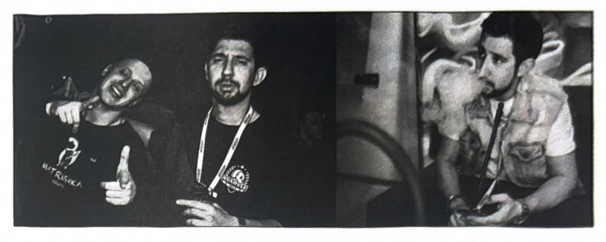

*図：サーシャ Nuahule（アレクサンドル・グパロ）と仲間たち。イベントでくつろぐ様子とシーシャを吸う姿（原書 p.285）*

## ダーニャ・ヴァシリエフ。Дом Мусье Ле Кальян（ドム・ムシエ・ル・カリャン）。

（インタビュー抜粋）

### あなたの店のコンセプトはどう練り上げられた? 例えば、名前が生まれたきっかけのような、何か面白い話はある?

コンセプトは3か月ほどかけて練りました。私は「魂」のある場所が好きで、それ以外のどんな場所も、ゲストとして個人的にまったく受け入れられません。つまり私は、何か型どおりのもの、ましてやチェーン店よりも、「МариВанна（マリヴァンナ）」や、例えば Uilliam's のようなレストランのほうがずっと好きなのです。だから Дом（ドム）も、その雰囲気、仕掛け、ムードで人を魅了するような場所にしようと決めました。

私はすぐに、ここでは Pink Floyd や The Doors の趣の、選び抜かれた古い音楽だけを流すと決めました。店は、内装やメニューの品々にまつわる、ムシエ・ル・カリャンについてのさまざまな伝説に囲まれることにしました。私たちのところでは罵り言葉を使わないという決まりを設け、すべてを最大限に居心地よく、生き生きと、面白くしようと努めました。人々が微笑み、写真を撮りたくなるように。

重要な点：私は最初から、当時シーシャラウンジに通っていた層よりも、もっと大人の客層を狙っていました。そして、その層を惹きつけ、気に入ってもらうことができたと、誇りを持って言えます。そもそも私は Дом の最初のゲストなのです。つまり、自分自身がここで時間を過ごして心地よいように、すべてを作りました。私自身がゲストとしてもここから快感を得られるように。だから私たちのところには暖炉やレコードプレーヤーがあり、愛情を込めて、しばしば特注で、他の国々から集められた多くのものがあります。

Дом の背後には、カリスマ的で半ば神話的な人物が「立っている」ようにしたかったし、名前自体は（あらゆるマーケティングの法則に反して）長く、しかし記憶に残るものにしたかったのです。ちなみに、Дом では全般的に多くのことが一般的な法則どおりではなく作られていますし、今も作られています。そして私たちの客層はそれを評価してくれます。

### このアイデアが浮かんでから開店までに、だいたいどのくらいの時間が経った?

半年ほどです。一般的な意味での最初のシーシャラウンジを、私はピーテル（サンクトペテルブルク）で見ました。あちらでは、モスクワよりも早く開店し始めていたからです。その後、私たちのところにもいくつか現れ、私は決めました――自分の店を作るときが来た、と。

### 当時、シーシャラウンジを開くというのは、法整備が不透明だったことを考えると、かなり議論の余地のある決断だった。まさにこの事実で多くの人が二の足を踏んでいた。それでもどうやって踏み切った? そして迷いはあった?

なぜか迷いはありませんでした。その理由は、ばかげて聞こえるかもしれませんが、私には単純に、すべてうまくいく、人々にはこういう場所が必要なのだ、という100パーセントの内なる確信があったからです。

### Дом の開店にはどれくらいの予算があった?

最初は80万ルーブルほどです。でもその後、半年か、それ以上にわたって、私は利益の90%を改良に再投資しました。そういう時代でした。市場が生まれたばかりだったのです。もちろん今なら、こんな芸当は通用しないでしょう。

### プロジェクトが当たったと理解したのはいつ? その瞬間にどんな感情を抱いた?

プロジェクトは最初の月から当たりました。つまり、すぐに黒字になったのです。最初は小さな利益でしたが、それから伸びていきました。私は開店から5か月ほど、文字どおり24時間 Дом で働き、すべてを整えていたので、その瞬間を特には実感しませんでした。なんだか全部、惰性のうちに過ぎていったのです。利益から自分個人にすでに贈った最初のプレゼントは MacBook Air で、今でも使っていますし、今に至るまでこれは私の買い物のなかでほぼ最高のものです。

### Дом Мусье は、モスクワのシーシャラウンジのなかで常に一線を画してきた。それをどうやって成し遂げられたと思う?

私たちが最初から、こうした場所に普段通うのとは少し違う客層の要望に合わせていたからです。彼らを驚かせる必要がありました。彼らは良い意味で甘やかされています。つまり、彼らにはお金があり、しばしば多くのものを見てきています。海外の良いレストランも含めて。彼らはしばしば良い音楽の趣味を持っていますし、そもそもさまざまな種類の文化的なものへの趣味を持っています。ここでは正しいサービスと、それ以上の何か、私が言うところの「二番目の底（裏の深み）」、言葉では説明できない何かが必要です。いわば精神、どうあるべきかという良さの感覚、とでも言いましょうか。

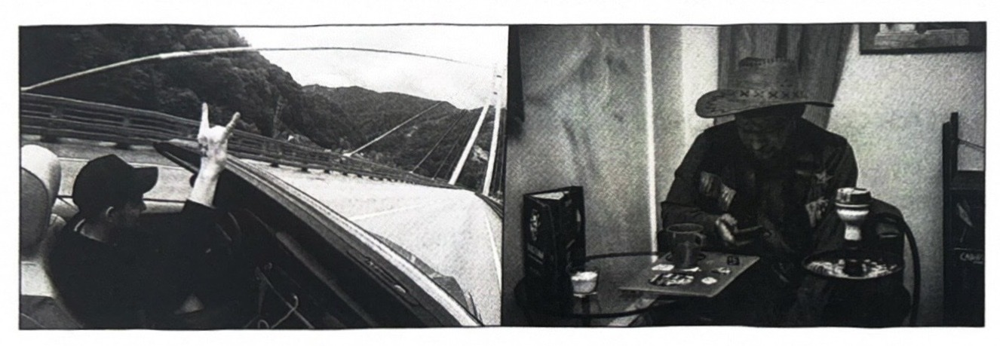

*図：ダーニャ・ヴァシリエフ。ドライブ中にロックサインを掲げる姿と、店内でシーシャをくゆらせる姿（原書 p.288）*

### ダーニャ・ヴァシリエフによる、コンセプチュアルな店の5つのルール

普通でないことをする。場所が万人向けでなくてもいい。けれど、あなたが最初に選んだ特定のオーディエンスは、文字どおりそこから快感を得るようにする。シーシャ業界以外の例としては Surf Coffee。

競合に合わせない。

自分自身が店の魂であること。場所を、いわばあなたの人生観や興味の延長であるかのように作ること。

シーシャラウンジからよりも、良いカフェ、レストラン、バーから学ぶこと。

関心を持ち、多方面に成長した人間であること。そして、生まれつきの善良さを必ず持っていること。

### ブランドを数で展開しようと考えたことは? 例えばフランチャイズとか。

フランチャイズについては、ずっと尋ねられてきましたし、今も尋ねられます。公式に宣言します――それはありませんし、これからもありません。私はフランチャイズビジネスに興味がありませんし、そもそも Дом をビジネスとは捉えていません。それは何よりも魂から、魂のためのものです。とても良く回ってはいますが。一方で、自分自身の店を今後もオープンしたいとは思っていますが、それらはすべて異なるもの、異なるコンセプトのものになるでしょう。

### 近いうちに何か計画している?

ごく近いうちには――ありません。

### プロジェクトをスケールさせたくない理由を説明してほしい。

フランチャイズのことを言っているなら、単純にそれが面白くないからです。自分のもの、文字どおり自分の頭と手でゼロから作り上げたもののほうが面白い。そして、それが他人に「使用のために」引き渡される、つまりフランチャイズが売られると、そこで人々がそれをどうやってやるのか分からなくなります。ここには喜びよりも面倒のほうが多い、と私には思えます。まあ、店が複雑で、ノウハウやニュアンスがたくさんある場合の話ですが。

### 次のテーマは――人。どんな基準で店のスタッフを選んでいる?

それは別の話です。私はいつも、とても長く、念入りにスタッフを選びます。ほとんど常に、面接はすべて自分で行います。例えば、たった一人のホステスを見つけるために、私は普通、自分で20人ほどの女性を「見ます」し、直接の面接にたどり着く前にどれだけふるい落とされるか……。いつもSNSを調べます。私たちには、チーム内で互いに似ていて、ゲストにも似ている人が必要です。そうすれば、みんなが心地よく、分かりやすく、息が合い、面白いのです。面接で私はいつも、全員に、その人がどんな音楽を聴くかを尋ねます。どんな映画が好きか、本は、などなど。つまり私にとっては、プロフェッショナルであることだけでなく、その人自身も重要なのです。その人が雰囲気に「合い」、それにふさわしく、問題なく溶け込めるように。

### あなたの店ではどのくらいの頻度でスタッフが入れ替わる?

総じてかなりまれです。たいていは、本格的な勉強や卒論の審査、実習が始まることに関係しています。つまり、もう仕事と勉強を両立できなくなるのです。

### そもそも私たちのビジネスにおいて、従業員のレベルやプロセスへの関与は、どれほど重要? それを軽視するオーナーをとても多く見てきた。あなたの意見が知りたい。

非常に重要です。私は、すべてのメンバーが、自分たちのどんな行動や下した決断も、全体として Дом の成功を左右するのだと感じ、理解しているモデルの支持者です。つまり私たちのところには「一人でプレーする」人はおらず、共同の努力だけ、共同の責任だけです。私が経験者だけを雇うかどうかについては――いいえ。経験のない女性の多くのほうが、経験のある人よりもずっと愛想がよく、機転がきき、ホールをよく感じ取れます。マスターについても同じことが言えます。どこかの無名（ノーネーム）のシーシャラウンジでただ3年働いて、それを経験だと考えるのは、かなり思い上がっています。もしその人が良い場所で（特に私が個人的に知っている人のところで）働いていたなら、それは考慮されますが、そうでなければそれは重要ではありません。私たちのところに就職したがった経験者たちは、いざ試してみると、詰め方が全然だめだったり、まったくタイプが合わなかったりしました。

### あなたのところでそれなりに長い期間働いた人を、解雇したことは?

長い期間――いいえ。たいていは1か月未満で解雇していました。私たちには、各従業員向けのあらゆる情報を網羅した、非常に詳細なスクリプトがあります。研修もあります。それらすべてと、2週間ほどにわたる同僚側からの仕事の手直しを踏まえても、効果が見えない、あるいはミスが多すぎる場合――その人を再教育することはできません。ちなみにそれは、礼儀正しさ、丁寧さ、そして「ホールを見る」能力を教えることが不可能なのとまったく同じです。私はこう考えています――人には、一度、二度は何かを言える。せいぜい三度まで。もしそれが簡単に直せることなのに、その人が何もしない、あるいはその人の仕事を常に見張っていなければならないなら、その人は替えなければなりません。

### 「代わりのきかない人間などいない」という主張に同意する?

はい。ただし、その人がスティーブ・ジョブズでなければ、ですが。

### 財政面以外で、チームを何でモチベートしている?

Дом そのものが、とてもよくモチベートしてくれます。そこでの仕事、ゲスト、雰囲気、上司としての私の寛容な態度、友好的な環境、便利な勤務シフト、いろいろなちょっとしたボーナス。

---

## 第9章

## マーケティング調査「私たちは誰か」

### 私たちは誰か？

2020年の初め、私は初めてシーシャの能動的な消費者層に関するマーケティング調査を行いました。

- この記事は、ウファ市で開催されたフォーラム「Прокачаем（プロカチャエム／スキルアップしよう）」での私の講演です。出席者の反応から、このテーマが興味を持たれ、求められているものだと理解しました。「モチベートし、支配し、楽しめ」——これがこの講義のタイトルでした。このテキストには、私の経験をまとめ、私たちが実践で用い、その成功を示してきた事例を挙げるよう努めました。もちろん、これは完全なリストではありません。そして、もしあなたがこれを補完できるのであれば、私にはあなたにとって素晴らしいニュースがあります——あなたは立ち止まることなく、飛躍的なスピードで成長しているということです。各項目の終わりには、それを実生活でどう実現するかの例を挙げていきます。

### 性別
- 女性
- 男性

### 年齢
- 41歳以上
- 31〜40歳
- 25〜30歳
- 18〜24歳

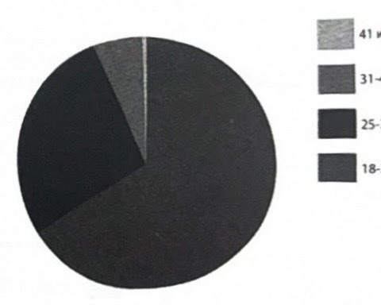

*図：回答者の年齢構成比（円グラフ）（原書 p.297）*

### あなたはシーシャ（の道具）を持っていますか

### どのくらいの頻度でタバコやアクセサリーを自宅用に購入しますか
- 購入しない
- 3ヶ月に1回
- 月に1回
- 週に1回

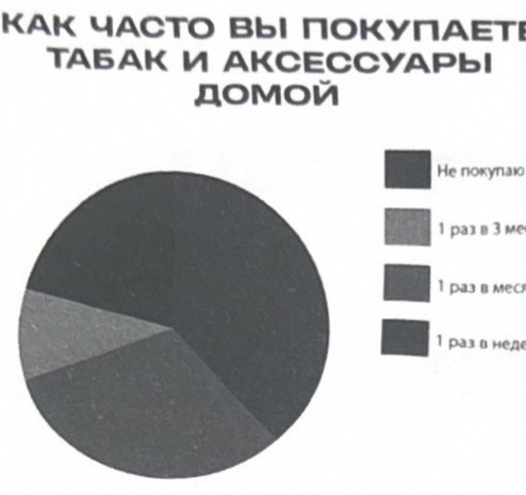

*図：自宅用のタバコ・アクセサリーの購入頻度（円グラフ）（原書 p.298）*

### どのくらいの期間シーシャを吸っていますか
- 1年未満
- 10年以上
- 1〜2年
- 2〜4年
- 5〜10年

### 学歴
- 高等教育中退
- 中等教育
- 高等教育を取得中

### 職業（活動）
- 働いていない
- トップマネージャー
- フリーランス
- 中間管理職
- 事業オーナー
- 学生
- 専門職（スペシャリスト）

### どのくらいの頻度でシーシャを吸いますか
- 月に1回
- 週に1回
- 週に5本まで
- 1日に1本以上

### あなたの収入はどのくらいですか
- 300（千ルーブル）以上
- 150〜300
- 100〜150
- 50〜100
- 30〜50
- 16〜30
- 15未満

### どの強さのシーシャを好みますか
- 強い
- 中くらい
- 弱い

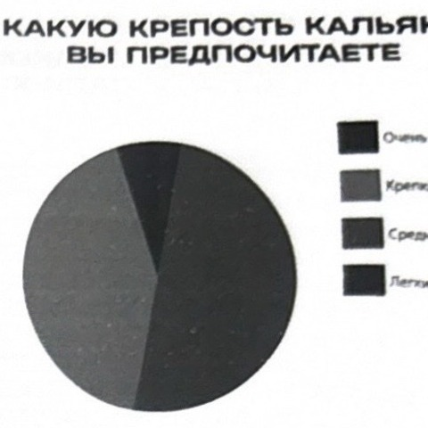

*図：好まれるシーシャの強さの構成比（円グラフ）（原書 p.299）*

### シーシャを作るあなたのスキルを1から10で評価してください
- 70（0.8%）
- 31（0.3%）
- 80（1%）
- 206（2.2%）
- 1067（12.2%）

### シーシャ以外に何か吸いますか
- IQOS（アイコス）およびその他の類似品: 2611（28%）
- 1006（10.9%）
- 25.9%
- 紙巻きタバコ: 1389（15.1%）
- 983（10.7%）
- 手巻きタバコ: 459（5%）
- ドハ（アラブのパイプタバコ）: 917（10%）
- 6077（66.1%）
- 吸わない
- 葉巻およびシガリロ: 716（7.8%）
- 372（4%）

### 下に挙げたロシア産のタバコおよびシーシャ用ミックスのうち、人生で一度でも試したことがあるものはどれですか
- Daily Hookah: 8353（90.9%）
- Spectrum: 7628（83%）
- DarkSide: 8950（97.4%）
- Duft: 8142（88.6%）
- BlackBurn: 6661（72.5%）
- MustHave: 8452（92%）
- Element: 7724（84%）
- Satyr: 6666（72.5%）
- Северный（セヴェルヌイ）: 7244（78.8%）
- B3: 2502（27.2%）
- Chabacco: 6866（74.7%）
- Cobra: 5067（55.1%）
- Hyperime（Inferno）: 1305（14.2%）
- Virginia Original: 2755（30%）
- Krass: 4382（47.7%）
- Baccar: 2399（26.1%）
- 1235（13.4%）
- X（Mxc）: 2774（30.2%）
- Сарко（サルコ）: 3035（33%）
- Sebero: 3971（43.2%）
- Matt pear: 1（0%）

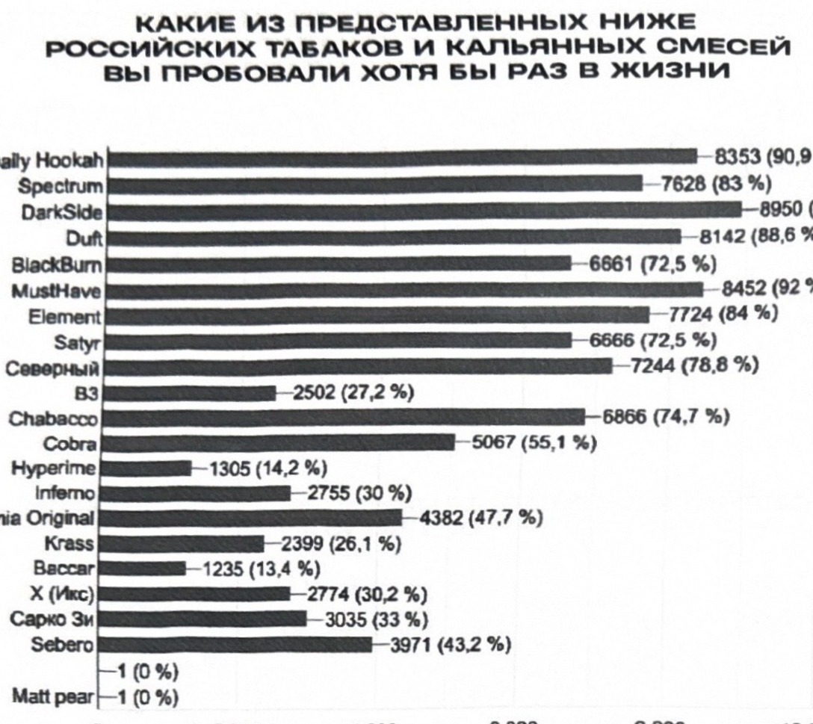

*図：一度でも試したことのあるロシア産タバコ・シーシャ用ミックス別の回答者数と割合（横棒グラフ）（原書 p.300）*

### 下に挙げた輸入シーシャ用タバコのうち、人生で一度でも試したことがあるものはどれですか
- AlFakher: 8811（95.9%）
- Adalya: 8800（95.8%）
- Afzal: 8354（90.9%）
- Nakhla: 8282（90.1%）
- Fumari: 8253（89.8%）
- Tangiers: 8199（89.2%）
- Azure: 4170（45.4%）
- Serbetli: 8584（93.4%）
- Malaki: 4147（45.1%）
- Starbuzz: 5798（63.1%）
- Al-Waha: 3146（34.2%）
- Mazaya: 2892（31.5%）
- Nirvana: 4365（47.5%）
- Zomo: 1470（16%）

### ノンタバコのシーシャ用ミックスを吸いますか
- いいえ
- はい

### どの方向性の味（香り）を好みますか
- ベリー: 6785／73%
- フルーツ: 6112／66.5%
- 柑橘類: 4714／51.3%
- デザート: 3902／42.5%
- 茶: 3762／40.9%
- スパイス: 3762／40.9%
- 花: 1949／21.2%

### これまでにシーシャ業界で働いたことがありますか
- いいえ、私はただシーシャを吸うのが好きなだけです
- いいえ、でも働きたいです
- はい、でももう働いていません
- はい、そして今も働いています

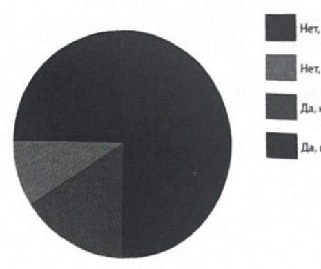

*図：シーシャ業界での就労経験の有無の構成比（円グラフ）（原書 p.301）*

### シーシャに関連した健康上の問題があったことはありますか

### スポーツをしていますか
- いいえ、していません
- はい、不定期かつ不規則に
- はい、定期的に
- いいえ

### シーシャに合わせてどの飲み物を好みますか
- アルコール: 8145（88.6%）
- 2214（24.1%）
- レモネード
- 炭酸飲料
- 水: 5072（55.2%）
- 3261（35.5%）
- コーヒー: 1650（18%）
- 5474（59.6%）

### シーシャ系ブロガーをフォローしていますか
- はい、YouTubeで: 6512（71%）
- はい、Instagramで: 6342（69.1%）
- はい、Telegramで: 1396（15.2%）
- いいえ、フォローしていません: 3515（38.3%）

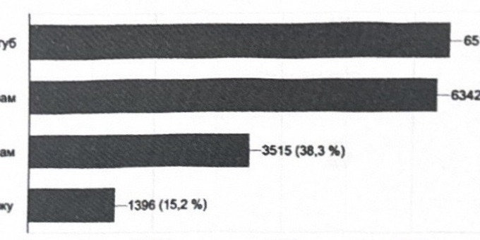

*図：シーシャ系ブロガーのフォロー状況（媒体別の回答者数と割合・横棒グラフ）（原書 p.302）*

### シーシャ関連のイベントに参加していますか
- はい、教育的なイベント: 3006（40.3%）
- はい、大規模な展示会: 2120（23.1%）
- はい、ローカルなテイスティング: 2008（29.4%）

## 本書の制作に参加したメンバー

- プロジェクト著者: パーヴェル・サヴィノフ（Павел Савинов）
- 編集者: アレクセイ・ルミャンツェフ（Алексей Румянцев）
- 表紙デザイン: マックス・ポポフ（Макс Попов）
- 組版および校正: ナスチャ・ニコラエワ（Настя Николаева）／デザインスタジオ LUPO

### 記事の執筆者
- ドミトリー・ズデルマン（Дмитрий Зудерман）
- エフゲニー・フェドートフ（Евгений Федотов）
- キリル・オフチンニコフ（Кирилл Овчинников）
- イリヤ・ロマノフ（Илья Романов）
- イリヤ・コブザレフ（Илья Кобзарев）
- ヴラド・パニューチン（Влад Панютин）
- ドミトリー・フングレエフ（Дмитрий Хунгуреев）
- マックス・ポポフ（Макс Попов）
- ロマン・クレツ（Роман Крецу）
- アルチョム・フロポフ（Артем Хлопов）
- キリル・グレベンニコフ（Кирилл Гребенников）
- アンドレイ・トゥルケヴィチ（Андрей Туркевич）
- ドミトリー・トレハ（Дмитрий Треха）
- アレクサンドル・ツヴィルコ（Александр Цвирко）
- ミハイル・プロホロフ（Михаил Прохоров）
- デニス・シヴァチェンコ（Денис Сиваченко）
- アンドレイ・レシ（Андрей Лесь）
- アルチョム・バエフ（Артем Баев）
- チモフェイ・コレエフ（Тимофей Кореев）
- ウラジーミル・デネシキン（Владимир Денежкин）
- サーシャ・Nuahule
- ダーニャ・ヴァシリエフ（Даня Васильев）

3年間にわたり、Telegramチャンネル「savinov says（サヴィノフ・セイズ）」で大きな人気を集めました。シーシャ、喫煙、ラウンジについて——著者は努めました。〔これは〕知識、経験、そして時間からのエッセンスです。

読み終えた後、あなたは少し違った考え方をするようになるでしょう。

### 著者について

パーヴェル・サヴィノフ（Павел Савинов）

2018年から業界に在籍。Telegramチャンネル「savinov says」の著者。

### プロジェクト
- NunGroup——シーシャラウンジおよびショップのネットワーク
- 教育フォーラム「Прокачаем（プロカチャエム）」
- ブランド「Хулиган（フリガン／ならず者）」——シーシャ、タバコ
- 国際経験 15ヶ国
- シーシャマスターのための賞「б…」
